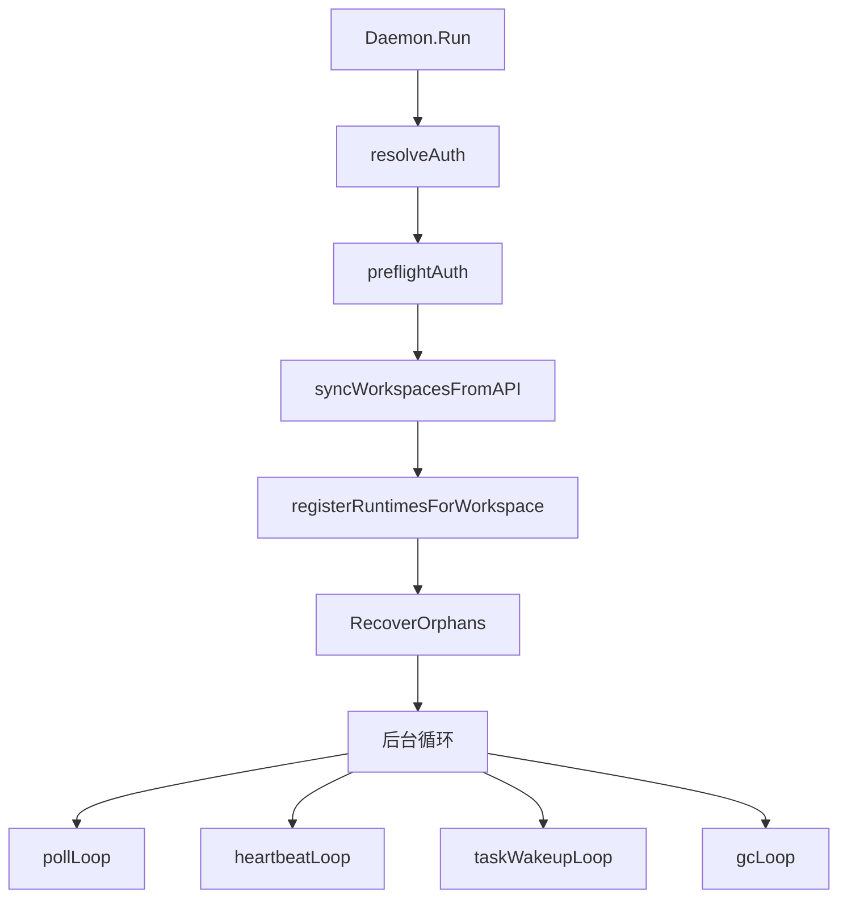

# Agents, Runtimes & Daemon Execution — internal

## 模块概览

该内部模块负责三件事：内置 Agent 模板、运行时注册与任务执行、本地/云端 Runtime 的控制面通信。核心代码分布在 `server/internal/agenttmpl/`、`server/internal/daemon/` 和 `server/internal/cloudruntime/`，并通过 `server/internal/handler/daemon.go`、`server/internal/handler/agent_template.go`、`server/internal/handler/cloud_runtime.go` 接入 HTTP/WS API。

## 核心数据模型

`agenttmpl.Template` 描述“从模板创建 Agent”的静态产品内容：`Slug`、`Name`、`Description`、`Instructions` 和 `Skills`。模板 JSON 被 `agenttmpl.Load()` 从 `templates/*.json` 嵌入并校验，运行期只读。

`daemon.Runtime` 是本机 daemon 在某个 workspace 注册出的可执行 runtime，包含 `ID`、`Provider`、`Status` 和可选 `ProfileID`。内置 runtime 来自 `Config.Agents`，自定义 runtime profile 来自 `GetRuntimeProfiles()`，由 `appendProfileRuntimes()` 转成注册请求。

`daemon.Task` 是 claim 后交给本地执行器的完整任务上下文，覆盖 issue、chat、autopilot、quick-create、project resources、repo 列表、agent 配置、技能、MCP 配置和任务级凭证。`AuthToken` 必须是 `mat_` 任务 token；`taskScopedAuthToken()` 会拒绝空值或非任务 token，不能回退到 daemon 自己的 PAT。

`execenv.Environment` 是一次任务运行的本地目录形态：`RootDir` 是 daemon 管理的任务根目录，`WorkDir` 是传给 agent CLI 的工作目录。普通任务使用 `{RootDir}/workdir`；`local_directory` 任务使用用户指定目录，并在结束时通过 `CleanupRuntimeConfig()` 和 `CleanupSidecars()` 清理注入内容。

## 模板加载与创建 Agent

`agenttmpl.Load()` 调用 `loadFromFS()` 读取嵌入文件系统中的模板 JSON，并通过 `validate()` 保证：

- `slug` 是小写 kebab-case。
- 文件名必须等于 `<slug>.json`。
- `name` 和 `instructions` 必填。
- 每个 `TemplateSkillRef` 必须有 `source_url`。
- 技能数组可以为空，代表 prompt-only 模板。

`server/internal/handler/agent_template.go` 在包初始化时加载全局 `agentTemplates`。`ListAgentTemplates()` 返回不含 `Instructions` 的列表，`GetAgentTemplate()` 返回详情。`CreateAgentFromTemplate()` 会复用手动创建 Agent 的 runtime 权限和 invocation permission 规则，然后按模板导入技能、创建 agent、绑定技能并广播 `EventAgentCreated`。

技能导入有两层去重：先用模板里的 `CachedName` 调 `GetSkillByWorkspaceAndName()` 跳过 fetch；若需要 fetch，`fetchTemplateSkillsParallel()` 并发调用 `fetchSkillFromURL()`，再用真实 frontmatter name 做第二次去重。新技能通过 `createSkillWithFilesInTx()` 写入，并记录 `origin.type = "agent_template"`、`template_slug` 和 `source_url`。

## Daemon 启动路径

`Daemon.Run()` 是本地运行时的总入口。它先绑定本地 health 端口，再执行认证、预检、注册和后台循环：

`LoadConfig()` 会探测本机安装的 provider CLI，填充 `Config.Agents`。`registerRuntimesForWorkspace()` 对每个 provider 调 `detectAgentVersion()` 和 `checkAgentMinVersion()`，再调用 `Client.Register()`。自定义 runtime profile 由 `appendProfileRuntimes()` 获取，`protocol_family` 决定 agent backend，`command_name` 或本机 override 决定实际可执行文件，解析结果保存在 `profileLaunchSpecs`，供 `runTask()` 启动时使用。

启动后主要循环包括：

- `workspaceSyncLoop()`：同步 workspace 成员集，必要时刷新 runtime profile。
- `taskWakeupLoop()`：维护 `/api/daemon/ws` 控制连接，接收任务唤醒、runtime profile 变更、workspace 变更和 WS heartbeat ack。
- `heartbeatLoop()`：为每个 runtime 独立发送 HTTP heartbeat；如果 WS heartbeat 最近成功，则跳过重复 HTTP 写入。
- `gcLoop()`：清理过期任务目录、可再生构建产物和 Codex session store。
- `autoUpdateLoop()`：空闲时检查 CLI 新版本并自更新。
- `tokenRenewalLoop()`：周期性调用 `RenewToken()` 延长 daemon PAT。

## 任务领取与调度

任务领取使用“先拿本地槽位，再 claim”的策略，避免服务端任务进入 `dispatched` 后本机没有执行能力。`pollLoop()` 创建固定大小的 slot semaphore；`runBatchPoller()` 每轮先拿可用 slot，再通过 `ClaimTasksWSFirst()` 一次性跨所有 runtime 领取最多 `len(slots)` 个任务。

`ClaimTasksWSFirst()` 优先走 WS RPC `tasks.claim`。如果连接不可用、写缓冲满或超时且请求尚未发送，会回退到 HTTP `Client.ClaimTasks()`；如果 `wsRPCClient` 判断请求已发送但连接断开，返回 `errWSRPCUncertain`，本轮不会 HTTP fallback，避免同一空闲 slot 被重复 claim。旧 server 不支持 `/api/daemon/tasks/claim` 时，`isBatchClaimUnsupported()` 触发 `claimTasksLegacy()`，退回逐 runtime claim。

服务端对应入口是 `Handler.ClaimTasksByRuntime()`，它校验 `daemon_id`、runtime 所属 workspace 和 machine ownership，然后调用 `TaskService.ClaimTasksForRuntimes()`。每个返回任务都通过 `buildClaimedTaskResponse()` 组装完整 payload，并用 `FinalizeTaskClaim()` 原子持久化任务 token 与 comment delivery receipt。

## 单任务执行路径

`handleTask()` 负责本地执行前后的保护逻辑：查 runtime provider、处理 `local_directory` path lock、标记 active env root、防止 GC 抢删、启动 `watchTaskCancellation()` 轮询服务端终态。真正启动 agent 的逻辑在 `runTask()`。

关键顺序不能随意调整：

1. `registerTaskRepos()` 把 task-scoped project repo 加入 workspace allowlist。
2. `startTaskPrepareLeaseExtender()` 在准备阶段延长 dispatched lease。
3. `ensureTaskSkillBundles()` 将 slim claim 中的 `SkillRefs` 解析成完整 `SkillData`，每个技能单独调用 `ResolveSkillBundle()` 并写入 `SkillBundleCache`。
4. `execenv.Reuse()` 尝试复用旧 workdir；不适用于 `local_directory` 和 squad leader 任务。
5. `execenv.Prepare()` 创建目录、写 `.agent_context/issue_context.md`、provider-native skill 目录、`AGENTS.md`/`CLAUDE.md` 等 runtime brief。
6. `Client.StartTask()` 必须在 workdir 已存在之后调用，避免消费者看到 `running` 后找不到目录。
7. `execenv.InjectRuntimeConfig()` 写入 Multica runtime brief。
8. `agent.New()` 创建 provider backend，`executeAndDrain()` 调 `backend.Execute()` 并转发消息。
9. 根据 `agent.Result.Status` 构造 `TaskResult`，由 `reportTaskResult()` 调 `CompleteTask()` 或 `FailTask()`。
10. 成功或失败后写 GC metadata，供 `gcLoop()` 后续清理。

`executeAndDrain()` 同时做三件事：执行 backend、批量上报 `ReportTaskMessages()`、等待最终 `session.Result`。它会把 text/thinking 合并成批次，把 tool use/result 保留为结构化消息，并在收到 session id 后调用 `PinTaskSession()`，减少 daemon 崩溃导致的 resume pointer 丢失。

## 执行环境与凭证边界

`execenv.Prepare()` 会在 workdir 写入 `.multica/daemon_task_context.json`，`EnsureWorkspacesRootMarker()` 还会在 `WorkspacesRoot` 根部写同类 marker。这个 fail-closed 设计用于防止 agent 子进程丢失所有 `MULTICA_*` 环境变量后回退到用户全局 PAT。

`runTask()` 传给子进程的环境包含 `MULTICA_TOKEN`、`MULTICA_SERVER_URL`、`MULTICA_DAEMON_PORT`、`MULTICA_WORKSPACE_ID`、`MULTICA_AGENT_ID`、`MULTICA_TASK_ID` 和 `MULTICA_TASK_SLOT`。`layerCustomEnvAndHermesHome()` 会叠加用户配置的 custom env，但 `isBlockedEnvKey()` 会拦截 `MULTICA_*`、`PATH`、`HOME`、`CODEX_HOME`、`OPENCLAW_CONFIG_PATH` 等 daemon 关键变量。

仓库 checkout 不在 `Prepare()` 中完成。Agent 通过 `multica repo checkout <url>` 调本地 daemon 的 `/repo/checkout`，由 `repoCheckoutHandler()` 调 `ensureRepoReady()` 和 `repoCache.CreateWorktree()`。这保证 repo allowlist、workspace settings、Co-authored-by 开关都由 daemon 统一判断。

## 心跳、唤醒与恢复

HTTP heartbeat 入口是 `Client.SendHeartbeat()`，服务端共享处理逻辑在 `Handler.processHeartbeat()`。返回的 `HeartbeatResponse` 可能包含 `PendingUpdate`、`PendingModelList`、`PendingLocalSkills` 和 `PendingLocalSkillImport`，daemon 通过 `handleHeartbeatActions()` 分发到独立 goroutine。

WS 控制连接由 `runTaskWakeupConnection()` 维护。它接收：

- `EventDaemonTaskAvailable`：写入 `taskWakeups`，唤醒 batch poller。
- `EventDaemonHeartbeatAck`：记录 WS heartbeat freshness，并处理 pending actions。
- `EventDaemonRPCResponse`：交给 `wsRPCClient.deliver()`。
- `EventDaemonRuntimeProfilesChanged`：调用 `refreshWorkspaceRuntimeProfiles()`。
- `EventDaemonWorkspacesChanged`：通知 `workspaceSyncLoop()` 重新拉 workspace 列表。

`runtime_gone` 走统一恢复入口 `handleRuntimeGone()`。它会从本地 `runtimeIndex` 和 workspace runtime 列表中移除 stale runtime，通过 coalescing 防止多路 heartbeat/poller/WS 同时重注册，再调用 `reregisterWorkspaceAfterRuntimeGone()` 并对新 runtime 执行 `RecoverOrphans()`。

## 云运行时代理

`server/internal/cloudruntime.Client` 是服务端到 Cloud Runtime Fleet 的薄客户端。`NewClient()` 保存 `BaseURL`、timeout 和可选 metrics recorder；`Do()` 负责记录 operation/status/duration，再进入 `doInner()` 构造 HTTP 请求。

`cloudruntime.Request` 支持 `Method`、`Path`、`Query`、`Body`、`UserID`、`RequestID`、`Op` 和额外 `Headers`。默认会写 `Accept: application/json`，有 body 时写 `Content-Type: application/json`，并权威写入 `X-User-ID`、`X-Request-ID`。响应体最大 1 MiB，超限返回错误。

`handler.proxyCloudRuntime()` 是对外代理入口，`ListCloudRuntimeNodes()`、`CreateCloudRuntimeNode()`、`ExecCloudRuntimeNode()` 等只配置 method/path/body/query/user 选项。非 JSON Fleet 响应会被 `writeCloudRuntimeResponse()` 包成 `{ "error": "..." }`；超时映射为 504，未配置或 base URL 无效映射为 503。

## 贡献时要守住的约束

新增 provider 时，需要同时考虑 `Config.Agents` 探测、`providerDisplayName()`、`runtimeConfigPath()`、`resolveSkillsDir()`、`providerNeedsInlineSystemPrompt()`、`agent.New()` backend，以及 provider 专属环境变量是否应加入 `isBlockedEnvKey()`。

修改任务状态顺序时，要保持 `StartTask()` 在 `execenv.Prepare()` 之后，`CompleteTask()`/`FailTask()` 使用 `postJSONWithRetry()`，并保留最终 `GetTaskStatus()` 检查，避免对已取消或已删除任务重复写终态。

修改 claim 逻辑时，要保持 slot-before-claim、`tryEnterClaim()`/`exitClaim()` 配对，以及 `errWSRPCUncertain` 不回退 HTTP 的语义，否则会引入 double-claim 或 dispatched-but-no-capacity 的故障。

修改模板时，只改 `server/internal/agenttmpl/templates/<slug>.json` 并保证 slug 与文件名一致。模板技能的 `cached_name` 影响快速复用，但不是正确性的唯一来源；真正导入仍以 fetch 到的 skill frontmatter 为准。