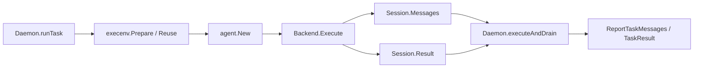

# Agents, Runtimes & Daemon Execution — pkg

## 模块定位

`server/pkg/agent` 是 Multica 守护进程与本机智能体 CLI 之间的适配层。它把 Claude Code、Codex、Hermes、OpenCode、Copilot、Cursor、Kiro、Qoder、Trae、Grok 等不同运行时统一成同一个 `Backend` 接口，让 `server/internal/daemon` 不需要理解每个 CLI 的协议细节。

这个包只负责“如何启动并驱动一个智能体进程”。task 的领取、工作目录准备、权限 token、消息持久化、失败分类和 issue 状态更新都在 daemon/service 层完成。

## 核心执行链路



`Daemon.runTask` 是主要入口。它先构造隔离执行环境，注入 `MULTICA_TOKEN`、`MULTICA_WORKSPACE_ID`、`CODEX_HOME`、`HERMES_HOME` 等运行时变量，再通过 `agent.New(provider, agent.Config{...})` 创建后端，并把 `agent.ExecOptions` 交给 `executeAndDrain`。

`executeAndDrain` 只依赖统一接口：调用 `backend.Execute(ctx, prompt, opts)`，消费 `Session.Messages`，等待 `Session.Result`。它会把文本、thinking、工具调用和工具结果批量上报到服务端，并在 `MessageStatus.SessionID` 出现时尽早调用 `PinTaskSession` 固化 resume 指针。

## 统一接口

所有后端都实现：

```go
type Backend interface {
	Execute(ctx context.Context, prompt string, opts ExecOptions) (*Session, error)
}
```

`Session` 分成两条通道：

- `Messages <-chan Message`：流式事件，用于实时 transcript。
- `Result <-chan Result`：最终结果，只发送一次。

`Message` 是跨运行时事件模型，支持 `MessageText`、`MessageThinking`、`MessageToolUse`、`MessageToolResult`、`MessageStatus`、`MessageError`、`MessageLog`。各 CLI 的私有事件都会被转换成这些类型，例如 Claude 的 `tool_use`、Copilot 的 `tool.execution_complete`、Codex 的 item update、ACP 的 tool call update。

`Result` 统一描述最终状态：`Status`、`Output`、`Error`、`DurationMs`、`SessionID` 和按模型聚合的 `Usage map[string]TokenUsage`。后端可以返回 `completed`、`failed`、`aborted`、`timeout`、`cancelled`；daemon 还会把 idle watchdog 触发的中止重新标记为 `idle_watchdog`。

`ExecOptions` 是 daemon 到后端的主要契约。常用字段包括：

- `Cwd`：task 工作目录。
- `Model`：运行时模型；空值表示让 CLI 使用自身默认值。
- `SystemPrompt`：只给支持安全 inline 指令的后端使用；Hermes ACP 明确忽略它，依赖 cwd 下的 `AGENTS.md` / `.agent_context`。
- `Timeout`：硬超时；`runContext` 对 `Timeout <= 0` 使用无 deadline 的 cancellable context。
- `SemanticInactivityTimeout`、`HandshakeTimeout`：Codex app-server 专用的语义进度和启动 RPC 边界。
- `ResumeSessionID`、`ResumeExpected`：恢复旧会话，以及恢复失败时是否需要让 agent 告知用户。
- `ExtraArgs`、`CustomArgs`：daemon 默认参数与用户配置参数。
- `McpConfig`：agent 级 MCP 配置。
- `ThinkingLevel`：运行时原生 reasoning/effort 值。
- `OpenclawMode`：OpenClaw local/gateway 路由。

## 后端实现模式

`New` 根据 provider 字符串返回具体后端。`SupportedTypes` 当前包含 `claude`、`codebuddy`、`codex`、`copilot`、`opencode`、`deveco`、`openclaw`、`hermes`、`pi`、`cursor`、`kimi`、`kiro`、`antigravity`、`qoder`、`traecli`、`grok`。这个列表必须与 runtime profile 的 `protocol_family` 约束、前端 `RUNTIME_PROFILE_PROTOCOL_FAMILIES` 保持同步。

主要后端分三类：

| 模式 | 代表后端 | 说明 |
| --- | --- | --- |
| JSONL / stream-json CLI | `claudeBackend`、`codebuddyBackend`、`copilotBackend`、`opencodeBackend`、`antigravityBackend` | 启动一次 CLI，逐行解析 stdout 事件，转换为 `Message`。 |
| JSON-RPC app-server | `codexBackend` | 启动 `codex app-server --listen stdio://`，通过 `codexClient.request` / `notify` 驱动线程和 turn。 |
| ACP JSON-RPC | `hermesBackend`、`kiroBackend`、`qoderBackend`、`traecliBackend`、`grokBackend` | 通过 ACP session / prompt 协议运行，复用 `hermesClient` 或相近消息流处理。 |

Claude 与 CodeBuddy 使用 `--output-format stream-json` 和 `--input-format stream-json`。`writeClaudeInput` / `writeCodebuddyInput` 在独立 goroutine 写入 prompt，stdout reader 同时运行，避免 CLI 启动 banner 填满管道后死锁。它们会处理 `control_request` 并自动返回 allow；Claude 还会通过 `forceClaudeToolInputForeground` 把后台工具执行改成前台执行，并用 `claudeToolResultHasAsyncLaunch` 拒绝 async background task。

Codex 是最复杂的后端。`codexBackend.Execute` 先写入 managed MCP 配置，再启动独立进程组。`codexClient` 维护 pending RPC，`handleLine` 分发响应、通知和 server request。执行顺序是 initialize、initialized、`startOrResumeThread`、`turn/start`，然后等待 turn completion。`handleServerRequest` 会处理权限审批、文件变更审批和 MCP elicitation；`codexPermissionsApprovalResponse` 负责生成允许响应。Codex 还维护语义活动 watchdog：如果长时间没有 item、completion、error 或状态进展，会返回带 `CodexSemanticInactivityMarker` 或 `CodexFirstTurnNoProgressMarker` 的 timeout 诊断。

Hermes 通过 `hermes acp` 启动。`ParseHermesProfileArgs` 复刻 Hermes 对 `-p` / `--profile` 的解析规则，daemon 在构建 overlay 后用 `StripHermesProfileArgs` 移除已消费的 profile 参数，避免 CLI 再次改写 `HERMES_HOME`。Hermes 后端设置 `HERMES_YOLO_MODE=1` 自动批准工具执行，并刻意忽略 `ExecOptions.SystemPrompt`。

Antigravity 使用 `agy -p <prompt>`。它没有结构化事件流，所以 stdout 文本直接变成 `MessageText`。为了支持 resume，后端通过 `--log-file` 捕获 conversation UUID；为了处理 agy 1.0.14 空 stdout 的回归，`readAntigravityTranscriptOutput` 会从 per-conversation `transcript.jsonl` 恢复当前 turn 的模型文本。

OpenCode 使用 `opencode run --format json`。它显式传 `--dir <cwd>` 并覆盖 `PWD`，保证 AGENTS.md、skills 和项目配置从 task 工作目录发现。取消时先对进程组发 SIGTERM，再超时 SIGKILL，避免工具子进程或 OpenCode 写管道异常后残留。

## 参数、环境与进程边界

所有后端都会调用 `buildEnv` 合并 daemon 注入的环境变量和用户自定义环境。`mergeEnv` 会过滤 Claude Code 的内部会话变量，例如 `CLAUDECODE`、`CLAUDE_CODE_SESSION_ID`、`CLAUDE_CODE_SSE_PORT`，但保留公开的 `CLAUDE_CODE_*` 配置变量。

`filterCustomArgs` 是用户参数的安全阀。每个后端定义自己的 blocked map，例如 `claudeBlockedArgs`、`codexBlockedArgs`、`opencodeBlockedArgs`、`antigravityBlockedArgs`。这些列表只拦截会破坏 daemon 与 CLI 通信协议的参数，例如输出格式、stdio transport、resume/session 标识、MCP 配置路径、权限模式。`unshellQuoteArg` 会去掉用户配置里常见的一层 shell 引号，因为 daemon 直接用 `exec.CommandContext` 启动子进程，不经过 shell。

进程控制由 `proc_other.go` / `proc_windows.go` 抽象。`hideAgentWindow` 避免 Windows 弹出控制台窗口；`configureProcessGroup` 和 `signalProcessGroup` 让 Codex、OpenCode、Deveco 等后端在取消时能杀掉整个进程树，而不是只杀直接子进程。

## MCP 配置

`hasManagedMcpConfig` 保留 API 的三态语义：SQL NULL 或 JSON `null` 表示继承运行时默认配置；任何非 null JSON，包括 `{}`，都表示 agent 保存了 managed MCP 配置，需要严格应用。

不同运行时的投递方式不同：

- Claude / CodeBuddy：`writeMcpConfigToTemp` 写临时 JSON 文件，再传 `--mcp-config <path>`；Claude 在 managed config 存在时追加 `--strict-mcp-config`。
- Codex：`ensureCodexMcpConfig` 把 Claude 风格 `mcpServers` 转成 `$CODEX_HOME/config.toml` 的 `[mcp_servers.<name>]` block，文件权限强制为 `0600`。managed config 存在时会清除继承来的用户 `[mcp_servers.*]`，并用 `filterCodexCustomConfigOverrides` 拦截 `-c mcp_servers...` 覆盖。
- OpenCode：`buildOpenCodeMCPConfigContent` 生成 `OPENCODE_CONFIG_CONTENT`，不修改 workdir 里的 `opencode.json`。
- Hermes / ACP：`buildACPMcpServers` 转成 ACP `session/new` 需要的 server 数组。
- Windows 浏览器 MCP：`hardenBrowserMcpConfig` 会为 Playwright MCP 写入禁用 GPU 的配置；Chrome DevTools MCP 在缺少显式 browser 参数时可用 Edge 路径兜底。

## 模型、thinking 与版本能力

`ListModels(ctx, providerType, executablePath)` 是模型列表入口。静态 provider 直接返回内置列表，动态 provider 会 shell out 到本机 CLI 并缓存结果。`Model` 可携带 `Thinking *ModelThinking`，让 UI 只在运行时实际支持 reasoning/effort 时显示选择器。

`thinking.go` 不把不同运行时的 thinking 值压成统一枚举。Claude 的 `--effort`、Codex 的 `model_reasoning_effort`、OpenCode 的 `--variant`、CodeBuddy 的 `--effort`、Grok 的 ACP `--effort` 都保留原生 token。daemon 在 `runTask` 中调用 `ValidateThinkingLevel` 校验 `(provider, model, thinkingLevel)`；不合法时跳过注入，避免陈旧配置阻断 task。

版本能力集中在 `version.go`：

- `DetectVersion` 调用 `detectCLIVersion`，对 `<cli> --version` 设置 10 秒超时。
- `CheckMinVersion` 用 `MinVersions` 校验 agent CLI，例如 Codex 最低 `0.100.0`。
- `CheckMinCLIVersion` 校验 Multica CLI quick-create 所需版本。
- `HandoffSupported` 是 assignment handoff note 的软门禁。

`LaunchHeader(agentType)` 返回用户可见的启动骨架，例如 `codex app-server`、`claude (stream-json)`、`hermes acp`。它被 runtime API 响应用来展示 custom args 会追加到哪条命令后面。

## 与其他模块的连接

`server/internal/daemon` 是最主要调用方：

- `runTask` 决定 provider、executable path、模型、custom args、MCP、thinking、resume 和 cwd。
- `executeAndDrain` 消费 `Session.Messages`，调用 `ReportTaskMessages` 持久化 transcript。
- `runIdleWatchdog` 基于最近消息时间和 in-flight tool 数量取消卡死的执行。
- resume 失败且 `Result.SessionID == ""` 时，`runTask` 会清空 `ResumeSessionID` 重试 fresh session，并保留 `ResumeExpected` 让 Codex 告知用户连续性丢失。

API/handler 层也依赖这个包：

- `CreateRuntimeProfile` 和 CLI runtime profile 命令通过 `IsSupportedType` 校验 `protocol_family`。
- `runtimeToResponse` 读取 `LaunchHeader`。
- `handleModelList` 调用 `ListModels`。
- `UpdateAgent` 使用 `ModelKnownIncompatibleWithProvider` 和 thinking 校验辅助。
- issue handoff 能力读取 `HandoffSupported`。

## 扩展一个新运行时

新增后端时，至少需要完成这些点：

1. 新建 `<provider>.go`，实现 `type <provider>Backend struct { cfg Config }` 和 `Execute`。
2. 在 `SupportedTypes`、`New`、`launchHeaders` 中注册 provider。
3. 如果支持模型选择，在 `ListModels` 添加分支；如果有最低版本，在 `MinVersions` 添加条目。
4. 定义 `<provider>BlockedArgs`，过滤会破坏协议的 custom args。
5. 明确 MCP 配置如何投递：argv、临时文件、环境变量、config 文件或 ACP session。
6. 如果支持 resume，保证 `Result.SessionID` 和早期 `MessageStatus.SessionID` 都能正确上报。
7. 为成功、缺失二进制、超时、stderr、custom args 过滤、resume、MCP 和消息解析写同目录 Go 测试。
8. 同步 runtime profile 数据库约束、前端 provider 列表、默认参数和文档中的启动说明。

这个包的关键维护原则是：后端可以各自复杂，但对 daemon 暴露的语义必须稳定。新的 CLI 差异应在 `pkg/agent` 内被吸收，不能把协议分支泄漏到 task 调度和业务层。