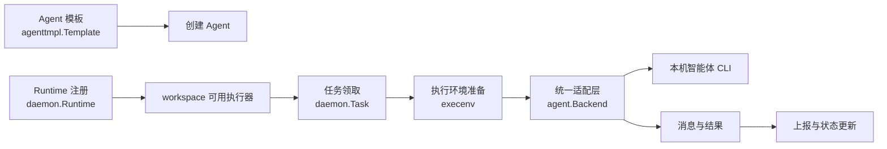

# Agents, Runtimes & Daemon Execution

## 模块概览

本模块组负责把“可选的智能体能力”变成“可在工作区中领取并执行任务的本地/云端运行单元”。它由两层组成：

- [内部控制面](agents-runtimes-daemon-execution-internal.md)：管理内置 Agent 模板、daemon 注册、workspace 同步、任务领取、心跳、取消、GC 和运行结果上报。
- [运行时适配包](agents-runtimes-daemon-execution-pkg.md)：通过 `server/pkg/agent` 将 Claude Code、Codex、Hermes、OpenCode、Copilot、Cursor、Kiro、Qoder、Trae、Grok 等 CLI 统一成 `Backend` 接口。

内部控制面决定“什么时候执行、在哪个 workspace 执行、用哪个 runtime 执行、如何上报结果”；运行时适配包只处理“如何启动并驱动具体智能体进程”。两者通过 `agent.New(provider, agent.Config{...})` 和 `Backend.Execute` 衔接，因此 daemon 不需要理解每个 CLI 的协议差异。

## 协作方式

`agenttmpl.Load()` 提供只读模板内容，用于从产品化模板创建 Agent；这些 Agent 最终会绑定到可执行的 runtime。runtime 来源包括内置 `Config.Agents` 和自定义 runtime profile，后者由 `appendProfileRuntimes()` 转换为注册请求，并通过 workspace 同步与心跳持续维护可用性。

任务执行从 handler/service 层进入 daemon：`StartTask` 记录任务开始，daemon 领取 `daemon.Task` 后由 `runTask` 准备隔离目录和环境变量，例如 `MULTICA_TOKEN`、`MULTICA_WORKSPACE_ID`、`CODEX_HOME`、`HERMES_HOME`。随后 `agent.New` 创建对应 provider 的后端，`Backend.Execute` 负责驱动 CLI，输出的 `Session.Messages` 与 `Session.Result` 再由 daemon drain 并通过 `ReportTaskMessages`、`TaskResult`、`ReportTaskUsage` 上报。

## 跨模块工作流

任务生命周期横跨 HTTP handler、service、daemon 和 runtime 适配层：

- 启动：`StartTask` 进入 service，记录开始事件和 analytics 上下文，然后由 daemon claim 并执行。
- 执行：`Daemon.runTask` 准备 `execenv`，调用 `server/pkg/agent` 的统一 `Backend`，持续收集消息和最终结果。
- 取消：`CancelTask` 经过 service 的 `CancelTaskWithResult`，记录取消耗时，并通过 daemon/WSRPC 影响正在执行的本地任务。
- 用量上报：`ReportTaskUsage` 进入 `CaptureTaskUsage`，复用任务 metrics/analytics 上下文。
- 自愈与同步：`workspaceSyncLoop`、`heartbeatLoop`、`handleRuntimeGone` 和 `refreshWorkspaceRuntimeProfiles` 共同维护 workspace 与 runtime 的一致性。
- 清理：`gcLoop`、`runGC`、`gcWorkspace` 和 `cleanTaskDir` 清理过期任务目录与 worktree，避免执行环境长期堆积。

整体上，内部子模块提供可靠的控制面和状态机，`server/pkg/agent` 提供可替换的执行后端。新增 provider 通常应优先落在适配包中；只有当它影响注册、心跳、任务调度或状态上报时，才需要改动内部 daemon 流程。