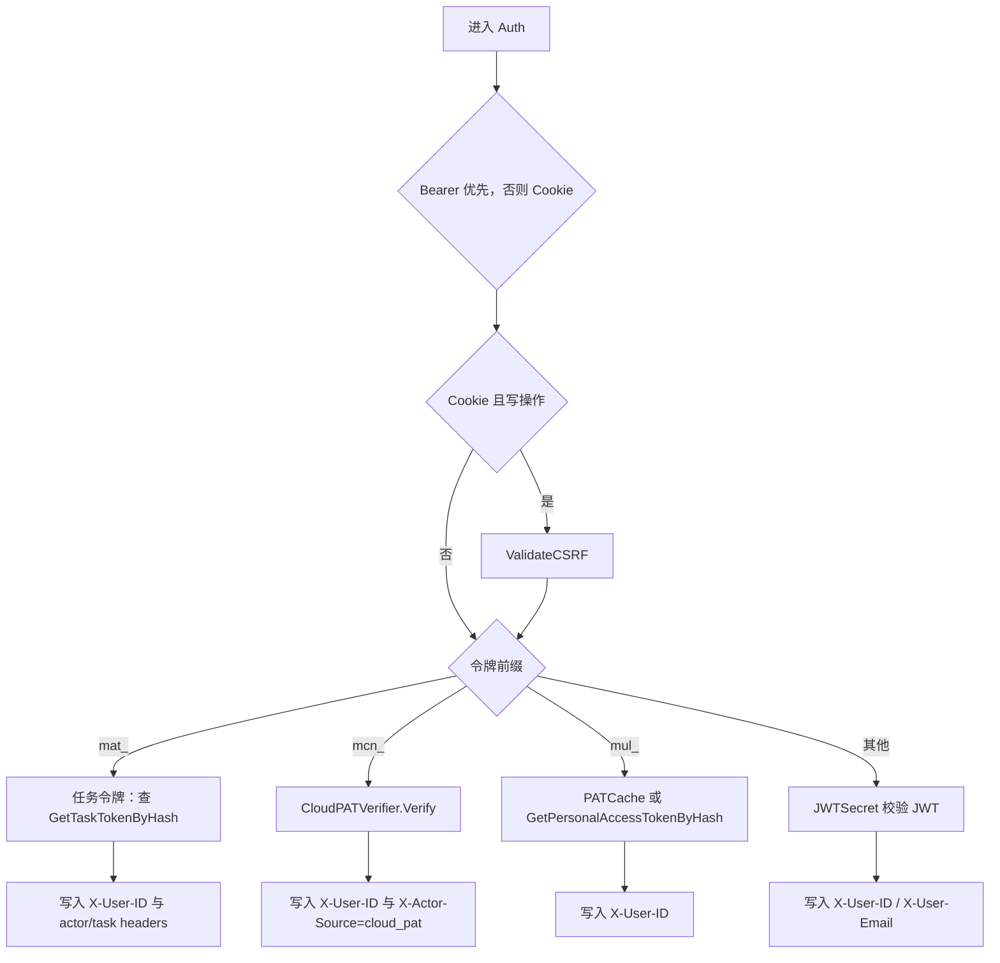

# Authentication, Middleware & Security — internal

## 模块概览

该内部模块负责服务端认证、请求安全边界、机器凭证识别、令牌缓存、CloudFront 私有资源访问和部分执行准入响应。代码分布在：

- `server/internal/auth/`：令牌生成、哈希、Cookie、CSRF、PAT/daemon/cloud PAT 缓存、CloudFront 签名。
- `server/internal/middleware/`：HTTP 认证、daemon 认证、限流、CSP、客户端元数据、CloudFront Cookie 刷新。
- `server/internal/handler/`：登录、个人访问令牌管理、人类 actor 守卫、dispatch 准入响应。

核心约定是：认证中间件把不同凭证解析成统一的下游形态，主要是 `X-User-ID`，但不会丢失关键的 actor 来源。机器凭证路径会由服务端写入 `X-Actor-Source`，供 `RequireHumanActor` 等人类专属接口做二次拒绝。

## 认证主路径

`middleware.Auth` 是普通 API 路由的认证入口，由 `server/cmd/server/router.go` 的 `NewRouterWithOptions` 装配。它按以下优先级取令牌：

1. `Authorization: Bearer <token>`
2. `multica_auth` HttpOnly Cookie

Cookie 来源的非安全方法会调用 `auth.ValidateCSRF` 校验 `X-CSRF-Token`。Bearer 来源不走 CSRF，因为它不依赖浏览器自动带 Cookie。

`Auth` 会先删除客户端传入的 `X-Actor-Source`，再由可信分支重新写入。这个模式是后续授权的关键：下游只能相信中间件设置的 actor 来源，不能相信客户端 header。

## 令牌类型

| 类型 | 前缀/来源 | 入口 | 解析结果 | 关键行为 |
| --- | --- | --- | --- | --- |
| 浏览器 JWT | `multica_auth` 或 Bearer JWT | `Auth` / `DaemonAuth` fallback | `X-User-ID`，JWT 时可有 `X-User-Email` | Cookie 写操作需要 CSRF |
| 普通 PAT | `mul_` | `Auth` / `DaemonAuth` fallback | `X-User-ID` | 使用 `PATCache`，缓存命中跳过 DB 和 `last_used_at` 更新 |
| Agent task token | `mat_` | `Auth` | `X-User-ID`、`X-Agent-ID`、`X-Task-ID`、`X-Workspace-ID`、`X-Actor-Source=task_token` | 机器凭证，代表 owner 执行任务 |
| Daemon token | `mdt_` | `DaemonAuth` | daemon context：workspace、daemon、auth path | 使用 `DaemonTokenCache` |
| Cloud node PAT | `mcn_` | `Auth` / `DaemonAuth` | `X-User-ID`、`X-Actor-Source=cloud_pat` | 由 Cloud Fleet 验证，本地只确认 owner 存在 |

`auth.GeneratePATToken`、`auth.GenerateDaemonToken`、`auth.GenerateAgentTaskToken` 都生成固定前缀加 40 位随机 hex。数据库和缓存使用 `auth.HashToken` 的 SHA-256 hex，不存储原始 token。

## 登录与会话 Cookie

`handler.SendCode` 负责验证码发送：规范化 email、检查注册策略、限制 60 秒内重复发送、写入 verification code，然后调用 `EmailService.SendVerificationCode`。

`handler.VerifyCode` 负责验证码登录：读取最新验证码，使用 `subtle.ConstantTimeCompare` 比较；非生产环境还支持 `MULTICA_DEV_VERIFICATION_CODE`，但 `isDevVerificationCode` 会在 `APP_ENV=production` 时禁用。验证成功后通过 `findOrCreateUser` 创建或读取用户，调用 `issueJWT` 签发 JWT，并用 `auth.SetAuthCookies` 写入：

- `multica_auth`：HttpOnly，会话 JWT。
- `multica_csrf`：非 HttpOnly，供前端读取并放入 `X-CSRF-Token`。

`auth.generateCSRFToken` 生成 `nonce.signature`，其中 signature 是 `HMAC-SHA256(nonce, authToken)`。`ValidateCSRF` 不只是比较 header 和 cookie，而是用 auth cookie 中的真实 JWT 重新计算 HMAC，因此子域即使能写 CSRF cookie，也不能伪造有效 header。

`auth.AuthTokenTTL` 从 `AUTH_TOKEN_TTL` 读取时长，支持 Go duration 字符串和整数秒，并在首次调用后缓存。未配置或非法时使用 30 天默认值。`isSecureCookie` 根据 `FRONTEND_ORIGIN` 是否为 `https` 决定 Cookie `Secure` 标记；`cookieDomain` 会忽略 IP 字面量形式的 `COOKIE_DOMAIN`，避免浏览器按 RFC 6265 丢弃 Cookie。

`handler.GoogleLogin` 使用 Google OAuth code 换取 access token，再请求 Google userinfo。用户创建逻辑同样走 `findOrCreateUser`，新用户会通过 `RecordEvent` 记录 signup 事件，并进入 `NormalizeSignupSource` / `NormalizeTaskSource` 等指标归一化链路。

## PAT 生命周期

`handler.CreatePersonalAccessToken` 为当前用户创建 `mul_` PAT。原始 token 只在 `CreatePATResponse.Token` 返回一次；数据库保存 `HashToken(rawToken)` 和前 12 字符 `token_prefix`。

`handler.RenewCurrentPersonalAccessToken` 只允许当前请求使用的 `mul_` Bearer token 续期。它会重新从 `Authorization` header 读取原始 token，因为上游 `Auth` 只传递 `X-User-ID`，不传递 token hash。续期策略是：

- 只处理 `mul_`，拒绝 JWT、Cookie、`mat_` 和 `mcn_`。
- 距离过期时间大于 `PATRenewThreshold`（7 天）时返回 `Renewed=false`。
- 进入窗口后，用 `ExtendPersonalAccessTokenExpiry` 将 `expires_at` 原地延长 `PATRenewExtension`（90 天）。
- 并发续期通过 SQL CAS 条件处理；失败后重读当前 row，并把当前 expiry 返回给调用方。
- 不主动清 `PATCache`，因为缓存 TTL 最长 10 分钟，下一次 miss 会读取新 expiry。

`handler.RevokePersonalAccessToken` 调用 `RevokePersonalAccessToken` 查询并删除后，会用返回的 hash 调用 `PATCache.Invalidate`，让撤销立即生效，不必等待 TTL。

## Redis 缓存与撤销窗口

`PATCache`、`DaemonTokenCache`、`MembershipCache` 和 `CloudPATVerifier` 的内部缓存都遵循“Redis 故障不阻断请求”的模式：读取失败当 miss，写入失败只记录日志。

`PATCache` 使用 `mul:auth:pat:<hash>`，TTL 由 `TTLForExpiry(now, expiresAt)` 计算，取 `AuthCacheTTL`（10 分钟）和 token 剩余寿命的较小值，避免缓存条目越过 token 过期时间。

`DaemonTokenCache` 使用 `mul:auth:daemon:<hash>`，缓存 `DaemonTokenIdentity{WorkspaceID, DaemonID}`。`DaemonAuth` 的 `mdt_` 分支命中后直接写入 daemon context，不查 DB。

`MembershipCache` 使用 `mul:auth:member:<userID>:<workspaceID>`，只缓存“是否是成员”，TTL 为 5 分钟。它不缓存角色；依赖角色的授权，例如 `requireWorkspaceRole` / `RequireWorkspaceRoleFromURL`，必须直接查数据库。

`CloudPATVerifier` 使用 `mul:auth:mcn:<hash>`，TTL 只有 60 秒。`mcn_` token 的生命周期归 Cloud Fleet 管理，本地无法主动失效，所以 TTL 本身就是撤销延迟上限。

## Cloud PAT 验证

`auth.CloudPATVerifier` 通过 `NewCloudPATVerifier` 创建。`FleetBaseURL` 为空时返回 `nil`，中间件会对 `mcn_` token 直接返回 401，而不是降级尝试 JWT/PAT。

`CloudPATVerifier.Verify` 的顺序是：

1. 用 `HashToken(token)` 查 Redis 正向缓存；命中则返回 `CloudPATIdentity`。
2. 调用 `fetch`，向 `<FleetBaseURL>/api/v1/pat/verify` POST `fleetVerifyRequest{Token}`。
3. Fleet 返回 `valid=true` 后，调用 `ownerLookupFor(queries)` 确认 `owner_id` 是本地 `users` 表中的真实用户。
4. owner 存在才写缓存并返回。

错误类别有明确 HTTP 映射：

- `ErrCloudPATInvalid`：Fleet 返回 `valid=false`，或 owner 不存在，映射为 401。
- `ErrCloudPATUnavailable`：Fleet 不可达、非 200、响应过大、JSON 解析失败、DB lookup 基础设施错误，映射为 503。
- `ErrCloudPATNotConfigured`：verifier 未配置，映射为 401。

`CloudPATInvalidError` 会保留 Fleet 的 reason，供日志记录；HTTP 响应仍只返回通用 invalid token，避免泄露 `token_not_found`、`token_revoked` 等细节。

## DaemonAuth

`middleware.DaemonAuth` 是 daemon 相关路由的认证入口，只接受 `Authorization: Bearer`，不读取 Cookie。它支持：

- `mdt_` daemon token：优先 `DaemonTokenCache.Get`，miss 后查 `GetDaemonTokenByHash`，再通过 context 写入 workspace ID、daemon ID 和 `DaemonAuthPathDaemonToken`。
- `mcn_` cloud PAT：走 `CloudPATVerifier.Verify`，写入 `X-User-ID`、`X-Actor-Source=cloud_pat`，并设置 `DaemonAuthPathCloudPAT`。
- `mul_` PAT：共享 `PATCache`，设置 `DaemonAuthPathPAT`。
- JWT：使用 `JWTSecret` 验证，设置 `DaemonAuthPathJWT`。

下游通过 `DaemonWorkspaceIDFromContext`、`DaemonIDFromContext`、`DaemonAuthPathFromContext` 读取 daemon 认证上下文。只有 `mdt_` 路径会提供 daemon workspace 和 daemon ID；PAT/JWT/cloud PAT fallback 只证明用户身份。

## 人类 actor 守卫

`handler.RequireHumanActor` 用于账号级、人类专属接口，例如账单余额、交易、checkout、portal session 等。它检查服务端写入的 `X-Actor-Source`：

- `task_token`：拒绝，返回 403。
- `cloud_pat`：拒绝，返回 403。
- 空值或未知值：放行。

放行未知值是有意设计。新增机器凭证类型时，必须在认证分支写入新的 `X-Actor-Source`，并同步评审是否加入 `RequireHumanActor` 的拒绝列表。

不要用 `resolveActor` 替代这个守卫。`resolveActor` 面向 workspace 内作者归因，而 `RequireHumanActor` 面向账号级授权；账单路由没有 workspace 上下文，也不应该信任 legacy `X-Agent-ID` / `X-Task-ID` fallback。

## CloudFront 私有资源访问

`auth.CloudFrontSigner` 为 CloudFront private distribution 生成 signed cookies 和 signed URL。`NewCloudFrontSignerFromEnv` 依赖：

- `CLOUDFRONT_KEY_PAIR_ID`
- `CLOUDFRONT_DOMAIN`
- `COOKIE_DOMAIN`
- `CLOUDFRONT_PRIVATE_KEY_SECRET` 或 `CLOUDFRONT_PRIVATE_KEY`

私钥加载顺序是 AWS Secrets Manager 优先，其次是本地开发用的 base64 PEM 环境变量。`parseRSAPrivateKey` 先尝试 PKCS8，再尝试 PKCS1。

`SignedCookies` 返回 `CloudFront-Policy`、`CloudFront-Signature`、`CloudFront-Key-Pair-Id` 三个 Cookie，使用 `Secure`、`HttpOnly`、`SameSite=None`。`SignedURL` 和 `SignedURLWithContentDisposition` 服务于 CLI/API 客户端，后者会先设置 `response-content-disposition` 查询参数再签名。

`middleware.RefreshCloudFrontCookies` 在 signer 非空时启用。认证请求中缺少 `CloudFront-Policy` 时，它会按 `AuthTokenTTL` 重新签发 cookies，避免 CDN Cookie 早于会话过期导致 403。

## 请求安全中间件

`middleware.RateLimit` 是 Redis 固定窗口限流器。它通过 Lua 脚本原子执行 `INCR` 和首次 `EXPIRE`，避免网络失败导致没有 TTL 的永久限流 key。Redis 为空时是 no-op；Redis 报错时 fail-open 并记录日志。

`ParseTrustedProxies` 解析可信代理 CIDR。只有 `RemoteAddr` 属于可信代理时，`extractIP` 才会读取 `X-Forwarded-For`，并从右向左选择第一个非可信 IP。默认不信任 XFF。

`middleware.ContentSecurityPolicy` 为大多数响应设置严格 CSP：`frame-ancestors 'none'`、`object-src 'none'`、`base-uri 'self'`。附件预览路径 `/api/attachments/*/(download|content)` 使用 `attachmentPreviewCSPHeader`，允许 `frame-ancestors 'self'`，便于应用内预览。

`middleware.ClientMetadata` 读取 `X-Client-Platform`、`X-Client-Version`、`X-Client-OS` 并放入 request context。`ClientMetadataFromContext` 和 `SetClientMetadata` 供普通 HTTP 和 WebSocket 场景复用。这些值是客户端可控的，只能用于日志、指标和非安全 gating，不能作为授权依据。

`middleware.SetWebhookTriggerID` 会把已解析的 webhook trigger ID 写回原始 `*http.Request` 的 context，供 `RequestLogger` 在请求结束后记录审计信息，同时避免把 bearer token 暴露在日志路径中。

## Dispatch 准入响应

`handler/admission.go` 定义同步触发 agent/squad 执行时的统一响应形态。关键类型是：

- `DispatchStatus`：`queued`、`coalesced`、`deferred`、`blocked`。
- `DispatchReasonCode`：别名到 `dispatch.ReasonCode`，由 service 层决定，handler 层只序列化。
- `DispatchTarget`：只在调用者有权限看见目标时填充 `Name`。
- `DispatchOutcome`：每个目标的结果，可附带 `TaskID` 和 `RunID`。
- `writeDispatchBlocked`：写入结构化 403/409 响应。

设计重点是非枚举性：当目标不可用或无权调用时，wire 上只暴露稳定 reason code 和通用 fallback message，不泄露私有 agent 是否存在、名称或 owner。

## 扩展注意事项

新增认证分支时，必须先决定它是人类等价还是机器等价。机器凭证需要在 `Auth` / `DaemonAuth` 中先清理客户端 header，再写入唯一的 `X-Actor-Source`，并评审 `RequireHumanActor`。

新增可缓存 token 时，TTL 必须不超过 token 剩余寿命；如果上游系统不能主动通知本地撤销，TTL 就是撤销延迟边界，不能复用 `AuthCacheTTL`。

新增 workspace 成员授权时，只有“是否为成员”可以使用 `MembershipCache`。任何 role、owner、admin 级别判断都必须查数据库。

生产环境必须显式设置 `JWT_SECRET`。`defaultJWTSecret` 只适合开发环境；如果生产遗漏配置，所有实例会共享可预测 secret。