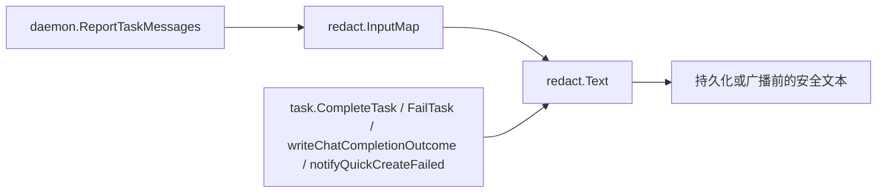

# Authentication, Middleware & Security — pkg

## 密钥脱敏包（`server/pkg/redact`）

`pkg/redact` 负责在代理输出进入数据库或通过 WebSocket 广播之前，识别并替换常见敏感信息。它是一个轻量级、无外部服务依赖的字符串脱敏层，主要处理任务执行结果、消息上报参数和失败通知中的密钥、令牌、连接串与本机用户路径。



## 公开接口

### `Text(s string) string`

`Text` 是核心脱敏函数。它接收任意字符串，按 `patterns` 中定义的正则规则依次扫描并替换匹配内容，最后再对当前用户的 home 目录路径做本地用户名遮蔽。

典型用途是处理代理输出、任务完成摘要、失败原因或即将写入数据库的文本：

```go
safeOutput := redact.Text(rawOutput)
```

当前覆盖的敏感信息类型包括：

- AWS access key ID：替换为 `[REDACTED AWS KEY]`
- AWS secret access key：替换为 `[REDACTED AWS SECRET]`
- PEM 私钥块：替换为 `[REDACTED PRIVATE KEY]`
- GitHub classic token 与 fine-grained PAT：替换为 `[REDACTED GITHUB TOKEN]`
- OpenAI / Anthropic `sk-` API key：替换为 `[REDACTED API KEY]`
- Slack `xox*` 与 `xapp-` token：替换为 `[REDACTED SLACK TOKEN]`
- GitLab `glpat-` token：替换为 `[REDACTED GITLAB TOKEN]`
- Google `AIza...` API key：替换为 `[REDACTED GOOGLE API KEY]`
- Stripe live secret / restricted key：替换为 `[REDACTED STRIPE KEY]`
- JWT：替换为 `[REDACTED JWT]`
- `Bearer <token>`：替换为 `Bearer [REDACTED]`
- 带密码的连接串：替换为 `[REDACTED CONNECTION STRING]@`
- 常见凭据型 `key=value` / `key: value` 片段：替换为 `[REDACTED CREDENTIAL]`

`Text` 还会遮蔽本机 home 目录中的用户名。例如当前 home 目录为 `/Users/alice` 时，输出中的 `/Users/alice/project` 会变成 `/Users/****/project`。`homeDir` 和 `username` 在 `init()` 中解析一次，避免每次调用都查询系统用户信息。

### `InputMap(m map[string]any) map[string]any`

`InputMap` 用于处理结构化输入参数。它返回一个新的 map，只对 string 类型的 value 调用 `Text`，其他类型保持原值。

```go
safeInput := redact.InputMap(input)
```

行为细节：

- 输入为 `nil` 时返回 `nil`
- 不修改原始 map
- 只处理顶层 string value
- 不递归处理嵌套 map、slice 或 struct

这使它适合 `ReportTaskMessages` 这类 handler 在接收 agent 上报参数时做浅层输入清洗。

## 脱敏规则的执行方式

所有规则定义在包级变量 `patterns` 中，每项是一个 `secretPattern`：

```go
type secretPattern struct {
    re          *regexp.Regexp
    replacement string
}
```

`Text` 会按数组顺序依次执行：

```go
for _, p := range patterns {
    s = p.re.ReplaceAllString(s, p.replacement)
}
```

因此维护规则时需要注意顺序。更具体的规则应放在可能覆盖它的通用规则之前。例如 Stripe live key 使用 `sk_live_`，不能依赖 OpenAI/Anthropic 的 `sk-` 规则；GitHub fine-grained PAT 使用 `github_pat_`，也不能被 classic `ghp_` 规则覆盖。

替换文本使用明确的占位符，而不是删除内容，这样调用方仍能知道输出中曾出现某类凭据，同时不会保留原始 secret。

## 与代码库的连接点

该包主要在任务执行链路和 daemon 上报链路中使用：

- `internal/handler/daemon.go` 的 `ReportTaskMessages` 调用 `InputMap` 和 `Text`，用于清洗 agent 上报的消息内容与输入参数。
- `internal/service/task.go` 的 `writeChatCompletionOutcome` 调用 `Text`，用于清洗聊天完成结果。
- `CompleteTask`、`FailTask` 和 `notifyQuickCreateFailed` 调用 `Text`，用于清洗任务完成、失败和快速创建失败时产生的文本。

这些调用点共同保证：任务相关文本在进入持久化层或广播给前端之前，先经过统一的 secret redaction。

## 安全边界与限制

`pkg/redact` 是基于正则的防泄漏保护层，不是完整的数据分类系统。它适合拦截常见凭据格式，但不保证识别所有私有 token、业务自定义密钥或经过编码/拆分的 secret。

当前实现还有几个明确边界：

- `InputMap` 只处理顶层 string value，不处理嵌套结构。
- `Text` 不解析 JSON、YAML、shell AST 或日志格式，只做字符串扫描。
- 通用凭据规则依赖常见变量名，如 `API_KEY`、`PASSWORD`、`DATABASE_URL` 等。
- home 目录遮蔽依赖进程启动时 `os.UserHomeDir()` 和 `user.Current()` 的结果。

新增调用方如果处理的是嵌套输入，需要在调用前展开字段，或为该数据结构增加专门的清洗逻辑。

## 维护与扩展建议

新增脱敏规则时，优先添加到 `patterns`，并补充对应测试。规则应尽量满足以下要求：

- 匹配真实 secret 格式，而不是过宽地匹配普通文本。
- 使用稳定占位符，便于日志排查和测试断言。
- 对带分隔符的 token 保留必要尾随字符，避免破坏周围文本结构。
- 将专用规则放在通用规则之前，避免被提前替换或漏检。
- 明确排除非敏感公开值，例如当前 Stripe 规则只处理 `sk_live_` / `rk_live_`，不处理 `pk_live_`。

测试覆盖位于 `pkg/redact/redact_test.go`，包括 GitHub、Slack、AWS、Google、Stripe、JWT、Bearer token、连接串、通用凭据、home 目录和 `InputMap` 行为。新增规则时应至少包含一个应脱敏样例，并在可能误伤普通文本时增加反例测试。