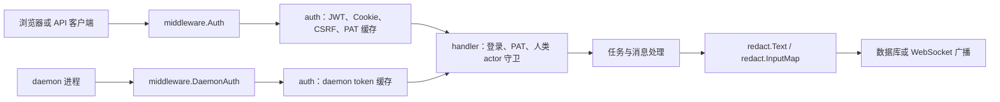

# Authentication, Middleware & Security

## 概览

该模块组定义了服务端请求进入系统后的安全边界：谁可以访问、凭证如何校验、机器与真人 actor 如何区分，以及执行输出在持久化或广播前如何脱敏。

- [内部认证、中间件与安全](authentication-middleware-security-internal.md) 负责认证主链路、Cookie/CSRF、PAT 与 daemon token 校验、CloudFront 私有资源签名、限流、CSP 和人类 actor 守卫。
- [密钥脱敏包](authentication-middleware-security-pkg.md) 提供 `server/pkg/redact`，在任务输出、代理消息、失败原因等文本离开执行层之前移除敏感信息。

## 子模块如何协作

请求首先由 `middleware.Auth` 或 `middleware.DaemonAuth` 建立身份上下文。普通 API 请求会从 `Authorization: Bearer` 或 `multica_auth` Cookie 提取凭证；Cookie 路径下的非安全方法再由 `auth.ValidateCSRF` 校验 `X-CSRF-Token`。daemon 请求则通过 daemon token 缓存识别机器身份。

认证结果会被标准化为下游可消费的请求形态，例如 `X-User-ID`。同时，机器凭证路径会保留 `X-Actor-Source`，使 `handler.RequireHumanActor` 能在登录态存在时继续拒绝非真人 actor 访问人类专属接口。

登录与令牌生命周期由 handler 和 auth 共同完成：`VerifyCode` 使用 `SetAuthCookies` 写入认证 Cookie，`Logout` 调用 `ClearAuthCookies` 清理会话；`CreatePersonalAccessToken` 使用 `HashToken` 存储 PAT 摘要，`RevokePersonalAccessToken` 通过 PAT 缓存失效路径让撤销尽快生效。

CloudFront 相关能力位于同一安全边界内。`auth.SignedCookies` 为私有资源生成访问 Cookie，配合中间件刷新逻辑，使附件或私有内容访问不需要绕过统一认证链路。

## 跨模块关键流程

### 登录与会话建立

`VerifyCode` 完成用户认证后，将用户实体转换为 `UserResponse`，并通过 `SetAuthCookies` 建立浏览器会话。之后普通请求由 `middleware.Auth` 读取 Cookie 或 Bearer token，统一注入用户身份。

### PAT 创建、校验与撤销

PAT 创建时由 `CreatePersonalAccessToken` 生成响应并调用 `HashToken` 存储安全摘要。请求进入 `middleware.Auth` 后，PAT 通过缓存路径快速解析；撤销时 `RevokePersonalAccessToken` 调用 `Invalidate` 清理缓存，避免已撤销令牌继续命中。

### daemon 身份与人类接口隔离

daemon 请求经 `middleware.DaemonAuth` 和 daemon token cache 识别，随后仍可复用用户维度的授权信息。但由于 actor 来源被保留下来，`RequireHumanActor` 可以把机器凭证挡在需要真人操作的 handler 之外。

### 执行输出脱敏

认证和授权解决“谁能做什么”，`pkg/redact` 解决“结果能否安全落库或广播”。例如 `daemon.ReportTaskMessages` 会通过 `redact.InputMap` 处理参数，任务完成、失败通知和 chat completion 输出会通过 `redact.Text` 清理 AWS key、PEM 私钥、GitHub token、连接串和本机 home 路径等敏感内容。