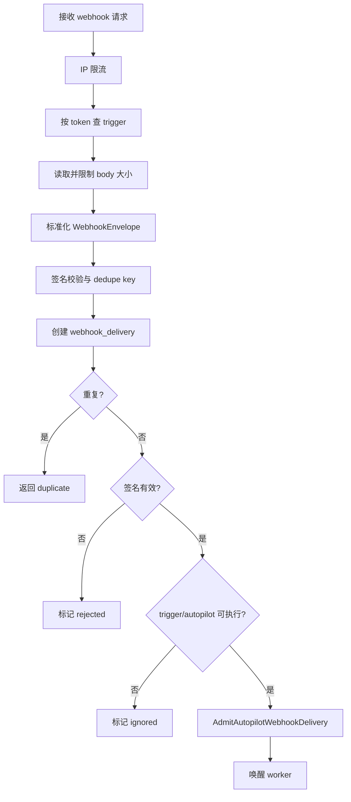

# Autopilot, Webhooks & Scheduling

## 模块概览

Autopilot 模块负责把“自动化规则”转成可审计、可重放、可调度的执行记录。它覆盖三类入口：

- 认证 API：创建、更新、删除 autopilot，管理 trigger、协作者、订阅者和运行记录。
- 公共 Webhook：通过 URL bearer token 接收外部事件，做签名校验、去重、持久化和异步派发。
- 调度执行：schedule trigger 通过 cron 计算 `next_run_at`，由 scheduler 领取并派发。

核心代码分布在：

- `server/internal/handler/autopilot.go`：Autopilot、Trigger、Run、协作者的 HTTP API。
- `server/internal/handler/autopilot_webhook.go`：公共 webhook ingress、payload 标准化、签名、去重、限流。
- `server/internal/handler/webhook_delivery.go`：认证侧 delivery 查询和 replay。
- `server/internal/service/autopilot.go`：实际派发、准入、跳过、issue/task 同步。
- `server/internal/scheduler/jobs_autopilot.go` 与 `internal/scheduler/manager.go`：schedule trigger 的领取和执行。

## 数据模型职责

`AutopilotResponse` 是 autopilot 的主要 API 形状，包含 `assignee_type`、`assignee_id`、`execution_mode`、`subscribers`、`can_write` 和 `can_manage_access`。`autopilotToResponse` 负责把 `db.Autopilot` 转成该响应，并兼容旧数据：当 `AssigneeType` 为空时默认返回 `"agent"`。

`AutopilotTriggerResponse` 表示 trigger。`triggerToResponse` 会为 webhook trigger 派生 `webhook_path` 和 `webhook_url`，并只返回签名密钥的状态信息：`has_signing_secret` 和 `signing_secret_hint`，不会返回 secret 本身。

`AutopilotRunResponse` 表示运行历史。`runToResponse` 会反序列化 `trigger_payload` 和 `result`；列表接口使用 `runToResponseSlim` 去掉完整 payload，避免 webhook envelope 造成大响应。

`WebhookDeliveryResponse` 是认证 API 暴露的 webhook delivery 视图。列表使用 `slimDeliveryToResponse`，详情使用 `deliveryToResponse(..., true)` 才包含 `selected_headers`、`raw_body` 和 `response_body`。

## 权限模型

Autopilot 写权限由 `memberCanWriteAutopilot` 判定：

- autopilot 创建者可写；
- workspace `owner` / `admin` 可写；
- 显式协作者可写。

`autopilotWriteByOwnership` 只覆盖创建者和 workspace 管理员，不查协作者表。`requireAutopilotWrite` 用于编辑、删除、触发、管理 trigger、轮换 webhook token、设置 signing secret、replay delivery。

协作者列表管理更严格，由 `requireAutopilotAccessManagement` 控制：只有创建者和 workspace `owner` / `admin` 可以 grant 或 revoke；协作者不能继续转授权，避免权限升级。

读详情时，`GetAutopilot` 会根据 `canWrite` 决定是否暴露 webhook token、path 和 URL。非写权限成员仍可看到 trigger 元数据，但不会拿到可触发外部执行的 secret。

## Autopilot 生命周期

创建入口是 `CreateAutopilot`。它校验 `title`、`assignee_id`、`execution_mode`、`issue_title_template`，并通过 `validateAutopilotAssignee` 确认 assignee 是 workspace 内的 agent 或 squad。Squad assignee 会额外检查 squad 未归档、leader agent 存在且未归档，并确认当前 actor 可以调用私有 leader。

创建时会在同一事务内：

1. 插入 autopilot；
2. 调用 `recordAutopilotRuleVersion` 记录规则版本；
3. 添加 subscribers；
4. commit 后发布 `protocol.EventAutopilotCreated`。

更新入口是 `UpdateAutopilot`。它使用 raw JSON 字段区分“字段未传”和“显式置空”，尤其用于 `description`、`project_id`、`issue_title_template`、`subscribers`。`assignee_type` 和 `assignee_id` 必须成对校验，防止把 agent id 当作 squad id 使用。

`autopilotRuleSubstantiveChange` 定义哪些变更需要重新发布规则版本：`assignee_type`、`assignee_id`、`status`、`execution_mode`、`description`、`issue_title_template`。`title` 和 `project_id` 被视为非实质性变更。实质性更新会重新记录 rule version，并通过 `SetAutopilotTriggerPublishersByAutopilot` 把所有 trigger 的责任发布者改为当前编辑者。

删除入口 `DeleteAutopilot` 实际执行归档：调用 `ArchiveAutopilot`，保留 runs、tasks、deliveries、subscribers 和 collaborators 作为执行历史。归档也会记录 rule version。

## Trigger 管理

`CreateAutopilotTrigger` 支持两种 `kind`：`schedule` 和 `webhook`。旧的 `"api"` kind 被拒绝。schedule trigger 必须提供 `cron_expression`，并通过 `computeNextRun` 调用 `service.ComputeNextRun` 计算 `next_run_at`。timezone 使用 `service.ValidateTimezone` 校验，缺省行为是 UTC。

Webhook trigger 会在插入前生成 token。`createWebhookTriggerWithMintedToken` 使用 `generateWebhookToken` 生成 `awt_` 前缀、URL-safe base64 的 256-bit token，并在事务内同时插入 trigger 和记录 rule version。若唯一索引冲突，会最多重试 3 次。

`UpdateAutopilotTrigger` 对 schedule/webhook 字段做 kind-specific 校验：非 schedule trigger 不能更新 `cron_expression` 或 `timezone`；非 webhook trigger 不能使用 `event_filters`。更新 schedule 的 cron 或 timezone 后会重新计算 `next_run_at`。

Trigger 的实质性变更包括 `enabled`、`cron_expression`、`timezone` 和 `event_filters`。`label` 是展示字段，不转移责任。实质性变更会记录 rule version，并用 `SetAutopilotTriggerPublisher` 只更新当前 trigger 的发布者。

`RotateAutopilotTriggerWebhookToken` 为 webhook trigger 生成新 bearer token，旧 URL 立即失效。`SetAutopilotTriggerSigningSecret` 单独处理 signing secret，避免 secret 混入通用 PATCH 请求体或日志；空字符串表示清除 secret。

## Webhook Ingress 流程

`HandleAutopilotWebhook` 是公共入口，不在认证路由组内。URL path 中的 token 是 bearer credential。



请求体最大为 `maxWebhookBodyBytes`，当前是 256 KiB。`normalizeWebhookPayload` 要求 body 是 JSON object 或 array，拒绝空 body、非法 JSON 和 scalar JSON。它会生成稳定的 `WebhookEnvelope`：

```json
{
  "event": "github.workflow_run.completed",
  "eventPayload": {},
  "request": {
    "receivedAt": "2026-07-16T00:00:00Z",
    "contentType": "application/json"
  }
}
```

事件推断顺序在 `inferEvent` 中：`X-GitHub-Event`、`X-Gitlab-Event`、`X-Event-Type`、body 的 `event`、`type`、`action`，最后默认 `webhook.received`。GitHub 事件会结合 body.action 形成类似 `github.pull_request.opened` 的事件名。

签名通过 `verifyWebhookSignatureForProvider` 完成。当前 provider 是 `"generic"` 或 `"github"`，都使用 GitHub 兼容的 `X-Hub-Signature-256: sha256=<hex>`。底层 `verifyHubSignature` 使用 HMAC-SHA256 和 `hmac.Equal` 做常量时间比较。未配置 signing secret 时结果是 `not_required`。

去重由 `extractDedupeKey` 提取：GitHub provider 优先使用 `X-GitHub-Delivery`，generic 使用 `Idempotency-Key`，其他情况回退到通用 header。`persistInboundDelivery` 插入 `webhook_delivery`，若 `(trigger_id, dedupe_key)` 唯一约束冲突，则读取原 delivery 并调用 `BumpWebhookDeliveryAttempt`，返回 `duplicate`。

## Event Filters

`WebhookEventFilter` 的形状是：

```go
type WebhookEventFilter struct {
	Event   string   `json:"event"`
	Actions []string `json:"actions,omitempty"`
}
```

`validateWebhookEventFilters` 在写入边界拒绝空 event 和空 action。create 时 `encodeWebhookEventFilters` 对空列表返回 nil，表示接受所有事件。update 时 `encodeWebhookEventFiltersAlways` 即使对空列表也返回 `[]`，用于支持 PATCH 显式清空 filters。

匹配逻辑在 `webhookEventAllowedByTriggerScope`。没有 filters 或 filters 为空时允许所有事件；filters 损坏时 fail closed。`splitWebhookEvent` 会把 `github.workflow_run.completed` 拆成 provider、event name、action；`webhookActionCandidates` 还会从 payload 的 `action`、`state`、`conclusion`、`status` 里提取候选 action。

一个重要细节：多个 filter 可以共享同一个 event name。匹配器不会在第一个 event name 命中但 action 不匹配时提前返回 false，而是继续扫描后续 filter。

## Delivery 查询与 Replay

`ListAutopilotDeliveries` 返回某个 autopilot 的最近 deliveries，列表不带 raw body、headers 和 response body。`GetAutopilotDelivery` 会通过 `loadDeliveryForAutopilot` 再次确认 delivery 属于当前 autopilot，防止跨 workspace 猜 ID 泄露。

`ReplayAutopilotDelivery` 会从历史 delivery 创建一个新的 delivery row，并同步派发 autopilot。它拒绝 replay 签名失败的 delivery，避免把原本被拒绝的攻击 payload 重新送入执行链。Replay 插入时使用空 dedupe key，因此不会被原 delivery 的幂等键合并；新 row 通过 `replayed_from_delivery_id` 关联来源。

Replay 会复用 `normalizeWebhookPayload`，从原始 `raw_body` 和 `selected_headers` 重新构造 envelope，再调用 service 层派发。

## 调度与派发连接

Schedule trigger 的时间计算在 handler 层通过 `computeNextRun` 委托给 `service.ComputeNextRun`。调度运行本身由 `internal/scheduler` 负责：`manager.Run` 调用 `RunOnce`，领取任务后走 `runClaimed`、`runHeartbeats` 和 `heartbeat`，保证长任务执行期间租约不会过期。

Autopilot schedule job 位于 `jobs_autopilot.go`，`autopilotHandler` 会把领取到的 schedule trigger 交给 service 层派发。Webhook 路径则先由 `HandleAutopilotWebhook` 创建 durable delivery 和 admitted run，再唤醒 `WebhookDeliveryWorker`。worker 的 `ProcessNext` 会重新读取 delivery，复用 `normalizeWebhookPayload`，并进行最终派发与状态更新。

Service 层的关键入口包括：

- `DispatchAutopilotManual`：手动 “run now”，由 `TriggerAutopilot` 调用。
- `AdmitAutopilotWebhookDelivery`：webhook ingress 同步准入，创建或复用幂等 run。
- `DispatchAutopilot` / `dispatchAutopilot`：统一派发核心。
- `shouldSkipDispatch`：运行前跳过判断。
- `dispatchCreateIssue`：`execution_mode=create_issue` 时创建 issue，并用 `buildIssueDescription` 组装描述。
- `recordSkippedRun`、`failRun`、`publishRunDone`：维护 run 状态和事件发布。
- `SyncRunFromIssue`、`SyncRunFromTask`、`SyncRunFromLinkedIssueTask`：从 issue/task 终态事件反向同步 autopilot run。

## 责任归属与审计

该模块非常重视“谁发布了会执行的规则”。`recordAutopilotRuleVersion` 是 handler 对 `service.RecordAutopilotRuleVersion` 的薄封装，要求调用方传入事务内的 `db.Queries`，保证规则版本和业务写入原子提交。

创建 autopilot、创建/删除 trigger、归档 autopilot、实质性更新 autopilot 或 trigger 都会记录 rule version。手动执行 `TriggerAutopilot` 是直接人为动作，会把当前 member 作为 `direct_human` 归属传给 `DispatchAutopilotManual`。Webhook 和 schedule 执行则依赖 trigger 上的 `published_by_type` / `published_by_id`，表示最近一次实质性塑造该 trigger 的人。

## 开发注意事项

修改 autopilot 或 trigger 字段时，先判断它是否改变“执行什么、谁执行、何时执行、是否执行”。如果是实质性变更，必须同步更新 rule version；如果只改展示字段，例如 `title` 或 `label`，不应转移责任归属。

新增 webhook provider 时，需要同时考虑 `isAllowedWebhookProvider`、`extractDedupeKey`、`verifyWebhookSignatureForProvider`、事件推断和 delivery 指标维度。不要只在 create path 放开 provider，否则会得到看似可配置但行为仍按 generic 处理的 trigger。

任何会暴露 webhook token、signing secret、raw body 或 selected headers 的接口都要重新检查权限边界。当前约定是：token 只给 writer；secret 永不回显；delivery 列表不返回大 payload，详情才返回调试字段。

处理 webhook ingress 时保持“先持久化，再异步派发”的结构。`webhook_delivery` 是恢复、去重、replay 和运营可见性的基础；绕过 delivery 直接 dispatch 会破坏幂等和审计链路。