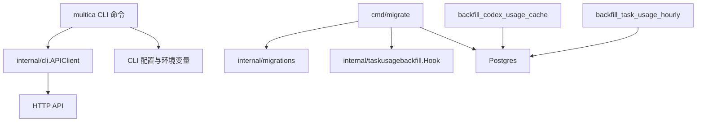

# CLI & Maintenance Tools — cmd

## 模块概览

`server/cmd` 放置 Multica 的可执行命令入口，分为两类：

1. 运维维护工具：直接连接 Postgres，执行迁移、历史数据回填和修复。
2. `multica` CLI 子命令：面向用户和 agent 任务环境，通过 `internal/cli.APIClient` 调用 HTTP API。

这些命令通常不承载核心业务规则，而是负责参数解析、环境解析、输入校验、请求体组装、调用内部包或远端 API，并把结果打印为 JSON 或表格。



## 维护命令

### `cmd/migrate`

`server/cmd/migrate/main.go` 是数据库迁移执行器，支持：

```bash
go run ./cmd/migrate up
go run ./cmd/migrate down
```

入口 `main()` 初始化 logger、解析方向、读取 `DATABASE_URL`，然后通过 `migrations.Files(direction)` 找到迁移文件并调用 `runMigrations()`。

`runMigrations(ctx, pool, opts)` 是核心执行函数：

- 校验 `runOptions.Direction` 必须是 `"up"` 或 `"down"`。
- 使用 `quoteQualifiedIdentifier()` 安全拼接 `schema_migrations` 表名。
- 获取 session 级 Postgres advisory lock，默认 key 为 `migrationAdvisoryLockKey`。
- 创建迁移记录表。
- 遍历迁移文件，使用 `migrations.ExtractVersion(file)` 得到版本号。
- `up` 时跳过已应用版本，`down` 时跳过未应用版本。
- 执行 SQL 文件后写入或删除迁移记录。

迁移锁必须绑定到固定连接，所以 `runMigrations()` 使用 `pool.Acquire(ctx)` 获取 `*pgxpool.Conn`，而不是直接调用 `pool.Exec()`。这是因为 `pg_advisory_lock` 是 session 级锁，如果连接被池回收，锁就不能可靠保护整个迁移循环。

`runOptions.Hooks` 支持迁移前钩子。当前注册的生产钩子是：

```go
var preMigrationHooks = map[string]preMigrationHook{
    "103_drop_legacy_daily_rollups": runTaskUsageHourlyHook,
}
```

`runTaskUsageHourlyHook()` 调用 `taskusagebackfill.Hook(ctx, pool, taskusagebackfill.HookOptions{})`，用于在 migration 103 之前补齐 `task_usage_hourly`。这样直接从 v0.3.4 升级到当前版本时，migration 103 的 fail-closed lag guard 不会因为 server 尚未启动、rollup watermark 尚未推进而失败。

测试会直接覆盖 `runOptions.Files`、`SchemaMigrationsTable`、`AdvisoryLockKey` 和 `Hooks`，因此新增迁移 runner 行为时应保持这些注入点可用。

### `cmd/backfill_task_usage_hourly`

`server/cmd/backfill_task_usage_hourly/main.go` 用于从历史 `task_usage` 数据初始化统一小时聚合表 `task_usage_hourly`。它应在小时聚合相关迁移落地后、注册 cron worker 前运行。

核心流程在 `run()` 中：

1. 解析 flags：
   - `--dry-run`
   - `--months-back`
   - `--force-partial`
   - `--sleep-between-slices`
2. 连接 Postgres。
3. 获取 advisory lock `4246`，与 rollup cron 和其他 backfill 串行化。
4. 查询 `task_usage` 的 `MIN(created_at)` 和 `MAX(created_at)`。
5. 用 `monthFloor()` 对齐到 UTC 月初。
6. 按月调用：
   ```sql
   SELECT rollup_task_usage_hourly_window($1::timestamptz, $2::timestamptz)
   ```
7. 非 dry-run 时调用 `stampWatermark()`，把 `task_usage_hourly_rollup_state.watermark_at` 设置为 `now() - 5 minutes`。

`--months-back` 是危险选项。即使只回填最近 N 个月，`stampWatermark()` 仍会推进 watermark，旧桶之后不会被 cron 自动补回。因此当 cutoff 会跳过历史数据时，命令要求显式传入 `--force-partial`。

`stampWatermark(ctx, pool)` 使用普通 `UPDATE` 修改 `id = 1` 的状态行。如果没有行被更新，它只记录 warn，提示可能尚未应用对应 schema migration。

### `cmd/backfill_codex_usage_cache`

`server/cmd/backfill_codex_usage_cache/main.go` 是一次性托管数据修复工具，用来修正 Codex 历史 `task_usage` 行中被重复计入的 cached input tokens。

它只处理满足以下条件的行：

- `tu.provider = 'codex'`
- `tu.cache_read_tokens > 0`
- `tu.input_tokens > 0`
- `COALESCE(tu.updated_at, tu.created_at) < --cutoff`
- 可选限制到指定 `--workspace-id`

`--cutoff` 必须是 Codex usage normalization fix 实际上线时间，并且必须早于当前时间。`config.parseAndValidate(now)` 会拒绝未来 cutoff，避免对已正常写入的行再次扣减。

默认是 dry-run。`run()` 会先调用 `loadDryRunSummary()` 按 workspace 和 UTC 日期聚合候选行，`logSummary()` 输出：

- 候选行数
- 修复前 input token 总数
- 修复后 input token 总数
- 将移除的 token 数
- 被 clamp 到 0 的行数
- 候选行的 created_at 范围

只有传入 `--execute` 才会执行 `executeBackfill()`。更新逻辑按批处理：

```sql
SET input_tokens = GREATEST(tu.input_tokens - tu.cache_read_tokens, 0),
    updated_at = now()
```

批查询使用 `FOR UPDATE OF tu SKIP LOCKED`，并按 `COALESCE(updated_at, created_at), id` 排序。`--batch-size` 控制每批大小，`--sleep-between-batches` 可降低写压力。

执行前会获取 advisory lock `4246`，与小时 rollup/backfill 使用同一个锁域。执行后如果 `--rebuild-rollup=true`，命令使用 `databaseClock()` 记录修复开始和结束的数据库时间，并通过 `rollupWindow(startedAt, finishedAt)` 前后各扩 1 秒，然后调用：

```sql
SELECT rollup_task_usage_hourly_window($1::timestamptz, $2::timestamptz)
```

`correctedInputTokens(inputTokens, cacheReadTokens)` 是纯函数测试面，表达同一 clamp 规则：扣减后小于 0 则返回 0。

## `multica` CLI 命令

`server/cmd/multica` 使用 Cobra 组织用户 CLI。每个 `cmd_*.go` 文件通常定义一个顶层 command、若干子命令、flags，以及对应的 `runXxx()` 处理函数。

### API client 与上下文解析

`cmd_agent.go` 中的 `newAPIClient(cmd)` 是大多数 CLI 子命令的共同入口。它解析：

- server URL：`resolveServerURL()` / `tryResolveServerURL()`
- workspace ID：`resolveWorkspaceID()`
- token：`resolveToken()`，定义在 `cmd_auth.go`

解析优先级通常是 flag、环境变量、profile config。server URL 会经过 `normalizeAPIBaseURL()`，内部调用 `daemon.NormalizeServerBaseURL()`。

agent 托管执行环境有特殊约束：

- `inAgentExecutionContext()` 检查 `MULTICA_AGENT_ID` 或 `MULTICA_TASK_ID`。
- `inDaemonManagedExecutionContext()` 额外检查 `MULTICA_DAEMON_PORT` 和工作目录 marker。
- `daemonTaskContextMarkerPath()` 从当前目录向上查找 `execenv.TaskContextMarkerRelPath`，并验证 JSON 中的 `managed_by`。

在 daemon-managed agent task 中，CLI 禁止回退读取用户全局配置中的 token/workspace。`newAPIClient()` 还要求 token 必须是 `mat_` task-scoped token，否则返回明确错误。这样可以避免 agent 内执行 CLI 时意外用用户 PAT 写入数据。

### agent 命令

`agentCmd` 管理 agent 生命周期和相关资源：

- `runAgentList()`
- `runAgentGet()`
- `runAgentCreate()`
- `runAgentUpdate()`
- `runAgentArchive()`
- `runAgentRestore()`
- `runAgentTasks()`
- `runAgentAvatar()`

这些函数使用 `newAPIClient()` 创建 client，然后调用 `GetJSON`、`PostJSON`、`PutJSON` 等方法访问 `/api/agents` 相关接口。

`runAgentCreate()` 和 `runAgentUpdate()` 只在 flag 被显式设置时写入请求体。常见字段包括：

- `name`
- `description`
- `instructions`
- `runtime_id`
- `runtime_config`
- `custom_args`
- `model`
- `thinking_level`
- `mcp_config`
- `visibility`
- `permission_mode`
- `invocation_targets`
- `max_concurrent_tasks`

`applyAgentPermissionFlags()` 把 `--permission-mode`、`--public-to-workspace`、`--public-to-member` 翻译成服务端字段 `permission_mode` 和 `invocation_targets`。如果只设置了 public-to flags 而没有显式设置 mode，默认使用 `public_to`。

`custom_env` 不再通过 `agent update` 修改。对应逻辑被拆到 `agent env`：

- `runAgentEnvGet()` 调用 `/api/agents/{id}/env` 读取明文 `custom_env`。
- `runAgentEnvSet()` 调用同一 audited endpoint 替换整个 `custom_env`。

secret 输入通道由 `resolveCustomEnv()` 和 `resolveMcpConfig()` 统一处理。二者都支持 inline、stdin、file 三选一，并拒绝空输入：

```bash
multica agent env set <id> --custom-env-file ./env.json
multica agent update <id> --mcp-config-stdin < mcp.json
```

`parseCustomEnv()` 只接受 JSON object of string keys and string values，空对象 `{}` 表示清空。`parseMcpConfig()` 接受 JSON object 或字面量 `null`，其中 `null` 表示清除配置。为了避免泄露 secret，JSON 解析错误不会包装底层 `json.Unmarshal` 错误。

agent skills 子命令包括：

- `runAgentSkillsList()`
- `runAgentSkillsSet()`
- `runAgentSkillsAdd()`

`cleanSkillIDsFlag()` 会 trim `--skill-ids`，过滤空字符串。`printAgentSkillsMutationResult()` 根据 `--output` 输出 JSON 或表格。

### auth 命令

`cmd_auth.go` 提供认证相关能力：

- `runAuthLogin()`
- `runAuthLoginBrowser()`
- `runAuthLoginToken()`
- `runAuthStatus()`
- `runAuthLogout()`

`runAuthLogin()` 根据 `--token` 是否存在选择 token 登录或浏览器登录。

token 登录通过 `validateLoginTokenPrefix()` 限制前缀，当前接受：

```go
var loginTokenPrefixes = []string{"mul_", auth.CloudPATPrefix}
```

浏览器登录流程由 `runAuthLoginBrowser()` 实现：

1. 解析 server URL 和 app URL。
2. 用 `resolveCallbackBinding()` 决定 callback host 和 listener bind address。
3. 本地启动 `/callback` HTTP server。
4. 生成随机 `state` 防 CSRF。
5. 打开浏览器访问 `appURL/login?cli_callback=...&cli_state=...`。
6. callback 收到 JWT 后调用 `/api/tokens` 换取 PAT。
7. 用 `/api/me` 验证 PAT。
8. 保存 profile config，并清空旧 workspace ID。

`resolveCallbackBinding()` 处理 hosted、本机 self-host、LAN self-host、反向代理和 SSH 等拓扑。`detectOutboundIP()` 用 UDP dial 推断访问 server 时本机使用的源 IP；`browserLoginInstructions()` 在 SSH 且 callback host 是 loopback 时打印端口转发提示。

### attachment 命令

`cmd_attachment.go` 提供文件上传和下载：

- `runAttachmentUpload()`：上传本地文件并绑定到当前 chat task。
- `runAttachmentDownload()`：按 attachment ID 获取 signed download URL 并下载到本地。

上传时 task ID 来自 `--task`，没有传入则使用 `client.TaskID`，也就是 `MULTICA_TASK_ID`。命令拒绝 HTTP URL，只接受本地路径。上传完成后输出 JSON，其中包括可粘贴到回复中的 markdown：

- 普通文件：`!file[name](url)`
- 图片：``

`escapeMarkdownLabel()` 会转义 `\`、`[`、`]`、`(`、`)`，避免文件名破坏 markdown label。

下载流程先访问 `/api/attachments/{id}` 获取 metadata 和 `download_url`，再调用 `client.DownloadFile()` 下载内容，并写入 `--output-dir`。最终 stdout 输出 JSON，stderr 打印本地绝对路径。

### autopilot 命令

`cmd_autopilot.go` 管理 scheduled/triggered agent automations。主要命令包括：

- `runAutopilotList()`
- `runAutopilotGet()`
- `runAutopilotCreate()`
- `runAutopilotUpdate()`
- `runAutopilotDelete()`
- `runAutopilotTrigger()`
- `runAutopilotRuns()`
- `runAutopilotTriggerAdd()`
- `runAutopilotTriggerUpdate()`
- `runAutopilotTriggerDelete()`
- `runAutopilotTriggerRotateURL()`

创建 autopilot 时，`runAutopilotCreate()` 要求：

- `--title`
- `--agent`
- `--mode=create_issue|run_only`

`--agent` 会通过 `resolveAgent()` 解析为 agent ID。`--project` 通过 `resolveProjectID()` 解析。subscriber 输入由 `resolveAutopilotSubscriberInputs()` 处理。

更新 autopilot 时，`runAutopilotUpdate()` 只发送显式变更字段。`--subscriber` 和 `--clear-subscribers` 互斥。`--mode` 同样只能是 `create_issue` 或 `run_only`。

trigger 相关命令支持 schedule 和 webhook：

- `runAutopilotTriggerAdd()` 默认 `--kind=schedule`。
- schedule trigger 要求 `--cron`，可传 `--timezone`。
- webhook trigger 禁止 `--cron` 和 `--timezone`。
- webhook URL 会通过 `printWebhookURL()` 输出，优先使用响应中的 `webhook_url`。

列表类命令通常使用 `loadActorDisplayLookup()` 做 agent/member 显示名映射，并用 `displayID()` 支持短 ID 或完整 UUID 表格输出。

## 输出约定

CLI 命令普遍提供 `--output table|json`。JSON 输出调用 `cli.PrintJSON(os.Stdout, value)`，表格输出调用 `cli.PrintTable(os.Stdout, headers, rows)`。

错误消息倾向于面向操作者，例如：

- 缺少 workspace：`requireWorkspaceID()`
- daemon task 中 token 类型不正确：`newAPIClient()`
- secret 输入为空或多通道冲突：`resolveCustomEnv()` / `resolveMcpConfig()`
- 无字段更新：`runAgentUpdate()` / `runAutopilotUpdate()`

新增命令时应保持这个模式：参数错误直接返回 `fmt.Errorf(...)`，网络/API 错误用操作名包装，例如 `fmt.Errorf("update agent: %w", err)`。

## 与代码库其他部分的连接

`server/cmd` 不直接实现 HTTP handler 或数据库业务规则，而是连接以下内部包：

- `internal/logger`：命令启动时调用 `logger.Init()`。
- `internal/cli`：API client、配置读写、输出格式、API timeout。
- `internal/daemon` / `internal/daemon/execenv`：server URL 规范化、daemon task marker。
- `internal/migrations`：迁移文件发现和版本号提取。
- `internal/taskusagebackfill`：migration 103 前的小时聚合回填 hook。
- Postgres functions：`rollup_task_usage_hourly_window()`、`pg_advisory_lock()`、`pg_advisory_unlock()`。

维护命令直接操作数据库，需要和 migration、cron、rollup worker 的锁语义保持一致。当前 task usage 相关工具共享 advisory lock `4246`，迁移 runner 使用独立的 `migrationAdvisoryLockKey`。

## 修改指南

新增或修改 `cmd/multica` 子命令时，优先沿用现有结构：

1. 定义 `var xxxCmd = &cobra.Command{...}`。
2. 在 `init()` 中挂载子命令和 flags。
3. 在 `runXxx()` 中调用 `newAPIClient()`。
4. 用 `cli.APIContext()` 或明确 timeout 创建 context。
5. 组装请求体时只写入用户显式设置的 flags。
6. 支持 `--output json`，默认表格或简短人类可读输出。

处理 secret 时不要把原始内容放进错误消息或日志。参考 `parseCustomEnv()`、`parseCustomArgs()`、`parseMcpConfig()` 的无内容错误模式。

修改维护命令时要特别注意幂等性和可恢复性：

- 数据修复默认应 dry-run。
- 大范围写入应支持 batch 或 slice。
- 长任务应响应 SIGINT/SIGTERM。
- 与 cron 或并发实例共享的数据路径应使用 advisory lock。
- 回填类命令应能安全重跑，至少不能重复扣减或重复推进错误 watermark。