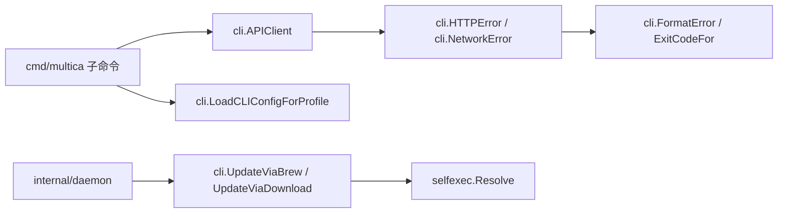

# CLI & Maintenance Tools — internal

## CLI 与维护工具（internal）

该模块为 `multica` 命令行和守护进程提供内部基础设施，主要覆盖四类能力：

- `server/internal/cli`：CLI 配置、REST API 客户端、用户可读错误、输出格式、更新逻辑。
- `server/internal/selfexec`：解析当前进程实际可执行文件路径，供自更新逻辑使用。
- 上层调用者主要来自 `cmd/multica/*` 的子命令，以及 `internal/daemon/daemon.go` 的维护任务。
- 该模块不承载业务状态本身，而是把命令行输入、机器本地配置、HTTP 请求和维护操作连接到服务端 API。



## API 客户端

`APIClient` 是 `server/internal/cli/client.go` 中的 REST 客户端封装。`cmd/multica` 的 agent、runtime、status 等子命令通过它访问 Multica 服务端。

核心字段：

- `BaseURL`：服务端地址，`NewAPIClient` 会去掉末尾 `/`。
- `WorkspaceID`：请求头 `X-Workspace-ID`。
- `Token`：请求头 `Authorization: Bearer <token>`。
- `AgentID`：请求头 `X-Agent-ID`，用于把请求归因到 agent。
- `TaskID`：请求头 `X-Task-ID`，用于 agent task 校验。
- `HTTPClient`：默认使用 `http.Client{Timeout: httpTimeout()}`。
- `Platform`、`Version`、`OS`：覆盖客户端身份头；为空时使用包级变量 `ClientPlatform`、`ClientVersion`、`ClientOS`。

`setHeaders` 是所有 API helper 的共同入口，会统一设置认证、workspace、agent/task 和客户端身份头。新增 HTTP helper 时应复用它，避免不同命令发送不一致的上下文。

常用 JSON helper：

- `GetJSON`
- `GetJSONWithHeaders`
- `PostJSON`
- `PutJSON`
- `PatchJSON`
- `DeleteJSON`
- `DeleteJSONResponse`
- `DeleteJSONWithBody`

这些方法的模式一致：

1. 使用 `http.NewRequestWithContext` 构造请求。
2. JSON body 方法先 `json.Marshal`，并设置 `Content-Type: application/json`。
3. 调用 `setHeaders`。
4. 执行 `HTTPClient.Do`。
5. 用 `wrapTransport` 把传输层错误转为 `*NetworkError`。
6. 对 `status >= 400` 返回 `*HTTPError`。
7. 成功时按需解码 JSON。

这使上层命令可以统一依赖 `errors.As(err, *HTTPError)` 或 `FormatError` / `ExitCodeFor` 处理失败，而不必理解每个 HTTP 方法的细节。

## 超时与命令上下文

HTTP 传输默认超时为 `defaultHTTPTimeout = 30 * time.Second`，可通过环境变量 `MULTICA_HTTP_TIMEOUT` 覆盖。`httpTimeout` 支持两种格式：

- Go duration：如 `45s`、`2m`
- 秒数整数：如 `45`

无效、空值或非正数都会回退到默认 30 秒。

命令级上下文由以下函数管理：

- `APITimeout()`
- `AtLeastAPITimeout(min time.Duration)`
- `APIContext(parent context.Context)`

`APITimeout` 实际返回 `httpTimeout() + apiContextGrace`，其中 `apiContextGrace = 5 * time.Second`。设计目标是让 `http.Client` 的传输超时先触发，从而得到可分类的 “request timed out” 错误，而不是外层 context 提前取消。

上传场景中，`UploadFileWithURL`、`UploadChatAttachment`、`ImportSkillFile` 会在上下文 deadline 大于默认 `HTTPClient.Timeout` 时复制一份 `http.Client` 并临时放大 `Timeout`，避免大文件上传被默认客户端超时截断。

## 文件上传与下载

文件上传都走 multipart form。

`UploadFile(ctx, fileData, filename, issueID)` 上传到 `/api/upload-file`，可附带 `issue_id`，只返回 attachment id。它期望响应 JSON 中存在 `id` 字段；缺失会返回 `upload response missing attachment id`。

`UploadChatAttachment(ctx, fileData, filename, taskID)` 同样上传到 `/api/upload-file`，但附带 `task_id`，用于把附件绑定到 chat task 产生的 assistant reply。它返回完整的 `AttachmentResponse`，包括：

- `ID`
- `URL`
- `DownloadURL`
- `MarkdownURL`
- `Filename`
- `ContentType`
- `SizeBytes`
- `CreatedAt`

`UploadFileWithURL(ctx, fileData, filename)` 用于不关联 issue/comment 的上传，返回 attachment id 和 URL。这里允许 `ID` 为空，因为服务端在 “S3 上传成功但 DB 记录失败” 的 fallback 路径中可能返回空 id，但文件 URL 仍可使用。

`ImportSkillFile(ctx, fileData, filename, onConflict, out)` 上传 `.skill` / `.zip` 到 `/api/skills/import`，并可附带 `on_conflict` 策略。成功时把结构化导入结果解码到 `out`。

`DownloadFile(ctx, downloadURL)` 支持两类 URL：

- 绝对 URL：如签名 CloudFront/S3 URL，直接请求，不附加 CLI 认证头，避免破坏签名 query。
- 相对 URL：如 `/api/attachments/{id}/download`，会拼到 `BaseURL` 后，并调用 `setHeaders` 附加认证上下文。

下载读取上限是 100 MB，与上传限制保持一致。

## 配置文件与 profile

`server/internal/cli/config.go` 管理 CLI 持久配置。默认配置路径是：

```text
~/.multica/config.json
```

命名 profile 的配置路径是：

```text
~/.multica/profiles/<name>/config.json
```

路径相关函数：

- `CLIConfigPath()`
- `CLIConfigPathForProfile(profile string)`
- `ProfileDir(profile string)`

读取与写入函数：

- `LoadCLIConfig()`
- `LoadCLIConfigForProfile(profile string)`
- `SaveCLIConfig(cfg CLIConfig)`
- `SaveCLIConfigForProfile(cfg CLIConfig, profile string)`

`LoadCLIConfigForProfile` 在配置文件不存在时返回空 `CLIConfig` 和 nil error，方便命令用默认值继续运行。`SaveCLIConfigForProfile` 会创建目录，并通过同目录临时文件加 `os.Rename` 做原子写入；最终权限设置为 `0600`，因为配置中可能包含 `Token`。

`CLIConfig` 包含：

- `ServerURL`
- `AppURL`
- `WorkspaceID`
- `Token`
- `Backends`
- `ProfileCommandOverrides`

`Backends` 当前只定义 `OpenClaw` 覆盖项。`OpenClawOverride` 支持：

- `BinaryPath`
- `StateDir`

OpenClaw 解析优先级由注释约定：

- `BinaryPath`：`MULTICA_OPENCLAW_PATH` > `backends.openclaw.binary_path` > PATH 查找
- `StateDir`：`OPENCLAW_STATE_DIR` > `backends.openclaw.state_dir` > OpenClaw 默认 `~/.openclaw`

`ProfileCommandOverrides` 是本机级别的 `profile_id -> executable path` 映射，用于自定义 runtime profile 的命令路径覆盖。它不会发送到服务端，因为可执行文件路径是机器本地属性。

## 错误分类、展示与退出码

`server/internal/cli/errors.go` 把底层错误转换为稳定的用户体验和脚本可判断的退出码。

主要类型：

- `ErrorKind`：粗粒度错误分类。
- `HTTPError`：HTTP 状态错误，在 `client.go` 中构造，在 `errors.go` 中定义 `Kind()`。
- `NetworkError`：传输层错误包装，保留原始 error，同时隐藏默认用户消息中的 raw URL。
- `UserMessageError`：允许命令提供更具体的用户可读消息。
- `Language`：`LangEN` / `LangZH`。

`wrapTransport(req, err)` 是传输层错误入口。所有 HTTP helper 都在 `HTTPClient.Do` 后调用它。它会通过 `classifyNetworkError` 分类：

- `KindNetworkTimeout`
- `KindNetworkDNS`
- `KindNetworkRefused`
- `KindNetworkTLS`
- `KindNetworkOffline`

HTTP 状态码由 `HTTPError.Kind()` 映射：

- `401` -> `KindAuthRequired`
- `403` -> `KindForbidden`
- `404` -> `KindNotFound`
- `409` -> `KindConflict`
- `400` / `422` -> `KindValidation`
- `429` -> `KindRateLimited`
- `5xx` -> `KindServerError`

`FormatError(err, debug)` 是顶层用户展示入口。非 debug 模式只输出一行友好消息；debug 模式或设置 `MULTICA_DEBUG` 时，会追加原始错误链和结构化细节。

语言通过 `DetectLanguage` 从环境变量判断，优先级是：

1. `LC_ALL`
2. `LC_MESSAGES`
3. `LANG`

第一个已设置变量以 `zh` 开头时使用中文，否则使用英文。

`ExitCodeFor(err)` 提供稳定退出码：

- `0`：无错误
- `1`：通用错误
- `2`：网络错误
- `3`：认证或权限错误，即 401 / 403
- `4`：404
- `5`：400 / 422

新增命令时，推荐让错误原样向上返回，由顶层统一调用 `FormatError` 和 `ExitCodeFor`。如果命令需要更明确的提示，用 `WithUserMessage(msg, err)` 包装，但不要丢失原始错误。

## 输出辅助函数

`server/internal/cli/output.go` 提供两个简单输出 helper：

- `PrintTable(w, headers, rows)`
- `PrintJSON(w, v)`

`PrintTable` 使用 `text/tabwriter` 输出 tab 对齐表格。`PrintJSON` 使用缩进 JSON，缩进为两个空格。

上层命令中常见模式是：默认输出表格，指定 JSON 输出时调用 `PrintJSON`。例如 agent list/get/tasks 等命令会根据输出格式在 `PrintTable` 和 `PrintJSON` 之间切换。

## flag 与环境变量

`FlagOrEnv(cmd, flagName, envKey, fallback)` 实现统一优先级：

1. 如果 cobra flag 被显式设置，使用 flag 值。
2. 否则，如果环境变量非空，使用环境变量值。
3. 否则使用 fallback。

它只处理 string flag。调用者需要确保 `flagName` 对应的 flag 已在命令上注册。

## 自更新逻辑

`server/internal/cli/update.go` 负责 CLI 自更新。它支持两条路径：

- Homebrew 安装：`UpdateViaBrew()`
- 直接下载 GitHub release：`UpdateViaDownload()` / `UpdateViaDownloadWithTimeout()`

版本判断相关函数：

- `IsReleaseVersion(v string)`
- `IsNewerVersion(latest, current string)`
- `parseReleaseVersion(v string)`

这些函数只接受严格三段数字版本，可带 `v` 前缀，例如 `0.1.13` 或 `v0.1.13`。带 dev describe 后缀、预发布后缀、第四段版本号的字符串都会解析失败。这个限制是有意的，避免源代码构建或开发版本被自动降级到公开 release。

GitHub release 相关函数：

- `FetchLatestRelease()`
- `fetchReleaseByTag(tag string)`
- `findReleaseAsset(assets, targetVersion, goos, goarch)`
- `findChecksumManifestAsset(assets)`
- `parseChecksumManifest(manifest, assetName)`
- `verifyAssetSHA256(data, expectedHex, assetName)`

直接下载更新的流程是：

1. 用 `selfexec.Resolve()` 找到当前可执行文件。
2. 解析符号链接，得到真实二进制路径。
3. 根据目标版本请求 GitHub release metadata。
4. 根据 `runtime.GOOS` / `runtime.GOARCH` 找到 release archive。
5. 找到 `checksums.txt`。
6. 先下载 checksum manifest。
7. 从 manifest 中找到 archive 的 SHA-256。
8. 下载 archive 到内存。
9. 对 archive 做 SHA-256 校验。
10. 校验通过后再解压出 `multica` 或 `multica.exe`。
11. 写入同目录临时文件。
12. 继承原二进制权限。
13. 调用平台相关 `replaceBinary` 替换当前二进制。

校验失败时不会解压，也不会写入目标路径。这一点对无人值守的 daemon 自动更新很重要，因为缺少 `checksums.txt` 或 checksum 不匹配都应失败关闭，而不是安装未验证二进制。

archive 解析函数：

- `extractBinaryFromTarGz(r, name)`：Unix 平台 `.tar.gz`
- `extractBinaryFromZip(r, name)`：Windows 平台 `.zip`

资源命名由 `releaseAssetCandidates` 生成，优先匹配当前版本化命名：

```text
multica-cli-<version>-<goos>-<goarch>.<ext>
```

并兼容旧命名：

```text
multica_<goos>_<goarch>.<ext>
```

`IsBrewInstall()` 通过 `selfexec.Resolve()`、`filepath.EvalSymlinks`、`GetBrewPrefix()` 和 `MatchKnownBrewPrefix()` 判断当前二进制是否来自 Homebrew。`MatchKnownBrewPrefix` 是 `brew --prefix` 不可用时的离线兜底，会识别已知 Cellar 路径：

- `/opt/homebrew`
- `/usr/local`
- `/home/linuxbrew/.linuxbrew`

## 平台相关二进制替换

`replaceBinary` 有 Unix 和 Windows 两个实现。

Unix 版本在 `update_unix.go` 中：

- 直接 `os.Rename(tmpPath, exePath)`。
- 运行中的进程继续持有旧 inode，因此可安全覆盖路径。
- `CleanupStaleUpdateArtifacts()` 是 no-op。

Windows 版本在 `update_windows.go` 中：

- Windows 不允许覆盖正在运行的 `.exe`。
- `replaceBinary` 会先删除旧的 `.old` 残留。
- 再把当前 exe 重命名为 `exePath + ".old"`。
- 然后把新二进制重命名到原路径。
- 如果安装新二进制失败，会尝试把旧 exe 恢复回原路径。

`CleanupStaleUpdateArtifacts()` 在 Windows 启动时删除残留的 `.old` 文件。它同样依赖 `selfexec.Resolve()` 找到当前 exe。

## selfexec：当前可执行文件解析

`server/internal/selfexec/selfexec.go` 的 `Resolve()` 用于获取当前进程实际二进制路径。自更新逻辑必须知道要替换哪个文件，因此不能只依赖工作目录或 argv 字符串。

解析顺序在 `resolveWith` 中：

1. 优先调用 `os.Executable()`。
2. 如果失败，检查 `os.Args[0]` 是否存在。
3. 用 `exec.LookPath(args[0])` 按正常可执行文件查找规则解析。
4. 转为绝对路径。
5. `os.Stat` 确认目标是 regular file。
6. 如果两条路径都失败，用 `errors.Join` 返回包含 `os.Executable` 和 fallback 的组合错误。

这个 fallback 对特殊启动环境有意义：某些环境可能无法提供 OS 级 executable metadata，但仍能通过 `argv[0]` 找到实际命令。

## 与代码库其他部分的连接

该模块的上游主要是命令实现和 daemon：

- `cmd/multica/cmd_agent.go` 使用 `NewAPIClient` 创建客户端，并调用 `GetJSON`、`PostJSON`、`PutJSON`、`UploadFileWithURL` 等访问服务端。
- agent 命令通过 `APIContext` 获取统一 deadline。
- agent 命令通过 `PrintTable` / `PrintJSON` 输出列表、详情和任务。
- workspace、server URL、auth 解析路径会调用 `LoadCLIConfigForProfile`。
- `internal/daemon/daemon.go` 的 `resolveAuth` 读取 CLI 配置。
- daemon 更新流程调用 `IsBrewInstall`、`UpdateViaBrew`、`UpdateViaDownload`。
- `UpdateViaDownloadWithTimeout` 和 Windows 清理逻辑依赖 `internal/selfexec.Resolve`。

开发该模块时需要保持这些边界：

- `server/internal/cli` 可以依赖标准库、cobra，以及少量内部维护包如 `selfexec`。
- HTTP helper 应返回 `*HTTPError` 或 `*NetworkError`，保证 `FormatError` 和 `ExitCodeFor` 能继续工作。
- 新增持久配置字段应使用 `json:",omitempty"`，避免空值改变配置文件形状。
- 涉及 token 或本地路径的配置写入应继续使用 `SaveCLIConfigForProfile` 的原子写入和 `0600` 权限模式。
- 自更新路径必须先校验 checksum 再解压或替换二进制。