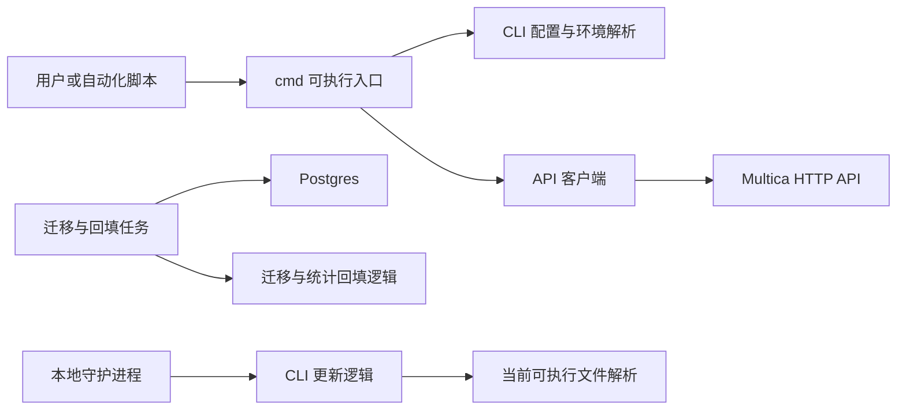

# CLI & Maintenance Tools

## 概览

`CLI & Maintenance Tools` 负责把本地命令、维护任务和 Multica 服务端连接起来。它由两个子模块组成：

- [cmd](cmd.md)：提供可执行入口，包括 `cmd/multica` 用户 CLI、数据库迁移和历史数据回填命令。
- [internal](internal.md)：提供 CLI 共享基础设施，包括 `cli.APIClient`、配置加载、错误格式化、输出格式、自更新和当前可执行文件解析。

整体上，`cmd` 负责“命令做什么”，`internal` 负责“命令如何安全、稳定地访问配置、HTTP API 和本机环境”。

## 子模块协作

`cmd/multica` 中的 agent、autopilot、auth、config、daemon、attachment 等子命令会先解析参数和本地上下文，再通过 [internal](internal.md) 中的 `LoadCLIConfigForProfile`、`APIContext`、`APIClient`、`PrintJSON`、`PrintTable` 等能力完成请求和输出。

典型路径是：

1. 子命令解析参数、profile、workspace、agent 或 issue 标识。
2. `internal/cli` 读取配置并构造请求上下文。
3. `cli.APIClient` 发起 HTTP 请求，并把网络错误或服务端错误包装成可展示的 `HTTPError` / `NetworkError`。
4. 子命令使用统一的 JSON 或表格输出返回结果。

维护类命令则更靠近服务端运行环境。`cmd/migrate` 调用迁移与任务用量回填逻辑，`backfill_codex_usage_cache`、`backfill_task_usage_hourly` 等命令直接面向历史数据修复和统计补齐。它们与用户 CLI 使用不同入口，但共同遵循“入口薄、逻辑下沉”的结构。

## 关键工作流

用户 CLI 工作流以 `cmd/multica` 为入口，复用 `internal/cli` 的配置、API 客户端、错误处理和输出工具。例如 `runAgentAvatar` 使用 `GetJSON` 查询 API，`runAutopilotTrigger` 使用 `PrintJSON` 输出结果，`runAutopilotRuns` 使用 `PrintTable` 展示列表。

本地配置工作流由命令入口触发，落在 `internal/cli` 的配置读写能力上。例如登录、状态检查和 `config set` 会围绕 profile、server URL 和 token 组织本地 CLI 状态。

守护进程与更新工作流跨越 `cmd/multica`、`internal/daemon`、`internal/cli` 和 `internal/selfexec`。命令层负责启动或管理 daemon，更新逻辑负责选择 brew 或下载更新，自执行路径解析用于定位当前 CLI 二进制。

维护工作流集中在 [cmd](cmd.md) 的独立命令中，面向数据库迁移、缓存回填和小时级任务用量聚合。这些命令通常由运维或发布流程调用，目标是修复或推进服务端数据状态，而不是提供交互式用户体验。