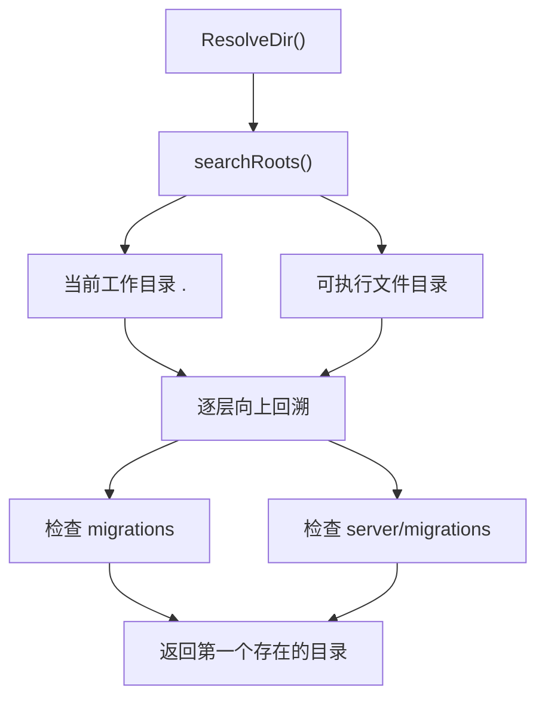

# Data Access, Schema & Migrations — internal

## 模块概览

`server/internal/migrations` 负责在不同启动位置下定位数据库迁移目录，并按迁移方向返回有序的 SQL 文件列表。它是迁移 CLI、服务健康检查和部分集成测试共享的底层工具层，不直接执行 SQL，也不连接数据库。

核心职责有三类：

- 解析迁移目录：`ResolveDir()`
- 按方向列出迁移文件：`Files(direction string)`
- 提取并校验迁移版本集合：`AllVersions()`、`ExtractVersion(filename string)`

## 目录解析策略

`ResolveDir()` 会从多个搜索根开始查找迁移目录，返回第一个存在且是目录的路径。

搜索入口由 `searchRoots()` 提供：

```go
func searchRoots() []string {
	roots := []string{"."}
	if exe, err := selfexec.Resolve(); err == nil {
		roots = append(roots, filepath.Dir(exe))
	}
	return roots
}
```

也就是说，模块会优先从当前工作目录查找；如果能通过 `selfexec.Resolve()` 解析当前可执行文件路径，还会从可执行文件所在目录查找。这使同一套迁移逻辑可以同时适配开发环境、测试环境和编译后二进制运行环境。

每个搜索根会向上回溯最多 `maxSearchDepth + 1` 层，目前 `maxSearchDepth` 为 `4`。每一层都会尝试两个候选目录：

```go
var candidateLeaves = []string{
	"migrations",
	filepath.Join("server", "migrations"),
}
```

因此，模块可以识别以下两类常见布局：

```text
migrations/
server/migrations/
```

`ResolveDir()` 使用 `seen map[string]bool` 去重，避免当前工作目录和可执行文件目录重叠时重复检查相同路径。



如果所有候选路径都不存在，`ResolveDir()` 返回：

```go
fmt.Errorf("migrations directory not found")
```

调用方需要把这个错误视为运行环境配置问题，而不是空迁移集。

## 迁移文件排序

`Files(direction string)` 是迁移文件发现的主入口。它先调用 `ResolveDir()` 找到迁移目录，然后使用 `filepath.Glob` 匹配指定方向的迁移文件：

```go
suffix := "." + direction + ".sql"
files, err := filepath.Glob(filepath.Join(dir, "*"+suffix))
```

方向参数通常是：

- `"up"`：匹配 `*.up.sql`
- `"down"`：匹配 `*.down.sql`

排序规则和迁移执行顺序一致：

- `direction == "up"` 时使用 `sort.Strings(files)`，按文件名升序应用迁移。
- `direction == "down"` 时使用 `sort.Sort(sort.Reverse(sort.StringSlice(files)))`，按文件名降序回滚迁移。

模块没有对 `direction` 做枚举校验。传入其他字符串时，它仍会匹配 `*.<direction>.sql`，并按非 `down` 的升序逻辑排序。因此生产调用方应只传入 `"up"` 或 `"down"`。

## 版本提取

`ExtractVersion(filename string)` 从迁移文件名中去掉方向后缀，返回迁移版本名：

```go
func ExtractVersion(filename string) string {
	base := filepath.Base(filename)
	base = strings.TrimSuffix(base, ".up.sql")
	base = strings.TrimSuffix(base, ".down.sql")
	return base
}
```

示例：

```go
ExtractVersion("/repo/server/migrations/20260716093000_create_users.up.sql")
// 返回 "20260716093000_create_users"

ExtractVersion("20260716093000_create_users.down.sql")
// 返回 "20260716093000_create_users"
```

该函数只做文件名级别的后缀裁剪，不校验版本格式。如果传入的文件名不以 `.up.sql` 或 `.down.sql` 结尾，会返回原始 base name。

## 完整版本集合

`AllVersions()` 返回磁盘上所有 `up` 迁移的版本名，顺序与应用顺序一致：

```go
func AllVersions() ([]string, error) {
	files, err := Files("up")
	if err != nil {
		return nil, err
	}
	if len(files) == 0 {
		return nil, fmt.Errorf("no up migrations found")
	}
	versions := make([]string, len(files))
	for i, f := range files {
		versions[i] = ExtractVersion(f)
	}
	return versions, nil
}
```

这个函数用于判断数据库 schema 是否完整。它刻意返回所有 `up` 迁移版本，而不是只返回字典序最后一个版本。

原因是迁移可能不是严格追加的：如果新增了一个编号低于当前最新版本的补充迁移，只检查“最后一个版本是否已应用”会误判数据库已经就绪。`AllVersions()` 让调用方可以逐个检查 `schema_migrations` 中是否记录了每一个迁移版本，从而发现这种乱序补充迁移。

## 与代码库其他部分的关系

该模块被几个运行路径复用：

- `cmd/migrate/main.go` 的 `main` 调用 `Files()` 获取待执行的迁移 SQL 文件。
- `cmd/migrate/main.go` 的 `runMigrations` 调用 `ExtractVersion()` 记录或识别迁移版本。
- `cmd/server/health.go` 的 `newServerHealth` 调用 `AllVersions()`，用于服务就绪检查。
- `server/internal/taskusagebackfill/hook_test.go` 的 `applyMigrationsUpTo` 调用 `ExtractVersion()`，在测试中按指定版本应用迁移。
- `cmd/backfill_codex_usage_cache/integration_test.go` 的 `testApplyMigrationsUpTo` 调用 `ExtractVersion()`，支持集成测试准备数据库状态。

可以把这个包理解为“迁移文件系统索引层”。它不关心数据库连接、事务、`schema_migrations` 表写入或 SQL 执行细节，只提供稳定的文件定位、排序和版本名解析能力。

## 维护注意事项

新增迁移目录布局时，应优先扩展 `candidateLeaves`，而不是在调用方硬编码路径。这样迁移 CLI、服务健康检查和测试会同时获得一致行为。

修改搜索深度时，应评估编译后二进制运行路径。`ResolveDir()` 当前同时考虑当前工作目录和可执行文件目录，是为了避免 `make`、测试、部署脚本或手动运行二进制时路径不同导致迁移目录找不到。

修改迁移文件命名规则时，必须同步检查：

- `Files(direction string)` 的 glob 后缀规则
- `ExtractVersion(filename string)` 的后缀裁剪规则
- 调用方对 `schema_migrations` 版本值的读写逻辑

`AllVersions()` 的“检查所有 up 迁移”语义不应退化为只检查最后一个版本。这个行为直接影响服务健康检查对数据库 schema 完整性的判断。