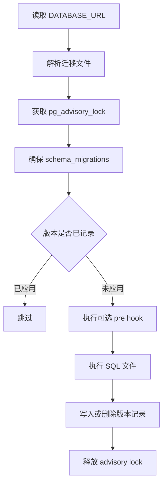

# Data Access, Schema & Migrations — migrations

## migrations 模块

`server/migrations/` 保存 Multica 后端 PostgreSQL schema 的线性演进记录。每个迁移由一对 SQL 文件组成：

```text
<数字前缀>_<名称>.up.sql
<数字前缀>_<名称>.down.sql
```

`up` 用于向前升级 schema，`down` 用于回滚对应版本。目录中的 SQL 不包含 Go 调用关系；它们由 `server/cmd/migrate/main.go` 中的迁移运行器加载、排序、执行，并通过 `schema_migrations` 表记录已应用版本。

### 运行入口

常用命令都最终调用同一个迁移二进制入口：

```bash
cd server && go run ./cmd/migrate up
cd server && go run ./cmd/migrate down
```

仓库级命令会在开发、测试或启动前自动执行迁移：

```bash
make setup
make start
make dev
make test
make migrate-up
make migrate-down
```

迁移目录解析由 `server/internal/migrations/migrations.go` 提供：

- `ResolveDir()`：从当前工作目录或可执行文件路径向上查找 `migrations` / `server/migrations`。
- `Files(direction)`：按方向收集 `*.up.sql` 或 `*.down.sql`，`up` 按字典序升序执行，`down` 按字典序降序执行。
- `AllVersions()`：返回所有 `up` 迁移版本，用于 readiness 检查确认数据库没有漏掉低编号补丁。
- `ExtractVersion(filename)`：从文件名中去掉 `.up.sql` / `.down.sql`，版本值就是完整 stem，例如 `103_drop_legacy_daily_rollups`。

### 执行模型

迁移运行器的核心函数是 `runMigrations(ctx, pool, runOptions)`。它不是通用迁移框架封装，而是项目内实现，行为需要按源码理解：



关键语义：

- `schema_migrations(version TEXT PRIMARY KEY, applied_at TIMESTAMPTZ)` 是唯一的应用记录来源。
- `migrationAdvisoryLockKey` 使用 Postgres session-level `pg_advisory_lock` 串行化并发迁移，避免多副本启动或人工迁移相互竞争。
- 运行器刻意不把整个迁移循环包进事务，因为仓库中有 `CREATE INDEX CONCURRENTLY`，Postgres 不允许它出现在事务块内。
- 每个 SQL 文件执行成功后才记录版本；如果 SQL 或 hook 失败，该版本不会写入 `schema_migrations`，下一次运行会重试。
- `down` 方向只会回滚已经记录的版本，并从 `schema_migrations` 删除对应记录。

### 文件命名与编号规则

`server/internal/migrations/migrations_lint_test.go` 是迁移文件结构的守门测试：

- 每个 stem 必须同时存在 `.up.sql` 和 `.down.sql`。
- 文件名必须以数字前缀加下划线开头，例如 `149_issue_origin_agent_create.up.sql`。
- `001` 到 `148` 是冻结的历史区间，里面保留了一些旧的重复编号。
- 新迁移不得复用旧编号，也不得新增重复编号；使用下一个唯一数字前缀。
- 历史重复编号通过 `legacyDuplicateMigrationStems` 固定白名单保护，不能改名或增补。

因此新增迁移时应先查看当前最大编号，然后创建一对新的唯一 stem：

```text
193_example_feature.up.sql
193_example_feature.down.sql
```

### 基础数据模型

`001_init.up.sql` 建立核心业务表和索引：

- 身份与工作区：`"user"`、`workspace`、`member`
- Agent 与执行队列：`agent`、`agent_task_queue`、`daemon_connection`
- Issue 体系：`issue`、`comment`、`issue_label`、`issue_to_label`、`issue_dependency`
- 通知与审计：`inbox_item`、`activity_log`

初始 schema 使用 `pgcrypto` 的 `gen_random_uuid()` 生成主键，广泛使用 `ON DELETE CASCADE` 清理工作区、issue、agent 下属数据。状态类字段大多用 `CHECK` 约束而不是自由字符串，例如 `issue.status`、`agent.status`、`agent_task_queue.status`。

后续迁移围绕这些表扩展：chat、autopilot、runtime、skills、projects、attachments、GitHub/Lark/Slack 集成、usage rollup、squad、labels、properties 等。

### Agent、Runtime 与任务队列演进

`agent` 和 `agent_task_queue` 是迁移最密集的核心表之一。

重要迁移包括：

- `004_agent_runtime_loop`：引入 `agent_runtime`，把运行时实例从 `agent.runtime_config` 中拆出来，并回填历史 agent 的 runtime。
- `020_task_session`、`060_chat_session_runtime_id`、`066_force_fresh_session`：保存会话恢复所需的 `session_id`、`work_dir`、runtime 绑定，以及手动重跑时强制新会话的信号。
- `055_task_lease_and_retry`：增加 `attempt`、`max_attempts`、`parent_task_id`、`failure_reason`，支持任务重试和失败分类。
- `067_task_queue_claim_candidate_index`、`080_agent_task_queue_queued_index`、`114_agent_task_queue_running_started_at_index`、`125_agent_task_queue_dispatched_prepare_index`：为 daemon claim、TTL sweeper、运行中任务扫描建立局部索引。
- `128_agent_task_queue_runtime_mcp_overlay`：增加 `runtime_mcp_overlay`，并用 `clear_runtime_mcp_overlay_on_terminal_state()` 触发器在任务进入 `completed`、`failed`、`cancelled` 时清除短期 MCP 凭据。
- `184_agent_task_attribution`、`185_agent_task_accountable_user`、`190_agent_task_attribution_invariant_check`：为任务写入 human attribution，并通过 `agent_task_queue_accountable_matches_originator` 约束防止 originator/accountable 不一致。

任务队列表上的索引通常是局部索引，例如只覆盖 `status = 'queued'` 或 `status IN ('queued', 'dispatched')`，目的是让长期累积的终态任务不拖慢热路径。

### Usage Rollup 迁移

Token usage 的聚合经历了多代 schema：

- `032_task_usage` 创建原始事件表 `task_usage`。
- `073_task_usage_daily_rollup` 创建按天、runtime 维度的 `task_usage_daily`，并提供 `rollup_task_usage_daily_window()` / `rollup_task_usage_daily()`。
- `077_task_usage_daily_invalidation` 增加 dirty queue 和触发器，捕获删除、runtime 重归属等 `updated_at` 水位无法发现的变化。
- `084_task_usage_dashboard_rollup` 为 dashboard 增加按 workspace/agent/project/model 的 daily rollup。
- `101_task_usage_hourly_schema` 和 `102_task_usage_hourly_pipeline` 引入统一的 UTC 小时级 `task_usage_hourly`，用 `task_usage_hour_bucket()`、dirty queue 和触发器统一支撑 runtime 页面与 dashboard。
- `103_drop_legacy_daily_rollups` 在 fail-closed guard 通过后删除旧 daily rollup 管线。
- `104_drop_runtime_timezone` 删除 `agent_runtime.timezone`，查看时区改由用户视角处理。

这一组迁移有配套 Go 入口：

- `server/cmd/backfill_task_usage_hourly/main.go`：操作员显式回填历史 `task_usage` 到 `task_usage_hourly`。
- `server/internal/taskusagebackfill/Hook`：`cmd/migrate` 在 `103_drop_legacy_daily_rollups` 前自动运行的 pre-migration hook。
- `runTaskUsageHourlyHook()`：注册在 `preMigrationHooks` 中，确保直接从旧版本升级时不会因为未回填而触发 103 的 fail-closed 保护。

这些 rollup 函数的核心契约是“按 dirty key 从原始 `task_usage` 重新计算并替换目标 bucket”，不是增量累加。因此重放窗口、cron 与 backfill 重叠执行都应收敛到同一结果。

### 搜索索引

搜索相关迁移分为两代：

- 早期 `032_issue_search_index`、`033_comment_search_index`、`036_search_index_lower` 使用 `pg_bigm`，适配 CJK 友好的 `LIKE '%keyword%'` 查询，并用 `DO ... EXCEPTION` 在 CI 或缺扩展环境中跳过。
- 后续 `137_search_index_pg_trgm_extension` 以及 `138` 到 `142` 使用 `pg_trgm` 和独立的 `CREATE INDEX CONCURRENTLY` 文件，为 issue、comment、project 建立 trigram 搜索索引。

涉及 `CREATE INDEX CONCURRENTLY` 的迁移必须保持单语句文件。不要把它和 `ALTER TABLE`、`CREATE EXTENSION` 或其他 SQL 放在同一个迁移文件里。

### 外部集成表

迁移目录也是外部集成的数据契约来源：

- `079_github_integration`：`github_installation`、`github_pull_request`、`issue_pull_request`
- `109_lark_integration`：`lark_installation`、`lark_user_binding`、`lark_chat_session_binding`、inbound dedup/audit/outbound 映射等
- `124_channel_generalization`：把 Lark 相关抽象推广为 channel 层
- `127_user_composio_connection`、`128_agent_task_queue_runtime_mcp_overlay`、`132_agent_task_queue_runtime_connected_apps`：支持 Composio 与 per-task connected apps
- `176_webhook_delivery_worker`、`177_autopilot_run_webhook_delivery_index`、`178_webhook_delivery_queue_index`：支持 webhook delivery worker 队列

这些表通常会把跨系统身份、去重令牌、worker lease、投递状态放进数据库，用唯一索引和局部索引保护幂等性与扫描性能。

### 审计型与数据修复型迁移

不是所有迁移都只改 schema。目录中有三类常见非纯 schema 文件：

- 审计型迁移：例如 `043_audit_reserved_slugs`、`045_audit_dashboard_route_slugs`、`047_audit_extended_reserved_slugs`、`049_audit_legacy_reserved_slugs`。这类迁移用 `RAISE EXCEPTION` 阻止部署继续，以免历史数据与新路由规则冲突。
- 一次性数据修复：例如 `044_fix_workspace_fallback_slug`、`056_audit_newly_reserved_slugs`、`079_backfill_api_invalid_request`、`095_backfill_starter_content_state`。
- 前向不可逆清理：例如 `053_drop_orphan_onboarding_current_step`、`103_drop_legacy_daily_rollups`。对应 `down` 文件会明确说明为什么不能恢复原始状态。

写这类迁移时，注释必须说明目标数据、失败条件、是否可逆，以及为什么不在应用层处理。

### Down 迁移策略

每个迁移都必须有 `.down.sql`，但并不代表所有业务语义都能完整恢复。常见模式：

- 结构变更：反向 `DROP COLUMN`、`DROP TABLE`、恢复旧 `CHECK` 约束或旧索引。
- 数据回填：如果无法区分迁移写入的数据和之后自然产生的数据，`down` 通常是 no-op，并在注释里说明。
- 数据清理：如果原始值已丢失，`down` 必须明确不可逆原因。
- 约束收紧：回滚前可能需要把不兼容行改写回旧状态，例如把新状态值迁移到旧状态集合中的某个值。

### 与 sqlc 和应用代码的连接

迁移定义数据库事实，`server/pkg/db/queries/*.sql` 和 sqlc 生成代码依赖这些事实。修改表、列、约束或枚举值时，通常还需要同步：

- `server/pkg/db/queries/*.sql`
- `server/pkg/db/generated/*.sql.go`，通过 `make sqlc` 生成
- 对应 handler/service/daemon 读写路径
- 前端 API schema 和类型解析，尤其是新增响应字段时
- 相关内置 skill 文档，如果改变 CLI、Agent 行为或用户可见流程

新增数据库字段时要注意默认值和回填顺序：先添加 nullable 或有安全默认值的列，再回填，再收紧 `NOT NULL` 或 `CHECK`，避免在大表上长时间锁表。

### 新增迁移检查清单

新增迁移前先确认当前最大编号，并使用唯一新前缀。不要复用 `001` 到 `148` 的历史编号，也不要向 `legacyDuplicateMigrationStems` 增加新项。

每个迁移 stem 必须同时提交：

```text
NNN_feature_name.up.sql
NNN_feature_name.down.sql
```

如果创建热表索引并使用 `CONCURRENTLY`，保持文件只有这一条 `CREATE INDEX CONCURRENTLY` 或 `DROP INDEX CONCURRENTLY` 语句。

如果引入 `CHECK` 约束到大表，优先使用：

```sql
ALTER TABLE agent
    ADD CONSTRAINT agent_description_length
    CHECK (char_length(description) <= 255) NOT VALID;

ALTER TABLE agent VALIDATE CONSTRAINT agent_description_length;
```

如果迁移会阻止部署继续，例如审计历史数据，使用清晰的 `RAISE EXCEPTION`，错误信息要告诉操作员需要改哪些数据以及为什么。

如果迁移依赖历史数据回填，并且后续迁移会删除旧读路径，参考 `103_drop_legacy_daily_rollups`：先提供 backfill 命令或 pre-migration hook，再在删除迁移中加入 fail-closed guard。