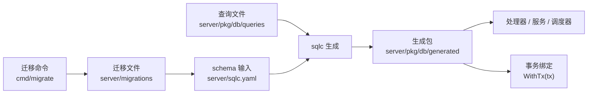

# Data Access, Schema & Migrations — pkg

## 数据访问、Schema 与迁移

这个模块是 Go 后端的持久化边界。手写 SQL 放在 `server/pkg/db/queries/`，数据库结构由 `server/migrations/` 定义，`sqlc` 根据 `server/sqlc.yaml` 生成 `server/pkg/db/generated` 包。调用方不直接拼 SQL，而是通过 `*db.Queries` 调用强类型方法，例如 `CreateAgentTask`、`ClaimAgentTask`、`ListChatSessionsByCreator`、`UpsertChannelInstallationByAppID`。

GitNexus 没有为该模块检测到独立执行流；这是预期行为。它不是业务入口，而是被 `handler`、`service`、`middleware`、`scheduler` 和集成层调用的数据访问层。



## 生成代码模型

`server/sqlc.yaml` 使用 PostgreSQL 引擎、`pgx/v5` 驱动，并开启 `emit_json_tags` 与 `emit_empty_slices`。核心生成入口在 `generated/db.go`：

- `DBTX` 是最小数据库接口，包含 `Exec`、`Query`、`QueryRow`。
- `New(db DBTX) *Queries` 把 `*pgxpool.Pool`、事务或测试替身包装成查询对象。
- `(*Queries).WithTx(tx pgx.Tx) *Queries` 返回绑定同一事务的查询对象。

典型调用模式：

```go
tx, err := pool.Begin(ctx)
if err != nil {
    return err
}
defer tx.Rollback(ctx)

qtx := queries.WithTx(tx)
// 在同一个事务里调用生成查询，例如 qtx.CreateActivity、qtx.CancelAgentTask。

return tx.Commit(ctx)
```

`generated/models.go` 从迁移 schema 推导结构体。Postgres 可空字段使用 `pgtype.UUID`、`pgtype.Text`、`pgtype.Timestamptz` 等类型；`jsonb` 通常生成 `[]byte` 或参数侧的 `interface{}`；数组字段如 `composio_toolkit_allowlist` 生成 `[]string`。

## 查询组织方式

`queries/*.sql` 按领域分文件，`-- name: X :one|:many|:exec|:execrows` 决定生成方法签名：

- `activity.sql`：活动日志，例如 `ListActivitiesForIssue`、`CreateActivity`。
- `agent.sql`：Agent 与任务队列，例如 `CreateAgent`、`ClaimAgentTask`、`FailAgentTask`、`RecoverOrphanedTasksForRuntime`。
- `autopilot.sql`：Autopilot、触发器、运行记录和规则版本，例如 `CreateAutopilotRun`、`GetActiveAutopilotRuleVersion`、`SelectAutopilotsExceedingFailureThreshold`。
- `channel.sql`：平台无关的入站通道层，例如 `UpsertChannelInstallationByAppID`、`ClaimChannelInboundDedup`、`CreateChannelBindingToken`。
- `chat.sql`、`comment.sql`、`issue.sql`、`attachment.sql` 等文件覆盖产品核心对象。

SQL 注释很重要：它们会被复制到生成的 Go 方法上，通常记录并发语义、审计约束、幂等性和历史兼容原因。修改查询时应同步维护这些注释。

## 关键设计约束

所有工作区数据访问都应显式按 `workspace_id` 约束，或通过拥有者表 join 间接约束。示例包括 `GetAgentInWorkspace`、`GetChatSessionInWorkspace`、`GetAttachment`。对于自身没有 `workspace_id` 的表，会通过父实体做租户隔离，例如 `GetAgentTaskInWorkspace` 通过 `agent` join 校验任务所属工作区。

`UpdateAgent`、`UpdateAutopilot` 等查询大量使用 `COALESCE(sqlc.narg(...), column)` 实现局部更新。这个模式不能把字段写回 `NULL`，所以需要专门的清空查询，例如 `ClearAgentThinkingLevel`、`ClearAgentMcpConfig`、`ClearAgentComposioToolkitAllowlist`。

队列查询把并发控制放在 SQL 层。`ClaimAgentTask` 使用 `FOR UPDATE SKIP LOCKED` 和同一 issue/chat 下的串行化条件；`ReclaimStaleDispatchedTasksForRuntimes`、`ExpireStaleQueuedTasks` 通过租约时间和状态重检避免覆盖正在被 daemon 处理的任务；`SetTaskDeliveredCommentIDs`、`RequeueAgentTaskAfterClaimFailure` 使用 `dispatched_at` 做 CAS 防止旧 claim 回写。

通道集成大量使用应用层完整性约束。`channel_*` 表刻意弱化外键，因此删除或重绑必须调用清理查询，例如 `DeleteChannelInstallationsByArchivedRuntimeAgents`、`DeleteChannelUserBindingsByInstallation`、`DeleteChannelOutboundCardMessagesBySession`。不要假设数据库级 cascade 会替你清理这些行。

## 迁移系统

迁移文件位于 `server/migrations/`，每个迁移必须同时有 `.up.sql` 和 `.down.sql`。`server/internal/migrations` 提供：

- `ResolveDir()`：从当前目录或可执行文件位置向上查找 `migrations` / `server/migrations`。
- `Files(direction)`：按 apply 顺序返回 up 文件，按反向顺序返回 down 文件。
- `AllVersions()`：列出所有 up 迁移版本，用于 readiness 检查。
- `ExtractVersion()`：从文件名提取版本 stem。

`server/cmd/migrate` 的 `runMigrations` 会创建 `schema_migrations` 表记录已应用版本，并使用 Postgres session 级 `pg_advisory_lock` 串行化多实例迁移。整个迁移循环不会包在单个事务里，因为仓库中存在 `CREATE INDEX CONCURRENTLY` 这类不能在事务块内执行的迁移。

迁移还支持 `preMigrationHooks`。当前 `103_drop_legacy_daily_rollups` 前会执行 `runTaskUsageHourlyHook`，为 `task_usage_hourly` 做幂等回填；hook 失败会中止迁移且不会写入 `schema_migrations`，下次运行会重试。

## 添加或修改数据库能力

新增字段或表时，先添加成对迁移文件，再更新对应 `queries/*.sql`，然后运行 `make sqlc` 重新生成 `server/pkg/db/generated`。不要手改 `generated/*.go`，这些文件头部明确标记为 `Code generated by sqlc. DO NOT EDIT.`。

新增迁移要遵守 `migrations_lint_test.go` 的规则：up/down 必须配对；历史重复数字前缀被冻结；新迁移不能复用已有前缀，应使用当前最大编号之后的唯一编号。

新增查询时优先把业务不变量编码进 SQL：工作区边界、状态转移条件、幂等冲突键、`RETURNING` 行、CAS 条件和 `FOR UPDATE` 锁都应尽量靠近数据写入点。调用方负责权限判断和业务编排，但数据层应防止明显的竞态和跨租户误写。

## 与后端其他层的连接

服务启动时，`cmd/server/main.go` 和 `cmd/server/router.go` 使用 `db.New(pool)` 构造全局 `*db.Queries`，再传给 `handler.New`、中间件、事件监听器和后台任务。`TaskService`、`IssueService`、`AutopilotService` 等服务保存 `*db.Queries`，需要原子写入时通过 `WithTx(tx)` 获得事务查询对象。

集成层会按需要包一层更窄的接口。例如 Lark 的 `ChannelStore` 嵌入 `*db.Queries` 并重写 `WithTx`，Slack 安装服务用 `dbInstallQueries` 适配生成查询对象。这样测试可以提供小接口替身，同时生产路径仍复用 sqlc 生成方法。