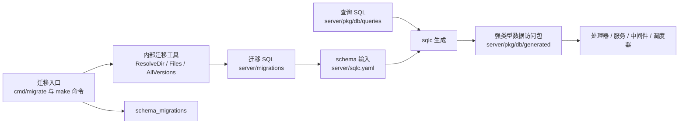

# Data Access, Schema & Migrations

## 模块概览

该模块组定义 Multica 后端的持久化边界：`server/migrations/` 描述 PostgreSQL schema 演进，`server/pkg/db/queries/` 描述手写 SQL 查询契约，`server/sqlc.yaml` 将两者输入 `sqlc` 并生成 `server/pkg/db/generated`，业务代码再通过 `*db.Queries` 调用强类型数据访问方法。

三个子模块分工如下：

- [内部迁移工具层](internal.md)：提供 `ResolveDir()`、`Files()`、`AllVersions()`、`ExtractVersion()`，负责定位迁移目录、排序迁移文件和解析版本。
- [迁移 SQL 目录](migrations.md)：保存成对的 `*.up.sql` / `*.down.sql`，并通过 `schema_migrations` 记录已应用版本。
- [数据访问包](pkg.md)：维护查询 SQL、`sqlc` 配置和生成代码，向 `handler`、`service`、`middleware`、`scheduler` 等上层模块暴露 `CreateAgentTask`、`ClaimAgentTask`、`ListChatSessionsByCreator`、`UpsertChannelInstallationByAppID` 等方法。

## 跨模块工作流

启动、测试或手动执行迁移时，`cmd/migrate` 会先通过内部迁移工具定位 `server/migrations/`，再按方向调用 `Files("up")` 或 `Files("down")` 获取有序 SQL 文件，并用 `schema_migrations` 判断哪些版本需要执行。`AllVersions()` 复用 `Files()` 与 `ExtractVersion()`，用于校验迁移版本集合。

开发新持久化能力时，schema 变化先进入迁移 SQL；查询逻辑进入 `server/pkg/db/queries/`；随后由 `sqlc` 根据 `server/sqlc.yaml` 生成 `server/pkg/db/generated`。上层业务模块只依赖生成后的 `*db.Queries` 和 `WithTx(tx)`，不直接拼接 SQL，也不需要知道迁移目录解析细节。

这套分层让 schema 演进、查询定义和业务调用保持解耦：迁移模块保证数据库结构可重复升级和回滚，`sqlc` 生成层保证查询调用具备类型约束，内部迁移工具则让 CLI、服务启动和集成测试共享同一套迁移发现规则。