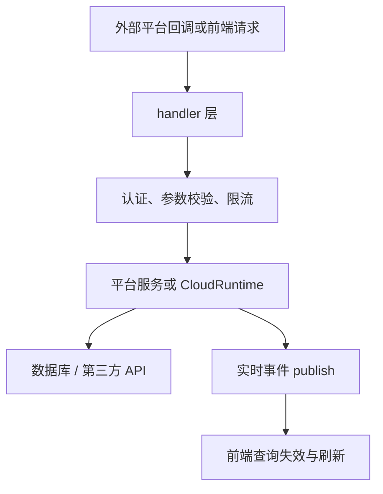

# External Integrations — internal

## 模块概览

`server/internal/handler` 与 `server/internal/integrations/*` 中的外部集成代码负责把第三方平台接入 Multica 后端，包括 GitHub、Slack、Lark/飞书、Composio、Stripe/Cloud Billing，以及更底层的 IM `channel` 抽象。模块边界很清晰：HTTP handler 做认证、参数校验、错误码映射与事件广播；平台服务包负责真正的第三方协议、凭据、状态机和数据库封装；`channel` 包定义平台无关的消息收发接口。

## 设计边界

handler 层只承担 HTTP 边界职责：

- 从 `chi.URLParam`、query、JSON body 中读取输入。
- 使用 `requireUserID`、`parseUUIDOrBadRequest`、`requireWorkspaceRole`、`canManageAgent` 做身份与权限检查。
- 把领域错误映射为稳定 HTTP 状态码和错误文案。
- 调用服务对象，例如 `h.Composio`、`h.LarkRegistration`、`h.SlackInstall`、`h.CloudRuntime`。
- 使用 `h.publish` 广播工作区事件，让前端重新拉取列表或详情。

平台协议和密钥处理尽量不放在 handler 中。例如 Slack token 校验在 `slack.RegisterBYO` 内完成，Lark 安装状态由 `lark.RegistrationService` 管理，Composio state 验证由 `h.Composio.CompleteCallback` 完成。GitHub 是例外较多的集成：由于 webhook 事件直接影响 PR 镜像、issue 链接和 issue 状态推进，`github.go` 中包含了较多业务编排逻辑。

## Cloud Billing 与 Stripe Webhook

`cloud_billing.go` 把 Multica 的 billing API 代理到 cloud-runtime 服务。普通用户接口通过 `h.proxyCloudRuntime` 复用标准 JSON 代理逻辑，并在需要时注入 `X-User-ID`：

- `GetCloudBillingBalance`
- `ListCloudBillingTransactions`
- `ListCloudBillingBatches`
- `ListCloudBillingTopups`
- `ListCloudBillingPriceTiers`
- `CreateCloudBillingCheckoutSession`
- `GetCloudBillingCheckoutSession`
- `CreateCloudBillingPortalSession`

`GetCloudBillingCheckoutSession` 对 `sessionId` 做本地校验，`isValidStripeSessionID` 只允许 `[A-Za-z0-9_]`，因为该值会拼进上游 URL path。

`HandleCloudBillingStripeWebhook` 是独立路径，不走普通 JSON proxy。它的关键约束是保留 Stripe 原始请求体：先做 cloud-runtime 配置检查、IP 限流、`Stripe-Signature` 存在性检查，再用 `http.MaxBytesReader` 将 body 限制为 `maxStripeWebhookBodySize`，最后把 body、`Stripe-Signature` 和原始 `Content-Type` 转发到 `/api/v1/webhooks/stripe`。不要在这里 `json.Unmarshal` 或重新序列化 body，否则上游的 Stripe 签名校验会失败。

## GitHub 集成

GitHub 集成覆盖安装、列表、删除、webhook、PR 镜像、CI 状态聚合和 issue 自动推进。

安装流程从 `GitHubConnect` 开始。该 handler 校验 workspace id，检查 `isGitHubConfigured`，通过 `signState` 生成 `workspaceID.nonce.sigHex` 格式的 HMAC state，然后返回 GitHub App 安装 URL。GitHub 重定向回来后由 `GitHubSetupCallback` 处理：它用 `verifyState` 恢复 workspace，解析 `installation_id`，调用 `fetchInstallationAccount` 尝试从 GitHub REST API 获取账号展示信息，再通过 `CreateGitHubInstallation` 持久化绑定，并广播 `protocol.EventGitHubInstallationCreated`。

`ListGitHubInstallations` 对 workspace 成员可见，但只有 owner/admin 会看到 numeric `installation_id`。`githubInstallationToBroadcast` 总是去掉 `InstallationID`，因为 websocket 广播无法按接收者角色裁剪 payload。

`HandleGitHubWebhook` 是所有 GitHub webhook 的入口。它读取最多 10 MiB body，使用 `verifyWebhookSignature` 校验 `X-Hub-Signature-256`，再按 `X-GitHub-Event` 分发到：

- `handleInstallationEvent`
- `handlePullRequestEvent`
- `handleCheckSuiteEvent`

PR 事件的核心逻辑在 `mirrorPullRequestForWorkspace`。它通过 `derivePRState` 和 `derivePRMergeableState` 计算本地 PR 状态，调用 `UpsertGitHubPullRequest` 镜像 PR，随后调用 `replayPendingCheckSuitesForPR` 回放先到达的 CI 事件。若 `workspaceAutoLinkPRsEnabled` 为真，它会从标题、正文和分支提取 issue 标识符：`extractIdentifiers` 做宽松链接，`extractClosingIdentifiers` 只识别紧跟 `close/fix/resolve` 的关闭意图。链接通过 `LinkIssueToPullRequest` 持久化，终态 PR 会触发 `GetIssuePullRequestCloseAggregate`，满足条件时调用 `advanceIssueToDone`。

CI webhook 由 `handleCheckSuiteEvent` 处理。它按 installation fan out 到所有绑定 workspace，并调用 `recordCheckSuiteForWorkspace`。如果本地 PR 尚未镜像，CI suite 会写入 pending 表；后续 PR upsert 时由 `replayPendingCheckSuitesForPR` drain 并重新写入 `UpsertPullRequestCheckSuite`。

## Composio 集成

`integrations_composio.go` 是用户级集成，不归属 workspace。普通管理接口要求登录用户，公共 callback 不要求 session，因为身份来自签名 state。

主要入口：

- `ComposioConnectInit`：读取 `toolkit_slug`，校验 `h.Composio != nil` 与 `composioMCPAppsEnabled`，调用 `h.Composio.BeginConnect` 返回 hosted connect URL。
- `ComposioCallback`：读取 `state`、`status`、`connected_account_id`，调用 `h.Composio.CompleteCallback`，成功或失败都重定向到 `CallbackRedirect`。
- `ListComposioConnections`：返回当前用户连接列表。
- `ListComposioToolkits`：返回可连接 toolkit catalog，保留 `connectable` 字段兼容旧客户端。
- `DeleteComposioConnection`：按用户和 connection id 断开连接，`composio.ErrConnectionNotFound` 映射为 404。

功能开关通过 `composioMCPAppsEnabled` 读取 `featureflags.ComposioMCPAppsEnabled`。如果服务未配置或 feature flag 关闭，所有入口返回 503。

## Lark / 飞书集成

`lark.go` 包含安装管理、用户绑定 token 兑换和二维码设备流安装。

`ListLarkInstallations` 对 workspace 成员可见。`configured` 表示 `h.LarkInstallations != nil`，`install_supported` 还要求 `h.LarkRegistration`、`h.LarkAPIClient` 存在且 `IsConfigured()` 为真。响应由 `larkInstallationToResponse` 生成，不暴露加密后的 app secret，也不暴露 websocket lease 运行时字段。

`BeginLarkInstall` 通过 `agent_id` 和 `region` 启动设备流。它先确认目标 agent 属于当前 workspace，再用 `canManageAgent` 允许 agent owner 或 workspace owner/admin 发起绑定。实际会话由 `h.LarkRegistration.BeginInstall` 创建，返回 `session_id`、`qr_code_url`、过期时间和轮询间隔。

`GetLarkInstallStatus` 读取安装会话状态。只有发起人或 workspace owner/admin 能查看；其他用户统一返回 404，避免泄露会话存在性。安装成功事件不在这里发布，而是在 registration service 写入安装行时发布。

`RevokeLarkInstallation` 将安装状态改为 `revoked`，保留行用于审计。正常情况下按绑定 agent 做 `canManageAgent` 授权；如果 agent 已被硬删除，则退回到 workspace owner/admin 清理 orphan installation。

`RedeemLarkBindingToken` 将 Lark open_id 绑定到当前登录的 Multica 用户。token 只证明某个 Lark open_id 请求绑定，最终用户身份来自 session。`lark.ErrBindingTokenInvalid`、`ErrBindingAlreadyAssigned`、`ErrBindingNotWorkspaceMember` 分别映射为 410、409、403。

## Slack 集成

`slack.go` 采用 bring-your-own-app 安装方式。`SlackInstallationResponse` 只暴露公开配置中的 `team_id` 和 `bot_user_id`，不暴露加密 bot token。

`ListSlackInstallations` 对 workspace 成员可见，未配置时返回空列表和 `configured: false`。`RegisterSlackBYO` 从 body 读取 `bot_token` 和 `app_token`，从 query 读取 `agent_id`，确认 agent 属于 workspace 后调用 `h.SlackInstall.RegisterBYO`。成功后通过 `publishSlackInstallationCreated` 广播 `protocol.EventSlackInstallationCreated`。

`RevokeSlackInstallation` 先用 `GetInWorkspace` 做 workspace-scoped lookup，防止通过猜 UUID 撤销其他 workspace 的安装，再调用 `h.SlackInstall.Revoke` 并广播 `protocol.EventSlackInstallationRevoked`。

`RedeemSlackBindingToken` 与 Lark 绑定流程一致：登录用户身份来自 session，token 携带 Slack user id 和安装上下文，`h.SlackBindingTokens.RedeemAndBind` 在服务层完成消费与绑定。

## channel 抽象

`server/internal/integrations/channel` 是 IM 集成的纯接口层，不依赖数据库、网络或具体平台包。它的目标是让核心逻辑只认识规范化消息，而不关心 Lark、Slack 或未来平台的原始事件格式。

核心类型：

- `Type`：持久化的平台 discriminator，例如当前的 `TypeFeishu = "feishu"`。
- `Channel`：平台 adapter 必须实现的接口，包含 `Type`、`Connect`、`Disconnect`、`Send`、`Capabilities`。
- `Config`：构造 adapter 的规范化配置，`Raw` 承载平台私有 JSON，`Handler` 是 inbound 消息进入核心的回调。
- `Factory`：`func(cfg Config) (Channel, error)`，由 registry 按 `Type` 注册和构造。
- `Capability`：能力 bitmask，例如 `CapText`、`CapRichCard`、`CapThreadReply`、`CapMessageEdit`。

`Capability.Has` 是“包含全部能力”的判断，`Capability.String` 用于诊断日志，未知高位会以十六进制保留，避免新增 bit 但忘记命名时静默丢失。

`Channel.Connect` 的语义很重要：它建立平台连接并阻塞运行接收循环，直到 context 取消或连接不可恢复。实现必须允许 `Send` 在连接生命周期内并发调用，也必须能承受 supervisor 在退避后重复调用 `Connect`。

## 入站消息批处理

`channel/engine/batcher.go` 中的 `pendingBatcher` 用于按 `chat_session_id` 防抖 agent run 触发。每条入站消息仍会同步完成持久化、去重和 ACK；被合并的只是“启动一次 agent run”的触发器。默认静默窗口是 `DefaultChatRunBatchWindow = 3 * time.Second`。

`Schedule` 会为同一个 key 停掉旧 timer 并保留最新 flush；`onFire` 用 generation 防止 `Stop()` 与 timer 并发触发导致旧 flush 执行；`FlushAll` 在优雅关闭时停止 batcher、执行所有 pending flush，并等待已触发的 flush 完成。`FlushAll` 后再调用 `Schedule` 会直接 inline 执行 flush，避免 shutdown 期间丢触发。

## 与代码库其他部分的连接

路由注册在 `cmd/server/router.go` 的 `NewRouterWithOptions` 周边完成。该函数负责把 handler 字段和服务对象组装起来，例如 Lark registration、Slack binding service、channel engine router、outbound replier、feature flags 等。handler 返回的事件通过 `h.publish` 进入 realtime 层，前端通常不直接消费完整 payload，而是用事件失效 React Query 缓存并重新拉取列表。

数据库访问主要通过 `h.Queries` 的 sqlc 方法完成，例如 `CreateGitHubInstallation`、`ListGitHubInstallationsByInstallationID`、`UpsertGitHubPullRequest`、`LinkIssueToPullRequest`、`UpdateIssueStatus`。Lark、Slack、Composio 的大部分 DB 细节被封装在各自 service/store 中，handler 只处理返回值和错误分类。

新增或修改集成时，优先保持这个分层：HTTP 边界留在 handler，平台协议和凭据处理放进 `server/internal/integrations/<platform>`，跨平台消息能力放进 `channel` 抽象。对于公共 webhook 或 callback，必须明确认证来源：GitHub 用 HMAC，Stripe 用上游验证的 `Stripe-Signature`，Composio 用签名 state，不能假设有用户 session。