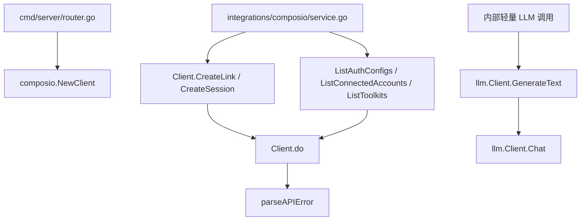

# External Integrations — pkg

## 模块概览

`server/pkg` 下的外部集成代码提供两个独立、可复用的 Go package：

- `server/pkg/composio`：面向 Composio v3.1 REST API 的轻量 SDK，覆盖连接授权、MCP session、toolkit、工具执行、webhook 验签和错误解析。
- `server/pkg/llm`：面向 OpenAI 兼容接口的薄封装，给服务端内部提供统一的 Chat、流式 Chat 和一次性文本生成入口。

这两个 package 都刻意保持在业务层之外：它们不依赖 `server/internal`、handler、数据库或 Multica 领域模型。上层集成服务负责把工作区、用户、权限和产品语义转换成这些 package 的请求结构。



## `pkg/composio`

`composio` package 是项目内 Composio 集成的底层 HTTP SDK。它只依赖 `github.com/go-resty/resty/v2`，通过 `Client` 统一处理 base URL、认证 header、超时、重试和错误解析。

### Client 构造与请求管线

核心入口是：

```go
client, err := composio.NewClient(composio.Options{
    APIKey: os.Getenv("COMPOSIO_API_KEY"),
})
```

`Options` 控制客户端行为：

- `APIKey`：必填，作为 `x-api-key` header 发送。
- `BaseURL`：默认是 `https://backend.composio.dev/api/v3.1`，测试中可指向 `httptest.Server`。
- `UserAgent`：默认是 `multica-composio-go/0.1`。
- `Timeout`：默认 `30s`；负数表示不设置 resty timeout。
- `HTTPClient`：注入自定义 `*http.Client`，由 `newRestyClient` 通过 `resty.NewWithClient` 原样接管。
- `RetryCount` / `RetryWaitTime`：配置 resty 重试。

所有 endpoint 方法都走同一条内部路径：

1. `Client.newRequest(ctx)` 创建绑定 `context.Context` 的 `*resty.Request`。
2. endpoint 方法设置 body 或 query path。
3. `Client.do(req, method, path, out)` 执行请求。
4. 成功时由 resty 反序列化到 `out`。
5. 非 2xx 时调用 `parseAPIError` 返回 `*APIError`。

`Client.BaseURL()` 返回默认化后的 API root。`Client.APIKeyHeader()` 返回 `map[string]string{"x-api-key": ...}` 的副本，用于 SDK 外部的 Composio 请求，例如 MCP streaming client。

### 错误模型

Composio 非 2xx 响应用 `APIError` 表示。`parseAPIError` 解析上游的标准 envelope：

```json
{
  "error": {
    "message": "...",
    "code": 400,
    "slug": "INVALID_INPUT",
    "status": 400,
    "request_id": "req_...",
    "suggested_fix": "...",
    "errors": ["..."]
  }
}
```

`APIError` 保留：

- `HTTPStatus`：本地观测到的 HTTP status。
- `Message`、`Code`、`Slug`、`Status`、`RequestID`、`SuggestedFix`、`Errors`：来自上游 body。
- `RawBody`：完整响应体，方便日志排查。

辅助判断方法：

- `IsNotFound()`：HTTP 404。
- `IsUnauthorized()`：HTTP 401。
- `IsRateLimited()`：HTTP 429。

`DeleteConnectedAccount` 会特殊处理 404：如果上游返回 not found，它返回 `nil`，让删除逻辑具备幂等语义。

### Auth Configs

`AuthConfig` 表示 Composio project 里的认证配置，即某个 toolkit 如何鉴权。连接授权流程需要它的 `ID`，也就是 `ac_...`。

主要 API：

```go
resp, err := client.ListAuthConfigs(ctx, composio.ListAuthConfigsRequest{
    ToolkitSlugs: []string{"github"},
    Limit:        100,
})
```

`ListAuthConfigsRequest` 支持：

- `ToolkitSlugs`：编码为逗号分隔的 `toolkit_slug`。
- `IsComposioManaged`：区分 Composio 托管 OAuth app 与自带 OAuth client。
- `ShowDisabled`：是否包含禁用配置。
- `Search`、`Limit`、`Cursor`。

返回值是分页结构 `ListAuthConfigsResponse`，包含 `Items`、`NextCursor` 和 `TotalItems`。

在上层集成中，`integrations/composio/service.go` 的 `fetchAuthConfigMap` 会构造 `ListAuthConfigsRequest`，handler 测试也直接使用 `ListAuthConfigsResponse` 来验证接口行为。

### Connected Accounts 与 Connect Link

Connect Link 用于把用户送到 Composio 托管的授权页面。

```go
link, err := client.CreateLink(ctx, composio.CreateLinkRequest{
    AuthConfigID: "ac_abc",
    UserID:       "user-id",
    CallbackURL:  "https://app.example.com/composio/callback",
})
```

`CreateLink` 在本地校验两个必填字段：

- `AuthConfigID`
- `UserID`

返回的 `CreateLinkResponse.RedirectURL` 是上层应交给用户打开的地址。

连接列表由 `ListConnectedAccounts` 负责：

```go
accounts, err := client.ListConnectedAccounts(ctx, composio.ListConnectedAccountsRequest{
    UserIDs:      []string{"user-id"},
    ToolkitSlugs: []string{"github"},
    Statuses:    []string{"ACTIVE"},
})
```

这个方法按 Composio v3.1 规范把数组过滤器编码为重复 query 参数，例如：

```text
user_ids=u1&user_ids=u2
```

支持的过滤器包括 `UserIDs`、`ToolkitSlugs`、`AuthConfigIDs`、`ConnectedAccountIDs`、`Statuses`、`OrderBy`、`OrderDirection`、`AccountType`、`Limit` 和 `Cursor`。

断开连接有两个不同语义：

- `RevokeConnection(ctx, connectedAccountID)`：请求上游 provider 撤销 OAuth grant，但保留 Composio 记录。
- `DeleteConnectedAccount(ctx, connectedAccountID)`：删除 Composio 连接记录，不撤销 provider token；如需撤销，应先调用 `RevokeConnection`。

上层服务的 `BeginConnect` 会使用 `CreateLinkRequest`，`verifyAccountOwnership` 会使用 `ListConnectedAccountsRequest` 来确认连接归属。

### MCP Session

`CreateSession` 打开 Composio tool-router，也就是 MCP session：

```go
session, err := client.CreateSession(ctx, composio.CreateSessionRequest{
    UserID: "user-id",
    ManageConnections: &composio.ManageConnections{
        CallbackURL: "https://app.example.com/composio/callback",
    },
})
```

`CreateSessionRequest` 只有 `UserID` 是本地强校验必填。其他复杂字段，例如 `Toolkits`、`AuthConfigs`、`Tools`、`Tags`、`MultiAccount`、`Preload` 等，使用 `map[string]any` 或 `any` 表示。这是有意的：Composio 这些 schema 子结构较多且容易演进，SDK 只在当前集成常用的 `ManageConnections` 上提供强类型结构。

`CreateSessionResponse` 暴露：

- `SessionID`
- `MCP`：包含 `Type` 和 `URL`
- `ToolRouterTools`
- `Config`
- `ConfigVersion`
- `Experimental`
- `Warnings`

MCP 客户端连接 `CreateSessionResponse.MCP.URL` 时需要带 Composio API key。不要手写 header，使用：

```go
headers := client.MCPAuthHeaders()
```

`MCPAuthHeaders` 实际返回 `APIKeyHeader()` 的副本。这个设计让 secret 从 SDK 边界流出的位置更明确，便于上层接入日志脱敏流程。

### Toolkits

`Toolkit` 是最小化的 toolkit 描述，用于 UI 展示和调度判断：

```go
type Toolkit struct {
    Slug        string
    Name        string
    LogoURL     string
    Description string
    Categories  []string
    AuthSchemes []string
    Meta        map[string]any
}
```

列表查询：

```go
resp, err := client.ListToolkits(ctx, composio.ListToolkitsRequest{
    Category: "productivity",
    Limit:    50,
    SortBy:   "usage",
})
```

单个查询：

```go
toolkit, err := client.GetToolkit(ctx, "github")
```

`GetToolkit` 会校验 `slug` 非空，并用 `url.PathEscape` 拼接路径。`ListToolkits` 被 `integrations/composio/service.go` 调用，用于返回项目可用的 Composio toolkit 列表。

### 工具执行

`ExecuteTool` 是确定性的后端工具调用路径，绕过 MCP session 编排，适合固定流程，例如内置 skill 或自动化执行：

```go
resp, err := client.ExecuteTool(ctx, "GITHUB_CREATE_ISSUE", composio.ExecuteToolRequest{
    UserID: "user-id",
    Arguments: map[string]any{
        "title": "新建 issue",
    },
})
```

本地校验规则：

- `toolSlug` 必填。
- `ConnectedAccountID` 和 `UserID` 至少设置一个。

`ExecuteToolRequest.Version` 可显式固定工具定义版本，避免 Composio 推进 `latest` 后行为漂移。`AllowTracing` 保留是为了兼容上游已废弃字段。

`ExecuteToolResponse.Data` 是 `map[string]any`，因为不同工具的输出 schema 不同，调用方需要按具体工具文档自行转换。

### Webhook 验签与事件解析

Composio webhook 相关常量：

- `HeaderWebhookID`：`webhook-id`
- `HeaderWebhookTimestamp`：`webhook-timestamp`
- `HeaderWebhookSignature`：`webhook-signature`
- `DefaultWebhookTolerance`：`300s`

入口函数有三个：

```go
headers := composio.HeadersFromHTTP(r.Header)

err := composio.VerifyWebhook(secret, headers, rawBody, composio.VerifyOptions{})

body, err := composio.VerifyHTTPRequest(secret, r, composio.VerifyOptions{})
```

`VerifyWebhook` 的签名字符串为：

```text
<webhook-id>.<webhook-timestamp>.<rawBody>
```

函数使用 `secret` 做 HMAC-SHA256，然后 base64 编码结果，并与 `webhook-signature` 中的候选签名做常量时间比较。

时间戳校验规则：

- `VerifyOptions.Tolerance == 0`：使用默认 `300s`。
- `VerifyOptions.Tolerance < 0`：禁用重放窗口检查，主要用于测试历史 payload。
- `VerifyOptions.Now`：测试中可注入当前时间。
- timestamp 优先按 Unix seconds 解析；失败后尝试 RFC3339。

签名 header 解析兼容两种形式：

```text
v1,<signature>
v1,<signature> v2,<signature>
<bare-base64-signature>
```

失败时会返回可用 `errors.Is` 判断的 sentinel error：

- `ErrWebhookSecretMissing`
- `ErrMissingWebhookHeaders`
- `ErrInvalidWebhookSignature`
- `ErrWebhookTimestampStale`

`VerifyHTTPRequest` 会读取并关闭 `r.Body`，验证失败时仍返回已读取的 body，方便 handler 记录原始 payload。验签成功后再用 `ParseEvent` 解析 `EventEnvelope`：

```go
event, err := composio.ParseEvent(body)
```

`EventEnvelope.Data` 和 `EventEnvelope.Metadata` 是 `json.RawMessage`，调用方按 `Type` 再解成具体事件结构。

## `pkg/llm`

`llm` package 是 OpenAI Go SDK 的项目内薄封装。它的目标不是构建 agent runtime，而是给服务端内部“简单调用一次 LLM”的场景提供统一入口，例如生成聊天标题或草拟 quick-create issue。

### 配置与启用状态

构造入口：

```go
client := llm.New(llm.Config{
    APIKey:       os.Getenv("MULTICA_LLM_API_KEY"),
    BaseURL:      os.Getenv("MULTICA_LLM_BASE_URL"),
    DefaultModel: os.Getenv("MULTICA_LLM_DEFAULT_MODEL"),
})
```

`New` 永不返回错误。空配置会得到一个 disabled client，后续调用返回 `ErrNotConfigured`。这让服务启动不因为 LLM 未配置而失败，上层可以把它视作“功能未启用”。

`Config` 字段：

- `APIKey`：上游 API key。
- `BaseURL`：OpenAI 或 OpenAI 兼容 gateway。只配置 `BaseURL` 不配置 key 也有效，适合本地无 key gateway。
- `DefaultModel`：请求未指定模型时使用；为空则使用 `FallbackModel`。
- `MaxRetries`：传给 OpenAI SDK；负数按 0 处理。
- `HTTPClient`：替换 SDK 默认 transport，主要用于测试。

`FallbackModel` 当前是 `gpt-4o-mini`。`Client.Enabled()` 用于判断是否配置了 `APIKey` 或 `BaseURL`。`Client.DefaultModel()` 返回最终生效的默认模型，永不为空。

### Chat 与默认模型

`Chat` 是非流式 Chat Completions 入口：

```go
completion, err := client.Chat(ctx, params)
```

它做三件事：

1. 调用 `Enabled()`，未配置时返回 `ErrNotConfigured`。
2. 调用 `applyDefaultModel`，当 `params.Model` 为空时填入 `Client.defaultModel`。
3. 调用 `withDefaultTimeout`，如果传入的 `ctx` 没有 deadline，则加上 `60s` 默认超时。

然后请求被原样交给 OpenAI SDK：

```go
return c.sdk.Chat.Completions.New(ctx, params)
```

`params` 中的 tools、response format、temperature 等能力都由 SDK 原生支持，`llm` package 不重新建模这些字段。

### ChatStream

`ChatStream` 是流式 Chat Completions 入口：

```go
stream, err := client.ChatStream(ctx, params)
defer stream.Close()
```

它同样检查 `Enabled()` 并应用默认模型，但不会加默认超时。流式请求的生命周期通常绑定 HTTP handler 和客户端连接，应由调用方控制。返回值是 OpenAI SDK 的 `*ssestream.Stream[openai.ChatCompletionChunk]`，调用方必须关闭。

### GenerateText

`GenerateText` 是内部一次性文本生成的便捷方法：

```go
text, err := client.GenerateText(ctx, "", "系统提示词", "用户提示词")
```

它会：

1. 检查 `Enabled()`。
2. 如果 `systemPrompt` 非空，加入一条 system message。
3. 加入一条 user message。
4. 用传入的 `model` 构造 `ChatCompletionNewParams`。
5. 调用 `Chat`，因此会复用默认模型与默认超时逻辑。
6. 返回 `completion.Choices[0].Message.Content`。

如果上游没有返回 choices，函数返回错误：

```text
llm: upstream returned no choices
```

调用图上，`GenerateText` 是 `llm` package 内唯一直接复用 `Chat` 的便捷层；`Chat` 和 `ChatStream` 则是更接近 OpenAI SDK 的底层入口。

## 与代码库其他部分的关系

`pkg/composio` 的主要消费者是 Composio 集成服务和 handler 测试：

- `cmd/server/router.go` 通过 `NewRouterWithOptions` 构造 Composio client。
- `integrations/composio/service.go` 调用 `ListToolkits`、`CreateLink`、`ListAuthConfigs`、`ListConnectedAccounts` 等方法。
- `server/internal/handler/integrations_composio_test.go` 使用 `ListAuthConfigsResponse`、`ListConnectedAccountsResponse`、`CreateSessionResponse` 等类型验证 handler 行为。
- `integrations/composio/service_test.go` 使用 SDK response 类型测试 service 层编排。

`pkg/llm` 的 `Config` 被多个服务端测试和构造路径引用，用于创建可配置或禁用的 LLM client。package 自身不感知具体业务用途；上层负责决定未配置时如何降级。

这两个 package 的共同边界原则是：只表达外部 API 的协议和本地调用约束，不引入工作区权限、数据库实体或 UI 状态。需要修改外部集成行为时，优先判断变更属于哪一层：

- HTTP 协议、鉴权 header、请求/响应类型、错误解析：放在 `server/pkg/composio` 或 `server/pkg/llm`。
- Multica 用户、工作区、权限、连接归属、回调 URL 策略：放在上层 `integrations/...` 或 handler。
- 测试替身和上游模拟：通过 `Options.HTTPClient`、`Options.BaseURL`、`llm.Config.HTTPClient` 或 disabled client 行为注入。