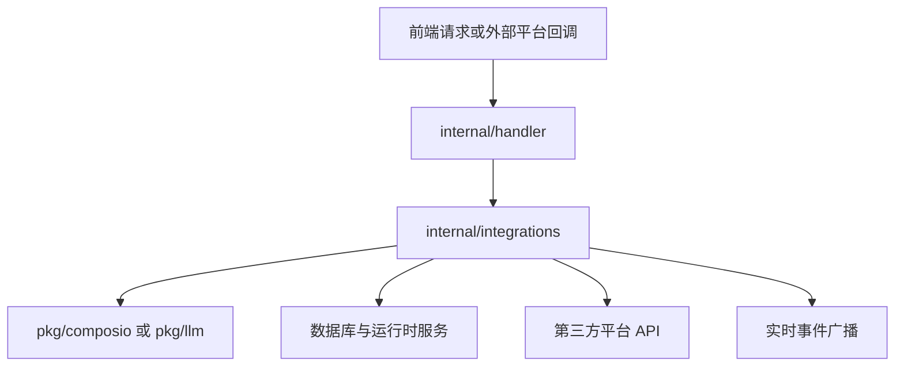

# External Integrations

## 模块概览

External Integrations 负责把 Multica 后端连接到外部平台与通用第三方 API。它由两层组成：

- [External Integrations — internal](external-integrations-internal.md)：面向产品语义的集成层，包含 GitHub、Slack、Lark/飞书、Composio、Stripe/Cloud Billing，以及 IM `channel` 抽象。这里处理认证、权限、工作区绑定、事件回调、消息路由和实时广播。
- [External Integrations — pkg](external-integrations-pkg.md)：面向外部协议的底层 package，主要提供 `pkg/composio` 和 `pkg/llm`。它们不理解 Multica 的工作区、成员或权限，只暴露可复用的 API 客户端能力。

## 分层关系

`internal` 子模块是产品集成的主干。`GitHubConnect`、`ListGitHubInstallations`、`RegisterSlackBYO` 等 handler 负责 HTTP 边界：读取参数、校验用户与工作区权限、调用集成服务，并通过 `writeJSON` / `writeError` 返回稳定响应。Slack、Lark、GitHub 等平台逻辑则沉到 `server/internal/integrations/*`，例如 Lark 的 `RedeemAndBind`、Slack 的 `Handle` / `processEvent`、channel engine 的 `EnsureSession` 和 `AppendUserMessage`。

`pkg` 子模块提供更低层的协议适配。`pkg/composio.Client` 负责 Composio 连接授权、MCP session、toolkit、工具执行和 webhook 验签；`pkg/llm.Client` 负责 OpenAI 兼容的 Chat、流式 Chat 和文本生成。上层服务把 Multica 的工作区、用户和权限语义转换成这些 package 的请求结构。

## 跨模块工作流

典型接入流程从 handler 开始：例如 GitHub 安装、Slack BYO 注册或 Lark 绑定请求进入 `internal/handler`，经过 `requireUserID`、`parseUUIDOrBadRequest`、`requireWorkspaceRole` 等检查后，转交给对应集成服务。服务层负责平台凭据、绑定 token、安装状态和第三方 API 调用，最后由 handler 返回 JSON 或发布工作区事件。

消息类集成通过统一的 `channel` 抽象协作。Slack 的 `processEvent` 会生成 `OutboundMessage`，Lark 的 outbound/replier 逻辑处理卡片、线程和 token 刷新，channel engine 通过 `EnsureSession`、`AppendUserMessage`、lease supervisor 等组件维护会话绑定和处理权。这样不同 IM 平台可以共享会话生命周期与消息路由模型。

Composio 和 LLM 能力则作为可复用基础设施被内部集成调用。`integrations/composio/service.go` 使用 `pkg/composio` 创建授权链接、创建 MCP session、查询 toolkit 与 connected account；内部轻量文本生成通过 `pkg/llm.Client.GenerateText` 统一走 Chat 接口。业务状态仍由 `internal` 管理，协议细节留在 `pkg`。