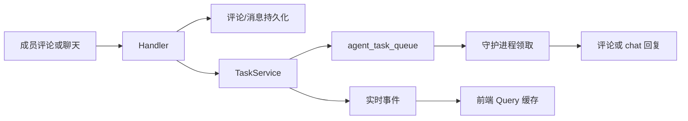

# Issues, Tasks, Comments & Chat

## 模块概览

这个模块把 `issue` 协作面上的四类对象串起来：评论、活动时间线、agent task、chat 会话。后端入口主要在 `server/internal/handler/activity.go`、`comment.go`、`chat.go`、`chat_history.go`、`chat_pinned_agent.go`、`chat_title.go`；真正创建、取消、归因 task 的逻辑集中在 `server/internal/service/task.go`，归因规则由 `server/internal/attribution/attribution.go` 提供纯函数分类。

核心原则是：HTTP handler 负责鉴权、请求解析、响应兼容和实时广播；`TaskService` 负责 task 生命周期、归因、队列通知和取消收尾；数据库查询由 sqlc 生成的 `db.Queries` 承接。

## 时间线与评论读取

`ListTimeline` 返回一个 issue 的完整时间线，把 `ListCommentsForIssue` 和 `ListActivitiesForIssue` 的结果合并成 `TimelineEntry`。默认返回按 `(created_at, id)` 升序排列的扁平数组；如果请求带 `limit`、`before`、`after` 或 `around`，会返回兼容旧客户端的 `timelinePaginatedResponse`，其中 cursor 恒为空、`has_more_*` 恒为 false。

`mergeTimeline` 只做合并和排序；评论详情由 `commentsToEntries` 批量补齐 reactions 和 attachments，避免每条评论单独查询。活动行由 `activityToEntry` 映射，保留 `action` 和 `details`。

评论读取入口是 `ListComments`。默认行为是返回 `commentHardCap` 内的完整时间顺序评论列表；额外参数是为 agent/CLI 节省上下文设计的投影，不是普通 UI 分页：

- `roots_only=true`：只返回顶层评论，并填充 `reply_count`、`last_activity_at`。
- `summary=true`：用 `summarizeContent` 把内容截到 `summaryContentRunes`，并设置 `content_truncated`。
- `fold=true`：用 `foldResolvedThreads` 把已解决线程折叠为“根评论 + 结论回复”或“仅根评论”。
- `thread=<comment-id>`：通过递归 CTE 找到线程根，并返回整条线程。
- `tail=<N>`：只和 `thread` 一起用，返回根评论和最近 N 条回复。
- `recent=<N>`：按线程 `MAX(created_at)` 选最近活跃的 N 条线程。
- `before` + `before_id`：组合 cursor，在 `recent` 下表示线程 cursor，在 `thread+tail` 下表示回复 cursor。

`fold=true` 不允许和 `since`、`tail`、`roots_only` 组合，因为这些模式只拿到部分线程，折叠可能隐藏未读取的解决结论。

## 评论写入与触发

`CreateComment` 负责创建成员或 agent 评论。它会先用 `sanitizeNullBytes` 清理 PostgreSQL `TEXT` 不能接受的 NUL/无效 UTF-8，再校验 `parent_id`、附件和 `suppress_agent_ids`。评论内容按 Markdown 源码存储；HTML/XSS 处理在渲染层和编辑器层完成，不在写入时做 HTML sanitizer。

作者身份来自 `resolveActor`：普通请求是 `member`，带 agent/task 上下文的 CLI 请求可能是 `agent`。当 agent 在当前 issue 的 task 中发评论时，`CreateComment` 会把 `X-Task-ID` 写入 `comment.source_task_id`，供后续归因沿 `comment.source_task_id -> agent_task_queue.originator_user_id/accountable_user_id` 追溯。

评论保存后会发布 `comment:created`，然后调用 `TaskService.AutoUnresolveThreadOnReply` 自动重新打开被回复的已解决线程。最后 `triggerTasksForComment` 决定是否触发 agent task，并把显式 @agent/@squad 的结果填入 `CommentResponse.TriggerOutcomes`。

触发规则由 `computeCommentAgentTriggers` 实现：

- 以 `/note` 开头的评论只保存，不触发 agent。
- 包含 `@all` 时不触发 agent。
- 显式 `@agent` / `@squad` 优先，由 `resolveMentionedAgentCommentTriggers` 解析。
- 显式成员 mention 会阻止默认 assignee fallback。
- 成员回复 agent 评论时，`routeReplyToParentAuthor` 优先唤醒父评论作者。
- 成员回复普通线程时，`routeThreadRootOwners` / `routeConversationOwnersForRoot` 尝试延续线程原 owner。
- 没有更具体路由时，`routeAssigneeFallback` 触发当前 issue 的 agent assignee 或 squad leader。
- agent 作者通常不走成员式路由，只保留 worker agent 唤醒 squad leader 的窄路径。

`PreviewCommentTriggers` 使用同一套解析逻辑预览将触发的 agent，并通过 `commentBlockedTargetOutcomes` 返回会被阻止的显式 mention。预览和提交都先清理 NUL，避免“预览不触发、提交后触发”的差异。

## Task 入队、合并与归因

评论触发 task 时，`enqueueCommentAgentTriggers` 会逐个处理 `commentAgentTrigger`。如果 `(issue, agent)` 已有 pending task，不直接丢掉新评论，而是先尝试 `mergeCommentIntoPendingTask`。合并成功会把新评论加入 queued task 的 `coalesced_comment_ids`，并重新计算整套归因、`runtime_mcp_overlay`、`runtime_connected_apps` 和 `trigger_summary`。如果 queued task 已经被领取，路径会通过 `hasActiveTaskForIssueAndAgent` 判断是 `deferred` 等待完成后 reconcile，还是创建新 task。

新 task 由 `TaskService.EnqueueTaskForIssue`、`EnqueueTaskForMention`、`EnqueueTaskForThreadParent`、`EnqueueTaskForSquadLeader` 等方法落到共同的 `enqueueIssueTaskWithCommentPlan`。它会校验 assignee、agent 是否归档、是否有 runtime，然后写入 `agent_task_queue` 并广播 `task:queued`，同时通知守护进程领取。

归因由 `attribution.Result` 表示。`Source` 包括 `direct_human`、`delegation`、`comment_source`、`trigger_owner`、`rule_owner`、`owner_fallback`、`unattributed` 等。重要区别是：`originator_user_id` 是授权语义，`accountable_user_id` 是审计语义；归因“代表谁发起”，不参与权限判断。`finalizeAttribution` 保证只要 `UserID` 有值，`AccountableUserID` 必须等于它。

`TaskService.attributionForIssueTask` 是 issue-backed task 的归因入口：成员直接操作优先，其次评论链，其次 autopilot trigger/rule owner，其次 issue creator 或 agent-created issue 的 origin task。无法精确归因时，`applyAttributionFallback` 按工作区策略决定是否降级为 `owner_fallback`，或返回 `ErrAttributionFailClosed` 拒绝入队。

## Chat 会话与消息

`CreateChatSession` 创建用户和 agent 的一对一会话。它先校验 agent 属于当前工作区且未归档，再用 `canInvokeAgent` 判断是否允许发起会产生 task 的聊天。创建事务会先调用 `LockWorkspaceForChatSessionCreate`，避免工作区删除过程中插入孤儿 session。

`ListChatSessions` 只返回当前用户创建的 session，并用 `accessibleAgentIDs` 过滤掉调用者已经失去访问权的私有 agent。`gateChatSessionForUser` 是读取/发送的大门：先验证 session creator，再通过 `canAccessPrivateAgent` 确认仍可查看目标 agent。`SendChatMessage` 还会额外重新执行 `canInvokeAgent`，因为“能看历史”不等于“能继续启动新 task”。

`SendChatMessage` 的写入是强事务路径：先预校验附件 UUID、session 状态、agent 归档/runtime、invoke 权限；然后调用 `TaskService.SendDirectChatMessage`。该方法在同一事务内创建 `agent_task_queue`、设置 `chat_input_task_id`、创建用户 `chat_message`、绑定附件、`TouchChatSession`。事务提交后才广播 `task:queued` 并通知守护进程，避免守护进程看到“有 task 没消息”或“有消息没 task”的中间态。

聊天消息读取有两种接口：`ListChatMessages` 返回完整历史；`ListChatMessagesPage` 用 `before_created_at` + `before_id` 分页，SQL 取最近窗口后在响应前反转为时间正序。`chatMessageToResponse` 会补齐失败原因、耗时、`message_kind` 和附件。

首条用户消息后，`maybeGenerateChatTitleAsync` 会异步生成标题。它只在 `h.LLM.Enabled()` 时启动，使用 `generateChatSessionTitle` 调 LLM，再经 `sanitizeChatTitle` 清理前缀、引号和尾标点，最后用 `UpdateChatSessionTitleIfCurrent` 做 CAS，避免覆盖用户手动改名。

## Chat 状态、置顶与归档

`UpdateChatSession` 只允许修改 `title`。`SetChatSessionPinned` 设置 `pinned_at`，不 bump `updated_at`，避免聊天列表排序跳动。`SetChatSessionArchived` 把 session 设为归档或恢复；归档会删除 `channel_chat_session_binding`，让后续外部频道消息创建新 session，而不是复活已归档会话。

`DeleteChatSession` 会在事务里锁住 session、取消相关 task、删除外部频道绑定、outbound card、draft restore，再删除 session 和系统 agent 相关清理。取消事件和 `chat:session_deleted` 只在 commit 后发布。

`chat_pinned_agent.go` 提供快速聊天 agent 条。`ListChatPinnedAgents` 同样按 `accessibleAgentIDs` 过滤；`PinChatAgent` 最多允许 `maxChatPinnedAgents` 个，并且对已置顶 agent 保持幂等；`UnpinChatAgent` 删除对应行。

## 取消与草稿恢复

`CancelTaskByUser` 是用户可见的取消入口。租户边界通过 `GetAgentTaskInWorkspace` 基于 task 的 `agent_id` 校验，因此 issue task、chat task、autopilot run_only task、quick_create task 都能统一取消。chat task 只能由 session creator 取消；非 chat task 则按目标 agent 的私有访问规则校验。

真正取消由 `TaskService.CancelTaskWithResult` 完成。它调用 `CancelAgentTask`，记录指标，执行 `finalizeCancelledChatMessage`，然后 reconcile agent 状态、广播 `task:cancelled` 并通知完成。

chat task 的取消有三种结果：

- task 已有 assistant transcript：追加一条 `"Stopped."` assistant 消息。
- task 未产生 transcript：删除用户消息，分离附件，返回 `CancelledChatMessageResult` 让客户端恢复输入框。
- 已开始但暂时空 transcript，且客户端支持 `AppCapabilityChatDraftRestoreV1`：先 `MarkChatFinalizeDeferred`，等待守护进程 cancel-ack 或 sweeper 后由 `FinalizeDeferredCancelledChat` 判定。

`FinalizeDeferredCancelledChat` 会锁 chat session、claim deferred marker，再决定创建 `chat_draft_restore` 还是追加 `"Stopped."`。完成后广播 `chat:cancel_finalized`。客户端错过事件也可以通过 `ListChatDraftRestores` 拉取待恢复草稿，并用 `ConsumeChatDraftRestore` 幂等删除。

## 外部频道历史

`chat_history.go` 只服务 agent task 内部命令：`GetChatChannelHistory` 对应 `multica chat history`，`GetChatThread` 对应 `multica chat thread [id]`。鉴权在 `chatHistorySession` 中完成，必须是 `X-Actor-Source=task_token` 且带 `X-Task-ID`；普通 JWT 或伪造 header 不能读取频道历史。

当前实现通过 `ChatChannelHistoryReader` 抽象 Slack 历史读取。没有 Slack 集成时返回 200 和说明性 `note`；会话不是频道绑定时也返回空消息和 `note`；真实读取失败才返回 502。

## 实时事件与前端连接

后端使用 `protocol` 事件驱动前端缓存更新：

- 评论：`comment:created`、`comment:updated`、`comment:deleted`、`comment:resolved`、`comment:unresolved`
- task：`task:queued`、`task:dispatch`、`task:running`、`task:completed`、`task:failed`、`task:cancelled`
- chat：`chat:message`、`chat:done`、`chat:cancel_finalized`、`chat:session_read`、`chat:session_deleted`、`chat:session_updated`

前端侧 server state 属于 TanStack Query：issue timeline、task 列表、chat sessions、chat messages、pending tasks 都应通过 query cache 更新或失效。`packages/core/chat/store.ts` 只保存聊天窗口尺寸、打开状态、草稿、已应用 restore ledger 等 client/view state，不应镜像服务器消息列表。

新增字段时要同步更新 `packages/core` 的 zod schema 和 API parser。桌面客户端可能滞后，服务端在 `ListTimeline` 这类边界上保留兼容响应形状；新增字段应尽量 additive，并让旧客户端可忽略。