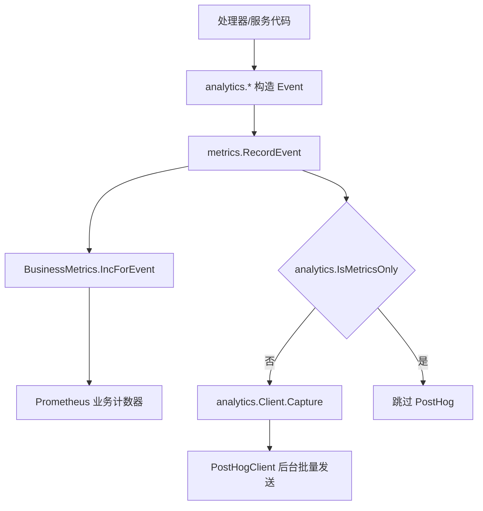

# Observability, Analytics & Feature Flags — internal

## 模块概览

该模块覆盖服务端内部的可观测性、产品事件、运行时指标、结构化日志、进程内事件总线和服务端功能开关。核心代码分布在：

- `server/internal/analytics`：构造产品事件，并在需要时异步发送到 PostHog。
- `server/internal/metrics`：Prometheus 指标、业务事件计数、任务/LLM 指标、DB 采样器和 HTTP 中间件。
- `server/internal/logger`：全局 `slog` 初始化和请求上下文日志字段提取。
- `server/internal/events`：同步进程内 pub/sub 事件总线。
- `server/internal/featureflags`：服务端功能开关 key 与前端公开开关评估。

当前服务端产品分析以数据库和 Grafana/Prometheus 为准。`analytics.Event` 仍然是事件合同的统一表达，但 `analytics.IsMetricsOnly` 对所有服务端事件返回 true，因此 `metrics.RecordEvent` 会跳过 PostHog，仅递增 Prometheus 计数器。PostHog 发送路径仍保留，用于未来新增的非 metrics-only 事件。



## 产品事件与 Analytics

`analytics.Event` 是服务端事件的通用结构，字段接近 PostHog `/capture/` 形状：

- `Name`：事件名，如 `signup`、`workspace_created`。
- `DistinctID`：用户或匿名主体标识；用户事件通常是 `user.id`。
- `WorkspaceID`：工作区级事件的关联工作区。
- `Properties`：事件属性，禁止放原始 PII。
- `SetOnce` / `Set`：PostHog person properties。
- `Timestamp`：可选时间戳，`PostHogClient.Capture` 会补默认值。

事件构造函数都在 `analytics/events.go` 中，例如 `Signup`、`WorkspaceCreated`、`IssueCreated`、`IssueExecuted`、`ChatMessageSent`、`AgentCreated`、`AutopilotRunStarted`、`FeedbackSubmitted`、`ContactSalesSubmitted`。这些函数负责统一属性命名和归一化约定，而不是让调用点手写 map。

常见模式：

```go
ev := analytics.IssueCreated(actorID, workspaceID, issueID, agentID, taskID, runID, analytics.SourceChat, analytics.PlatformWeb)
metrics.RecordEvent(app.analytics, app.businessMetrics, ev)
```

不要直接调用 `analytics.Client.Capture` 发送由 `analytics.*` 构造的产品事件。服务端事件必须经过 `metrics.RecordEvent`，这样 Prometheus 与潜在 PostHog 发送不会漂移；`business_pairing_test.go` 会约束这一点。

`withCoreProperties` 会补充跨事件共享字段：`user_id`、`workspace_id`、`agent_id`、`task_id`、`issue_id`、`chat_session_id`、`autopilot_run_id`、`source`、`runtime_mode`、`provider`，并始终写入 `is_demo`。`nonAgentUserID` 会过滤包含 `:` 的合成主体，避免把 agent 或 workspace 合成 ID 当成真实用户。

## PostHog 客户端

`analytics.NewFromEnv` 根据环境变量创建客户端：

- `ANALYTICS_DISABLED=true|1`：强制使用 `NoopClient`。
- `POSTHOG_API_KEY` 为空：使用 `NoopClient`。
- `POSTHOG_HOST`：默认 `https://us.i.posthog.com`。
- `ANALYTICS_ENVIRONMENT` / `APP_ENV`：经 `EnvironmentFromEnv` 归一化为 `production`、`staging` 或 `dev`。

`PostHogClient` 的设计目标是不阻塞请求路径。`Capture` 只尝试写入有界 channel；队列满时丢弃事件并通过 `dropped` 计数，避免外部分析服务影响产品可用性。后台 `run` goroutine 按 `BatchSize` 或 `FlushEvery` 调用 `send`，`Close` 会停止 worker 并尽量 drain 已排队事件。

`send` 会在每个事件上补充：

- `workspace_id`
- `event_schema_version`
- `environment`
- 默认 `is_demo=false`
- 缺失且合法时的 `user_id`
- `$set_once` 和 `$set`

## Prometheus 业务指标

`metrics.BusinessMetrics` 是业务可观测性的主入口。`NewBusinessMetrics` 创建任务、LLM、业务事件和生命周期相关 collector；`Collectors` 返回所有需要注册到 Prometheus registry 的 collector。

任务生命周期使用强类型方法，不通过 `analytics.Event`：

- `RecordTaskEnqueued`
- `RecordTaskDispatched`
- `RecordTaskStarted`
- `RecordTaskTerminal`
- `RecordTaskFailed`
- `RecordTaskQueuedExpired`
- `RecordTaskLeaseExpired`

`RecordTaskDispatched` 会调用 `markTaskInProgress`，`RecordTaskTerminal` 会调用 `clearTaskInProgress`，通过 `activeTasks` map 防止同一个 `taskID` 重复增加 in-progress gauge。空 `taskID` 只增不减，调用方应尽量提供真实 task ID。

LLM 用量通过 `RecordLLMUsage` 记录。它先调用 `PriceForModelAlias`，能定价时记录 `multica_llm_tokens_total` 和 `multica_llm_cost_usd_total`；不能定价时记录 `multica_llm_unpriced_tokens_total`，并把 request model 标成 `unknown`。

## 业务事件计数

`metrics.RecordEvent(client, m, ev)` 是服务端 funnel/community/commercial 事件的唯一入口。它先检查 `analytics.IsMetricsOnly(ev.Name)`，再决定是否调用 `client.Capture`，随后调用 `m.IncForEvent(ev)`。

`IncForEvent` 根据 `ev.Name` 分发到具体 Prometheus counter，并从 `ev.Properties` 读取少量低基数字段。例如：

- `EventSignup` 使用 `signup_source`，经 `NormalizeSignupSource`。
- `EventIssueCreated` 使用 `source` 和 `platform`。
- `EventRuntimeReady` 递增 ready counter，并在 `ready_duration_ms > 0` 时观察 `runtimeReadySeconds`。
- `EventRuntimeFailed` 使用 `runtime_mode`、`provider`、`failure_reason`、`recoverable`。
- `EventAutopilotRunCompleted` / `EventAutopilotRunFailed` 统一写入 terminal counter，状态分别为 `completed` 和 `failed`。

不适合表达为 `analytics.Event` 的指标使用强类型方法，例如 `RecordAutopilotRunSkipped`、`RecordWebhookDelivery`、`RecordGithubEventReceived`、`RecordCloudRuntimeRequest`、`RecordDaemonWSMessageReceived`。

## DB 采样器

`BusinessSamplerCollector` 是 opt-in 的 Prometheus collector，用于在 `/metrics` scrape 时从数据库读取当前状态类 gauge。`NewBusinessSamplerCollector(nil)` 或 `Pool == nil` 会返回 nil，表示禁用采样器。

安全约束集中在 `business_sampler.go` 和 `business_sampler_queries.go`：

- 每个查询单独开启 read-only transaction。
- `runQuery` 设置 `SET LOCAL statement_timeout`，默认 500ms。
- 整体 refresh 使用 `8 * queryTimeout` 的 context 上限。
- 成功 snapshot 通过 `CacheTTL` 缓存，默认 8s。
- 查询失败只记录 `query_errors` 并保留旧 snapshot。
- 输出 label 经过 `NormalizeTaskSource`、`NormalizeRuntimeMode`、`NormalizeRuntimeProvider` 等 allow-list 归一化。

采样器暴露活跃用户/工作区、queued/running/stuck task、在线 runtime、runtime heartbeat age histogram、workspace 总量，以及采样器自身的查询耗时和错误计数。

## HTTP、DB 与 Daemon WS Collector

`HTTPMetrics` 提供请求计数、耗时、in-flight gauge 和 daemon workspace 响应大小 histogram。`Middleware` 会跳过健康检查路径，使用 chi 的 route pattern 作为 `route` label，避免把真实 URL 参数写成高基数标签。

`DBCollector` 从 `pgxpool.Stat()` 导出连接池状态，包括 acquired、idle、total、acquire count、等待时间和连接销毁计数。它只读 pool 统计，不访问数据库。

`DaemonWSCollector` 包装 `daemonws.Metrics` 的 atomic 计数，导出 daemon WebSocket 连接、断开、慢消费驱逐、Redis wakeup 发布/接收和本地投递 hit/miss。

## 日志

`logger.Init` 初始化全局 `slog`，使用 `tint` handler。`LOG_LEVEL` 支持 `debug`、`info`、`warn`、`error`，默认 debug。`isTerminal` 用于判断 stderr 是否是终端；重定向到文件时关闭 ANSI 颜色。

`NewLogger(component)` 返回带 `component` 字段的 logger。`NewWriterLoggerDefault(component, w)` 用于 daemon 等写文件场景：它创建无颜色 handler，并同时设置为全局默认 logger，保证直接调用 `slog.Info` 的代码也写入同一个 sink。

`RequestAttrs(r)` 从请求中提取 `request_id`、`X-User-ID` 和 `middleware.ClientMetadataFromContext` 的 client platform/version/os，供 handler 层日志复用。

## 进程内事件总线

`events.Bus` 是同步 pub/sub。`Subscribe(eventType, h)` 注册类型级 handler，`SubscribeAll(h)` 注册全局 handler，`Publish(e)` 先调用类型级 handler，再调用全局 handler。每个 handler 都有独立 `recover`，单个 listener panic 不会阻断后续 listener。

`events.Event` 携带 `Type`、`WorkspaceID`、`ActorType`、`ActorID`、`Payload`，以及 `TaskID`、`ChatSessionID` 等 realtime fanout scope hint。调用方需要注意：handler 是同步执行的，不应在 listener 中做长时间阻塞工作。

## 功能开关

`featureflags/keys.go` 定义服务端内部使用的开关 key：

- `ComposioMCPApps`
- `AgentBuilder`
- `ResourceLabels`

对应 helper 为 `ComposioMCPAppsEnabled`、`AgentBuilderEnabled`、`ResourceLabelsEnabled`，都调用 `featureflag.Service.IsEnabled(ctx, key, false)`，默认关闭。

`EvaluateFrontendPublicFlags` 返回可下发给前端的公开开关 map，并额外把兼容 key `agents_skill_toggles` 固定为 true，用于兼容旧桌面客户端。

## 贡献注意事项

新增服务端产品事件时，先在 `analytics/events.go` 增加事件名和构造函数，再在 `metrics/business_events.go` 的 `IncForEvent` 中增加 Prometheus 分发逻辑，并确认是否需要加入 `metricsOnlyEvents`。属性应优先复用 `CoreProperties` 和现有 `Normalize*` allow-list，避免引入高基数 label。

新增 Prometheus label 前要检查 `metricLabels` 相关配置和归一化函数。不要把 user ID、workspace ID、issue ID、email、自由文本、错误全文放进 Prometheus label；这些只能作为事件属性、日志字段或数据库数据处理。

新增采样器查询时保持 `runQuery` 的事务和 timeout 模式，输出 label 必须来自固定 allow-list，结果集要有明确上限。对于 count distinct 这类单行聚合，不要在内部 distinct 子查询加 `LIMIT`，否则会得到错误计数。