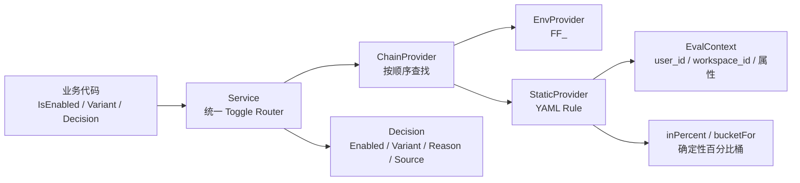

# Observability, Analytics & Feature Flags — pkg

## 模块定位

`server/pkg/featureflag` 是后端的框架级 Feature Flag 模块。业务代码不直接读取环境变量、YAML 或具体 Provider，而是通过 `Service.IsEnabled`、`Service.Variant` 或 `Service.Decision` 查询开关结果。

这个包同时提供基础可观测性信息：每次评估会产出 `Decision`，其中包含 `Reason` 和 `Source`，用于说明“为什么得到这个结果”和“哪个配置层命中”。当 Provider 返回 `ReasonError` 且 `Service` 配置了 `WithLogger` 时，`Service.Decision` 会写入结构化 warning 日志。

## 核心评估链路



标准服务启动路径是：

1. `cmd/server/main.go` 调用 `NewServiceFromEnv`
2. `NewServiceFromEnv` 创建 `EnvProvider`
3. 如果设置了 `MULTICA_FEATURE_FLAGS_FILE`，调用 `LoadRulesFromYAMLFile`
4. `LoadRulesFromYAMLFile` 通过 `parseRulesYAML` 和 `ruleConfig.toRule` 转成运行时 `Rule`
5. `NewStaticProvider` 加载规则
6. `NewChainProvider` 将 env 层放在 static 层之前
7. `NewService` 返回业务代码使用的 `*Service`

## Toggle Router：`Service`

`Service` 是业务代码应持有的唯一入口，定义在 `service.go`。

主要方法：

- `NewService(provider Provider, opts ...Option) *Service`
- `IsEnabled(ctx context.Context, key string, defaultVal bool) bool`
- `Variant(ctx context.Context, key string, defaultVal string) string`
- `Decision(ctx context.Context, key string, defaultVal bool) Decision`
- `Provider() Provider`
- `WithLogger(l *slog.Logger) Option`

`Service` 的设计重点是“默认安全”：

- `nil *Service` 合法，会返回调用方传入的默认值。
- `nil Provider` 合法，也会返回默认值。
- Provider 未命中时不会报错，`Decision.Reason` 为 `ReasonDefault`，`Decision.Source` 为 `"default"`。
- Provider 返回 `ReasonError` 时，`Decision` 仍会返回给调用方；如果配置了 logger，会记录 warning。

典型调用方式：

```go
if flags.IsEnabled(ctx, "billing_new_invoice_email", false) {
	return s.sendNewInvoiceEmail(ctx, invoice)
}
return s.sendLegacyInvoiceEmail(ctx, invoice)
```

对于多分支实验，使用 `Variant`：

```go
variant := flags.Variant(ctx, "checkout_algo", "control")
switch variant {
case "experiment-v2":
	return s.runExperiment(ctx)
default:
	return s.runControl(ctx)
}
```

需要诊断信息时使用 `Decision`：

```go
decision := flags.Decision(ctx, "checkout_algo", false)
// decision.Source 可用于判断命中 env、static 还是 default
// decision.Reason 可用于判断是 static、percent、default 还是 error
```

## Provider 合约

`Provider` 定义在 `provider.go`：

```go
type Provider interface {
	Lookup(ctx context.Context, key string) (decision Decision, found bool)
	Name() string
}
```

Provider 必须并发安全，因为 `Service` 会在多个请求 goroutine 中读取它。`Lookup` 的返回值语义很重要：

- `(Decision{}, false)` 表示这个 Provider 不认识该 key，调用方可以继续查下一个 Provider 或使用默认值。
- `(decision, true)` 表示 Provider 已经对该 key 作出决定。
- 内部错误不应 panic，应返回 `Decision{Reason: ReasonError}` 且 `found=true`，避免错误配置被后续低优先级 Provider 静默覆盖。

`Decision` 是模块的诊断载体：

- `Key`：被评估的 flag key。
- `Enabled`：布尔投影。
- `Variant`：原始变体值；布尔 flag 使用 `"on"` / `"off"`。
- `Reason`：决策原因，包括 `ReasonStatic`、`ReasonPercent`、`ReasonOverride`、`ReasonDefault`、`ReasonError`。
- `Source`：产生决策的 Provider 名称，例如 `"env"`、`"static"`、`"default"`。

## Provider 编排：`ChainProvider`

`ChainProvider` 定义在 `chain_provider.go`，用于按优先级组合多个 Provider。

```go
cp := featureflag.NewChainProvider(envProvider, staticProvider)
svc := featureflag.NewService(cp)
```

行为规则：

- `NewChainProvider(providers ...Provider)` 会跳过 `nil` Provider。
- `Lookup` 按注册顺序调用每个 Provider 的 `Lookup`。
- 第一个返回 `found=true` 的 Provider 获胜。
- 没有任何 Provider 命中时返回 `(Decision{}, false)`。
- 空链合法，永远未命中，让 `Service` 回退到调用方默认值。
- `Providers()` 返回 Provider 切片快照，切片本身可安全读取，但 Provider 实例仍是共享对象，不应被外部修改。

标准环境中，`NewServiceFromEnv` 使用的顺序是：

1. `EnvProvider`
2. `StaticProvider`

因此 `FF_<KEY>` 环境变量会覆盖 YAML 文件中的规则。

## 环境变量 Provider：`EnvProvider`

`EnvProvider` 定义在 `env_provider.go`，用于运维覆盖、本地开发和紧急 kill switch。

构造函数：

```go
provider := featureflag.NewEnvProvider("FF_")
```

flag key 会通过 `flagKeyToEnv` 转成环境变量名：

- `"checkout_new_payment_flow"` → `FF_CHECKOUT_NEW_PAYMENT_FLOW`
- `"checkout.newPayment"` → `FF_CHECKOUT_NEWPAYMENT`
- 非字母数字字符会被合并为单个 `_`
- 前后 `_` 会被去掉

支持的值格式：

- `"true"`、`"on"`、`"1"`、`"yes"`：启用，`Variant="on"`
- `"false"`、`"off"`、`"0"`、`"no"`：禁用，`Variant="off"`
- 空字符串：显式禁用
- `"42%"`：基于 `user_id` 的确定性百分比 rollout
- 其他非空字符串：作为变体名，`Enabled=true`

百分比 env 覆盖使用 `EvalContextFrom(ctx)` 读取 `user_id`，再调用 `inPercent(key, userID, percent)`。非法百分比，例如负数、大于 100 或非数字，会返回 `ReasonError`，并且不会继续回退到后面的 Provider。

## 静态规则 Provider：`StaticProvider`

`StaticProvider` 定义在 `static_provider.go`，是线程安全的内存 Provider，适合承载随代码和配置一起发布的生产规则。

构造和加载方式：

```go
sp := featureflag.NewStaticProvider()

sp.Set("billing_new_invoice_email", featureflag.Rule{
	Default: true,
})

sp.LoadRules(map[string]featureflag.Rule{
	"checkout_algo": {
		Default: false,
		Variant: "experiment-v2",
		Percent: &featureflag.PercentRollout{
			Percent: 25,
			By:      "user_id",
		},
	},
})
```

并发模型：

- `Set` 使用写锁安装或替换单条规则。
- `LoadRules` 先 clone 输入 map，再用写锁原子替换完整规则表。
- `Lookup` 使用读锁读取规则，然后释放锁再执行评估。
- `Keys` 返回排序后的 key 副本，适合诊断接口展示。

`Rule` 的评估顺序是固定的，且第一个命中获胜：

1. `Deny`：命中则关闭，优先级最高。
2. `Allow`：命中则开启。
3. `Percent`：按确定性桶判断是否开启。
4. `Default`：兜底值。

`AllowBy`、`DenyBy` 和 `Percent.By` 都使用 `EvalContext.Lookup` 读取属性。为空时默认使用 `"user_id"`。

`decisionFromRule` 对 `Variant` 有一个关键约束：`Rule.Variant` 只在规则评估为 enabled 时返回。只要评估结果为 false，`Variant` 一律是 `"off"`。这样可以避免调用方用 `Variant()` 分支时，把未进入实验的人错误路由到实验分支。

## 请求评估上下文：`EvalContext`

`EvalContext` 定义在 `eval_context.go`，用于把用户、工作区和任意属性传入 flag 评估。

```go
ctx = featureflag.WithEvalContext(ctx, featureflag.EvalContext{
	UserID:      user.ID,
	WorkspaceID: workspace.ID,
	Attributes: map[string]string{
		"plan":    "enterprise",
		"country": "CN",
	},
})
```

读取规则由 `EvalContext.Lookup(name string)` 定义：

- `"user_id"` 映射到 `EvalContext.UserID`
- `"workspace_id"` 映射到 `EvalContext.WorkspaceID`
- 其他 key 从 `Attributes` 读取
- 空字符串视为未找到

`WithEvalContext(parent, ec)` 会返回携带上下文的新 `context.Context`。如果 `parent` 是 `nil`，会使用 `context.Background()`。`EvalContextFrom(ctx)` 在没有上下文或没有值时返回零值 `EvalContext`，因此调用方不需要做 nil 判断。

## 百分比 rollout

百分比 rollout 由 `hash.go` 中的 `bucketFor` 和 `inPercent` 实现。

`bucketFor(key, identifier)` 使用 FNV-1a 计算 `[0, 100)` 的稳定桶。hash 输入中在 key 和 identifier 之间写入 `0` 分隔符，避免 `"ab"+"c"` 与 `"a"+"bc"` 这类拼接碰撞模式。

`inPercent(key, identifier, percent)` 的行为：

- `percent <= 0`：全部关闭
- `percent >= 100`：全部开启
- 其他值：`bucketFor(key, identifier) < percent`

当 `identifier` 为空时仍会得到稳定桶。这意味着没有用户 ID 的请求不会随机抖动，而是按 flag key 进入同一个匿名 cohort。

## YAML 配置加载

配置入口在 `config.go`。

环境变量：

- `MULTICA_FEATURE_FLAGS_FILE`：YAML 规则文件路径，由 `EnvFlagFile` 定义。
- `FF_`：运行时覆盖前缀，由 `EnvOverridePrefix` 定义。

`LoadRulesFromYAMLFile(path)` 读取 YAML 文件并调用 `parseRulesYAML`。空文件或只包含空白字符的文件是合法的，会返回空 map。

YAML wire format 使用内部结构 `ruleConfig`，再由 `toRule` 转为运行时 `Rule`。这样配置格式可以独立演进，不必直接暴露给业务调用方。

示例：

```yaml
billing_new_invoice_email:
  default: true

checkout_algo:
  default: false
  variant: experiment-v2
  percent:
    percent: 25
    by: user_id

ops_disable_recommendations:
  default: false
  allow:
    - user-internal-1
    - user-internal-2
```

`NewServiceFromEnv(opts ...Option)` 是服务器标准装配函数：

- 总是创建 `NewEnvProvider("FF_")`
- 如果设置了 `MULTICA_FEATURE_FLAGS_FILE`，读取文件并创建 `StaticProvider`
- 用 `NewChainProvider` 组合 Provider
- 用 `NewService` 返回服务
- 如果配置了 logger，会记录初始化日志，包含文件路径、规则数量和 env 前缀

当文件路径未设置时，服务仍正常工作；未命中的 flag 会回退到调用方默认值。当文件路径已设置但文件读取或解析失败时，函数返回错误，让服务启动阶段显式失败。

## 与代码库其他部分的连接

当前调用图中，生产入口是 `cmd/server/main.go`：

- `main` 调用 `NewServiceFromEnv`
- `main` 调用 `WithLogger`
- 最终得到的 `Service` 注入到后端业务路径中

测试侧使用较多：

- `internal/handler/featureflag_test.go` 的 `withFeatureFlag` 通过 `NewStaticProvider`、`Set` 和 `NewService` 构造测试 flag。
- `internal/service/resolve_originator_test.go` 的 `composioMCPAppsTestFlags` 直接创建 `Rule` 并注入 `StaticProvider`。
- `pkg/featureflag/*_test.go` 覆盖 ChainProvider 优先级、YAML 解析、env 覆盖和服务装配行为。

这说明模块边界比较清晰：生产代码通常只关心 `Service`，测试代码可以直接使用 `StaticProvider` 和 `Rule` 精准控制 flag 状态。

## 扩展新 Provider 的方式

新增配置源时实现 `Provider` 即可：

```go
type DBProvider struct {
	// 数据库连接或缓存字段
}

func (p *DBProvider) Name() string {
	return "db"
}

func (p *DBProvider) Lookup(ctx context.Context, key string) (featureflag.Decision, bool) {
	// 未找到 key 时返回 found=false
	// 内部错误时返回 ReasonError 且 found=true
	return featureflag.Decision{}, false
}
```

然后按优先级放入 `NewChainProvider`：

```go
svc := featureflag.NewService(featureflag.NewChainProvider(
	featureflag.NewEnvProvider(featureflag.EnvOverridePrefix),
	dbProvider,
	staticProvider,
))
```

优先级应从最具体到最通用：请求级 override、环境变量、数据库、静态配置。这样紧急覆盖和调试入口可以稳定压过普通配置。