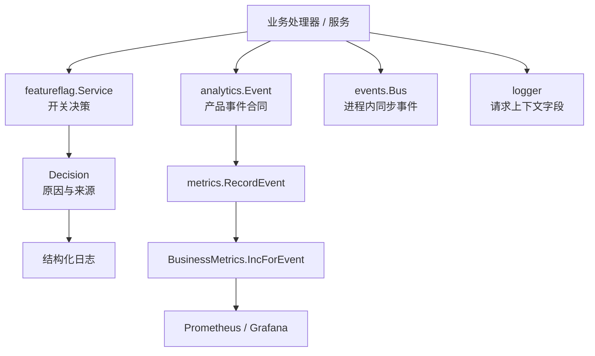

# Observability, Analytics & Feature Flags

## 模块概览

该模块组把后端运行期的“观测、计数、事件表达、日志上下文和功能开关”组织成一条统一链路：

- [Observability, Analytics & Feature Flags — internal](observability-analytics-feature-flags-internal.md)：面向服务端业务代码，负责 `analytics.Event`、`metrics.RecordEvent`、Prometheus 指标、`logger`、进程内 `events.Bus` 以及内部功能开关适配。
- [Observability, Analytics & Feature Flags — pkg](observability-analytics-feature-flags-pkg.md)：提供框架级 `featureflag.Service`，通过 `ChainProvider`、`EnvProvider`、`StaticProvider` 和 `Decision` 统一评估功能开关。

两层的分工是：`pkg/featureflag` 决定“某个能力是否启用、来自哪个配置层、为什么得到这个结果”；`internal/*` 负责把业务动作、运行状态和系统行为转化为可查询、可告警、可调试的观测信号。

## 协作方式

业务代码通常先通过 `featureflag.Service.IsEnabled`、`Variant` 或 `Decision` 判断功能路径，再在实际行为发生后用 `analytics.*` 构造事件，并交给 `metrics.RecordEvent` 记录。当前服务端事件由 `analytics.IsMetricsOnly` 统一判定为 metrics-only，因此 `RecordEvent` 主要落到 `BusinessMetrics.IncForEvent` 和 Prometheus 计数器；PostHog 客户端路径保留，但不是当前服务端分析主链路。

指标层会在写入 Prometheus 前规范化标签，例如 `RecordTaskStarted`、`RecordTaskEnqueued`、`RecordTaskTerminal` 统一任务来源、运行模式和终态；`IncForEvent` 会复用 `NormalizeRuntimeMode`、`NormalizeOnboardingPath`、`NormalizeSignupSource` 等函数，避免高基数或不一致标签污染指标。

功能开关链路由 `NewServiceFromEnv` 装配：它加载 YAML 规则，经 `LoadRulesFromYAMLFile`、`parseRulesYAML` 和 `toRule` 转成 `StaticProvider` 规则，同时叠加 `EnvProvider` 的 `FF_<KEY>` 覆盖能力。百分比发布通过 `PercentRollout`、`inPercent` 和 `bucketFor` 基于 `EvalContext` 做确定性分桶，保证同一用户或工作区得到稳定结果。

## 关键跨模块流程

### 业务事件到指标

以 `CreateContactSales` 为例，处理器提交销售线索后触发产品事件，`metrics.RecordEvent` 转入 `IncForEvent`，再通过 `NormalizeSignupSource` 和 `normalizeFromAllowList` 规范化来源标签，最终写入 Prometheus。这个流程体现了模块组的核心原则：事件合同由 `analytics` 统一表达，指标维度由 `metrics` 控制。

### 功能开关到可解释决策

服务启动时，`main` 通过 `NewServiceFromEnv` 初始化 `featureflag.Service`。运行时业务代码只查询 `Service`，不直接读取环境变量或 YAML。每次评估都会产生 `Decision`，其中的 `Reason` 和 `Source` 可用于解释命中的配置层；当 Provider 返回错误且配置了 `WithLogger` 时，决策链路会输出结构化 warning 日志。

### 任务与运行态观测

任务、Autopilot、LLM、Webhook、GitHub 事件和 daemon websocket 等运行态信号都汇入 `metrics`。`RecordTaskStarted`、`RecordTaskTerminal`、`RecordGithubEventReceived` 等入口负责把业务状态转成稳定标签和指标，使 Grafana/Prometheus 成为服务端行为分析的主要来源。

## 阅读顺序

先阅读 [Observability, Analytics & Feature Flags — internal](observability-analytics-feature-flags-internal.md) 理解服务端如何产生日志、事件和指标；再阅读 [Observability, Analytics & Feature Flags — pkg](observability-analytics-feature-flags-pkg.md) 理解功能开关评估链路、配置来源和决策可观测性。