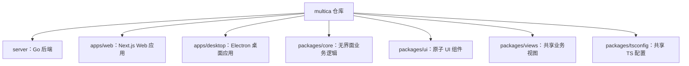

# Other — AGENTS.md

## AGENTS.md 模块说明

`AGENTS.md` 是仓库根目录下的代理协作入口文档，用来告诉 AI 编码代理在 `multica` 仓库中如何理解项目、遵守边界、选择命令，并在修改代码前使用 GitNexus 做影响分析。

这个文件本身不是可执行代码模块，没有函数、类、内部调用或执行流。它的作用是约束和引导后续代码阅读、修改、测试、提交等开发行为。

## 文档定位

`AGENTS.md` 明确声明自己不是架构和规范的唯一权威来源，而是一个精简指针文档：

- 权威架构、编码规则和约定在根目录 `CLAUDE.md`
- 命令清单以 `Makefile`、`package.json`、`pnpm-workspace.yaml` 为准
- 本文件提供快速上下文、硬性边界和 GitNexus 使用规则

开发者或代理进入仓库后，应先读取 `CLAUDE.md`，再结合本文件中的快速参考和 GitNexus 规则开展工作。

## 仓库结构概览

`AGENTS.md` 将 `multica` 描述为 Go 后端加 pnpm monorepo 前端的混合项目：



各目录的职责边界是贡献代码时最重要的上下文之一：

- `server/`：Go 后端，使用 Chi router、sqlc、gorilla/websocket
- `apps/web/`：Next.js App Router 前端应用
- `apps/desktop/`：Electron 桌面应用
- `packages/core/`：无界面业务逻辑，包括 Zustand stores、React Query hooks、API client
- `packages/ui/`：原子 UI 组件，基于 shadcn/Base UI，不包含业务逻辑
- `packages/views/`：可复用业务页面和组件
- `packages/tsconfig/`：共享 TypeScript 配置

## 状态管理规则

本模块强调 React Query 和 Zustand 的职责划分，这是修改前端代码时必须遵守的核心约束。

React Query 负责所有服务端状态，例如：

- issues
- members
- agents
- inbox
- workspace list

Zustand 只负责客户端或视图状态，例如：

- view filters
- drafts
- modals
- desktop tab state

当前 workspace identity 由路由驱动，只会为了平台衔接进行镜像。不要把 workspace 的真实来源迁移到 Zustand。

WebSocket 事件应更新 React Query 中的服务端数据。Zustand 写入只应用于清理客户端拥有的指针，并且需要遵守单一 responder/self-event guard 模式，避免重复响应自身事件。

## 包边界约束

`AGENTS.md` 中的包边界是硬规则，不应为了局部方便绕过。

`packages/core/` 的限制：

- 不能依赖 `react-dom`
- 不能直接使用 `localStorage`
- 不能读取 `process.env`

`packages/ui/` 的限制：

- 不能导入 `@multica/core`
- 组件必须保持原子化和无业务逻辑

`packages/views/` 的限制：

- 不能使用 `next/*`
- 不能使用 `react-router-dom`
- 路由能力必须通过 `NavigationAdapter` 注入

`apps/web/platform/` 的职责：

- 这是唯一允许使用 Next.js 平台 API 的位置

这些规则保证共享包可以被 Web、Desktop 和其他运行环境复用，避免框架 API 泄漏到通用层。

## 常用命令

本文件只列出最常用命令，完整命令仍以 `Makefile`、`package.json`、`pnpm-workspace.yaml` 为准。

```bash
make dev
pnpm typecheck
pnpm test
make test
make check
```

命令用途：

- `make dev`：自动设置并启动完整开发环境
- `pnpm typecheck`：运行 TypeScript 类型检查
- `pnpm test`：运行 TypeScript 单元测试，测试框架为 Vitest
- `make test`：运行 Go 测试
- `make check`：运行完整验证流水线

贡献代码前通常应至少运行与改动相关的检查；跨包或共享逻辑改动应优先使用 `make check` 做完整验证。

## GitNexus 集成

仓库已由 GitNexus 索引，项目名为 `multica`。索引包含符号、调用关系和执行流，用于在修改代码前理解影响范围。

`AGENTS.md` 对 GitNexus 的要求是强制性的：

- 修改函数、类或方法前，必须先运行 `impact({target: "symbolName", direction: "upstream"})`
- 提交前，必须运行 `detect_changes()` 检查改动影响范围
- 如果影响分析返回 HIGH 或 CRITICAL 风险，必须先警告用户
- 理解陌生代码时，优先使用 `query({search_query: "concept"})`
- 查看具体符号上下文时，使用 `context({name: "symbolName"})`
- 做安全审查时，使用 `explain({target: "fileOrSymbol"})` 查看 taint findings

本模块没有自身调用图，但它规定了其他代码模块修改前的调用图工作流。

## 推荐工作流

修改代码时应按以下顺序处理：

1. 读取 `CLAUDE.md`，确认当前任务适用的架构和编码规则。
2. 根据目录位置确认包边界，例如是否允许使用 Next.js API、React DOM、`@multica/core`。
3. 使用 GitNexus `query` 或 `context` 理解相关功能和符号。
4. 修改任何函数、类或方法前，对目标符号运行 `impact`。
5. 如果风险为 HIGH 或 CRITICAL，先向用户说明影响范围。
6. 完成改动后运行相关测试或检查。
7. 提交前运行 `detect_changes()`，确认影响范围符合预期。

## 索引维护

如果 GitNexus 索引过期，文档建议在仓库根目录运行：

```bash
node .gitnexus/run.cjs analyze
```

如果 `.gitnexus/run.cjs` 不存在，则使用：

```bash
npx gitnexus analyze
```

如果遇到 npm 11 崩溃问题，可以使用全局安装方式：

```bash
npm i -g gitnexus
```

索引状态会直接影响 `impact`、`query`、`context`、`detect_changes` 等结果的准确性，因此在大规模修改、重命名或跨模块排查前应确保索引可用。

## 相关资源

GitNexus 提供以下资源 URI，用于理解仓库结构和执行流：

| 资源 | 用途 |
|---|---|
| `gitnexus://repo/multica/context` | 查看代码库概览和索引新鲜度 |
| `gitnexus://repo/multica/clusters` | 查看功能区域聚类 |
| `gitnexus://repo/multica/processes` | 查看全部执行流 |
| `gitnexus://repo/multica/process/{name}` | 查看单个执行流的步骤级追踪 |

## 维护建议

更新 `AGENTS.md` 时应保持它的“指针文档”定位，不要把完整架构说明、长命令列表或实现细节复制进来。新增规则时应确认是否也需要同步到 `CLAUDE.md`，避免两个文档产生冲突。

适合放入本文件的内容包括：

- 仓库级硬性约束
- 代理必须遵守的工作流
- 关键目录职责
- 最常用命令入口
- GitNexus 或其他代码智能工具的强制使用规则

不适合放入本文件的内容包括：

- 详细业务流程说明
- 单个功能模块的实现细节
- 长篇测试策略
- 与 `CLAUDE.md` 重复的大段规范
- 临时任务说明或个人偏好