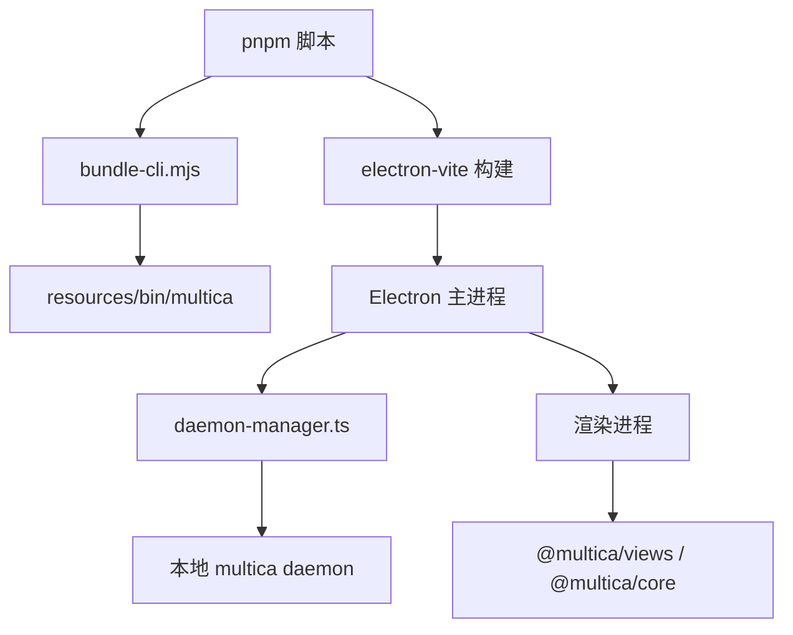

# Other — apps-desktop

## 模块概览

`apps/desktop` 是 Multica 的 Electron 桌面客户端模块，负责把共享前端视图、Electron 主进程能力、本地 `multica` CLI、守护进程生命周期和跨平台安装包组合成可发布的桌面应用。

模块边界大致分为四层：

桌面端不是独立业务实现。业务页面主要来自 `@multica/views`，服务器状态仍由 `@multica/core` 中的 React Query 逻辑管理；桌面模块补充的是原生能力：窗口、协议、菜单、更新、CLI/daemon 管理、打包和平台适配。

## 构建与运行入口

`package.json` 定义桌面模块的主要脚本：

- `pnpm dev`：运行 `scripts/dev.mjs`，依次准备 CLI、修补 macOS 开发版 Electron 名称，然后启动 `electron-vite dev`。
- `pnpm build`：先执行 `bundle-cli.mjs`，再执行 `electron-vite build`。
- `pnpm package`：运行 `scripts/package.mjs`，构建 Electron 产物、派生版本号、按目标平台打包。
- `pnpm typecheck`：分别检查 Node 侧 `tsconfig.node.json` 和 Web 侧 `tsconfig.web.json`。
- `pnpm test`：运行 Vitest 单元测试。

`electron.vite.config.ts` 将 Electron 分为 `main`、`preload`、`renderer` 三个构建目标。主进程和 preload 使用 `externalizeDepsPlugin()` 外置依赖；渲染进程使用 React、Tailwind，并将 `@` 映射到 `src/renderer/src`。渲染开发端口由 `DESKTOP_RENDERER_PORT` 控制，默认 `5173`，用于支持多个 worktree 并行运行。

## 发布配置

`electron-builder.yml` 定义安装包和平台身份：

- 应用身份为 `appId: ai.multica.desktop`，产品名为 `Multica`。
- 注册 `multica://` 协议。
- `asarUnpack: resources/**` 保证打包后的 CLI 二进制可以从 `app.asar.unpacked` 执行。
- macOS 产物包括 `dmg` 和 `zip`，文件名固定为 `multica-desktop-${version}-mac-${arch}.${ext}`，并启用 notarization。
- Linux 显式设置 `executableName: multica`，避免 scoped npm 包名 `@multica/desktop` 泄漏到 `.desktop`、图标名和可执行文件名。
- Linux 固定 `StartupWMClass: Multica`，并使用 `build/icons` 中预渲染的 hicolor 图标尺寸，避免 GNOME 图标关联失败。
- RPM 通过 `--rpm-rpmbuild-define=_build_id_links none` 禁用 build-id symlink，避免多个 Electron RPM 共享同一个 Electron build-id 时安装冲突。
- Windows 目标为 `nsis`。
- GitHub 发布使用 `releaseType: release`，匹配 CLI 发布流程中已创建的正式 Release，保证 `electron-updater` 元数据能被上传。

## 打包脚本

`scripts/package.mjs` 是 `electron-builder` 的包装层。它解决三个核心问题：版本号、目标矩阵和 CLI 同步。

版本号由 `deriveVersion()` 读取 `git describe --tags --match v[0-9]* --always --dirty`，再交给 `normalizeGitVersion()` 转换为合法 semver：

- `v0.1.36` → `0.1.36`
- `v0.1.35-14-gf1415e96` → `0.1.35-14-gf1415e96`
- 无 tag 的裸 hash → `0.0.0-g<hash>`

这里始终使用 argv 数组调用 git，而不是 shell 字符串，避免 Windows 下 `v[0-9]*` 被错误保留引号导致版本退化。

`parsePackageArgs()` 解析平台、架构和透传参数；`resolveBuildMatrix()` 生成构建矩阵；`builderArgsForTarget()` 生成单个目标的 `electron-builder` 参数。多目标构建时会使用 `dist/<platform>-<arch>` 隔离输出目录。Windows arm64 使用 `latest-arm64` 更新频道，macOS x64 使用 `latest-x64` 并设置 `minimumSystemVersion=12.0.0`，避免覆盖既有 x64/arm64 默认更新源。

## CLI 打包与安装

桌面端依赖本地 `multica` CLI 启动和管理 daemon。CLI 有两个来源：构建期内置、运行期托管安装。

`scripts/bundle-cli.mjs` 从 `server/cmd/multica` 编译 Go CLI，并复制到 `apps/desktop/resources/bin/`。它支持 `--target-platform` 和 `--target-arch`，将 Node 平台映射到 Go 的 `GOOS/GOARCH`。构建时使用与 CLI 发布一致的 `ldflags` 写入 `version`、`commit`、`date`。如果机器没有 `go`，脚本会跳过构建，让桌面端运行时走自动安装兜底；如果 Go 编译失败，则直接失败。

运行期逻辑在 `src/main/cli-bootstrap.ts` 和 `src/main/daemon-manager.ts` 中：

- `managedCliPath()` 返回用户数据目录下托管 CLI 路径。
- `ensureManagedCli()` 在托管 CLI 缺失或强制安装时下载最新 Release。
- `fetchChecksums()` 读取 GitHub Release 的 `checksums.txt`。
- `selectPlatformReleaseAssetName()` 根据当前平台选择 `multica-cli-<version>-<os>-<arch>.<ext>`，并兼容旧格式 `multica_<os>_<arch>.<ext>`。
- 下载后通过 `verifyChecksum()` 校验 SHA-256，再用系统 `tar` 解压并安装。
- macOS 上会尝试 ad-hoc codesign，降低子进程执行时的 Gatekeeper 摩擦。

`daemon-manager.ts` 的 `resolveCliBinary()` 选择 CLI 的优先级是：缓存结果、打包内置 CLI、已安装托管 CLI、重新下载托管 CLI、PATH 上的 `multica`。每个候选都会通过 `probeCliBinary()` 执行 `version --output json` 验证。

## 开发 worktree 隔离

`scripts/worktree-dev-env.mjs` 让多个 git worktree 可以同时运行 `pnpm dev:desktop`：

- `isLinkedWorktree()` 通过 `.git` 是否为文件识别 linked worktree。
- `offsetForPath()` 使用 POSIX `cksum` 兼容算法按路径生成 `0..999` 偏移。
- `rendererPortForPath()` 将开发端口映射到 `5174 + offset`，保留主 checkout 的默认 `5173`。
- `appSuffixForPath()` 生成类似 `<folder>-<offset>` 的应用名后缀。
- `applyWorktreeDevEnv()` 填充 `DESKTOP_RENDERER_PORT` 和 `DESKTOP_APP_SUFFIX`，但不会覆盖用户显式设置。

`scripts/dev.mjs` 会先调用 `applyWorktreeDevEnv()`，再运行 `bundle-cli.mjs`、`brand-dev-electron.mjs` 和 `electron-vite dev`。`brand-dev-electron.mjs` 只在 macOS 生效，它修改开发用 Electron.app 的 `Info.plist`，让菜单栏、Cmd+Tab 和 Activity Monitor 显示 `Multica Canary` 或带 worktree 后缀的名称。

## daemon 生命周期管理

`src/main/daemon-manager.ts` 是桌面端管理本地 daemon 的核心。它维护当前 daemon 状态、CLI 路径缓存、活动 profile、认证探测状态和配置写入队列。

profile 设计是桌面端专用的：`deriveProfileName()` 根据目标 API host 生成 `desktop-<host>`，`resolveActiveProfile()` 确保该 profile 的 `config.json` 中写入对应 `server_url`。这样桌面端不会读写用户手动配置的默认 CLI profile。`healthPortForProfile()` 与 Go 端保持一致，用 profile 名称派生健康检查端口。

主要状态流：

- `startDaemon()` 解析 CLI，确保活动 profile，检查现有 `/health`，然后执行 `multica daemon start --profile <name>`。
- `fetchHealth()` 轮询 `http://127.0.0.1:<port>/health`，将 daemon 响应转换成 `DaemonStatus`。
- `sendStatus()` 通过 `webContents.send("daemon:status", status)` 推送给渲染进程。
- `ensureRunningDaemonVersionMatches()` 比较运行中 daemon 的 `cli_version` 和当前可用 CLI 版本，必要时调用 `restartDaemon()`；如果 `active_task_count` 不为 0，则延迟重启。
- `syncToken()` 将渲染进程传入的 JWT 兑换成长期 PAT，并写入桌面专用 profile。
- `reauthenticate()` 用于从 `auth_expired` 状态恢复：清除旧 token，重新 mint PAT，再重启 daemon。

认证判断刻意保守。`probeTokenValidity()` 只读取 profile 中 daemon 实际使用的 token，并请求 `${targetApiBaseUrl}/api/me`。`classifyAuthProbe()` 只有在明确 `401` 或无 token 时返回 `auth_expired`；网络错误、5xx 和其他状态都返回 `unknown`，避免把临时故障误判为登录失效。

## 外部链接与上下文菜单

`src/main/context-menu.ts` 为 Electron 渲染页补齐右键菜单。Electron 默认没有浏览器式右键菜单，所以 `installContextMenu(webContents)` 监听 `context-menu` 事件并按场景添加：

- 可编辑区域：`cut`、`paste`、`selectAll`
- 有选中文本：`copy`
- 鼠标位于 http/https 链接上：自定义“在浏览器中打开链接”和“复制链接地址”

链接打开通过 `openExternalSafely()`，并先用 `isSafeExternalHttpUrl()` 检查 scheme。`eslint.config.mjs` 进一步用 `no-restricted-syntax` 禁止主进程直接调用 `shell.openExternal` 或 `webContents.downloadURL`，要求统一经过安全包装。

上下文菜单的自定义链接文案由 `pickLabels()` 根据 `app.getPreferredSystemLanguages()` 选择，支持 `en`、`zh-Hans`、`ja`、`ko`，其他语言回退英文。

## 应用版本

`src/main/app-version.ts` 的 `getAppVersion()` 统一提供桌面端显示版本：

- 打包环境直接返回 `app.getVersion()`，该值由 `scripts/package.mjs` 通过 `extraMetadata.version` 写入。
- 开发环境使用同一套 `git describe --tags --match v[0-9]* --always --dirty` 逻辑派生版本，避免 UI 永远显示 `package.json` 中静态的 `0.1.0`。

## 静态约束与测试重点

`eslint.config.mjs` 有两个桌面端特有约束：

- 主进程中所有外部 URL 打开和下载必须走 `external-url.ts` 的安全包装。
- 渲染进程业务代码不能直接使用 `react-router-dom` 的 `useNavigate`、`Navigate` 或 `router.navigate`，必须走 `src/platform` 中的导航适配层和 tab Coordinator 协议。

测试覆盖集中在纯逻辑和平台兼容风险较高的区域：

- `package.test.mjs` 覆盖版本派生、参数解析、构建矩阵和更新频道。
- `worktree-dev-env.test.mjs` 覆盖 `cksum` 兼容性、端口派生和 worktree 环境注入。
- `cli-release-asset.test.ts` 覆盖新旧 CLI Release 资产命名。
- `daemon-auth-probe.test.ts` 确保网络错误不会被误判为认证过期。
- `context-menu.test.ts` 验证链接菜单、scheme 过滤和多语言标签。