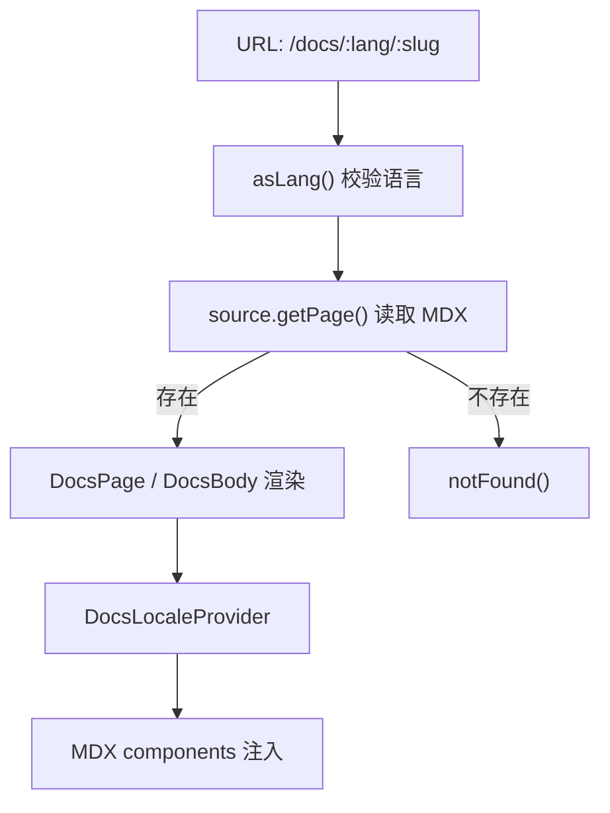

# Other — apps-docs

## 模块定位

`apps/docs` 是 Multica 的独立文档站应用，基于 Next.js App Router 和 Fumadocs 构建。它负责渲染多语言 MDX 文档、生成静态页面、提供站内搜索、输出 sitemap，并维护文档站独立于产品主应用的视觉系统。

这个模块和主产品应用共享一部分基础设施：`@multica/ui` 提供按钮、下拉菜单、样式工具和设计 token；`packages/ui/styles/tokens.css` 被 `app/global.css` 引入。但文档站自己的版式、字体、Fumadocs slot 映射、侧栏和正文样式都在 `apps/docs` 内部定义。

## 请求入口

文档站的主要页面入口在两个动态路由下：

- `app/[lang]/page.tsx`：语言首页，例如 `/docs`、`/docs/zh`
- `app/[lang]/[...slug]/page.tsx`：具体文档页，例如 `/docs/agents`、`/docs/zh/agents`

两个页面都使用相同的核心模式：

```tsx
const lang = asLang(params.lang);
const page = source.getPage(params.slug, lang);
if (!page) notFound();

const MDX = page.data.body;
```

`asLang()` 会把 URL 中的 `lang` 校验到 `i18n.languages` 内；不合法时回退到 `i18n.defaultLanguage`。页面内容由 `source.getPage()` 从 Fumadocs source 中读取。找不到页面时调用 Next.js 的 `notFound()`，最终落到 `app/[lang]/not-found.tsx`。

首页 `Page()` 会额外渲染 `DocsHero` 和 `Byline`，并把 `NumberedCards`、`NumberedCard`、`NumberedSteps`、`Step` 注入 MDX 组件表。普通文档页只渲染 `DocsTitle`、`DocsDescription` 和正文 MDX。



## 布局与全局框架

`app/[lang]/layout.tsx` 是文档站的根布局。它完成四件事：

1. 加载全局 CSS：`app/global.css`
2. 配置字体变量：`Inter`、`Geist_Mono`、`Source_Serif_4`
3. 初始化 Fumadocs 的 `RootProvider`
4. 用 `DocsLayout` 包裹所有文档页面

`RootProvider` 接收：

```tsx
i18n={{
  locale: lang,
  locales,
  translations: uiTranslations[lang],
}}
search={{ options: { api: "/docs/api/search" } }}
```

这说明 Fumadocs 的界面语言来自 `uiTranslations`，语言列表来自 `localeLabels` 和 `i18n.languages`，搜索 API 固定指向 `/docs/api/search`。

`DocsLayout` 使用 `source.getPageTree(lang)` 生成当前语言的侧栏树，并把 `DocsSettings` 挂载到侧栏 footer。默认的 Fumadocs 主题切换、搜索按钮和语言图标被关闭：

```tsx
themeSwitch={{ enabled: false }}
searchToggle={{ enabled: false }}
sidebar={{ footer: <DocsSettings locale={lang} /> }}
```

顶部导航和外部链接配置在 `app/layout.config.tsx`。`baseOptions` 定义文档站标题、GitHub 链接和 Multica 官网链接。`MulticaMark()` 是一个服务端安全的本地品牌标识实现，避免从 `@multica/ui` 引入带状态的图标组件。

## 多语言与链接处理

MDX 中的普通 `<a>` 会被替换成 `LocaleLink`：

```tsx
<MDX components={{ ...defaultMdxComponents, a: LocaleLink, VideoEmbed }} />
```

`DocsLocaleProvider` 在页面入口处写入当前语言，`useDocsLocale()` 在子组件中读取这个值。`LocaleLink()` 调用 `prefixLocale(href, lang)`，把站内链接自动补成当前语言对应的路径，再交给 `next/link` 做客户端导航。

同样的语言上下文也被 `NumberedCard()` 使用。它先通过 `useDocsLocale()` 读取语言，再用 `prefixLocale(href, lang)` 生成本地化链接。因此 MDX 作者可以写稳定的逻辑路径，不需要在每个语言文件里手工维护 `/zh/...`、`/ja/...` 前缀。

语言切换在 `DocsSettings` 中实现。`switchLocalePath(pathname, target)` 会识别当前路径是否已有非默认语言前缀，然后按目标语言重建路径。由于 Next.js router 中的 `pathname` 不包含 `basePath`，组件内部只在必要时剥离 `BASE_PATH = "/docs"`。

## 静态生成与元数据

`app/[lang]/layout.tsx`、`app/[lang]/page.tsx` 和 `app/[lang]/[...slug]/page.tsx` 都定义了 `generateStaticParams()`。

首页不能只依赖 layout 的静态参数。`app/[lang]/page.tsx` 中的注释明确说明：layout 的 `generateStaticParams` 不会自动级联到页面，所以首页自己返回 `i18n.languages.map((lang) => ({ lang }))`，避免 `/docs/` 和 `/docs/zh` 变成动态渲染。

普通文档页使用：

```tsx
export function generateStaticParams() {
  return docsSlugStaticParams(source.generateParams());
}
```

`docsSlugStaticParams()` 来自 `lib/static-params.ts`，调用图显示它内部会使用 `isLang()`、`addParam()` 和 `paramKey()` 去整理 Fumadocs 生成的参数。

两个页面的 `generateMetadata()` 都读取同一个 `page.data.title` 和 `page.data.description`，并通过 `docsAlternates()` 生成多语言 alternate。`docsAlternates()` 会调用 `hasLocalizedMdx()` 和 `absoluteDocsUrl()`，用于避免给不存在的本地化页面生成错误的 hreflang。

## 搜索 API

`app/api/search/route.ts` 使用 Fumadocs 的：

```tsx
createFromSource(source, { localeMap })
```

并导出 `GET` handler。英文和韩文使用 Fumadocs/Orama 的英文 tokenizer；中文和日文做了自定义 tokenizer。

`tokenizeCJK(raw)` 的策略是：

- 汉字逐字切分
- 拉丁字母和数字连续保留
- 全部先转小写

`tokenizeJapanese(raw)` 扩展了这个策略，额外覆盖 Hiragana、Katakana 和 `々`。这样日文文档不会因为英文 tokenizer 丢掉假名，也不会只保留 Kanji。

这个实现的目标是可用的召回率，而不是复杂的自然语言分词。对于文档站搜索来说，逐字 token 能覆盖中文、日文关键词，同时保留 `CLI`、产品名、命令名这类拉丁词。

## 视觉系统与样式

`app/global.css` 是文档站视觉系统的核心。它做了几层覆盖：

- 引入 Tailwind、Fumadocs preset 和 Multica UI token
- 定义 `--font-sans` 的 CJK fallback 顺序
- 为日文页面用 `html[lang|="ja"]` 提升日文字体优先级
- 覆盖文档站专属的 light/dark 颜色 token
- 把 Fumadocs 的 `--color-fd-*` slot 映射到 Multica token
- 定制正文、标题、链接、callout、卡片、侧栏、顶部导航、TOC 和代码块

字体顺序是这个模块的关键细节。默认栈中中文字体排在韩文字体前，避免中文用户看到 Korean Hanja 字形。日文因为 Kanji 和中文共享 Han Unicode block，所以只在 `html[lang|="ja"]` 下启用日文字体优先栈。

对应的回归测试在 `app/font-fallback-order.test.ts`：

- `expectChineseFontsBeforeKoreanFonts()` 检查中文 fallback 位于韩文 fallback 之前
- `expectJapaneseScopedOverride()` 检查存在 `html[lang|="ja"]`，并且日文字体早于中文字体出现

## MDX 专用组件

`components/editorial.tsx` 提供首页和重点页面使用的编辑化组件：

- `Byline`：带上下分割线的元信息条
- `NumberedCards`：三列编号卡片容器
- `NumberedCard`：带 `No. xx`、标题、说明、tag 的链接卡片
- `NumberedSteps`：步骤列表容器
- `Step`：单个步骤项

这些组件都是 `not-prose`，主动脱离 Fumadocs prose 样式，保证展示型页面有稳定版式。

`components/hero.tsx` 提供：

- `DocsHero`：首页 showpiece 标题区
- `DocsFeatureGrid` / `DocsFeatureCard`：旧卡片网格的兼容组件，注释中明确建议新页面优先使用 `NumberedCards`

`components/architecture-diagram.tsx` 是手写的架构图组件。`ArchitectureDiagram()` 在桌面端渲染左右不对称的 `YourSide`、`Connector`、`MulticaSide` 三段布局，在移动端改成纵向堆叠。它不使用 SVG 箭头，而是用边界和布局表达“你的机器”和“Multica 服务端”的职责分界。

## 交互组件

`DocsSettings` 是侧栏 footer 的客户端组件，替代 Fumadocs 默认的图标按钮行。它包含两个下拉菜单：

- 语言切换：显示当前语言名称，点击后通过 `router.push()` 跳转到目标语言路径
- 主题切换：使用 `next-themes` 的 `theme` 和 `setTheme`

组件用 `mounted` 状态延迟读取 theme，避免服务端渲染和客户端主题状态不一致导致 hydration 问题。

`VideoEmbed` 是点击后加载的第三方视频组件。它支持 `bilibili` 和 `youtube` 两个 provider 配置，但当前注释说明 YouTube 主要是预留。组件先用 `isValidId()` 校验视频 ID；无效时返回中文提示，不渲染坏 iframe。有效时先显示轻量 facade，用户点击后才挂载 iframe。

`Mermaid` 是客户端 Mermaid 渲染器。它通过动态 `import("mermaid")` 避免所有页面都加载 Mermaid 包。主题变量从 `getComputedStyle(document.documentElement)` 读取，并通过 1x1 canvas 把 `oklch()` 等现代 CSS 颜色转换成 Mermaid 能识别的 `rgb(...)`。当 `resolvedTheme` 变化时，组件会重新渲染图表。

## SEO 与 sitemap

`app/sitemap.ts` 动态读取 `source.getLanguages()`，按 canonical slug 聚合不同语言版本。每个逻辑页面只输出一个 sitemap entry，并在 `alternates.languages` 中声明所有可用语言。

canonical URL 优先使用 `i18n.defaultLanguage` 对应页面；如果默认语言版本不存在，则使用第一个可用语言版本。所有 URL 都通过 `absoluteDocsUrl()` 转为绝对地址，并额外写入 `x-default`。

## 内容组织

文档内容位于 `content/docs`，每个页面用 MDX frontmatter 提供：

```mdx
---
title: ...
description: ...
---
```

多语言文件通过文件名区分，例如：

- `agents.mdx`
- `agents.zh.mdx`
- `agents.ja.mdx`
- `agents.ko.mdx`

页面中可以直接导入 Fumadocs 组件和本模块组件，例如：

```mdx
import { Callout } from "fumadocs-ui/components/callout";
import { Mermaid } from "@/components/mermaid";
```

由于页面渲染时会注入 `LocaleLink`，MDX 内部链接应优先写逻辑路径，例如 `/agents`、`/providers`，让运行时根据当前语言自动补前缀。

## 与代码库其他部分的连接

`apps/docs` 主要依赖以下内部模块：

- `@multica/ui/components/ui/button` 和 `dropdown-menu`：用于 `DocsSettings`
- `@multica/ui/lib/utils`：`cn()` 用于 className 合并
- `packages/ui/styles/tokens.css`：作为文档站 token 的基础
- `lib/source`：Fumadocs 内容源，提供 `getPage()`、`getPageTree()`、`generateParams()`、`getLanguages()`
- `lib/i18n`：语言列表和默认语言
- `lib/translations`：Fumadocs UI 翻译、语言名称、首页文案
- `lib/site`：`docsAlternates()`、`absoluteDocsUrl()` 等 SEO URL 工具
- `lib/locale-link`：`prefixLocale()` 负责站内链接本地化

模块边界上，`apps/docs` 可以使用 Next.js API、Fumadocs 和客户端浏览器能力；这些能力没有向 `packages/core` 或 `packages/ui` 下沉。文档站的业务逻辑主要围绕内容渲染、语言路由、搜索和展示组件展开，不参与产品应用的工作区、issue、agent 状态管理。