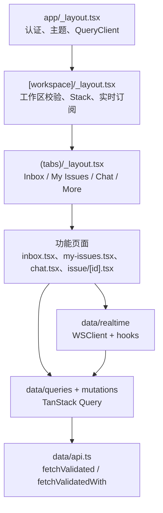

# Other — apps-mobile

## apps/mobile 移动端模块

`apps/mobile` 是 Multica 的 Expo + React Native iOS 客户端。它不是 Web/Desktop 的直接移植，而是一个独立移动端应用：路由、UI、数据缓存、实时订阅和本地状态都在移动端实现；与共享包的耦合被限制在 `@multica/core/types/*` 类型导入和少量纯函数导入。

移动端的核心目标是：在手机交互形态下保持与 Web/Desktop 相同的产品语义。列表计数、权限、状态枚举、数据身份、实时事件含义必须与 Web 保持一致；UI 容器和交互可以按 iOS 原生习惯调整。



## 模块边界

移动端可以从共享包导入：

- `import type` from `@multica/core/types/*`
- `@multica/core/` 中的纯函数，例如 `countUnreadChatMessages`、`deriveAgentPresenceDetail`、`buildPresenceMap`、`preprocessMentionShortcodes`

移动端不复用 Web 的运行时代码，例如不能直接导入 `packages/core/issues/ws-updaters.ts`。即使逻辑相似，也应在 `apps/mobile/data/realtime/*` 中复制设计并适配移动端缓存形状，避免被 Web 的 key factory 或更复杂缓存结构绑定。

## Expo 配置与构建变体

`app.config.ts` 是动态 Expo 配置入口，用 `APP_ENV` 切换应用名称、bundle id 和构建环境：

- `APP_ENV` 未设置时视为 `development`，应用名为 `Multica (Dev)`，默认 bundle id 为 `ai.multica.mobile.dev`
- `APP_ENV=staging` 时应用名为 `Multica (Staging)`，bundle id 为 `ai.multica.mobile.staging`
- `APP_ENV=production` 时应用名为 `Multica`，默认 bundle id 为 `ai.multica.mobile`

生产和开发变体支持通过 `EXPO_BUNDLE_IDENTIFIER_PROD`、`EXPO_BUNDLE_IDENTIFIER_DEV` 覆盖 bundle id，主要用于个人 Apple ID 签名。配置中已启用 `expo-router`、`expo-secure-store`、`@react-native-community/datetimepicker`、`react-native-enriched-markdown`、`expo-image-picker` 和 `expo-build-properties`。`expo-image-picker` 只声明照片库读取权限，明确禁用 camera 和 microphone。

常用脚本记录在 `apps/mobile/README.md`：

- `pnpm dev:mobile`：只启动 Metro，使用本地后端配置
- `pnpm dev:mobile:staging`：只启动 Metro，使用 staging
- `pnpm ios:mobile:device:staging`：构建并安装 iPhone Debug 版
- `pnpm ios:mobile:device:staging:release`：构建并安装 iPhone Release 版
- `pnpm ios:mobile:device:prod:release`：面向实际使用的生产后端 Release 版

## 路由结构

移动端使用 Expo Router 文件路由。工作区 slug 是路由层面的事实来源，`useWorkspaceStore` 只镜像当前 workspace id 和 slug，供 API header、实时连接和跨页面逻辑同步使用。

`app/(app)/[workspace]/_layout.tsx` 是工作区上下文布局，主要职责包括：

- 通过 `useLocalSearchParams` 读取 `workspace` slug
- 通过 `workspaceListOptions()` 查询用户可访问 workspace
- 找到匹配 workspace 后调用 `setCurrentWorkspace(matched.id, matched.slug)`
- 未匹配时重定向到 `/select-workspace`
- 挂载 `RealtimeProvider` 和 `RealtimeSubscriptions`
- 注册所有 workspace 内 Stack 页面和 formSheet 页面
- 在 workspace 切换时重置跨路由草稿状态：`useNewIssueDraftResetOnWorkspaceChange`、`useNewProjectDraftResetOnWorkspaceChange`、`useChatSessionPickerResetOnWorkspaceChange`

`unstable_settings = { anchor: "(tabs)" }` 用于冷启动深链。若用户从通知直接打开 `issue/[id]/picker/status` 这类 formSheet，Router 会自动把 `(tabs)` 作为底层页面，避免用户落在没有返回目标的 sheet 上。

## Stack 与 formSheet

`SHEET_OPTIONS` 是工作区内所有 iOS sheet 路由的共享配置：

```ts
const SHEET_OPTIONS = {
  presentation: "formSheet",
  sheetGrabberVisible: true,
  sheetAllowedDetents: [0.6, 0.95],
  sheetCornerRadius: 20,
  contentStyle: { flex: 1 },
  headerShown: false,
};
```

这个配置用于 issue picker、project picker、filter、chat sessions、workspace switcher 等页面。`sheetAllowedDetents: [0.6, 0.95]` 是为了绕开 iOS 26 + Expo 55 上 `"fitToContents"` 的尺寸和 padding 问题。少量孤立菜单可以覆盖为 `"fitToContents"`，但同一属性行中的 picker 应保持一致的 formSheet 交互。

已注册的主要路由包括：

- `(tabs)`：底部标签页
- `issue/[id]`：Issue 详情页
- `project/[id]`：Project 详情页
- `issue/[id]/edit`、`project/[id]/edit`：全屏 modal 编辑页
- `issue/[id]/picker/status|priority|assignee|label|project|due-date`
- `new-issue-picker/status|priority|assignee|project|due-date`
- `project/[id]/picker/status|priority|lead`
- `issues-filter`
- `chat-sessions`
- `switch-workspace`
- `more/issues|projects|agents|pins|settings`
- `new-issue`
- `search`

## 底部标签页

`app/(app)/[workspace]/(tabs)/_layout.tsx` 定义 `TabsLayout`，使用 Expo Router 的 JS `<Tabs>`，而不是 NativeTabs。原因是 “More” tab 需要拦截 `tabPress` 并打开菜单；JS Tabs 支持 `listeners.tabPress + e.preventDefault()`。

`TabsLayout` 中的关键逻辑：

- 用 `useColorScheme()` 和 `THEME` 设置 active/inactive tint
- 用 `useInboxUnreadCount(wsId)` 计算 Inbox badge
- 用 `useChatUnreadMessageCount(wsId)` 计算 Chat badge
- badge 超过 99 时显示 `"99+"`
- `More` tab 不导航，通过 `moreTriggerRef.current?.open()` 打开 `MoreTabDropdownAnchor`
- `(tabs)/more.tsx` 只是 expo-router 需要的 stub route，真实交互不会渲染它；异常进入时用 `Redirect` 回到 inbox

## 主要页面

### Inbox

`app/(app)/[workspace]/(tabs)/inbox.tsx` 渲染移动端 Inbox 列表。

关键数据流：

- `useQuery(inboxListOptions(wsId))` 读取原始 inbox 数据
- 用 `deduplicateInboxItems(rawItems ?? [])` 做展示前处理
- `SwipeableInboxRow` 渲染每一行
- 点击未读行时调用 `useMarkInboxRead().mutate(item.id)`
- 若 `item.issue_id` 存在，则 `router.push` 到 `"/[workspace]/issue/[id]"`，并传入 `highlight` 和 `h` 参数定位评论

`deduplicateInboxItems` 是重要的 Web 语义镜像：后端 `GET /api/inbox` 返回原始行，可能包含 archived item，也可能同一个 issue 有多条通知。移动端必须先过滤 archived，再按 `issue_id` 去重保留最新项，否则未读计数会与 Web 不一致。

Inbox 的批量菜单使用 `ActionSheetIOS.showActionSheetWithOptions`：

- `Mark all read`
- `Archive all read`
- `Archive completed`
- `Archive all`

`Archive all` 是破坏性动作，会再通过 `Alert.alert` 二次确认。

### My Issues

`app/(app)/[workspace]/(tabs)/my-issues.tsx` 渲染 “My Issues” 标签页，语义镜像 Web 的 `packages/views/my-issues/components/my-issues-page.tsx`。

核心状态来自 `useMyIssuesViewStore`：

- `scope`
- `statusFilters`
- `priorityFilters`

三个 scope 定义为：

```ts
const SCOPES = [
  { value: "assigned", label: "Assigned" },
  { value: "created", label: "Created" },
  { value: "agents", label: "Agents" },
];
```

移动端把完整语义 “Agents and Squads” 缩短成 “Agents”，是为了适配窄屏 pill 宽度；后端谓词仍由 `buildMyIssuesFilter(scope, userId)` 决定。

数据处理流程：

- 根据 `scope` 和 `userId` 生成 filter
- 调用 `myIssueListOptions(wsId, scope, filter)`
- 用 `filterIssues(data ?? [], statusFilters, priorityFilters)` 应用客户端筛选
- 按 `BOARD_STATUSES` 顺序分组为 `SectionList`
- 空 status section 被过滤，不显示空标题

`SectionHeader` 使用 `StatusIcon` 和 `STATUS_LABEL` 渲染状态标题，保持与 issue 状态系统一致。

### Chat

`app/(app)/[workspace]/(tabs)/chat.tsx` 是单屏聊天信息架构，不使用 `/chat/[id]` 子路由。会话切换、agent 选择、删除会话都在同一屏完成，其中会话选择通过 `chat-sessions` formSheet 路由和 `useChatSessionPickerStore` 桥接。

主要本地状态：

- `activeSessionId`：当前会话，`null` 表示新聊天
- `selectedAgentId`：新聊天时手动选择的 agent
- `agentPickerOpen`：agent picker modal 可见性

主要查询：

- `chatSessionsOptions(wsId)`
- `agentListOptions(wsId)`
- `memberListOptions(wsId)`
- `chatMessagesOptions(activeSessionId)`
- `pendingChatTaskOptions(activeSessionId)`
- `taskMessagesOptions(pendingTask?.task_id)`

`ChatTab` 首次进入某个 workspace 时会自动选中最近 session。这是移动端有意偏离 Web 的地方：Web 可以从空状态开始，手机上选择会话路径更长，因此移动端优化为直接进入最近会话。

发送消息由 `handleSend` 完成，流程镜像 Web 的 `chat-window.tsx`：

1. `ensureSession(content)` 确保 session 存在，并用 `sessionPromiseRef` 去重并发首条消息发送
2. 向 `chatKeys.messages(sessionId)` 写入 optimistic user message
3. 向 `chatKeys.pendingTask(sessionId)` 写入 optimistic pending task
4. 新会话时调用 `promoteNewDraft(sessionId)` 并切换 `activeSessionId`
5. 调用 `api.sendChatMessage(sessionId, content, { attachmentIds })`
6. 用服务端返回的 `task_id` 和 `created_at` 修正 pending task
7. invalidate messages 并清理 draft
8. 失败时移除 optimistic message，清空 pending task

`useChatSessionRealtime(activeSessionId, onDeleted)` 只订阅当前会话相关事件。Chat tab 失焦时通过 `useFocusEffect` 清理 `useChatSelectStore`，因为底部 tab 页面在切换时不会卸载。

### Chat Sessions Sheet

`app/(app)/[workspace]/chat-sessions.tsx` 是会话切换 sheet。它从 `chatSessionsOptions(wsId)` 读取缓存中的 session 列表，用 `useChatSessionPickerStore` 暴露当前选中项和一次性选择请求。

交互特点：

- 点击 session：`requestSelect(session.id)` 后 `router.back()`
- 长按 session：用 `Alert.alert` 确认删除
- 删除当前 active session 时调用 `requestSelect(null)`，让 Chat tab 清空本地 `activeSessionId`

这个小 store 的存在是因为 Chat tab 的 active session 本来是局部 `useState`，而 session picker 被拆到独立 route 后需要一个跨屏通道。

### Issue Detail

`app/(app)/[workspace]/issue/[id].tsx` 是 Issue 详情页。它是读多写少的 timeline 页面，底部固定 `InlineCommentComposer`。

关键行为：

- 从路由读取 `id`、`workspace`、`highlight`、`h`
- `highlight` 和 `h` 来自 Inbox 深链，用于滚动并闪烁目标评论
- `issueDetailOptions(wsId, id)` 读取 issue detail
- `issueTimelineOptions(wsId, id)` 读取 timeline
- `useIssueRealtime(id, () => router.back())` 订阅当前 issue 的实时事件
- 如果其他客户端删除当前 issue，回调执行 `router.back()`
- 进入页面时把 issue id 写入 `useViewedIssuesStore`，供 Chat composer 的 `@` 建议栏显示 “Recent”
- 卸载时清理 `useCommentSelectStore` 和 `useReplyTargetStore`

三点菜单使用 `ActionSheetIOS`，包含 Pin/Unpin、Edit details、Copy link、Open on web、Delete issue 等动作；破坏性删除通过 `Alert.alert` 二次确认。

## 数据层模式

移动端数据层由 TanStack Query 管理服务端状态，由 Zustand 管理客户端视图状态。

查询 key 使用 feature-local factory。以 inbox 为例：

```ts
export const inboxKeys = {
  all: (wsId: string | null) => ["inbox", wsId] as const,
  list: (wsId: string | null) => [...inboxKeys.all(wsId), "list"] as const,
};
```

这种三段式 key 形状与 Web 保持一致，方便 prefix invalidation，也避免裸字符串 key 扩散。

API 方法应使用 `ApiClient` 的封装：

- `this.fetchValidated(path, schema, fallback, opts?)`：GET 且返回值会被 UI 消费
- `this.fetchValidatedWith(path, schema, fallback, init, opts?)`：PATCH/PUT/POST 且响应会被消费
- `this.fetch<T>(path, init?)`：仅限响应不进入渲染路径的写操作

读查询必须把 TanStack Query 提供的 `signal` 传下去：

```ts
queryFn: ({ signal }) => api.listInbox({ signal })
```

这和 `data/api.ts` 内部的硬超时配套，防止 iOS 后台挂起网络请求后让 query 永远停在 fetching 状态。

## 实时订阅

移动端实时系统分三层：

1. `ws-client.ts`：无 React 的单 socket 客户端，负责重连、暂停、恢复
2. `realtime-provider.tsx`：根据 auth、workspace、AppState、NetInfo 管理 WSClient 生命周期
3. `use-<feature>-realtime.ts`：功能级订阅，把 WS payload 转成 TanStack Query cache patch

`RealtimeSubscriptions` 在 `[workspace]/_layout.tsx` 中挂载 workspace 级订阅：

- `useInboxRealtime()`
- `useIssuesRealtime()`
- `useMyIssuesRealtime()`
- `useChatSessionsRealtime()`
- `useProjectsRealtime()`
- `usePinsRealtime()`
- `useWorkspacePresencePrefetch()`
- `usePresenceRealtime()`

按层级区分订阅范围：

- 列表级订阅挂在 `RealtimeSubscriptions`，整个 workspace session 内常驻，例如 inbox unread、my issues
- 记录级订阅挂在拥有该记录的 screen 内，例如 `useIssueRealtime(id, ...)`、`useChatSessionRealtime(activeSessionId, ...)`

实时更新优先 patch cache。只有 payload 信息不足、缓存形状无法可靠判断成员关系、事件稀少或 reconnect 后才 invalidate。这个策略是移动端专门为蜂窝网络成本设计的。

## UI 与主题

移动端使用 NativeWind + Tailwind 3.4，颜色源是 `global.css` 的 CSS variables。React Navigation 主题通过 `lib/theme.ts` 中的 `NAV_THEME` 另行同步。修改 CSS 变量时必须同步更新 `lib/theme.ts`。

主题偏好存储在 `expo-secure-store`，key 为 `theme-preference`，取值为：

- `light`
- `dark`
- `system`

UI 组件选择遵循固定优先级：

1. iOS / React Native 原生 API
2. RNR 组件默认样式
3. 没有合适组件时再讨论或局部组合

实际代码中可以看到这些模式：

- 确认和删除：`Alert.alert`
- 短菜单：`ActionSheetIOS.showActionSheetWithOptions`
- 底部标签图标：`expo-image` 加 SF Symbols，例如 `"sf:tray.fill"`
- 页面标题和右侧动作：`Header`、`IconButton`、`HeaderActions`
- 列表骨架：`Skeleton`
- 状态、优先级、头像：`StatusIcon`、`PriorityIcon`、`ActorAvatar`

通用 UI primitive 放在 `components/ui/`；业务组件放在 `components/<domain>/`。例如 `SwipeableInboxRow` 属于 inbox domain，`IssueRow` 属于 issue domain，`ProjectRow` 属于 project domain。

## 与共享代码的连接

调用图中能看到移动端和共享包的几个明确连接点：

- `useAgentPresence` 调用 `deriveAgentPresenceDetail`
- `byAgent` 调用 `buildPresenceMap`
- unread count 的 `select` 调用 `countUnreadChatMessages`
- `preprocessMobileMarkdown` 调用 `preprocessMentionShortcodes`
- `standaloneAttachments` 调用 `contentReferencesAttachment`
- `shortDate` 调用 `formatDateOnly`

这些都是合理的共享方式：移动端复用纯计算逻辑或类型定义，但不复用 Web 的 React hooks、query factories、ws updaters 或 UI 组件。

## 贡献时的检查点

新增移动端功能前，应先阅读对应 Web/Desktop 实现，找出必须一致的点：列表计数、枚举、权限、缓存副作用、乐观更新、实时事件覆盖和展示前预处理。特别是任何列表接口，都要检查 Web 是否有 `dedupe*`、`coalesce*`、`filter*`、`*-display.ts` 或 `useMemo(() => transform(raw))` 之类逻辑。

新增代码时保持这些约束：

- 新 read API 方法使用 `fetchValidated` 或 `fetchValidatedWith`
- 新 query 的 `queryFn` 必须转发 `{ signal }`
- 新 workspace-scoped feature 要有自己的 query key factory
- 新 realtime hook 使用 typed `ws.on<E>()` 和 `useWSSubscriptions`
- 有完整 payload 的 WS 事件优先 `setQueryData` patch
- 不从 Web 导入 `ws-updaters.ts`
- 新 UI 先找现有移动端模式，再用 iOS 原生或 RNR 默认组件
- 新 `apps/mobile/` 子目录创建后要检查 git ignore，避免被根 `.gitignore` 的 `data/`、`build/` 等规则吞掉

移动端模块的主要复杂度不在单个页面，而在“手机交互可以不同，但产品语义不能不同”。贡献时最重要的是先找到 Web 的真实数据处理路径，再在移动端用适合 iOS 的容器和组件表达同一套语义。