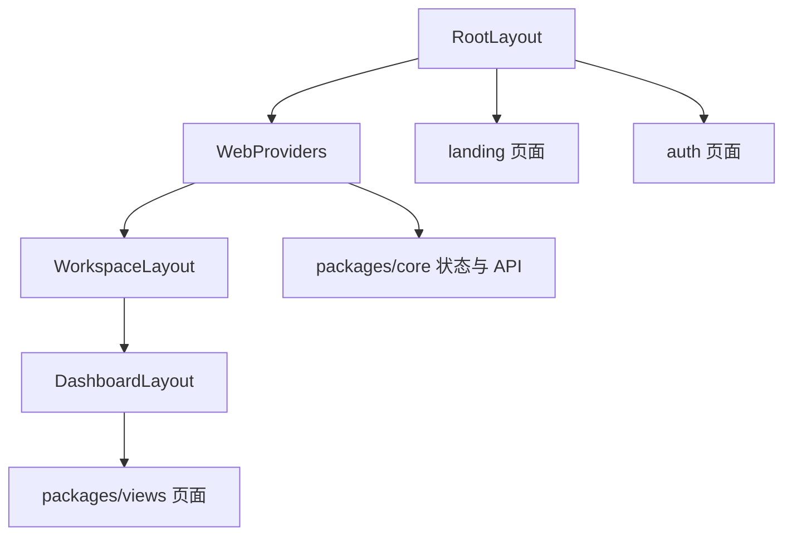

# Other — apps-web

## 模块概览

`apps/web` 是 Multica 的 Next.js App Router 外壳层，负责把 Web 平台能力接入共享业务包。它不承载主要业务页面实现，而是负责路由、认证跳转、工作区解析、SEO 元数据、平台 Provider、Cookie/URL/通知桥接等 Web 专属逻辑。

业务页面主要来自：

- `@multica/views`：共享页面和业务组件，例如 `IssuesPage`、`AgentsPage`、`LoginPage`、`OnboardingFlow`
- `@multica/core`：认证、路径、React Query 配置、API client、平台 singleton
- `@multica/ui`：基础 UI、`ErrorBoundary`、`Skeleton`、`Toaster`

## 整体结构

## 根布局与全局 Provider

`apps/web/app/layout.tsx` 定义 Web 应用根布局 `RootLayout`：

- 通过 `getRequestLocale()` 读取请求语言，并把 `RESOURCES[locale]` 注入 `WebProviders`
- 设置 `<html lang>`，语言映射由 `HTML_LANG` 控制：`en`、`zh-CN`、`ko-KR`、`ja-JP`
- 加载 `Inter`、`Geist_Mono`、`Source_Serif_4`，并把字体变量暴露给 CSS
- 包裹 `ThemeProvider`、`WebProviders`、`Toaster`
- 开发环境下，当 `VITE_REACT_GRAB` 存在时加载 `react-grab`

`apps/web/components/web-providers.tsx` 中的 `WebProviders` 是 Web 平台接入点。它创建 `CoreProvider`，传入：

- `apiBaseUrl={process.env.NEXT_PUBLIC_API_URL}`
- `wsUrl={deriveWsUrl()}`
- `cookieAuth={!hasLegacyToken()}`
- `onLogin={setLoggedInCookie}`
- `onLogout`：重置 `useWelcomeStore` 并调用 `clearLoggedInCookie()`
- `identity={ platform: "web", version: WEB_VERSION }`
- `localeAdapter=createBrowserCookieLocaleAdapter()`
- `WebNavigationProvider`

`deriveWsUrl()` 会优先使用 `NEXT_PUBLIC_WS_URL`，否则从当前页面 origin 派生 `/ws`，方便自托管和局域网部署。

## 字体与全局样式

`apps/web/app/globals.css` 组合 Tailwind、shadcn、共享 tokens 和 Web 专属样式：

- `@source` 扫描 `packages/ui`、`packages/core`、`packages/views`
- `--font-sans` 默认使用 Inter + 中文优先 CJK fallback
- `html[lang|="ja"]` 对日语启用日文字体优先，避免日文 Kanji 被中文字体渲染

`apps/web/app/font-fallback-order.test.ts` 防止 Web 和 Desktop 的 CJK fallback 顺序漂移。

`apps/web/app/custom.css` 主要处理 `.landing-light`。着陆页强制 light token，避免 `next-themes` 的 `.dark` 影响下载页、云端等待列表等共享组件。

## 认证路由

认证路由位于 `apps/web/app/(auth)`。

`LoginPageContent` 是登录页核心逻辑，包装共享的 `@multica/views/auth` `LoginPage`，并处理 Web 专属行为：

- 读取 `next`、`platform`、`cli_callback`、`cli_state`
- 使用 `sanitizeNextUrl()` 防止开放重定向
- 使用 `googleState` 把 `platform:desktop`、`next:`、`cli_callback:`、`cli_state:` 编入 Google OAuth state
- `handleSuccess()` 在邮箱验证码登录成功后决定跳转
- 已登录用户直接访问 `/login` 时，由 effect 处理到达页重定向

`resolveLoggedInDestination(qc, hasOnboarded, workspaces)` 是登录后默认落点解析：

- 未 onboarding 用户先调用 `api.listMyInvitations()`
- 如果有待处理邀请，写入 `workspaceKeys.myInvitations()` 并返回 `paths.invitations()`
- 否则委托 `resolvePostAuthDestination(workspaces, hasOnboarded)`

登录页有一个重要竞态保护：`settledLoggedOutRef` 区分“页面到达时已登录”和“当前表单刚登录”。这样 `verifyCode` 写入 `user` 后，不会由到达页 effect 抢先基于冷 Query cache 误跳到 `/workspaces/new`。

`apps/web/app/auth/callback/page.tsx` 的 `CallbackContent` 处理 Google OAuth 回调：

- 缺少 `code` 或存在 `error` 时渲染错误卡片
- `cli_callback` 合法时，调用 `api.googleLogin()` 并通过 `redirectToCliCallback()` 把 token 回传 CLI
- `platform:desktop` 时，调用 `api.googleLogin()` 后跳转 `multica://auth/callback?token=...`
- 普通 Web 登录时，调用 `loginWithGoogle()`，随后 `api.listWorkspaces()` 并写入 `workspaceKeys.list()`
- `nextUrl` 优先；未 onboarding 用户再查 `api.listMyInvitations()`；最后使用 `resolvePostAuthDestination()`

`/invite/[id]` 和 `/invitations` 都是受保护路由。未登录用户会被 `router.replace()` 到 `/login?next=...`，登录后再回到原目标。

`/onboarding` 由 `OnboardingPage` 包装共享 `OnboardingFlow`。它只在认证且未 onboarding 时渲染；完成时根据 `ws` 和 `issueId` 跳转到 guide issue、workspace issues 或 root。`completingRef` 防止 `refreshMe()` 更新 `onboarded_at` 后，页面 guard 和 `onComplete` 导航互相抢占。

## 工作区路由与 Dashboard

`apps/web/app/[workspaceSlug]/layout.tsx` 是所有工作区页面的入口 guard：

- 未认证时跳转 `paths.login()`
- `user.onboarded_at == null` 时跳转 `paths.onboarding()`
- 通过 `workspaceBySlugOptions(workspaceSlug)` 从工作区列表解析当前 workspace
- 渲染阶段调用 `setCurrentWorkspace(workspaceSlug, workspace.id)`，保证子查询发出前平台 singleton 已有正确 workspace header
- 写入 `last_workspace_slug` cookie，供代理或下次页面加载使用
- 通过 `useWorkspaceSeen()` 避免删除/离开工作区时短暂闪现 `NoAccessPage`
- 成功解析后提供 `WorkspaceSlugProvider`

`apps/web/app/[workspaceSlug]/(dashboard)/layout.tsx` 将共享 `DashboardLayout` 接入 Web 平台：

- `loadingIndicator={<MulticaIcon />}`
- `searchSlot={<SearchTrigger />}`
- `extra` 挂载 `SearchCommand`、`WebNotificationBridge`、`FloatingChat`

Dashboard 下大多数页面只是薄路由包装，直接返回共享视图：

- `IssuesPage`、`IssueDetail`
- `AgentsPage`、`AgentDetailPage`、`AgentCreationStudio`
- `ProjectsPage`、`ProjectDetail`
- `RuntimesPage`、`RuntimeDetailPage`、`RuntimeSettingsPage`
- `SettingsPage`、`InboxPage`、`ChatPage`
- `SkillsPage`、`SkillDetailPage`
- `SquadsPage`、`SquadDetailPage`
- `DashboardPage`

动态参数页使用 Next.js 15 的 `params: Promise<...>` 模式，并在 client component 中通过 React `use(params)` 取值。

`apps/web/app/[workspaceSlug]/attachments/[id]/preview/page.tsx` 故意放在 `(dashboard)` 外，避免左侧栏和顶部 chrome 占用空间。它仍位于 `[workspaceSlug]` 下，因此可以复用工作区解析和 `useWorkspaceId()`。

## Web 通知桥接

`WebNotificationBridge` 把浏览器通知点击事件接到共享导航系统：

- 调用 `registerSystemNotificationClickHandler()`
- 使用通知 payload 中的 `slug`，而不是当前 active workspace
- 目标路径为 `paths.workspace(slug).inbox() + "?issue=..."`
- 使用 `pushRef` 保持 handler 稳定，同时调用最新的 `useNavigation().push`

这保证用户切换工作区后，点击旧通知仍会打开通知来源工作区的 inbox。

## 着陆页与内容页

`apps/web/app/(landing)` 是公开营销和内容路由：

- `/` 和 `/homepage` 渲染 `MulticaLanding`
- `/about`、`/changelog`、`/contact-sales` 渲染对应 client 页面
- `/download` 服务端调用 `fetchLatestRelease()`，再把 release 传给 `DownloadClient`
- `/usecases` 和 `/usecases/[slug]` 从 MDX 内容源读取本地化 use case

`LandingLayout` 使用 `LocaleProvider` 和独立 serif 字体，并注入 Organization / SoftwareApplication JSON-LD。外层 `.landing-light` 保证着陆页始终使用 light token。

`DownloadClient` 在客户端调用 `detectOS()`，再把检测结果传给 `DownloadHero`。页面组成是：

- `LandingHeader`
- `DownloadHero`
- `AllPlatforms`
- `CliSection`
- `CloudSection`
- `VersionInfoFooter`
- `LandingFooter`

`UseCasePage` 自定义 MDX components。`createSmartParagraph(locale)` 会识别作者写在 MDX 段落里的特殊标记：

- `[占位图: ...]` 渲染 `PlaceholderImage`
- `[CTA: ...]` 和 `[Secondary CTA: ...]` 渲染 `MDXCTA`

内部链接由 `Link` 处理，外部链接保留原生 `<a>`。

## SEO、错误页和基础路由

- `robots()` 返回 `MetadataRoute.Robots`，允许公开页面，禁止 API、认证和应用内页面
- `sitemap()` 返回公开页面 sitemap
- `favicon.ico/route.ts` 308 重定向到 `/favicon.svg`
- `not-found.tsx` 渲染基础 404 页面
- `global-error.tsx` 是 Next.js 全局错误边界，会调用 `captureException(error, { source: "global-error", digest })`

## 平台配置工具

`apps/web/config/runtime-urls.ts` 提供 `resolveRemoteApiUrl(env)`，用于运行时配置 backend URL：

优先级为：

1. `REMOTE_API_URL`
2. `NEXT_PUBLIC_API_URL`
3. `BACKEND_PORT`
4. `API_PORT`
5. `SERVER_PORT`
6. `PORT`
7. 默认 `http://localhost:8080`

对应测试在 `runtime-urls.test.ts`，覆盖显式 URL、端口别名、空白值和默认值。

## 测试覆盖重点

当前 app 层测试集中在 Web 平台 wiring，而不是共享页面行为：

- `login/page.test.tsx` 测试登录表单、验证码、已登录到达页、Desktop handoff、`next` 和 post-login redirect 竞态
- `auth/callback/page.test.tsx` 测试 OAuth callback 的 normal web、CLI、Desktop、邀请、unsafe next、pending invitations 分支
- `font-fallback-order.test.ts` 防止 CJK 字体顺序回归
- `runtime-urls.test.ts` 覆盖运行时 URL 解析

共享组件行为应放在 `packages/views` 测试中；app 层测试只覆盖 Next.js search params、router、cookie、平台跳转等 Web 专属逻辑。

## 贡献注意事项

新增 Web 页面时，优先判断它是否是共享业务页面：

- 业务 UI 放在 `packages/views/<domain>/`
- Web 路由只做参数读取、guard、slot 注入和导航适配
- 共享页面不要 import `next/*`
- Web 专属能力放在 `apps/web` 或 `apps/web/platform`
- 需要工作区上下文的页面必须位于 `[workspaceSlug]` 下，并依赖 `WorkspaceLayout` 完成解析
- 新的公开着陆页需要补齐 `metadata`，必要时更新 `sitemap()` 和 `robots()`