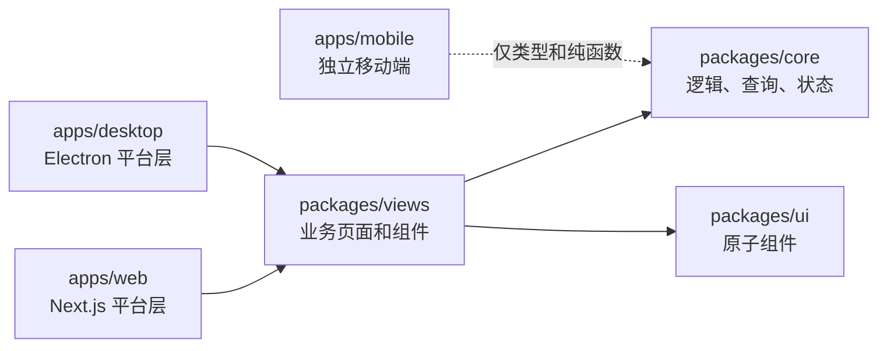

# Other — CLAUDE.md

## 模块定位

`CLAUDE.md` 是仓库级开发规则文档，不参与运行时调用，也没有函数、类或执行流。它的作用是为贡献者和代码代理提供硬约束：哪些目录承担什么职责、状态应该放在哪里、平台差异如何隔离、测试应该写到哪个包、以及修改 API 或桌面行为时必须遵守哪些兼容性规则。

该文件应保持短小且权威，只记录“从代码中不容易推断、但容易做错”的规则。更细的命名、术语、i18n 与中文产品文案规范由：

- `apps/docs/content/docs/developers/conventions.mdx`
- `apps/docs/content/docs/developers/conventions.zh.mdx`

维护。修改翻译、路由名、包名、文件名、数据库列、类型名或中文 UI/文档文案前，应先阅读这两个文档。

## 仓库结构

Multica 是一个 AI-native 任务管理平台，核心领域模型包括 workspace、issue、member、agent、inbox 等。agent 是一等 assignee，可以拥有 issue、评论并改变状态。

主要目录分工如下：

| 路径 | 职责 |
| --- | --- |
| `server/` | Go 后端，使用 Chi router、sqlc、gorilla/websocket |
| `apps/web/` | Next.js App Router Web 应用 |
| `apps/desktop/` | Electron 桌面应用 |
| `apps/mobile/` | Expo / React Native iOS 应用，修改前必须阅读 `apps/mobile/CLAUDE.md` |
| `packages/core/` | 无头业务逻辑、API client、React Query hooks、Zustand stores |
| `packages/ui/` | 原子 UI 组件，仅 shadcn/Base UI 等基础组件 |
| `packages/views/` | Web 与 Desktop 共享的业务页面和组件 |
| `packages/tsconfig/` | 共享 TypeScript 配置 |

共享包直接导出 `.ts` / `.tsx` 源码，由消费它们的 app 编译。依赖方向是：



`packages/core` 和 `packages/ui` 必须保持相互独立，`packages/views` 可以依赖二者。

## 状态管理规则

仓库将服务端状态和客户端状态严格分离：

- TanStack Query 拥有所有服务端状态，例如 issues、users、workspaces、inbox、agents、members，以及任何 API 返回的数据。
- Zustand 只拥有客户端或视图状态，例如 filters、drafts、modals、tab layout、navigation history。
- 当前 workspace identity 由路由驱动；平台 store 或 singleton 只能为了 headers、持久化 namespace、reconnect 等平台管线镜像 slug/id。
- 共享 Zustand store 只能放在 `packages/core/`，不能放在 `packages/views/` 或 app 目录。
- React Context 只用于平台管线，例如 `WorkspaceIdProvider` 和 `NavigationProvider`。

服务端交互也有明确归属：

- 只有 auth/workspace stores 可以直接调用 `api.*`。
- 其他服务端读写应通过 queries/mutations 完成。
- workspace-scoped query key 必须包含 `wsId`。
- 需要 workspace 上下文的 hook 应接受 `wsId` 参数；除非保证运行在 provider 内，否则不要在 hook 内部调用 `useWorkspaceId()`。

### 乐观更新

只有同时满足以下条件时才使用 optimistic update：

- 结果可以在本地确定预测。
- 用户仍停留在同一屏幕，不发生导航。
- 失败很少见。
- 回滚简单。

典型场景是 status、assignee、toggle field patch：先 patch 确定的缓存，失败时回滚，settle 时 invalidate 不确定的 projection。

create、delete、leave 等会导航或确认的流程必须等待服务端完成后再导航或清理缓存。不要乐观地从缓存中移除实体。

chat/message send 使用 pending-message pattern：发送后立即渲染带 pending 状态的消息，失败时可重试，而不是做不可见的静默乐观更新。

### WebSocket 与持久化

WebSocket event 可以 invalidate 或 patch Query cache 中的服务端数据，但不能把服务端 payload 镜像进 Zustand。只有在清理客户端拥有的指针时才允许写 store，例如 active session、selection、current workspace；并且当事件可能由当前客户端触发时，需要单一 responder 和 self-initiated guard。

持久化只用于 durable preferences、drafts、layout。不要持久化服务端数据或临时 UI 状态。

Zustand selector 必须返回稳定引用。不要在 selector 中直接返回新建 object/array，除非配合 shallow comparison。

## 包边界

`CLAUDE.md` 中的包边界是硬约束：

| 包或目录 | 禁止事项 | 推荐模式 |
| --- | --- | --- |
| `packages/core/` | `react-dom`、`localStorage`、`process.env`、UI libraries | 使用 `StorageAdapter`，保持无头逻辑 |
| `packages/ui/` | 导入 `@multica/core`、放业务逻辑 | 只放原子 UI 组件 |
| `packages/views/` | `next/*`、`react-router-dom`、stores | 使用 `NavigationAdapter`、`useNavigation()`、`<AppLink>` |
| `apps/web/platform/` | 非平台职责 | 仅放 Next.js navigation/platform APIs |
| `apps/desktop/src/renderer/src/platform/` | 非平台职责 | 仅放 `react-router-dom` wiring |

每个 `apps/` 和 `packages/` 下的 workspace 都必须在自己的 `package.json` 中声明直接导入的外部依赖。共享依赖使用 `pnpm-workspace.yaml` 里的 `catalog:`；`apps/mobile/` 的 Expo/React Native 相关版本直接固定。

## Web 与 Desktop 共享规则

Web 和 Desktop 应通过 `packages/core/`、`packages/ui/`、`packages/views/` 共享业务逻辑、hooks、stores、组件和视图。只要同一逻辑同时出现在 Web 和 Desktop 中，就应考虑抽取，除非它依赖平台 API。

新增共享页面或功能时：

1. 页面或组件放到 `packages/views/<domain>/`。
2. 在 `apps/web/app/` 和 Desktop router 中分别加平台 wiring，除非 Desktop 流程是 transition overlay。
3. 共享代码中使用 `useNavigation().push()` 或 `<AppLink>`。
4. 使用共享 guard/provider，例如 `packages/views/layout/` 中的 `DashboardGuard`。
5. 平台专属 UI 留在 app 层，或通过 props/slots 注入。
6. 需要 workspace context 的 hook 接收 `wsId`。

CSS 从 `packages/ui/styles/` 共享。应使用 `bg-background`、`text-muted-foreground` 等 semantic token，避免硬编码 Tailwind 颜色和重复 base style。

## Mobile 边界

`apps/mobile/` 是独立移动端。修改前必须阅读 `apps/mobile/CLAUDE.md`，其中包含移动端 mandatory pre-flight、导入限制、语义对齐、技术栈、UI 规则、数据 helper、realtime 策略和发布流程。

根文档只保留三条提醒：

- Mobile 只共享 `@multica/core` 的类型和纯函数；类型导入使用 `import type`。
- Mobile 必须匹配 Web/Desktop 的产品语义，例如 counts、permissions、enums/transitions、data identity。
- Mobile 可以在 UI 和交互上根据手机上下文做差异化。

## API 兼容性

前端必须能承受后端响应漂移，尤其是已安装的 Desktop 客户端可能连接更新版本的后端。

关键规则：

- API JSON 使用 `packages/core/api/schema.ts` 中的 `parseWithFallback` 和 zod schema 解析。
- 不要把网络 JSON 直接 cast 成 `T`。
- UI 会消费的 endpoint response 必须先经过 schema。
- 下游 UI 对字段使用 optional chaining 和默认值。
- 服务端 boolean 字段使用显式判断，例如 `field === true`，避免 truthy/falsy。
- 关键能力不要只绑定一个后端 boolean；尽量组合多个信号。
- server-driven enum switch 必须有 `default` 分支。
- 新增或修改 endpoint 时，要同步新增或更新 schema，并加入 malformed-response 测试。

## 后端 UUID 规则

在 `server/internal/handler/` 中，写查询使用 UUID 前必须清楚 UUID 来源。

常见模式：

- 路径参数可能是 UUID 或人类可读 ID 时，先通过 loader 解析，例如 `loadIssueForUser`、`loadSkillForUser`、`loadAgentForUser`、`requireDaemonRuntimeAccess`，后续写入使用解析出的 `entity.ID`。
- 请求边界传入的纯 UUID 使用 `parseUUIDOrBadRequest(w, s, fieldName)`；`ok=false` 时立即返回。
- sqlc 结果或测试 fixture 的可信 UUID round-trip 使用 `parseUUID(s)`，无效时 panic。
- handler 外部使用安全版本 `util.ParseUUID(s) (pgtype.UUID, error)`，并始终检查 error。

## Desktop 路由与平台规则

Desktop routing 分为三类：

| 类型 | 示例 | 规则 |
| --- | --- | --- |
| Session routes | `/:slug/issues` | workspace-scoped tab destination |
| Transition flows | 创建 workspace、接受 invite | 使用 `WindowOverlay` state，不放进 routes |
| Error/stale states | stale workspace tabs | 自动丢弃 stale tab groups，不渲染 Desktop error page |

更多约束：

- 新的 pre-workspace desktop flow 要在 `stores/window-overlay-store.ts` 注册 `WindowOverlay` type，不要加入 `routes.tsx`。
- `setCurrentWorkspace(slug, uuid)` 来自 `@multica/core/platform`，只用于镜像 active route，服务 headers、storage namespace 和 reconnect。
- workspace route layout 负责设置 current workspace。
- 离开 workspace context 的代码必须显式调用 `setCurrentWorkspace(null, null)`。
- workspace delete 必须等待服务端完成后再导航和清理。
- workspace leave 当前为了避免 `member:removed` realtime race，会先清理并导航再 mutation；这是已知技术债，不是可复用模式。
- 跨 workspace 导航必须走 navigation adapter，让它调用 `switchWorkspace(slug, targetPath)`。
- dashboard shell 外的全窗口 Desktop view 必须把 `<DragStrip />` 作为第一个 flex child。
- 顶部 48px 内的交互控件需要 `WebkitAppRegion: "no-drag"`。

## UI 规则

UI 开发优先使用 shadcn/Base UI 组件，通过仓库根目录执行：

```bash
pnpm ui:add badge
```

通用要求：

- 使用 design token 和 semantic class，避免硬编码颜色。
- 不引入不必要的额外 local state。
- 主动处理 overflow、长文本、滚动、对齐和间距。
- Web 与 Desktop 完全相同的组件应放入共享包。

## 测试放置规则

测试应跟随被测代码所在层级：

| 被测内容 | 测试位置 |
| --- | --- |
| 共享业务逻辑、stores、queries、hooks | `packages/core/*.test.ts` |
| 共享 UI 组件、页面、表单、modal | `packages/views/*.test.tsx` |
| cookies、redirects、search params 等平台 wiring | `apps/web/*.test.tsx` 或 `apps/desktop/` |
| 端到端流程 | `e2e/*.spec.ts` |
| 后端 | `server/` Go tests |

约束：

- 不要在 app test file 中测试共享组件行为。
- `packages/views/` 测试不能 mock `next/*` 或 `react-router-dom`。
- mock `@multica/core` store 时使用 Zustand callable-store 形状：`selectorFn` 加 `getState`。
- API 调用通过 mock `@multica/core/api`。
- E2E setup/teardown 优先使用 `TestApiClient`。
- 行为变更优先在正确包中先写失败测试，再实现。

## 常用命令

命令以仓库脚本为准，常用入口包括：

```bash
make dev              # 自动 setup 并启动应用
make start            # 启动后端和前端
make stop             # 停止当前 checkout 的应用进程
make server           # 只运行 Go server
make daemon           # 运行本地 daemon
make test             # Go 测试
make sqlc             # SQL 变更后重新生成 sqlc 代码
pnpm install
pnpm dev:web
pnpm dev:desktop
pnpm build
pnpm typecheck
pnpm lint
pnpm test             # 通过 Turborepo 运行 TS/Vitest 测试
pnpm exec playwright test
pnpm ui:add badge     # 添加 shadcn/Base UI 组件到 packages/ui
```

worktree 共享一个 PostgreSQL container，并通过 `.env.worktree` 隔离 DB name 和端口。`make dev` 会自动检测。手动设置时使用 `make worktree-env`、`make setup-worktree`、`make start-worktree`。

`pnpm dev:desktop` 会自动按 worktree 隔离 renderer port 和 app name，不依赖 `.env.worktree`。

CI 环境运行 Node 22、Go 1.26.1，以及 `pgvector/pgvector:pg17` PostgreSQL service。

## 编码与文档同步

通用编码规则：

- TypeScript 开启 strict mode，保持类型明确。
- Go 遵循标准惯例：`gofmt`、`go vet`、检查 error。
- 代码注释使用英文。
- 优先使用现有模式和组件，不创建平行抽象。
- 除非任务要求，不做大范围重构。
- 内部非边界代码不要添加兼容层、fallback path、dual write、legacy adapter 或临时 shim。
- API 边界例外：已安装 Desktop client 可能连接新后端，因此 response parsing 必须遵守 API 兼容性规则。
- 产品未上线且某流程/API 被替换时，优先删除旧路径，而不是保留两套。

路由和 reserved slug：

- 新的全局 pre-workspace route 必须是单词形式，例如 `/login`、`/inbox`，或 `/{noun}/{verb}`，例如 `/workspaces/new`。
- 不要新增 hyphenated root route，例如 `/new-workspace`。
- reserved slug 位于 `server/internal/handler/reserved_slugs.json`。
- 修改 reserved slug 后运行 `pnpm generate:reserved-slugs`，并提交生成的 `packages/core/paths/reserved-slugs.ts`。

内置 skill 文档同步：

- 修改 CLI commands/flags、API fields 或产品行为时，如果相关内容被 `server/internal/service/builtin_skills/*` 下的内置 skill 文档记录，需要在同一个 PR 更新对应 `SKILL.md` 和 `references/*-source-map.md`。

## 验证策略

代码变更应先运行最窄且有用的检查，风险升高或用户要求时再运行更广验证。

常用检查：

```bash
pnpm typecheck
pnpm test
make test
pnpm exec playwright test
make check
```

不要声称验证通过，除非实际运行过对应命令。若因为 docs-only 或用户要求跳过检查，应明确说明。

## 提交与发布

提交应保持原子性，并使用 conventional prefixes：

- `feat(scope)`
- `fix(scope)`
- `refactor(scope)`
- `docs`
- `test(scope)`
- `chore(scope)`

生产部署需要在 `main` 上创建 CLI release tag：创建 `v0.x.x`，push 后由 `release.yml` 发布 binaries 和 Homebrew tap。默认 bump patch，除非用户指定版本。

## 领域提醒

所有 query 都按 `workspace_id` 过滤，membership gate 控制访问，`X-Workspace-ID` 选择当前 workspace。

Issue assignee 是多态关系：`assignee_type` 加 `assignee_id` 可以指向 member 或 agent。

## GitNexus / Code Intelligence

仓库已由 GitNexus 索引为 `multica`。`CLAUDE.md` 把 GitNexus 作为理解和修改代码前的安全检查入口，而不是运行时依赖。

关键要求：

- 修改任何函数、类或方法前，先对目标 symbol 运行 upstream impact analysis，并向用户报告 direct callers、affected processes 和 risk level。
- 如果 impact analysis 返回 HIGH 或 CRITICAL，需要先警告用户再继续编辑。
- commit 前运行 `detect_changes()`，确认变更只影响预期 symbol 和 execution flows。
- 理解陌生代码时优先用 `query({search_query: "concept"})` 查 execution flows。
- 需要某个 symbol 的完整上下文时使用 `context({name: "symbolName"})`。
- 安全审查时使用 `explain({target: "fileOrSymbol"})` 查看 taint findings。

由于 `CLAUDE.md` 本身是文档文件，调用图和执行流为空；它通过开发流程和代码审查规则影响整个仓库，而不是通过 import 或 runtime call 被执行。