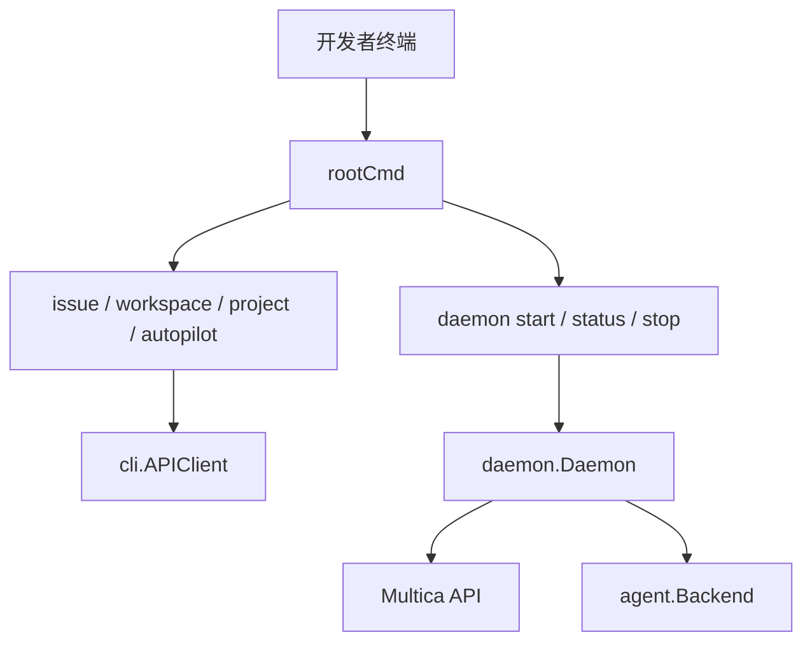
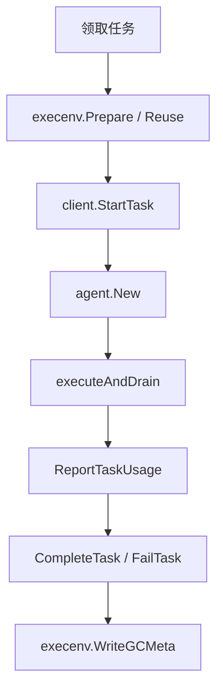

# Other — CLI_AND_DAEMON.md

## CLI 与本地 Agent Daemon

`CLI_AND_DAEMON.md` 说明的是 `multica` 命令行和本地 agent daemon 的用户可见行为。文档文件本身没有可执行符号；对应实现主要分布在 `server/cmd/multica/`、`server/internal/cli/`、`server/internal/daemon/` 和 `server/pkg/agent/`。

### 模块职责

`multica` CLI 是本机与 Multica 服务端之间的控制入口，负责登录、配置、workspace 选择、issue/project/autopilot 管理，以及启动本地 daemon。daemon 是实际执行 agent task 的常驻进程：它发现本机可用的 agent CLI，向服务端注册 runtime，领取任务，在隔离工作目录中启动对应 agent，并把进度、消息、用量和最终结果回传服务端。

### CLI 入口与命令注册

CLI 二进制入口在 `server/cmd/multica/main.go`：

- `rootCmd` 是 Cobra 根命令，声明全局 `--server-url`、`--workspace-id`、`--profile`、`--debug`。
- `init()` 设置版本模板、写入 `cli.ClientVersion`，并把各子命令挂到 `rootCmd`。
- `main()` 先调用 `cli.CleanupStaleUpdateArtifacts()`，再执行 `rootCmd.Execute()`。
- 所有未被命令自行处理的错误最终进入 `cli.FormatError(err, debugFlag)`，退出码由 `cli.ExitCodeFor(err)` 决定。

命令文件按领域拆分，例如：

- `cmd_issue.go`：`runIssueList`、`runIssueCreate`、`runIssueCommentList`、`runIssueRuns`、`runIssueUsage`
- `cmd_workspace.go`：`runWorkspaceList`、`runWorkspaceSwitch`、`runWorkspaceGet`
- `cmd_project.go`：`runProjectList`、`runProjectCreate`、`runProjectResourceAdd`
- `cmd_autopilot.go`：`runAutopilotList`、`runAutopilotTriggerAdd`
- `cmd_auth.go` / `cmd_login.go`：浏览器登录、token 登录、状态与登出
- `cmd_daemon.go`：daemon 生命周期、日志、磁盘占用

新增 CLI 命令时通常遵循同一模式：定义 `var xxxCmd = &cobra.Command{... RunE: runXxx }`，在文件 `init()` 中声明 flags 并挂载子命令，执行函数里通过 `newAPIClient(cmd)` 或 daemon 专用逻辑完成实际工作。

### 配置、profile 与 workspace 解析

持久化配置由 `server/internal/cli/config.go` 管理：

- `CLIConfigPathForProfile("")` 指向 `~/.multica/config.json`。
- `CLIConfigPathForProfile("staging")` 指向 `~/.multica/profiles/staging/config.json`。
- `LoadCLIConfigForProfile` 读取当前 profile。
- `SaveCLIConfigForProfile` 使用临时文件加 rename 原子写入，并设置 `0600` 权限。

workspace 解析逻辑在 `cmd_agent.go` 的 `resolveWorkspaceID`：

1. 命令行 `--workspace-id`
2. 环境变量 `MULTICA_WORKSPACE_ID`
3. 当前 profile 配置里的 `workspace_id`

一个关键安全约束是 daemon 管理的 agent 任务不能回退到用户全局配置。`inDaemonManagedExecutionContext()` 会检查 `MULTICA_AGENT_ID`、`MULTICA_TASK_ID`、`MULTICA_DAEMON_PORT` 或工作目录里的 daemon marker；在这种上下文中，`resolveWorkspaceID` 不读取 `~/.multica/config.json`。这样可以避免 agent 子进程把写操作错误地落到用户当前默认 workspace。

### API 客户端与错误处理

普通 CLI 命令通过 `server/internal/cli/client.go` 的 `APIClient` 访问服务端。`NewAPIClient` 会设置 base URL、workspace、token 和 30 秒默认 HTTP timeout；请求头由 `setHeaders` 统一注入：

- `Authorization: Bearer <token>`
- `X-Workspace-ID`
- `X-Agent-ID`
- `X-Task-ID`
- `X-Client-Platform`
- `X-Client-Version`
- `X-Client-OS`

HTTP 错误统一包装为 `cli.HTTPError`，网络错误包装为 `cli.NetworkError`。`server/internal/cli/errors.go` 再把它们归类成 `ErrorKind`，例如 `KindNetworkTimeout`、`KindAuthRequired`、`KindNotFound`、`KindValidation`。`FormatError` 默认输出短句；`--debug` 或 `MULTICA_DEBUG=1` 才显示完整错误链、请求路径、状态码和原始响应体。

`DetectLanguage()` 会按 `LC_ALL`、`LC_MESSAGES`、`LANG` 顺序检测中文 locale。检测到 `zh` 时，错误消息切换为中文；命令帮助文本仍以 Cobra 定义为准。

### Daemon 生命周期命令

daemon 控制命令在 `server/cmd/multica/cmd_daemon.go`。

`runDaemonStart` 根据 `--foreground` 分流：

- 后台模式走 `runDaemonBackground`：解析当前可执行文件，拼出 `daemon start --foreground` 参数，启动子进程，写入 profile 对应的 `daemon.pid`，等待本地 `/health` 从 `starting` 变成 `running`。
- 前台模式走 `runDaemonForeground`：加载 daemon 配置，创建 logger，调用 `daemon.New(cfg, logger)`，然后执行 `d.Run(ctx)`。

本地状态按 profile 隔离：

- 默认 profile：`~/.multica/daemon.pid`、`~/.multica/daemon.log`
- 命名 profile：`~/.multica/profiles/<name>/daemon.pid`、`daemon.log`
- 默认 health 端口是 `19514`，命名 profile 通过 `healthPortForProfile` 计算稳定偏移端口。

`runDaemonStop` 通过本地 `POST /shutdown` 请求优雅停止 daemon；失败时才回退到强制 kill。`runDaemonStatus` 读取 `GET /health` 并支持 `--output json`。`runDaemonLogs` 读取 profile 对应的 `daemon.log`，支持 `-n` 和 `-f`。

### Daemon 配置加载与 agent 发现

daemon 配置由 `server/internal/daemon/config.go` 的 `LoadConfig` 构建。优先级基本是：命令行 override > 环境变量 > 默认值。

`LoadConfig` 会探测本机 agent CLI，并填充 `Config.Agents`。内置 provider 包括 `claude`、`codex`、`copilot`、`opencode`、`openclaw`、`hermes`、`pi`、`cursor`、`kimi`、`kiro`、`qoder`、`traecli`、`grok` 等。探测先走 `exec.LookPath` 或 `MULTICA_<PROVIDER>_PATH`，必要时通过登录 shell 解析 GUI 启动环境拿不到的 PATH。

每个 agent 的后端工厂在 `server/pkg/agent/agent.go` 的 `agent.New`。daemon 只按 provider 选择 backend；具体启动参数、ACP/stdin 协议、模型参数等由各 backend 实现负责。

### Daemon 运行主流程

`server/internal/daemon/daemon.go` 的 `Daemon.Run` 是核心入口：

1. 绑定本地 health listener，避免同 profile 重复启动。
2. 调用 `resolveAuth` 从当前 profile 配置加载 token。
3. 启动本地 health server，此时 `/health` 返回 `starting`。
4. 执行 `preflightAuth`，续期 token 并进行初始 workspace/runtime 注册。
5. 启动后台循环：`workspaceSyncLoop`、`taskWakeupLoop`、`heartbeatLoop`、`gcLoop`、`autoUpdateLoop`、`tokenRenewalLoop`。
6. 设置 `ready=true`，`/health` 进入 `running`。
7. 进入 `pollLoop` 领取并执行任务。
8. 退出时通过 `deregisterRuntimes` 通知服务端 runtime 下线。

runtime 注册由 `registerRuntimesForWorkspace` 完成。它会检测 agent CLI 版本，校验最低版本，拼出 runtime 名称和 provider 类型，并调用 daemon API 注册。`syncWorkspacesFromAPI` 会拉取用户可访问 workspace，为新 workspace 注册 runtime，为失效 workspace 清理本地 `runtimeIndex`。

### 任务执行路径

任务从服务端被 claim 后进入 `handleTask`，再进入 `runTask`。核心顺序不能随意调整：

`runTask` 在启动 agent 前会构造 `execenv.TaskContextForEnv`，把 issue、comment、agent、project、autopilot、connected apps、workspace context 等信息写入任务环境。`execenv.Prepare` 创建隔离工作目录；如果同一 agent/issue 有可复用工作目录，则 `execenv.Reuse` 会尝试恢复。`client.StartTask` 必须在工作目录落盘后调用，避免服务端状态已是 running 但消费者找不到 workdir。

agent 执行通过 `agent.ExecOptions` 传入 cwd、model、timeout、resume session、custom args、MCP 配置、thinking level 等。执行结果只在 `result.Status == "completed"` 时走 `CompleteTask`；其他状态全部通过 `FailTask` 上报，失败原因由 `taskfailure.Classify` 归类。token usage 无论成功、失败或取消都会尽量通过 `ReportTaskUsage` 上报。

### 本地 health、repo checkout 与 GC

daemon 的本地 HTTP 服务在 `server/internal/daemon/health.go`：

- `GET /health` 返回 `HealthResponse`，包含 status、pid、os、uptime、daemon_id、cli_version、agents、workspaces、active_task_count。
- `POST /shutdown` 触发 daemon 顶层 context 取消。
- `POST /repo/checkout` 给 agent 工作目录创建 repo worktree；它会调用 `ensureRepoReady` 校验 repo 是否属于当前 workspace 或任务授权范围。

工作目录垃圾回收由 `gcLoop` 和相关 GC 配置控制。完成或取消的 issue 可整目录清理；没有 `.gc_meta.json` 的 orphan 目录按 orphan TTL 清理；仍开放 issue 的可再生构建产物按 basename pattern 清理。`runTask` 和 `handleTask` 会用 active-root guard 防止 GC 在任务运行中误删目录。

### 与服务端和前端的连接

CLI 的 issue、workspace、project、autopilot 命令直接调用服务端 REST API，服务端再通过数据库、WebSocket、通知等模块更新产品状态。daemon 使用 daemon 专用 API 注册 runtime、heartbeat、claim task、上报进度和结果；服务端据此把 agent 显示为可分配 runtime，并把任务状态同步到 issue 详情、board、inbox 和 execution history。

前端不会直接控制 agent 进程。它通过服务端看到 daemon 注册出来的 runtime、issue task 状态、run messages 和 usage。CLI 文档中的 `issue runs`、`issue run-messages`、`issue usage` 对应的正是这些服务端持久化记录。

### 修改这个模块时的注意点

修改 CLI flags、命令行为或 daemon 环境变量时，要同步更新用户文档以及内置 agent skill 文档。`CLAUDE.md` 明确要求：变更 CLI 命令、flags、API 字段或 product behavior 时，同一 PR 里更新 `server/internal/service/builtin_skills/*/SKILL.md` 和相关 `references/*-source-map.md`。

新增 agent provider 时需要保持几处同步：

- `daemon.LoadConfig` 中的探测逻辑和环境变量
- `agent.New` 和 `SupportedTypes`
- provider 的 backend 实现与测试
- daemon 文档中的支持列表、模型变量、路径变量
- runtime profile 校验和最小版本检测（如适用）

修改错误处理时，应保持 `HTTPError`、`NetworkError`、`ErrorKind`、`FormatError`、`ExitCodeFor` 的分层。命令可以用 `cli.WithUserMessage` 提供更贴近场景的提示，但不要让 raw URL、内部调用链或 JSON body 默认泄漏到用户终端。