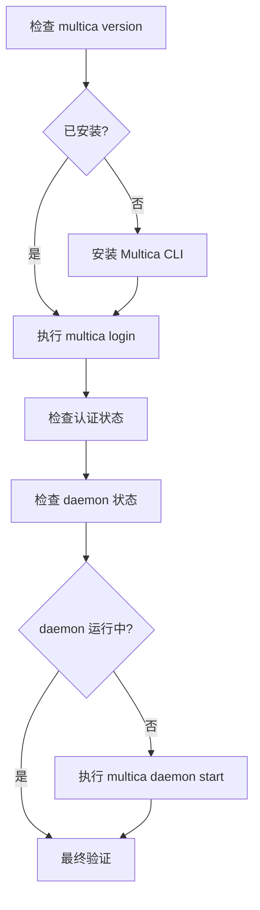

# Other — CLI_INSTALL.md

## 模块定位

`CLI_INSTALL.md` 是面向 AI Agent 的 Multica CLI 安装与启动手册。它不是运行时代码模块，也没有函数、类、内部调用或执行流；它的作用是把「安装 CLI、完成登录、启动 daemon、验证可用性」这条人工容易遗漏的操作链，整理成 AI Agent 可以逐步执行的命令化流程。

该文档主要服务于以下场景：

- 用户要求 Claude Code、Codex 等 AI Agent 在本机安装 Multica CLI。
- Agent 需要判断当前机器是否已经安装 `multica`。
- Agent 需要根据系统环境选择 Homebrew、GitHub Releases 或 PowerShell 安装方式。
- Agent 需要指导用户完成 OAuth 登录。
- Agent 需要启动 `multica daemon`，让本机 AI CLI 能被 Multica 工作区调用。

## 工作流程概览

核心流程按 5 个步骤组织：



文档中的每一步都包含：

- 要执行的具体 shell 或 PowerShell 命令。
- 成功时的期望输出。
- 失败时的处理路径。
- 需要用户参与的节点，例如浏览器 OAuth 登录。

## 安装检测

第一步使用：

```bash
multica version
```

这是整个安装流程的分支入口。

如果命令输出类似 `multica v0.x.x` 的版本字符串，说明 CLI 已经可用，安装步骤可以跳过，直接进入登录流程。

如果 shell 返回 `command not found`，说明当前 `$PATH` 中没有可执行的 `multica`，需要继续执行安装步骤。

这种检测方式依赖 CLI 自身的版本命令，而不是检查固定路径，因此适用于 Homebrew、手动安装、Windows 用户目录安装等不同安装来源。

## 安装方式

`CLI_INSTALL.md` 按平台和可用工具提供三条安装路径。

### Homebrew 安装

macOS 和 Linux 的首选路径是 Homebrew：

```bash
which brew
brew install multica-ai/tap/multica
multica version
```

该方式适合已经有 Homebrew 的开发机。安装完成后仍然用 `multica version` 验证，而不是假设 `brew install` 成功就代表 CLI 可用。

升级命令也在同一节中给出：

```bash
brew upgrade multica-ai/tap/multica
```

这表明 Homebrew 安装路径不仅用于首次安装，也承担后续版本更新入口。

### GitHub Releases 手动安装

当 Homebrew 不存在时，文档使用 GitHub Releases 下载平台对应的压缩包。

脚本会先检测操作系统和架构：

```bash
OS=$(uname -s | tr '[:upper:]' '[:lower:]')
ARCH=$(uname -m)
```

然后将 `x86_64` 归一化为发布包使用的 `amd64`：

```bash
if [ "$ARCH" = "x86_64" ]; then
  ARCH="amd64"
fi
```

接着通过 GitHub 的 `releases/latest` 重定向头获取最新 tag：

```bash
LATEST=$(curl -sI https://github.com/multica-ai/multica/releases/latest | grep -i '^location:' | sed 's/.*tag\///' | tr -d '\r\n')
VERSION="${LATEST#v}"
```

最终下载并安装：

```bash
curl -sL "https://github.com/multica-ai/multica/releases/download/${LATEST}/multica-cli-${VERSION}-${OS}-${ARCH}.tar.gz" -o /tmp/multica.tar.gz
tar -xzf /tmp/multica.tar.gz -C /tmp multica
sudo mv /tmp/multica /usr/local/bin/multica
rm /tmp/multica.tar.gz
```

这个路径假设目标系统支持 `curl`、`tar`，并且用户可以通过 `sudo` 写入 `/usr/local/bin`。文档也给出了无 `sudo` 时的替代方案：把二进制移动到 `~/.local/bin/multica`，并确保 `~/.local/bin` 在 `$PATH` 中。

### Windows PowerShell 安装

Windows 使用 PowerShell 一行安装：

```powershell
irm https://raw.githubusercontent.com/multica-ai/multica/main/scripts/install.ps1 | iex
```

该脚本会从 GitHub Releases 下载最新 Windows 二进制，并安装到：

```text
%USERPROFILE%\.multica\bin\
```

同时会把该目录加入用户级 PATH。

验证命令保持一致：

```powershell
multica version
```

Windows 失败处理主要覆盖三类问题：

- 终端未刷新 PATH，需要重启终端。
- 安装器检测到 Scoop 时会使用 Scoop 安装。
- PowerShell 执行策略阻止脚本运行时，需执行：

```powershell
Set-ExecutionPolicy -Scope CurrentUser -ExecutionPolicy RemoteSigned
```

## 登录流程

安装完成后，文档要求执行：

```bash
multica login
```

这是需要用户参与的关键步骤。该命令会打开浏览器进行 OAuth 认证，因此 Agent 需要明确提示用户完成浏览器登录后再返回终端。

登录成功后，文档使用以下命令验证认证状态：

```bash
multica auth status
```

期望输出应包含已认证用户和 server URL。

如果当前环境没有浏览器，例如远程服务器或 headless 环境，文档提供 Personal Access Token 方式：

```bash
multica login --token <mul_...>
```

也支持交互式 token 输入：

```bash
multica login --token=
```

如果需要连接自定义服务端，应在登录前设置：

```bash
multica config set server_url <url>
```

登录成功后，CLI 会自动发现并 watch 用户所属的 workspaces。后续 daemon 验证会依赖这些 workspace 信息。

## Daemon 启动与检查

文档先检查 daemon 状态：

```bash
multica daemon status
```

如果状态已经是 `running`，直接进入最终验证。

如果状态是 `stopped`，启动 daemon：

```bash
multica daemon start
```

然后等待 3 秒，再次执行：

```bash
multica daemon status
```

期望状态为 `running`，并且输出中能看到检测到的 AI Agent，例如：

```text
claude
codex
copilot
opencode
openclaw
hermes
pi
cursor-agent
grok
```

如果 daemon 启动失败，文档要求查看日志：

```bash
multica daemon logs
```

常见失败原因包括：

- 端口冲突，可能已有其他 profile 的 daemon 正在运行。
- 没有检测到任何支持的 AI CLI。
- 支持的 AI CLI 没有安装，或不在 `$PATH` 中。

## 最终验证

最终验证仍然使用：

```bash
multica daemon status
```

需要确认三件事：

1. daemon 状态为 `running`。
2. 至少检测到一个支持的 AI Agent CLI。
3. 至少有一个 workspace 正在被 watch。

如果 agents 列表为空，文档要求 Agent 明确告诉用户安装至少一个受支持 CLI，然后重启 daemon：

```bash
multica daemon stop && multica daemon start
```

这里的验证逻辑很重要：`daemon running` 只说明后台进程启动成功，不代表 Multica 已经具备执行任务的完整能力。完整可用状态还要求 agent CLI 和 workspace watcher 都存在。

## 与代码库其他部分的关系

`CLI_INSTALL.md` 位于仓库的文档/运维边界层，不参与 Go 后端、Next.js 前端、Electron 桌面端或共享 packages 的运行时调用。调用图中没有 internal calls、outgoing calls、incoming calls，也没有检测到 execution flows。

它连接代码库的方式主要是发布与使用链路：

- 依赖 GitHub Releases 中的 `multica-cli-${VERSION}-${OS}-${ARCH}.tar.gz` 发布产物。
- 依赖 Homebrew tap `multica-ai/tap/multica`。
- 依赖 Windows 安装脚本 `scripts/install.ps1`。
- 依赖 CLI 命令面：`multica version`、`multica login`、`multica auth status`、`multica daemon status`、`multica daemon start`、`multica daemon logs`。
- 依赖 daemon 对本机 AI CLI 的发现能力。
- 依赖登录后自动发现和监听用户所属 workspaces 的行为。

因此，修改该文档时应同步检查 CLI 实际命令、发布包命名、安装脚本路径、支持的 agent 列表和认证行为是否仍然准确。

## 维护注意事项

更新此文档时，优先保持它的“可执行 runbook”属性。每个步骤都应该让 Agent 能直接执行命令，并知道成功和失败分别意味着什么。

需要特别关注以下内容是否过期：

- `multica-ai/tap/multica` 是否仍是 Homebrew 安装源。
- GitHub Releases 的压缩包命名是否仍是 `multica-cli-${VERSION}-${OS}-${ARCH}.tar.gz`。
- Windows 安装脚本是否仍位于 `scripts/install.ps1`。
- token 页面是否仍是 `https://multica.ai/settings?tab=tokens`。
- 支持的 AI CLI 列表是否变化。
- `multica daemon status` 的输出字段是否仍包含 daemon 状态、agents 和 workspaces。
- `multica config set server_url <url>` 是否仍是自定义 server URL 的正确方式。

该模块的价值在于降低安装和接入过程的不确定性。任何修改都应尽量保留“命令、期望结果、失败处理”三段式结构，使 AI Agent 和开发者都能按文档直接完成本机配置。