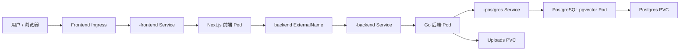

# Other — deploy-helm

## 概览

`deploy/helm/multica` 是 Multica 的 Helm Chart，用于把自托管版本部署到 Kubernetes 集群。它编排三类主要工作负载：

- Go 后端 API / WebSocket 服务，监听 `8080`
- Next.js standalone 前端服务，监听 `3000`
- 内置 PostgreSQL + pgvector，监听 `5432`

Chart 默认面向单命名空间、单 release 的自托管安装。敏感配置不由 Chart 渲染，而是通过预先创建的 Kubernetes Secret 注入，避免密钥进入 Git 或 Helm values。

## 目录结构

```text
deploy/helm/multica/
├── Chart.yaml
├── values.yaml
└── templates/
    ├── _helpers.tpl
    ├── backend.yaml
    ├── configmap.yaml
    ├── frontend.yaml
    ├── ingress.yaml
    ├── postgres.yaml
    └── prometheusrule.yaml
```

## Chart 元数据

`Chart.yaml` 定义 Chart 名称为 `multica`，类型为 `application`。

关键字段：

- `version: 0.1.0`：Chart 自身版本。
- `appVersion: "latest"`：默认应用镜像标签。`values.yaml` 中后端和前端镜像 `tag` 为空时，会回退到该值。
- `sources` 指向 `https://github.com/multica-ai/multica`。
- `keywords` 标记该 Chart 用于 `issue-tracker`、`ai-agents` 和 `self-host` 场景。

## 命名与通用模板

`templates/_helpers.tpl` 提供 Helm 命名和标签模板。

### `multica.labels`

为所有资源生成统一 Kubernetes 标签：

```yaml
app.kubernetes.io/name: multica
app.kubernetes.io/instance: <Release.Name>
app.kubernetes.io/managed-by: <Release.Service>
helm.sh/chart: <Chart.Name>-<Chart.Version>
```

组件模板会额外添加：

```yaml
app.kubernetes.io/component: backend
```

或 `frontend`、`postgres`、`backend-alias`。

### `multica.backend.fullname`

返回：

```text
<Release.Name>-backend
```

用于后端 Deployment、Service 和上传 PVC。

### `multica.frontend.fullname`

返回：

```text
<Release.Name>-frontend
```

用于前端 Deployment、Service 和 Ingress。

### `multica.postgres.fullname`

返回：

```text
<Release.Name>-postgres
```

用于内置 PostgreSQL Deployment、Service 和数据 PVC。

### `multica.databaseUrl`

当使用内置 PostgreSQL 时，后端通过该模板生成 `DATABASE_URL`：

```text
postgres://$(POSTGRES_USER):$(POSTGRES_PASSWORD)@<release>-postgres:5432/$(POSTGRES_DB)?sslmode=disable
```

这里的 `$(POSTGRES_USER)`、`$(POSTGRES_PASSWORD)`、`$(POSTGRES_DB)` 由 kubelet 在容器环境变量中展开，因此后端容器必须同时从 ConfigMap 和 Secret 加载这些变量。

## 部署拓扑



如果 `postgres.external.enabled=true`，图中的内置 PostgreSQL 资源不会创建，后端改为从 `existingSecret` 读取外部 `DATABASE_URL`。

## 配置来源

Chart 使用三类配置来源。

### `values.yaml`

`values.yaml` 是默认配置入口，覆盖内容包括：

- 镜像仓库、标签和拉取策略
- 内置或外部 PostgreSQL
- 后端副本数、资源、上传目录持久化
- 后端非敏感环境变量
- 前端副本数和兼容性别名
- Ingress host、class 和 TLS
- PrometheusRule 监控告警

### ConfigMap

`templates/configmap.yaml` 创建：

```text
<Release.Name>-config
```

它保存非敏感环境变量，包括：

- 后端运行环境：`APP_ENV`、`PORT`
- URL / CORS / Cookie：`MULTICA_APP_URL`、`FRONTEND_ORIGIN`、`CORS_ALLOWED_ORIGINS`、`COOKIE_DOMAIN`
- 注册和工作区开关：`ALLOW_SIGNUP`、`ALLOWED_EMAILS`、`ALLOWED_EMAIL_DOMAINS`、`DISABLE_WORKSPACE_CREATION`
- OAuth 配置中的非密钥部分：`GOOGLE_CLIENT_ID`、`GOOGLE_REDIRECT_URI`
- 上传和 CDN 配置：`S3_BUCKET`、`S3_REGION`、`CLOUDFRONT_DOMAIN`、`CLOUDFRONT_KEY_PAIR_ID`、`LOCAL_UPLOAD_BASE_URL`

当使用内置 PostgreSQL 时，还会写入：

```yaml
POSTGRES_DB
POSTGRES_USER
```

当 `postgres.external.enabled=true` 时，这两个字段不会写入 ConfigMap，因为后端应直接从 Secret 读取完整 `DATABASE_URL`。

### `existingSecret`

`existingSecret` 默认为：

```yaml
existingSecret: multica-secrets
```

Chart 不创建该 Secret，只引用它。安装前需要手动创建。

内置 PostgreSQL 模式需要至少包含：

```text
JWT_SECRET
POSTGRES_PASSWORD
RESEND_API_KEY
GOOGLE_CLIENT_SECRET
CLOUDFRONT_PRIVATE_KEY
MULTICA_DEV_VERIFICATION_CODE
```

外部 PostgreSQL 模式下，将 `POSTGRES_PASSWORD` 替换为：

```text
DATABASE_URL
```

后端 Deployment 使用 `envFrom.secretRef` 加载整个 Secret。PostgreSQL Deployment 只通过 `secretKeyRef` 读取 `POSTGRES_PASSWORD`。

## 后端资源

`templates/backend.yaml` 渲染后端相关资源。

### 上传 PVC

当：

```yaml
backend.uploads.persistence.enabled: true
```

Chart 会创建：

```text
<Release.Name>-backend-uploads
```

并挂载到后端容器：

```text
/app/data/uploads
```

该目录只在未配置 S3 时由后端使用。`values.yaml` 注释指出，存储选择逻辑在 `server/cmd/server/router.go` 中。

默认访问模式是：

```yaml
accessModes:
  - ReadWriteOnce
```

这适合单节点、本地路径、hostPath 或 EBS 类存储。如果 `backend.replicas > 1` 且仍使用本地上传存储，可能因为 PVC 不支持多节点挂载而导致调度失败。多副本部署应使用 S3，或把 `accessModes` 改为 `ReadWriteMany` 并选择兼容的 StorageClass。

### 后端 Deployment

后端 Deployment 名称为：

```text
<Release.Name>-backend
```

镜像由以下值决定：

```yaml
images.backend.repository
images.backend.tag
images.backend.pullPolicy
```

其中 `images.backend.tag` 为空时回退到 `Chart.appVersion`。

容器监听：

```yaml
containerPort: 8080
```

后端环境变量来源：

```yaml
envFrom:
  - configMapRef:
      name: <Release.Name>-config
  - secretRef:
      name: <existingSecret>
```

当使用内置 PostgreSQL 时，Deployment 额外设置：

```yaml
DATABASE_URL: postgres://$(POSTGRES_USER):$(POSTGRES_PASSWORD)@<release>-postgres:5432/$(POSTGRES_DB)?sslmode=disable
```

当使用外部 PostgreSQL 时，Chart 不生成该变量，应由 `existingSecret` 提供 `DATABASE_URL`。

### 迁移和探针

后端镜像入口会在启动服务前运行：

```text
./migrate up
```

模板注释说明迁移由 `cmd/migrate` 中的 PostgreSQL advisory lock 串行化，避免多个后端副本同时迁移产生竞争。

Deployment 仍默认：

```yaml
replicas: 1
strategy:
  type: Recreate
```

探针配置围绕迁移启动设计：

- `startupProbe` 访问 `/healthz`，最多等待约 5 分钟。
- `readinessProbe` 访问 `/healthz`，用于确认可接收流量。
- `livenessProbe` 访问 `/healthz`，在启动成功后检测运行状态。

### 配置变更滚动

后端 Pod 模板包含两个 checksum annotation：

```yaml
checksum/config
checksum/secret
```

`checksum/config` 对 `configmap.yaml` 渲染结果取 sha256。  
`checksum/secret` 使用 Helm `lookup` 读取集群中现有 Secret 的 `.data` 后取 sha256。

这样 `helm upgrade` 修改 ConfigMap 或 Secret 时，会改变 Pod 模板 hash，从而触发后端 Pod 滚动。`helm template` 或 dry-run 时 `lookup` 为空，因此 Secret checksum 只是占位值。

### 后端 Service

后端 Service 名称为：

```text
<Release.Name>-backend
```

类型为：

```yaml
type: ClusterIP
```

选择器匹配：

```yaml
app.kubernetes.io/name: multica
app.kubernetes.io/instance: <Release.Name>
app.kubernetes.io/component: backend
```

服务端口：

```yaml
port: 8080
targetPort: 8080
```

### `backend` ExternalName 兼容别名

当：

```yaml
frontend.compatibility.backendAlias: true
```

Chart 会额外创建一个未加 release 前缀的 Service：

```yaml
kind: Service
metadata:
  name: backend
spec:
  type: ExternalName
  externalName: <Release.Name>-backend.<namespace>.svc.cluster.local
```

这是为了兼容预构建的 `multica-web` 镜像。该镜像在构建时内置了：

```text
REMOTE_API_URL=http://backend:8080
```

Next.js standalone 构建不会在运行时重新计算 rewrite 目标，因此需要 Kubernetes 中存在名为 `backend` 的 DNS 名称。

该兼容层有一个重要限制：同一命名空间只能安装一个启用该选项的 release，因为 `backend` 这个 Service 名称没有 release 前缀。若命名空间已有同名 Service，安装会冲突。使用已修正 `REMOTE_API_URL` 的自定义前端镜像时，可以设置：

```yaml
frontend.compatibility.backendAlias: false
```

## 前端资源

`templates/frontend.yaml` 渲染前端 Deployment 和 Service。

前端 Deployment 名称为：

```text
<Release.Name>-frontend
```

镜像由以下值决定：

```yaml
images.frontend.repository
images.frontend.tag
images.frontend.pullPolicy
```

其中 `images.frontend.tag` 为空时回退到 `Chart.appVersion`。

容器监听：

```yaml
containerPort: 3000
```

运行时环境变量固定为：

```yaml
HOSTNAME: "0.0.0.0"
PORT: "3000"
```

前端 Service 为 `ClusterIP`，服务端口为 `3000`，选择 `app.kubernetes.io/component: frontend` 的 Pod。

前端本身不直接从 ConfigMap 或 Secret 加载业务配置。后端地址依赖镜像构建时的 `REMOTE_API_URL`，默认通过 `backend` ExternalName 兼容别名解析到集群内后端服务。

## PostgreSQL 资源

`templates/postgres.yaml` 只在以下条件下渲染：

```yaml
postgres.external.enabled: false
```

### 数据 PVC

创建：

```text
<Release.Name>-postgres-data
```

默认大小：

```yaml
postgres.persistence.size: 10Gi
```

默认不指定 `storageClassName`，使用集群默认 StorageClass。

### PostgreSQL Deployment

Deployment 名称为：

```text
<Release.Name>-postgres
```

镜像默认：

```yaml
repository: pgvector/pgvector
tag: pg17
```

它提供 PostgreSQL 17 + pgvector 能力。

环境变量来源：

- `POSTGRES_DB`：来自 `<Release.Name>-config`
- `POSTGRES_USER`：来自 `<Release.Name>-config`
- `POSTGRES_PASSWORD`：来自 `existingSecret`
- `PGDATA`：固定为 `/var/lib/postgresql/data/pgdata`

`PGDATA` 指向挂载目录下的子目录，是为了避免 local-path PVC 中的 `lost+found` 目录导致 `initdb` 认为目标目录非空。

PostgreSQL readinessProbe 使用：

```sh
pg_isready -U "$POSTGRES_USER" -d "$POSTGRES_DB"
```

### PostgreSQL Service

Service 名称为：

```text
<Release.Name>-postgres
```

类型为 `ClusterIP`，端口为 `5432`。内置后端 `DATABASE_URL` 会指向这个 Service。

## Ingress

`templates/ingress.yaml` 只在以下条件下渲染：

```yaml
ingress.enabled: true
```

默认创建两个 Ingress。

### 前端 Ingress

名称：

```text
<Release.Name>-frontend
```

默认 host：

```text
multica.dev.lan
```

路径：

```yaml
path: /
pathType: Prefix
```

后端服务：

```text
<Release.Name>-frontend:3000
```

### 后端 Ingress

名称：

```text
<Release.Name>-backend
```

默认 host：

```text
api.multica.dev.lan
```

路径：

```yaml
path: /
pathType: Prefix
```

后端服务：

```text
<Release.Name>-backend:8080
```

两个 Ingress 都使用：

```yaml
ingress.className
ingress.annotations
ingress.tls
```

默认 class 为：

```yaml
traefik
```

如果启用 TLS，可在 `ingress.tls` 中提供标准 Kubernetes Ingress TLS 配置。

## PrometheusRule

`templates/prometheusrule.yaml` 只在以下条件下渲染：

```yaml
monitoring.prometheusRule.enabled: true
```

该资源依赖 Prometheus Operator CRD：

```text
monitoring.coreos.com/v1
```

因此默认关闭，避免最小化自托管集群没有 CRD 时安装失败。

PrometheusRule 名称为：

```text
<Release.Name>-backend-sampler
```

它定义两个后端业务采样器告警。

### `MulticaBusinessSamplerQueryErrors`

检测以下采样查询的错误速率是否大于 0：

```text
acquire
active_users
active_workspaces
task_queued
task_running
task_stuck
runtime_online
runtime_heartbeat_age
workspace_total
```

PromQL 使用：

```promql
sum by (name) (
  rate(multica_business_sampler_query_errors_total{name=~"..."}[10m])
) > 0
```

持续时间由以下值控制：

```yaml
monitoring.prometheusRule.samplerQueryErrorsFor
```

默认：

```yaml
5m
```

### `MulticaBusinessSamplerQueryLatencyHigh`

检测业务采样查询的 p95 延迟是否超过 300ms：

```promql
histogram_quantile(
  0.95,
  sum by (le, name) (
    rate(multica_business_sampler_query_seconds_bucket{name=~"..."}[10m])
  )
) > 0.3
```

持续时间由以下值控制：

```yaml
monitoring.prometheusRule.samplerQueryLatencyFor
```

默认：

```yaml
10m
```

告警级别由：

```yaml
monitoring.prometheusRule.severity
```

控制，默认是 `warning`。

## 与应用代码的连接点

该 Chart 不包含 Go、TypeScript 或运行时代码调用，因此调用图中没有内部调用、外部调用或执行流。它通过 Kubernetes 资源把应用运行时连接起来。

关键连接点包括：

- 后端容器入口会执行 `./migrate up`，迁移逻辑位于应用代码的 `cmd/migrate`。
- 后端健康检查依赖 HTTP 路径 `/healthz`。
- 后端上传目录挂载到 `/app/data/uploads`，应用在未配置 S3 时使用本地上传存储。
- 上传存储选择逻辑由 `server/cmd/server/router.go` 负责。
- 前端镜像依赖构建时的 `REMOTE_API_URL=http://backend:8080`，Chart 通过 `backend` ExternalName Service 补齐运行时 DNS。
- 后端业务采样器需暴露 `multica_business_sampler_query_errors_total` 和 `multica_business_sampler_query_seconds_bucket` 指标，PrometheusRule 才能生效。

## 常见部署模式

### 默认单机自托管

默认 values 会部署：

- 前端 1 副本
- 后端 1 副本
- 内置 PostgreSQL 1 副本
- 后端上传 PVC
- PostgreSQL 数据 PVC
- 前端和后端 Ingress
- `backend` ExternalName 兼容别名

适合本地集群、小型自托管或单命名空间部署。

### 使用外部 PostgreSQL

设置：

```yaml
postgres:
  external:
    enabled: true
```

结果：

- 不创建 PostgreSQL Deployment
- 不创建 PostgreSQL Service
- 不创建 PostgreSQL PVC
- ConfigMap 不写入 `POSTGRES_DB` 和 `POSTGRES_USER`
- 后端不由 Chart 生成 `DATABASE_URL`

此时必须在 `existingSecret` 中提供：

```text
DATABASE_URL
```

### 使用 S3 / CloudFront 上传

当配置：

```yaml
backend.config.s3Bucket
backend.config.s3Region
backend.config.cloudfrontDomain
backend.config.cloudfrontKeyPairId
```

并在 Secret 中提供相关私钥后，后端可以使用对象存储。此时如果不需要本地上传目录，可以关闭：

```yaml
backend:
  uploads:
    persistence:
      enabled: false
```

这会避免创建和挂载 `/app/data/uploads` PVC。

### 多副本后端

后端启动迁移通过 PostgreSQL advisory lock 串行化，因此多个后端 Pod 同时启动时不会并发执行迁移。

但 Chart 仍默认使用：

```yaml
strategy:
  type: Recreate
replicas: 1
```

提高 `backend.replicas` 前需要同时确认：

- 上传存储不使用单写 PVC，或 PVC 支持 `ReadWriteMany`
- WebSocket / API 流量入口符合应用需求
- Secret 和 ConfigMap 变更滚动符合预期
- 当前部署环境允许多个后端 Pod 访问同一数据库

## 维护注意事项

修改模板时应优先复用 `_helpers.tpl` 中的命名和标签模板，避免资源名、selector 和 Service 指向不一致。

新增后端环境变量时，应按敏感性放置：

- 非敏感配置放入 `templates/configmap.yaml` 和 `values.yaml`
- 密钥、token、密码、私钥放入预创建的 `existingSecret`

修改后端 ConfigMap 或 Secret 相关逻辑时，需要保留 Deployment 中的 checksum annotation，否则 `helm upgrade` 可能不会触发 Pod 滚动，导致旧配置继续运行。

调整前端后端通信时，需要理解 `backend` ExternalName 的兼容目的。只要预构建 `multica-web` 镜像仍内置 `REMOTE_API_URL=http://backend:8080`，删除该别名会导致前端代理 `/api`、`/ws`、`/auth` 和 `/uploads` 失败。

启用 `monitoring.prometheusRule.enabled` 前，需要确认集群已安装 Prometheus Operator CRD，否则 Helm 安装会因未知资源类型失败。