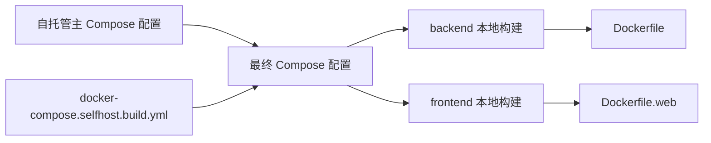

# Other — docker-compose.selfhost.build.yml

## 模块概览

`docker-compose.selfhost.build.yml` 是自托管部署的开发覆盖配置，用于让 Docker Compose 从当前代码检出目录构建镜像，而不是拉取官方 GHCR 镜像。

该文件不定义新的运行时流程，也没有函数、类或调用关系。它只覆盖 Compose 中已有的 `backend` 和 `frontend` 服务镜像来源，将它们切换为本地构建产物。

## 适用场景

适合在以下情况下使用：

- 验证当前工作区代码能否构建为自托管镜像
- 在本地或测试环境运行未发布版本
- 调试 `Dockerfile` 或 `Dockerfile.web`
- 覆盖官方镜像，改用本地源码构建出的开发镜像

它通常应作为 override 文件与自托管主 Compose 配置一起使用，例如通过多个 `-f` 参数叠加配置。

## 服务覆盖

### `backend`

```yaml
backend:
  image: multica-backend:dev
  build:
    context: .
    dockerfile: Dockerfile
    args:
      VERSION: ${VERSION:-dev}
      COMMIT: ${COMMIT:-unknown}
      DATE: ${DATE:-unknown}
```

`backend` 服务被覆盖为从仓库根目录构建后端镜像。

关键字段：

- `image: multica-backend:dev`：本地构建后的镜像标签
- `build.context: .`：构建上下文是当前仓库根目录
- `build.dockerfile: Dockerfile`：使用根目录下的 `Dockerfile`
- `VERSION`：构建版本，默认值为 `dev`
- `COMMIT`：构建提交标识，默认值为 `unknown`
- `DATE`：构建时间，默认值为 `unknown`

这些构建参数通常用于把版本信息注入后端二进制或镜像元数据。未显式传入环境变量时，Compose 会使用默认值，保证开发构建不依赖 CI 环境。

### `frontend`

```yaml
frontend:
  image: multica-web:dev
  build:
    context: .
    dockerfile: Dockerfile.web
    args:
      REMOTE_API_URL: http://backend:8080
      NEXT_PUBLIC_WS_URL: ${NEXT_PUBLIC_WS_URL:-}
      NEXT_PUBLIC_APP_VERSION: dev
```

`frontend` 服务被覆盖为从当前源码构建 Web 前端镜像。

关键字段：

- `image: multica-web:dev`：本地构建后的前端镜像标签
- `build.context: .`：构建上下文同样是仓库根目录
- `build.dockerfile: Dockerfile.web`：使用根目录下的 `Dockerfile.web`
- `REMOTE_API_URL: http://backend:8080`：前端服务端构建或运行时访问后端的内部 Compose 地址
- `NEXT_PUBLIC_WS_URL`：公开给浏览器端的 WebSocket 地址，默认空字符串
- `NEXT_PUBLIC_APP_VERSION: dev`：前端公开版本号固定为 `dev`

`REMOTE_API_URL` 使用 Compose 服务名 `backend`，因此前端容器可以通过 Docker 网络直接访问后端容器的 `8080` 端口。

## 配置关系

该文件依赖 Docker Compose 的配置合并机制。它不完整描述整个自托管环境，而是只声明需要替换的镜像构建部分。



合并后的效果是：

- 保留主 Compose 文件中的网络、端口、卷、环境变量和依赖关系
- 仅将 `backend` 和 `frontend` 的镜像来源改成本地 `build`
- 使用 `multica-backend:dev` 和 `multica-web:dev` 作为本地镜像标签

## 与代码库的连接

该模块位于仓库根目录，构建上下文也是仓库根目录，因此 `Dockerfile` 和 `Dockerfile.web` 可以访问整个 monorepo：

- 后端镜像通过 `Dockerfile` 构建 Go 后端
- 前端镜像通过 `Dockerfile.web` 构建 Next.js Web 应用
- 前端构建参数会把 API 地址和公开版本信息传入 Web 构建流程
- 后端构建参数会把版本、提交和日期信息传入镜像构建流程

由于该文件没有运行时代码，代码图中没有内部调用、外部调用、传入调用或执行流。它的影响发生在部署构建阶段，而不是应用运行阶段。

## 使用注意事项

使用该覆盖文件时，应确保当前工作区包含可构建的完整源码，并且根目录下存在：

- `Dockerfile`
- `Dockerfile.web`
- 后端构建所需的 Go 代码和依赖文件
- 前端构建所需的 pnpm workspace、Next.js 应用和共享包

如果需要生成可追踪的镜像，建议显式传入构建参数：

```bash
VERSION=dev-local \
COMMIT=$(git rev-parse --short HEAD) \
DATE=$(date -u +%Y-%m-%dT%H:%M:%SZ) \
docker compose -f <自托管主配置> -f docker-compose.selfhost.build.yml up --build
```

`NEXT_PUBLIC_WS_URL` 默认为空。如果部署环境需要浏览器连接特定 WebSocket 地址，应在运行 Compose 前显式设置该变量。