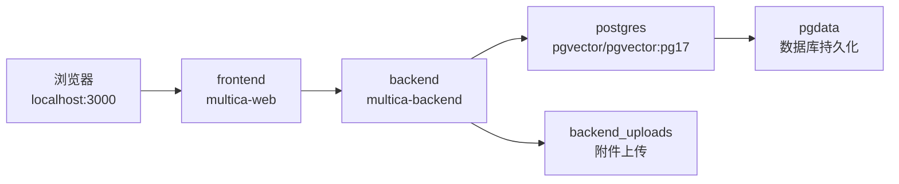

# Other — docker-compose.selfhost.yml

## 模块概览

`docker-compose.selfhost.yml` 是 Multica 自托管部署入口，用 Docker Compose 启动三类运行时组件：

- `postgres`：PostgreSQL 17 + pgvector，保存应用数据。
- `backend`：Multica Go 后端镜像，连接数据库、处理 API、上传文件、认证、集成和 webhook。
- `frontend`：Multica Web 前端镜像，对外提供 Next.js Web UI。

这个文件是声明式部署配置，不包含可调用函数、类或方法，因此没有内部调用、外部调用或执行流。它通过 Docker Compose 的服务依赖、网络解析、端口映射、卷挂载和环境变量把仓库中的后端、前端与数据库连接起来。



## 启动方式

典型自托管启动流程：

```bash
cp .env.example .env
# 至少修改 JWT_SECRET
docker compose -f docker-compose.selfhost.yml up -d
```

启动后默认访问地址：

- 前端：`http://localhost:${FRONTEND_PORT:-3000}`
- 后端：`http://localhost:${BACKEND_PORT:-8080}`

Compose 项目名由顶层 `name: multica` 指定，因此默认创建的网络、卷和容器都会归属于 `multica` 项目。

## 网络暴露模型

`backend` 和 `frontend` 的端口只绑定到宿主机回环地址：

```yaml
ports:
  - "127.0.0.1:${BACKEND_PORT:-8080}:8080"
  - "127.0.0.1:${FRONTEND_PORT:-3000}:3000"
```

这意味着服务默认只能从本机访问。跨机器访问或公网访问应通过反向代理完成，例如 Caddy、nginx 或 Cloudflare Tunnel，由代理负责 TLS 终止并转发到：

- `127.0.0.1:8080` 后端
- `127.0.0.1:3000` 前端

不要把这里改成 `0.0.0.0`。Docker 默认会绕过宿主机防火墙规则暴露端口；在未修改默认 `JWT_SECRET` 和 PostgreSQL 凭据时，直接暴露原始端口会带来明显风险。

## `postgres` 服务

`postgres` 使用镜像：

```yaml
image: pgvector/pgvector:pg17
```

它提供 PostgreSQL 17，并内置 pgvector 扩展能力。数据库连接信息来自环境变量，均有本地默认值：

```yaml
POSTGRES_DB: ${POSTGRES_DB:-multica}
POSTGRES_USER: ${POSTGRES_USER:-multica}
POSTGRES_PASSWORD: ${POSTGRES_PASSWORD:-multica}
```

数据库数据通过命名卷持久化：

```yaml
volumes:
  - pgdata:/var/lib/postgresql/data
```

健康检查使用 `pg_isready`：

```yaml
pg_isready -U ${POSTGRES_USER:-multica} -d ${POSTGRES_DB:-multica}
```

`backend` 依赖这个健康检查，只有 `postgres` 达到 `service_healthy` 后才会启动后端服务。

## `backend` 服务

`backend` 使用可配置镜像：

```yaml
image: ${MULTICA_BACKEND_IMAGE:-ghcr.io/multica-ai/multica-backend}:${MULTICA_IMAGE_TAG:-latest}
```

默认拉取 `ghcr.io/multica-ai/multica-backend:latest`。可以通过以下变量切换镜像仓库或版本：

- `MULTICA_BACKEND_IMAGE`
- `MULTICA_IMAGE_TAG`

后端容器内部监听固定端口：

```yaml
PORT: "8080"
```

宿主机端口由 `BACKEND_PORT` 控制，默认 `8080`，并只绑定到 `127.0.0.1`。

后端上传文件持久化到命名卷：

```yaml
volumes:
  - backend_uploads:/app/data/uploads
```

### 数据库连接

`DATABASE_URL` 使用 Compose 内部服务名 `postgres` 作为主机名：

```yaml
DATABASE_URL: postgres://${POSTGRES_USER:-multica}:${POSTGRES_PASSWORD:-multica}@postgres:5432/${POSTGRES_DB:-multica}?sslmode=disable
```

这里的 `postgres` 不是宿主机地址，而是 Docker Compose 网络内的服务 DNS 名称。后端不需要通过宿主机暴露的数据库端口访问 PostgreSQL。

### 认证与访问来源

关键认证和来源配置包括：

- `JWT_SECRET`：JWT 签名密钥，默认是 `change-me-in-production`，生产部署必须修改。
- `FRONTEND_ORIGIN`：前端来源，默认 `http://localhost:3000`。
- `CORS_ALLOWED_ORIGINS`：额外允许的 CORS 来源。
- `COOKIE_DOMAIN`：Cookie 域名。
- `APP_ENV`：应用环境，默认 `production`。
- `MULTICA_APP_URL`：应用前端 URL，默认 `http://localhost:3000`。

如果通过正式域名和反向代理访问，需要让 `FRONTEND_ORIGIN`、`MULTICA_APP_URL`、Google OAuth 回调地址等变量与外部访问地址一致。

### 邮件发送

后端支持 Resend 和 SMTP 两类邮件配置。

Resend 相关变量：

- `RESEND_API_KEY`
- `RESEND_FROM_EMAIL`，默认 `noreply@multica.ai`

SMTP 相关变量：

- `SMTP_HOST`
- `SMTP_PORT`，默认 `25`
- `SMTP_USERNAME`
- `SMTP_PASSWORD`
- `SMTP_TLS`
- `SMTP_TLS_INSECURE`，默认 `false`
- `SMTP_EHLO_NAME`

这些变量只负责把部署侧配置注入后端；具体发送逻辑在后端镜像内实现。

### Google OAuth

Google 登录相关变量：

- `GOOGLE_CLIENT_ID`
- `GOOGLE_CLIENT_SECRET`
- `GOOGLE_REDIRECT_URI`，默认 `http://localhost:3000/auth/callback`

部署到正式域名时，`GOOGLE_REDIRECT_URI` 应匹配 Google OAuth 控制台配置的回调地址。

### 附件与对象存储

对象存储相关变量：

- `S3_BUCKET`
- `S3_REGION`，默认 `us-west-2`
- `AWS_ENDPOINT_URL`
- `S3_USE_PATH_STYLE`
- `AWS_ACCESS_KEY_ID`
- `AWS_SECRET_ACCESS_KEY`

附件下载行为由以下变量控制：

- `ATTACHMENT_DOWNLOAD_MODE`，默认 `auto`
- `ATTACHMENT_DOWNLOAD_URL_TTL`，默认 `30m`

CloudFront 签名下载相关变量：

- `CLOUDFRONT_DOMAIN`
- `CLOUDFRONT_KEY_PAIR_ID`
- `CLOUDFRONT_PRIVATE_KEY`

如果没有配置 S3，后端仍会把上传文件保存在 `backend_uploads` 卷对应的 `/app/data/uploads` 路径中。

### 注册与工作区策略

访问控制相关变量：

- `ALLOW_SIGNUP`，默认 `true`
- `ALLOWED_EMAILS`
- `ALLOWED_EMAIL_DOMAINS`
- `DISABLE_WORKSPACE_CREATION`

这些变量用于约束谁可以注册、哪些邮箱或域名被允许，以及是否禁用工作区创建。

### GitHub App 与 webhook

GitHub App 相关变量：

- `GITHUB_APP_SLUG`
- `GITHUB_WEBHOOK_SECRET`

公共 webhook URL 相关变量：

- `MULTICA_PUBLIC_URL`
- `MULTICA_TRUSTED_PROXIES`

`MULTICA_PUBLIC_URL` 表示 API 在公网可访问的基础 URL，不能带尾随斜杠。后端会用它生成 autopilot webhook 触发器的绝对 URL。

如果服务位于同源反向代理之后，可以不设置 `MULTICA_PUBLIC_URL`，前端会根据 `window.origin + webhook_path` 组合 URL。

`MULTICA_TRUSTED_PROXIES` 是逗号分隔的 CIDR 列表，用于声明哪些代理来源允许设置 `X-Forwarded-For` 或 `X-Real-IP`，供 webhook 按 IP 限流使用。默认空值表示忽略这些转发头，使用连接的 `RemoteAddr`。

### Lark / 飞书集成

Lark / 飞书机器人集成变量：

- `MULTICA_LARK_SECRET_KEY`
- `MULTICA_LARK_HTTP_BASE_URL`
- `MULTICA_LARK_CALLBACK_BASE_URL`

`MULTICA_LARK_SECRET_KEY` 是启用开关：未设置时集成关闭。大陆飞书和国际 Lark 会按安装自动检测并并行支持。两个 base URL 变量通常保持为空，只在代理、mock 或单云 staging 等部署级覆盖场景中设置。

### Slack 集成

Slack 机器人集成变量：

- `MULTICA_SLACK_SECRET_KEY`

`MULTICA_SLACK_SECRET_KEY` 是启用开关：未设置时集成关闭。它用于解密每个 workspace 通过 OAuth 或 BYO 方式带入并加密存储在数据库中的 bot/app token。

## `frontend` 服务

`frontend` 使用可配置镜像：

```yaml
image: ${MULTICA_WEB_IMAGE:-ghcr.io/multica-ai/multica-web}:${MULTICA_IMAGE_TAG:-latest}
```

默认拉取 `ghcr.io/multica-ai/multica-web:latest`。可以通过以下变量切换镜像仓库或版本：

- `MULTICA_WEB_IMAGE`
- `MULTICA_IMAGE_TAG`

前端依赖后端容器启动：

```yaml
depends_on:
  - backend
```

这里的 `depends_on` 只表达启动顺序，不像 `backend` 对 `postgres` 那样等待健康检查。前端启动时如果后端还未完全可用，需要由前端运行时请求重试或用户刷新来恢复。

前端容器内设置：

```yaml
HOSTNAME: "0.0.0.0"
```

这表示 Next.js 服务在容器内部监听所有接口。宿主机侧仍然通过端口映射限制为 `127.0.0.1:${FRONTEND_PORT:-3000}`，所以不会因此直接暴露到公网。

## 持久化卷

文件末尾定义两个命名卷：

```yaml
volumes:
  pgdata:
  backend_uploads:
```

`pgdata` 保存 PostgreSQL 数据目录。删除这个卷会删除数据库状态。

`backend_uploads` 保存后端上传文件。删除这个卷会删除本地上传附件。

升级镜像或重启容器时，这两个卷会继续保留，除非显式执行删除卷的 Docker 命令。

## 与代码库其他部分的关系

这个 Compose 文件连接的是仓库的运行产物，而不是源码包本身：

- `server/` 构建出的后端运行时对应 `multica-backend` 镜像。
- `apps/web/` 构建出的 Next.js 前端对应 `multica-web` 镜像。
- 后端通过 `DATABASE_URL` 连接 `postgres` 服务。
- 前端通过浏览器访问路径与后端 API 交互，部署时需要保证 `FRONTEND_ORIGIN`、`MULTICA_APP_URL`、反向代理路由和 OAuth 回调地址一致。
- `apps/docs/content/docs/self-host-quickstart.mdx` 是该部署方式的用户向快速开始文档，Compose 文件顶部注释明确引用了它。

由于本模块没有函数调用或执行流，贡献者理解它时应重点关注配置边界：哪些值由 `.env` 注入，哪些端口只在本机暴露，哪些数据通过卷持久化，以及哪些外部集成通过环境变量开启。