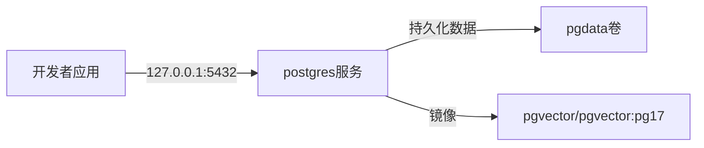

# Other — docker-compose.yml

## docker-compose.yml

`docker-compose.yml` 定义了 Multica 本地开发所需的数据库服务。当前文件只启动一个 `postgres` 服务，镜像为 `pgvector/pgvector:pg17`，提供 PostgreSQL 17 和 pgvector 扩展能力。



## 作用

该模块负责提供本地数据库运行环境：

- Compose 项目名：`multica`
- 数据库服务名：`postgres`
- PostgreSQL 数据库名：`multica`
- 默认用户：`multica`
- 默认密码：`multica`
- 本机访问地址：`127.0.0.1:5432`
- 数据持久化卷：`pgdata`

它是基础设施配置文件，不包含应用代码，因此没有内部调用、外部调用或代码级执行流。

## 服务定义

### `services.postgres`

`postgres` 是唯一的 Compose 服务：

```yaml
postgres:
  image: pgvector/pgvector:pg17
```

该服务使用 `pgvector/pgvector:pg17`，适合需要 PostgreSQL 向量扩展能力的本地环境。数据库初始化由镜像内置的 PostgreSQL entrypoint 完成。

### 环境变量

```yaml
environment:
  POSTGRES_DB: multica
  POSTGRES_USER: ${POSTGRES_USER:-multica}
  POSTGRES_PASSWORD: ${POSTGRES_PASSWORD:-multica}
```

含义：

- `POSTGRES_DB` 固定创建 `multica` 数据库。
- `POSTGRES_USER` 可通过宿主机环境变量覆盖，未设置时使用 `multica`。
- `POSTGRES_PASSWORD` 可通过宿主机环境变量覆盖，未设置时使用 `multica`。

示例：

```bash
POSTGRES_USER=dev POSTGRES_PASSWORD=secret docker compose up -d postgres
```

注意：这些变量只在数据库数据目录首次初始化时生效。如果 `pgdata` 已经存在，修改用户名或密码不会自动重建数据库用户。

### 端口映射

```yaml
ports:
  - "127.0.0.1:5432:5432"
```

服务只绑定到本机回环地址，不暴露到局域网或公网。应用可以通过以下地址访问：

```text
127.0.0.1:5432
```

默认连接信息为：

```text
host=127.0.0.1
port=5432
database=multica
user=multica
password=multica
```

具体连接字符串由后端或运行环境配置决定，不在该 Compose 文件中定义。

### 数据卷

```yaml
volumes:
  - pgdata:/var/lib/postgresql/data
```

`pgdata` 是命名卷，用于持久化 PostgreSQL 数据目录。停止容器不会删除数据库数据。

删除容器但保留数据：

```bash
docker compose down
```

删除容器并清空数据库数据：

```bash
docker compose down -v
```

## 与代码库的关系

该文件为代码库中的后端和开发工具提供本地 PostgreSQL 实例。它不直接调用 Go、TypeScript 或前端模块，也不会被应用代码导入。

典型开发流程是：

```bash
docker compose up -d postgres
```

然后启动后端或完整开发环境。后端连接数据库时应使用与该文件一致的数据库名、端口和认证信息。

## 维护注意事项

修改该文件时重点关注以下兼容性：

- 更换 `image` 可能影响 PostgreSQL 版本或 pgvector 扩展行为。
- 修改 `POSTGRES_DB` 会改变默认数据库名，需要同步应用数据库配置。
- 修改端口映射会影响本地连接地址。
- 修改卷名或挂载路径可能导致现有本地数据不可见。
- 如果需要重置初始化参数，通常需要先删除 `pgdata` 卷。