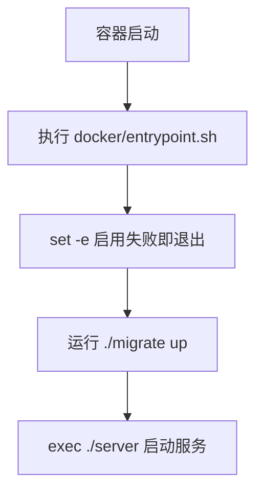

# Other — docker

## 模块概览

`docker/entrypoint.sh` 是容器启动入口脚本，用于在后端服务进程启动前先执行数据库迁移。它的职责很窄：启动容器时运行 `./migrate up`，迁移成功后再用 `./server` 启动 Go 后端服务。

该模块没有被代码图识别出内部调用、外部调用或业务执行流；它位于应用代码之外，主要通过 Docker 镜像的 entrypoint/command 机制连接到运行时环境。

## 启动流程



脚本内容很短：

```sh
#!/bin/sh
set -e

echo "Running database migrations..."
./migrate up

echo "Starting server..."
exec ./server
```

执行顺序如下：

1. `#!/bin/sh` 使用 POSIX shell 运行脚本。
2. `set -e` 要求任意命令返回非零状态时立即退出脚本。
3. `./migrate up` 执行数据库迁移。
4. 迁移成功后，`exec ./server` 启动后端服务进程。

## 关键行为

`set -e` 是这个脚本最重要的安全边界。只要 `./migrate up` 失败，脚本会立即退出，`./server` 不会启动。这避免了服务在数据库 schema 未准备好的状态下继续运行。

`exec ./server` 会用 `server` 进程替换当前 shell 进程。在容器中，这通常意味着后端服务成为主进程，从而能直接接收 Docker 发送的停止信号，例如 `SIGTERM`。这比在 shell 子进程中启动服务更适合容器运行。

`echo` 只提供启动日志标记，便于从容器日志中区分迁移阶段和服务启动阶段。

## 运行时依赖

该脚本假设当前工作目录下存在两个可执行文件：

- `./migrate`：数据库迁移命令。
- `./server`：后端服务二进制。

脚本本身不设置数据库连接参数、服务端口或其他环境变量。这些配置需要由 Dockerfile、Compose、Kubernetes 或部署平台注入，并由 `migrate` 与 `server` 自行读取。

## 与代码库的关系

在 Multica 的整体结构中，`server/` 是 Go 后端实现；`docker/entrypoint.sh` 是部署层包装，用来保证后端启动前数据库迁移已经执行。它不直接导入 Go 包，也不参与前端 monorepo 的构建流程。

如果后续修改迁移方式，应重点确认：

- `./migrate up` 是否仍然是正确的迁移入口。
- 迁移失败时是否应该阻止服务启动。
- 多副本部署时迁移命令是否支持并发执行，或是否由部署平台保证只有一个实例执行迁移。
- Docker 镜像中 `migrate` 和 `server` 的路径是否仍与脚本一致。