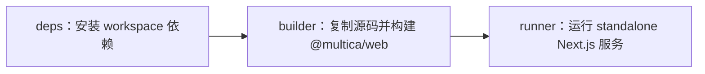

# Other — Dockerfile.web

## 模块职责

`Dockerfile.web` 用于构建和运行 `apps/web` Next.js 前端应用的生产镜像。它面向 monorepo 结构，使用 `pnpm` workspace 和 Turborepo 依赖布局，最终产出 Next.js standalone runtime，以减少运行阶段镜像内容。

该 Dockerfile 不包含应用级函数、类或运行时代码调用。调用图中也没有检测到内部调用、外部调用或执行流；它的主要行为由 Docker 多阶段构建指令、`pnpm`、Corepack 和 Next.js build 过程组成。

## 构建阶段概览



## `deps` 阶段：依赖安装

`deps` 阶段基于 `node:22-alpine`，工作目录为 `/app`。

它只复制依赖解析所需的文件：

- `pnpm-lock.yaml`
- `pnpm-workspace.yaml`
- `package.json`
- `turbo.json`
- `.npmrc`
- `apps/web/package.json`
- 各 workspace package 的 `package.json`

此外，它还复制了：

```dockerfile
COPY apps/web/source.config.ts apps/web/source.config.ts
```

原因是 `postinstall` 会运行 `fumadocs-mdx`，而该工具会读取 `apps/web/source.config.ts`。如果这里不提前复制该文件，依赖安装阶段可能会因为缺少配置文件而失败。

依赖安装前会通过 Corepack 激活仓库声明的 pnpm 版本：

```dockerfile
PNPM_VERSION="$(node -p 'require("./package.json").packageManager')"
corepack prepare "$PNPM_VERSION" --activate
```

随后执行：

```dockerfile
pnpm install --frozen-lockfile
```

这保证镜像构建严格使用 `pnpm-lock.yaml` 中锁定的依赖版本。

## `builder` 阶段：源码构建

`builder` 阶段同样基于 `node:22-alpine`。

它先复制根目录 `package.json` 并激活同一个 pnpm 版本。这里的注释说明了关键原因：离线 frozen install 会校验 `pnpm-lock.yaml` 中的 package-manager metadata，因此必须先准备好仓库声明的 pnpm 版本。

之后：

```dockerfile
COPY --from=deps /app ./
```

这会复制 `deps` 阶段已经安装好的依赖，并保留 pnpm 的符号链接结构。

接着复制完整源码：

```dockerfile
COPY apps/web/ apps/web/
COPY packages/ packages/
```

源码覆盖后再次运行：

```dockerfile
pnpm install --frozen-lockfile --offline
```

这一步不是重新下载依赖，而是在离线条件下重新链接 workspace，修复源码覆盖过程中可能被 `COPY` 影响的 pnpm symlink。

## 构建时配置

`builder` 阶段定义了三个构建参数：

```dockerfile
ARG REMOTE_API_URL=http://backend:8080
ARG NEXT_PUBLIC_WS_URL
ARG NEXT_PUBLIC_APP_VERSION=dev
```

它们随后被写入环境变量：

```dockerfile
ENV REMOTE_API_URL=$REMOTE_API_URL
ENV NEXT_PUBLIC_WS_URL=$NEXT_PUBLIC_WS_URL
ENV NEXT_PUBLIC_APP_VERSION=$NEXT_PUBLIC_APP_VERSION
ENV STANDALONE=true
```

这些变量与 `apps/web` 的 Next.js 构建相关：

- `REMOTE_API_URL`：供 Next.js rewrites 使用，将 API 请求代理到后端服务，默认目标是 `http://backend:8080`。
- `NEXT_PUBLIC_WS_URL`：暴露给浏览器端代码的 WebSocket 地址。
- `NEXT_PUBLIC_APP_VERSION`：暴露给前端的应用版本，默认是 `dev`。
- `STANDALONE=true`：指示构建使用 standalone 输出模式相关配置。

最终构建命令是：

```dockerfile
pnpm --filter @multica/web build
```

它只构建 workspace 中名为 `@multica/web` 的包，也就是 `apps/web`。

## `runner` 阶段：生产运行时

`runner` 阶段是最终镜像，同样使用 `node:22-alpine`，并设置：

```dockerfile
ENV NODE_ENV=production
```

它创建了专用的非 root 用户和用户组：

```dockerfile
addgroup --system --gid 1001 nodejs
adduser --system --uid 1001 nextjs
```

运行阶段只复制 Next.js 生产运行所需内容：

```dockerfile
COPY --from=builder --chown=nextjs:nodejs /app/apps/web/.next/standalone ./
COPY --from=builder --chown=nextjs:nodejs /app/apps/web/.next/static ./apps/web/.next/static
COPY --from=builder --chown=nextjs:nodejs /app/apps/web/public ./apps/web/public
```

其中：

- `.next/standalone` 包含 Next.js traced runtime 和必要的 `node_modules`。
- `.next/static` 不会自动包含在 standalone 输出中，因此需要单独复制。
- `public` 目录也需要单独复制，以提供静态公共资源。

容器使用 `nextjs` 用户运行：

```dockerfile
USER nextjs
```

服务监听端口为 `3000`：

```dockerfile
EXPOSE 3000
ENV PORT=3000
ENV HOSTNAME=0.0.0.0
```

启动命令是：

```dockerfile
CMD ["node", "apps/web/server.js"]
```

该路径来自 Next.js standalone 输出结构，`server.js` 是生产服务入口。

## 与代码库的连接方式

`Dockerfile.web` 连接的是 monorepo 中的前端发布链路：

- `apps/web`：被构建并运行的 Next.js 应用。
- `packages/core`、`packages/ui`、`packages/views`、`packages/tsconfig`、`packages/eslint-config`：作为 workspace 依赖参与安装和构建。
- 根目录 `package.json`：提供 `packageManager` 字段，用于 Corepack 激活准确的 pnpm 版本。
- `pnpm-lock.yaml`：控制依赖版本，所有安装步骤都使用 `--frozen-lockfile`。
- `turbo.json`：参与 workspace 构建配置，随依赖和源码一起复制。
- `apps/web/source.config.ts`：在依赖安装时被 `fumadocs-mdx` 的 postinstall 逻辑读取。

这个 Dockerfile 的设计重点是：先缓存依赖安装，再复制源码构建，最后只把 standalone 运行产物放入生产镜像。这样可以降低最终镜像体积，并避免在运行容器中携带完整源码和开发依赖。