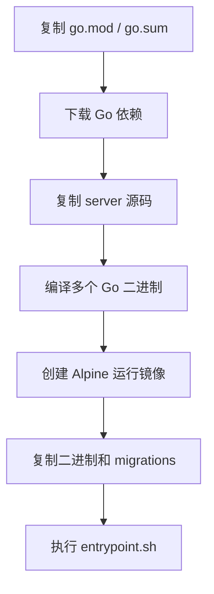

# Other — Dockerfile

## 模块概览

`Dockerfile` 定义了 Multica 后端容器镜像的构建与运行环境。它使用多阶段构建：第一阶段基于 `golang:1.26-alpine` 编译 Go 二进制文件，第二阶段基于 `alpine:3.21` 组装精简运行镜像。

该镜像主要面向 `server/` 目录下的 Go 后端，最终包含以下可执行文件：

- `server`：由 `./cmd/server` 构建，作为主要服务进程。
- `multica`：由 `./cmd/multica` 构建，通常用于 CLI 或辅助操作。
- `migrate`：由 `./cmd/migrate` 构建，用于数据库迁移相关流程。
- `backfill_task_usage_hourly`：由 `./cmd/backfill_task_usage_hourly` 构建，用于任务用量小时级回填。
- `backfill_codex_usage_cache`：由 `./cmd/backfill_codex_usage_cache` 构建，用于 Codex 用量缓存回填。

运行入口统一交给 `docker/entrypoint.sh`。

## 构建流程



### Builder 阶段

构建阶段使用：

```dockerfile
FROM golang:1.26-alpine AS builder
```

该阶段安装 `git`，因为部分 Go 模块下载可能依赖 Git：

```dockerfile
RUN apk add --no-cache git
```

工作目录为 `/src`。Dockerfile 先只复制 `server/go.mod` 和 `server/go.sum`：

```dockerfile
COPY server/go.mod server/go.sum ./server/
RUN cd server && go mod download
```

这是标准的依赖缓存模式。只要 `go.mod` 和 `go.sum` 没变，Docker 可以复用依赖下载层；业务源码变更时只需要重新执行后续源码复制和编译步骤。

随后复制完整后端源码：

```dockerfile
COPY server/ ./server/
```

### 编译产物

Dockerfile 编译五个静态 Go 二进制文件，全部输出到 `server/bin/`：

```dockerfile
RUN cd server && CGO_ENABLED=0 go build ... -o bin/server ./cmd/server
RUN cd server && CGO_ENABLED=0 go build ... -o bin/multica ./cmd/multica
RUN cd server && CGO_ENABLED=0 go build ... -o bin/migrate ./cmd/migrate
RUN cd server && CGO_ENABLED=0 go build ... -o bin/backfill_task_usage_hourly ./cmd/backfill_task_usage_hourly
RUN cd server && CGO_ENABLED=0 go build ... -o bin/backfill_codex_usage_cache ./cmd/backfill_codex_usage_cache
```

`CGO_ENABLED=0` 让产物不依赖 libc 动态链接，适合放入更小的 Alpine 运行镜像中。

`server` 和 `multica` 会注入构建元信息：

```dockerfile
ARG VERSION=dev
ARG COMMIT=unknown
ARG DATE=unknown
```

其中：

- `server` 注入 `main.version` 和 `main.commit`。
- `multica` 注入 `main.version`、`main.commit` 和 `main.date`。
- `migrate` 与两个 backfill 命令只使用 `-s -w` 压缩符号信息，不注入版本字段。

这些字段要求对应 Go 入口包中存在可通过 `-X` 设置的包级变量，例如 `main.version`、`main.commit`、`main.date`。如果变量被删除或改名，构建仍可能成功，但版本信息不会按预期写入。

## 运行镜像

运行阶段使用：

```dockerfile
FROM alpine:3.21
```

镜像只安装运行时必要依赖：

```dockerfile
RUN apk add --no-cache ca-certificates tzdata
```

- `ca-certificates` 用于 HTTPS/TLS 请求。
- `tzdata` 用于时区相关逻辑，避免运行时缺少时区数据库。

工作目录为 `/app`：

```dockerfile
WORKDIR /app
```

从 builder 阶段复制编译产物：

```dockerfile
COPY --from=builder /src/server/bin/server .
COPY --from=builder /src/server/bin/multica .
COPY --from=builder /src/server/bin/migrate .
COPY --from=builder /src/server/bin/backfill_task_usage_hourly .
COPY --from=builder /src/server/bin/backfill_codex_usage_cache .
```

同时复制数据库迁移文件和容器入口脚本：

```dockerfile
COPY server/migrations/ ./migrations/
COPY docker/entrypoint.sh .
```

`entrypoint.sh` 会被统一转换换行并赋予执行权限：

```dockerfile
RUN sed -i 's/\r$//' entrypoint.sh && chmod +x entrypoint.sh
```

这里的 `sed -i 's/\r$//'` 用于移除 Windows 风格 CRLF 换行中的 `\r`，避免 Alpine 中执行脚本时出现解释器路径异常。

## 容器入口和端口

镜像声明服务端口：

```dockerfile
EXPOSE 8080
```

实际启动命令为：

```dockerfile
ENTRYPOINT ["./entrypoint.sh"]
```

因此容器启动行为不直接由 Dockerfile 中的 `server` 命令决定，而是由 `docker/entrypoint.sh` 控制。修改启动顺序、是否先执行 `migrate`、如何选择运行 `server` 或其他辅助命令，都应优先检查和修改该脚本。

## 与代码库的关系

这个 Dockerfile 是 Go 后端的容器化边界，连接了以下代码路径：

- `server/go.mod`、`server/go.sum`：决定 Go 依赖解析与 Docker 构建缓存。
- `server/cmd/server`：主后端服务入口，产物为 `/app/server`。
- `server/cmd/multica`：CLI 入口，产物为 `/app/multica`。
- `server/cmd/migrate`：迁移入口，产物为 `/app/migrate`。
- `server/cmd/backfill_task_usage_hourly`：任务用量回填入口。
- `server/cmd/backfill_codex_usage_cache`：Codex 用量缓存回填入口。
- `server/migrations/`：运行镜像内的迁移文件目录 `/app/migrations`。
- `docker/entrypoint.sh`：容器运行时入口。

该模块没有普通代码意义上的函数调用图或执行流。它的执行模型是 Docker 构建层和容器入口脚本：构建时编译多个 Go 命令，运行时进入 `/app/entrypoint.sh`。

## 修改注意事项

新增 Go 命令时，需要同时考虑两个位置：

```dockerfile
RUN cd server && CGO_ENABLED=0 go build -ldflags "-s -w" -o bin/<命令名> ./cmd/<命令名>
COPY --from=builder /src/server/bin/<命令名> .
```

如果该命令需要在容器启动时被调用，还需要同步更新 `docker/entrypoint.sh`。

调整版本注入时，要保持 `-ldflags "-X main.version=..."` 中的变量名与对应 `cmd/*` 入口包中的变量一致。`main.version`、`main.commit`、`main.date` 是链接期注入，不是环境变量读取。

如果修改迁移目录结构，需要同步更新：

```dockerfile
COPY server/migrations/ ./migrations/
```

否则运行镜像中可能缺少 `migrate` 所需的迁移文件。

如果引入依赖 CGO 的 Go 包，需要重新评估 `CGO_ENABLED=0`。当前镜像假设所有二进制都可以静态编译并在 Alpine 运行阶段直接执行。