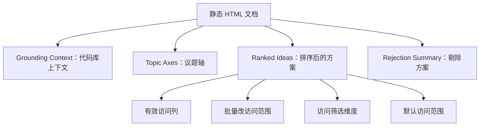

# Other — docs-ideation

## 模块定位

`docs/ideation/2026-07-14-agent-list-visibility-field-ideation.html` 是一份静态中文产品/工程构思文档，用于记录 `agents` 列表页增加“可见性 / 访问范围”能力的设计判断。它不是运行时代码模块：文件内没有 JavaScript、没有导出的函数、没有类，也没有被代码调用或参与执行流。

该文档的价值在于把一次 repo-grounded 的设计推理固化下来，帮助后续开发者理解为什么不要直接展示裸 `visibility`，而应该围绕 `permission_mode` + `invocation_targets` 建模“有效访问范围”。

## 文件结构

页面是单文件 HTML，包含三部分：

1. `<head>`：定义页面元信息、标题和内联 CSS。
2. `<style>`：定义亮色/暗色主题变量、版式、表格、卡片、徽标、图示等样式。
3. `<body>`：文档正文，按主题组织为多个 `<section>` 和 `article.idea`。

主要内容结构如下：

## 设计目标

这份文档服务于一个具体问题：在 `agents` 列表页增加“可见性范围”字段是否能提升使用效率。

文档给出的核心结论是：不要直接新增裸 `visibility` 列，而应新增“有效访问范围”列。原因是代码库中存在两个不同概念：

- `visibility`：派生字段，表示谁能看见 agent。
- `permission_mode` + `invocation_targets`：权威访问控制字段，决定谁能触发或调用 agent。

文档明确指出，裸 `visibility` 只有 `private | workspace` 两态，会把 `public_to + member` 这类“指定人员可调用”的 agent 折叠成 `private`，从而和“仅所有者”混淆。

## 关键代码引用

文档正文引用了多个真实代码位置，用来支撑设计判断：

- `packages/views/agents/components/agents-page.tsx`
  - 当前 agents 列表页位置。
  - 现有列包括 `agent / status / owner / runtime / last_active / runs / model / created`。
  - `visibility` 当前只用于计算 `isPrivate` 并展示行内小锁。
  - `AgentBatchToolbar` 和 `runBatch` 已存在，可作为批量修改访问范围的基础设施。

- `packages/core/types/agent.ts`
  - 定义 `visibility` 的派生语义。
  - 文档强调：`public_to + workspace` 映射为 `visibility: "workspace"`，其他情况会映射为 `visibility: "private"`。

- `server/.../agent_access.go`
  - `canInvokeAgent`：决定 agent 是否可被调用。
  - `canAccessPrivateAgent`：处理私有 agent 的可见性访问判断。
  - 文档用这两个函数说明“可见”和“可调用”不是同一件事。

- `agent-access-settings.tsx`
  - 包含 `AccessPicker`，可复用到批量访问范围修改流程中。

- `view-store.ts`
  - `AgentListFilters` 当前已有 `availability / runtimes / owners / models` 等筛选维度。
  - 文档建议增加 `access` 筛选维度。

## 内容模块

### Grounding Context

`#grounding` 是文档的事实基础区。它列出页面现状、列系统、权限模型、编辑入口、运营痛点和规模背景。

这一节最重要的约束是：`visibility` 是派生字段，不能直接作为“访问范围”的真实表达。后续所有方案都基于这个判断展开。

### Topic Axes

`#axes` 定义了四个分析维度：

- `what-to-show`：展示哪些权限/可见性数据。
- `how-to-display`：用列、徽标还是 tooltip 表达。
- `find-and-organize`：是否需要筛选、分组、排序。
- `manage-and-act`：是否支持行内或批量编辑，以及默认值策略。

这些轴不是代码逻辑，而是方案评估框架。

### Ranked Ideas

`#ranked` 是文档主体，包含四个 `article.idea`：

1. `#i1`：有效访问列（三态）
2. `#i2`：通过现有批量工具栏批量改访问范围
3. `#i3`：增加访问筛选维度
4. `#i4`：工作区级“新 agent 默认访问范围”

每个方案都使用同一组描述字段：

- `Basis`：依据，通常引用代码位置或运营事实。
- `Rationale`：为什么值得做。
- `Downsides`：代价或风险。
- `Confidence`：信心程度。
- `Complexity`：复杂度估计。

### Rejection Summary

`#rejections` 记录被剔除的方案，包括：

- 裸 `visibility` 列
- 独立“自动化不可达”告警标记
- 行内快切
- 按访问范围排序
- 访问范围分布计数 chip 条

这一节对后续贡献者很重要：它说明某些看似直接的实现方式已经被考虑过，并因语义误导、重复或收益不足而被排除。

## 样式系统

该 HTML 使用内联 CSS，不依赖外部样式表或脚本。主要样式模式包括：

- CSS 变量：`:root` 定义 `--bg`、`--fg`、`--muted`、`--border`、`--accent` 等主题变量。
- 暗色模式：通过 `@media (prefers-color-scheme: dark)` 覆盖变量。
- 容器：`.wrap` 控制最大宽度和页面边距。
- 想法卡片：`article.idea` 用边框、圆角和内边距组织单个方案。
- 徽标：`.id-chip`、`.pill` 用于方案编号和分类标签。
- 字段列表：`dl.fields` 使用 CSS Grid 对齐 `dt` 和 `dd`。
- 图示：`.diagram` 包裹内联 SVG。
- 页脚：`footer.composition-signal` 记录生成来源和 scratch 路径。

由于样式完全内联，该文件可以直接在浏览器中打开，不需要构建步骤。

## 与代码库的关系

该模块位于 `docs/ideation/`，属于设计记录和工程决策资料，不参与应用构建、测试或运行时调用。调用图中没有内部调用、外部调用、入站调用，也没有检测到执行流。

它连接代码库的方式是“引用和约束未来实现”：

- 为 `agents-page.tsx` 的列表列设计提供依据。
- 为 `AgentBatchToolbar` / `runBatch` 的扩展方向提供产品动机。
- 为 `AgentListFilters` 增加 `access` 维度提供上下文。
- 为 `AccessPicker` 的复用边界提供建议。
- 为权限语义避免误用 `visibility` 提供明确记录。

开发者在实现相关功能时，应把这份文档视为背景材料，而不是 API 合约。真正的行为仍以 `agent.ts`、`agent_access.go`、`agents-page.tsx` 和相关 store 代码为准。

## 维护注意事项

修改该文档时应保持以下原则：

- 不要把裸 `visibility` 描述成调用权限的权威来源。
- 新增代码引用时，应使用真实文件名、符号名和语义，不要写推测性 API。
- 如果对应实现已经落地，应更新“现有能力”“复杂度”和“剔除理由”，避免文档停留在过期状态。
- 如果访问控制模型改变，应优先更新 `Grounding Context`，因为后续方案都依赖这一节的事实判断。
- 保持单文件可阅读性；除非有明确复用需求，不需要拆分 CSS 或引入脚本。