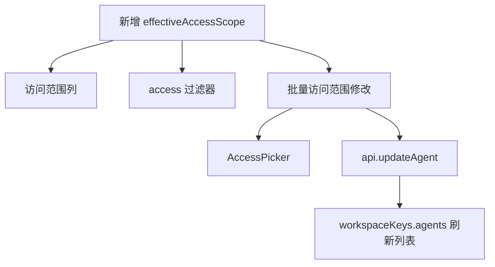

# Other — docs-plans

## 模块概览

`docs/plans/2026-07-14-001-feat-agent-list-access-scope-plan.md` 是一个实现就绪的功能计划文档，描述如何在 agents 列表页增加“访问范围”管理能力。它不是运行时代码模块，不包含函数、类或调用边，因此不会出现在执行流中；它的作用是把产品需求、技术决策、实现单元和验证标准固化为后续开发的契约。

该计划围绕一个目标：让 agent 的访问范围在列表页成为可见、可筛选、可批量修改的一等维度，避免操作者通过 SQL 或逐个打开详情页来判断和修改权限。

## 设计范围

该计划明确限定为前端改动，主要影响：

- `packages/core/agents/`
- `packages/core/agents/stores/view-store.ts`
- `packages/views/agents/components/agents-page.tsx`
- `packages/views/agents/components/agent-list-toolbar.tsx`
- `packages/views/agents/components/inspector/access-picker.tsx`
- `packages/views/locales/{en,zh-Hans,ja,ko}/agents.json`

它不要求后端 API 或数据库 schema 变更。访问范围从现有字段推导：

- `permission_mode`
- `invocation_targets`

计划中特别强调不要使用派生字段 `visibility` 作为真实访问范围来源，因为 `visibility: "private"` 无法区分“仅所有者可用”和“指定人员可用”。

## 核心语义

计划定义了三种有效访问范围：

| 范围 | 判断条件 |
| --- | --- |
| Workspace | `permission_mode: "public_to"` 且包含 workspace target |
| Specific people | `permission_mode: "public_to"` 且没有 workspace target，例如 member/team target 或无 targets |
| Owner-only | `permission_mode: "private"` |

该语义需要通过 `effectiveAccessScope(permissionMode, invocationTargets)` 统一表达。计划要求这个 helper 放在 `packages/core/agents/effective-access.ts` 中，并导出：

- `AccessScope = "workspace" | "specific-people" | "owner-only"`
- `effectiveAccessScope(permissionMode, invocationTargets)`

防御性行为也在计划中固定：

- 缺失 `permission_mode` 时返回 `owner-only`
- `permission_mode` 为 `public_to` 但缺失 `invocation_targets` 时返回 `specific-people`

## 计划结构

文档由几个契约层组成，每一层服务于不同读者：

### Product Contract

产品契约定义功能应该解决什么问题，以及用户可见行为是什么。主要需求包括：

- agents 列表增加默认可见的访问范围列
- 列表过滤器增加 `access` 多选维度
- 批量工具栏增加 “Set access scope” 操作
- 批量修改必须复用 `AccessPicker`
- 非 owner 的 agent 在批量修改中跳过
- 所有 agent 统一处理，不为 built-in agent 增加特殊逻辑

### Planning Contract

计划契约把产品需求转成代码层决策。关键决策包括：

- 使用纯前端 helper 推导访问范围
- column 和 filter 共用同一个 helper
- bulk action 通过 `api.updateAgent(id, { permission_mode, invocation_targets })` 逐个更新
- 批量修改使用 `isOwnedByMe` 做权限门禁，而不是 `canManage`
- `AccessPicker` 只增加可选的 `hideFooter` prop，避免重写权限选择 UI

### Implementation Units

实现被拆成四个单元：

1. `U1`：新增 `effectiveAccessScope` helper 和单元测试
2. `U2`：新增默认可见的访问范围列
3. `U3`：新增 `access` 过滤维度
4. `U4`：新增批量 “Set access scope” 操作和确认弹窗

这种拆分让 `U1` 成为共同依赖，`U2`、`U3`、`U4` 都依赖同一套访问范围语义，避免列、过滤器和批量操作出现判断不一致。

## 与代码库的连接

该计划文档本身没有运行时调用关系，但它准确指向后续实现需要接入的代码路径。

### 状态与列配置

`packages/core/agents/stores/view-store.ts` 负责列表视图状态。计划要求在这里扩展：

- `AgentColumnKey`
- `AGENT_DEFAULT_HIDDEN_COLUMNS`
- `AgentListFilters`
- `EMPTY_AGENT_FILTERS`

访问范围列需要加入 `AgentColumnKey`，但不能加入 `AGENT_DEFAULT_HIDDEN_COLUMNS`，因为需求要求默认可见。

### 列表渲染

`packages/views/agents/components/agents-page.tsx` 是列表页主体。计划要求在这里接入：

- `COLUMN_WIDTHS`
- grid track 变量
- header cell
- row cell
- skeleton cell
- row-filter predicate
- `AgentBatchToolbar`
- `runBatch`

访问范围 cell 应该调用 `effectiveAccessScope(row.agent.permission_mode, row.agent.invocation_targets)`，然后渲染本地化文本。

### 工具栏与过滤器

`packages/views/agents/components/agent-list-toolbar.tsx` 承担列开关和过滤器菜单。计划要求增加：

- `COLUMN_KEYS`
- `COLUMN_LABELS`
- `access` filter sub-menu
- `countActiveFilterDimensions` 对 `access` 的计数

`access` 过滤器应复用和 `availability` 过滤器相同的交互模式，包括键盘导航和 ARIA 语义。

### 批量修改

批量操作集中在 `AgentBatchToolbar` 和 `runBatch` 模式下。计划要求新增批量访问范围修改：

- 按 `isOwnedByMe` 过滤可修改 agent
- 使用 `AccessPicker` 选择 Workspace、Specific people 或 Owner-only
- 使用 `api.updateAgent` 写入 `permission_mode` 和 `invocation_targets`
- 批量完成后依赖既有 `workspaceKeys.agents(wsId)` invalidation 刷新列表

`AccessPicker` 本身只应增加 `hideFooter?: boolean`，让批量弹窗使用自己的确认按钮，避免出现两个保存入口。

## 推荐实现流



## 权限模型

计划中的批量修改权限故意比 archive/restore 更严格。archive/restore 可以依赖较宽的 `canManage`，但访问范围写入由后端按 owner-only 规则约束，因此 UI 必须使用 `isOwnedByMe`。

混合选择 owned 和 non-owned agent 时：

- 按钮在至少一个 owned agent 存在时可用
- 弹窗显示实际影响数量
- 弹窗显示跳过数量
- 确认后只对 owned agent 调用 `api.updateAgent`
- non-owned agent 不应触发失败式批处理

## 测试与验证

计划要求覆盖三个层级：

- `packages/core/agents/effective-access.test.ts`：验证三态推导和缺字段防御逻辑
- `packages/core/agents/stores/view-store.test.ts`：验证 column/filter 状态和持久化行为
- agents 页面级测试：验证列文本、过滤谓词、批量弹窗、`api.updateAgent` 调用和 query invalidation

完整验证命令包括：

```bash
pnpm typecheck
pnpm test
pnpm lint
```

另外还要求通过 `pnpm dev:web` 做浏览器 smoke test，确认真实 agents 上的列、过滤器和批量修改都能工作。

## 维护注意事项

这份计划是实现契约，不是历史备忘录。开发时应保持以下约束：

- 不要把 `visibility` 当成真实访问范围来源
- 不要在 Zustand 中镜像有效访问范围
- 不要为 built-in agent 增加特殊分支
- 不要改后端 API 或 schema
- 不要重写 `AccessPicker`，只通过 `hideFooter` 和 wrapper 复用
- zh-Hans 文案中保留产品名 `agent`

如果后续实现偏离这些点，应同步更新该计划或新增 follow-up 文档，避免计划与代码行为脱节。