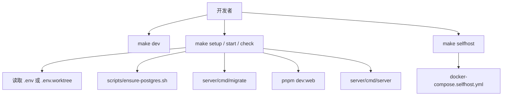

# Other — Makefile

## Makefile 模块

该 `Makefile` 是仓库本地开发、自托管、数据库维护、构建和验证流程的统一入口。它把 Go 后端、Next.js 前端、pnpm workspace、Docker Compose PostgreSQL、数据库迁移和自托管镜像编排到一组稳定的 `make` 目标中。



## 环境加载与默认值

文件顶部通过 `MAIN_ENV_FILE`、`WORKTREE_ENV_FILE` 和 `ENV_FILE` 决定当前 checkout 使用哪个环境文件：

```make
MAIN_ENV_FILE ?= .env
WORKTREE_ENV_FILE ?= .env.worktree
ENV_FILE ?= $(if $(wildcard $(MAIN_ENV_FILE)),$(MAIN_ENV_FILE),$(if $(wildcard $(WORKTREE_ENV_FILE)),$(WORKTREE_ENV_FILE),$(MAIN_ENV_FILE)))
```

优先级为：

1. 当前目录存在 `.env` 时使用 `.env`
2. 否则存在 `.env.worktree` 时使用 `.env.worktree`
3. 都不存在时默认指向 `.env`

如果 `ENV_FILE` 存在，`include $(ENV_FILE)` 会把其中的变量纳入 Make 上下文。随后定义一组本地默认值，包括：

- `POSTGRES_DB`、`POSTGRES_USER`、`POSTGRES_PASSWORD`、`POSTGRES_PORT`
- `PORT`：优先使用 `BACKEND_PORT`、`API_PORT`、`SERVER_PORT`，最后回退到 `8080`
- `FRONTEND_PORT`：默认 `3000`
- `DATABASE_URL`：默认连接本机 PostgreSQL
- `NEXT_PUBLIC_API_URL`、`NEXT_PUBLIC_WS_URL`
- `GOOGLE_REDIRECT_URI`
- `MULTICA_SERVER_URL`
- `LOCAL_UPLOAD_BASE_URL`

`export` 会把这些变量传给后续 recipe 中启动的 shell、Go 程序、pnpm 命令和脚本。

## 公共宏

### `REQUIRE_ENV`

`REQUIRE_ENV` 用于需要环境文件的目标，例如 `setup`、`start`、`stop`、`check`、`server`、`test`、`migrate-up` 和 `migrate-down`。

它检查 `$(ENV_FILE)` 是否存在；缺失时输出：

```text
Missing env file: <ENV_FILE>
Create .env from .env.example, or run 'make worktree-env' and use .env.worktree.
```

然后以非零状态退出。

### `REQUIRE_COMPOSE`

`REQUIRE_COMPOSE` 用于 `selfhost`、`selfhost-build` 和 `selfhost-stop`。它要求使用 Docker Compose CLI plugin，即 `docker compose`，并明确拒绝 legacy `docker-compose` v1。

维护这段逻辑时要注意 Make recipe 中 `$` 的展开规则：如果需要把 `$()` 留给 shell 做命令替换，应使用 `$$()`，否则 GNU Make 会先尝试把它解析成 Make 变量。

## 默认入口与帮助

默认目标是：

```make
.DEFAULT_GOAL := help
```

因此直接运行 `make` 不会启动服务，而是显示帮助信息。`help` 目标通过 `awk` 扫描 `$(MAKEFILE_LIST)`，读取两类注释：

- `##@ 分组名`：生成分组标题
- `target: ## 描述`：生成目标说明

`makehelp` 是 `help` 的别名。

## 本地开发工作流

### `make dev`

`dev` 是一键开发入口：

```make
dev:
	@bash scripts/dev.sh
```

它把完整初始化逻辑委托给 `scripts/dev.sh`，适合首次启动或日常快速启动当前 checkout。

### `make setup`

`setup` 用于准备当前 checkout：

1. 检查 `ENV_FILE`
2. 执行 `pnpm install`
3. 调用 `scripts/ensure-postgres.sh "$(ENV_FILE)"` 确保 PostgreSQL 可用
4. 在 `server/` 下执行 `go run ./cmd/migrate up`

该目标只做准备，不启动前后端服务。

### `make start`

`start` 会启动本地后端和前端：

1. 检查环境文件
2. 确保 PostgreSQL 可用
3. 执行数据库迁移
4. 并行启动：
   - `cd server && go run ./cmd/server`
   - `pnpm dev:web`

它使用 shell `trap 'kill 0' EXIT`，当前台 `make start` 退出时会终止同一进程组中的后端和前端子进程。

### `make stop`

`stop` 根据 `PORT` 和 `FRONTEND_PORT` 查找并杀掉本地进程：

```make
lsof -ti:$(PORT) | xargs kill -9
lsof -ti:$(FRONTEND_PORT) | xargs kill -9
```

随后根据 `DATABASE_URL` 判断数据库是否为本机地址。对于本机 PostgreSQL，它只停止应用进程，不停止共享数据库容器；对于远程数据库，它也不会尝试修改远端服务。

## 主 checkout 与 worktree

该 Makefile 显式支持主 checkout 和 Git worktree 共存。

主 checkout 使用 `.env`：

- `setup-main`
- `start-main`
- `stop-main`
- `check-main`

worktree 使用 `.env.worktree`：

- `worktree-env`
- `setup-worktree`
- `start-worktree`
- `stop-worktree`
- `check-worktree`

`worktree-env` 调用：

```make
bash scripts/init-worktree-env.sh .env.worktree
```

用于生成带独立数据库名和端口的 worktree 环境，避免多个 checkout 之间抢占同一组端口或数据库。

## 数据库目标

### `db-up` 和 `db-down`

`db-up` 启动共享 PostgreSQL 容器：

```make
docker compose up -d postgres
```

`db-down` 停止 Compose stack：

```make
docker compose down
```

### `db-reset`

`db-reset` 会删除并重建当前环境指向的数据库，然后重新运行迁移。它只允许操作本机数据库地址，遇到远程 `DATABASE_URL` 会拒绝执行：

```make
Refusing to reset: DATABASE_URL points at a remote host.
```

实际重建通过 Compose 中的 `postgres` 服务执行：

```make
docker compose exec -T postgres psql -U $(POSTGRES_USER) -d postgres \
  -c "DROP DATABASE IF EXISTS \"$(POSTGRES_DB)\" WITH (FORCE);" \
  -c "CREATE DATABASE \"$(POSTGRES_DB)\";"
```

### `migrate-up` 和 `migrate-down`

这两个目标都会先确保数据库存在，然后进入 `server/` 运行迁移命令：

```make
go run ./cmd/migrate up
go run ./cmd/migrate down
```

### `sqlc`

`sqlc` 在 `server/` 下执行：

```make
sqlc generate
```

用于根据 SQL schema 和 query 文件重新生成 Go 数据访问代码。

## 构建与测试

### `build`

`build` 生成三个 Go 二进制文件到 `server/bin`：

- `server/bin/server`，来自 `./cmd/server`
- `server/bin/multica`，来自 `./cmd/multica`
- `server/bin/migrate`，来自 `./cmd/migrate`

版本信息来自：

```make
VERSION ?= $(shell git describe --tags --match 'v[0-9]*' --always --dirty 2>/dev/null || echo dev)
COMMIT  ?= $(shell git rev-parse --short HEAD 2>/dev/null || echo unknown)
DATE    ?= $(shell date -u '+%Y-%m-%dT%H:%M:%SZ')
```

`multica` CLI 会通过 `-ldflags` 注入 `main.version`、`main.commit` 和 `main.date`。

### `test`

`test` 只覆盖 Go 测试流程：

1. 检查环境文件
2. 确保 PostgreSQL 可用
3. 执行迁移
4. 对除 `pkg/agent` 外的包执行 `go test -race`
5. 对 `./pkg/agent/...` 单独执行 `go test -race -p 2 -parallel 2`

`pkg/agent` 被单独处理，是因为该包包含大量依赖子进程和 5 秒硬截止时间的测试；在高核机器和 `-race` 下，默认并发度可能导致父事件循环饥饿。

### `check`

`check` 是完整本地验证入口：

```make
ENV_FILE="$(ENV_FILE)" bash scripts/check.sh
```

根据目标描述，它覆盖 TypeScript typecheck、TS 单元测试、Go 测试和 Playwright E2E。具体步骤由 `scripts/check.sh` 维护。

## CLI 与后端入口

### `server`

`server` 只启动 Go 后端：

```make
cd server && go run ./cmd/server
```

启动前会检查环境并确保 PostgreSQL 可用。

### `multica`

`multica` 从源码运行 CLI 入口：

```make
cd server && go run -ldflags "...version/commit/date..." ./cmd/multica $(MULTICA_ARGS)
```

`MULTICA_ARGS` 默认来自 `ARGS`：

```make
MULTICA_ARGS ?= $(ARGS)
```

因此可以使用：

```bash
make cli ARGS="daemon restart --profile local"
```

### `cli`

`cli` 是 `multica` 的转发目标：

```make
@$(MAKE) multica MULTICA_ARGS="$(MULTICA_ARGS)"
```

### `daemon`

`daemon` 通过源码 CLI 重启本地 agent daemon：

```make
make multica MULTICA_ARGS="daemon restart --profile local"
```

## 自托管目标

自托管流程基于 Docker Compose 文件：

- `docker-compose.selfhost.yml`
- `docker-compose.selfhost.build.yml`

### `selfhost`

`selfhost` 用于拉取官方镜像并启动自托管 stack。它会：

1. 检查 `docker compose`
2. 如果 `.env` 不存在，则从 `.env.example` 复制
3. 生成 `JWT_SECRET` 和 `POSTGRES_PASSWORD`
4. 拉取官方镜像
5. 执行 `docker compose -f docker-compose.selfhost.yml up -d`
6. 轮询 `http://localhost:${PORT:-8080}/health`
7. 输出前端、后端和 CLI 连接提示

如果官方镜像尚未发布，目标会提示改用：

```bash
make selfhost-build
```

### `selfhost-build`

`selfhost-build` 与 `selfhost` 类似，但不拉取官方镜像，而是从当前 checkout 构建：

```make
docker compose -f docker-compose.selfhost.yml -f docker-compose.selfhost.build.yml up -d --build
```

本地镜像标签为：

- `multica-backend:dev`
- `multica-web:dev`

### `selfhost-stop`

`selfhost-stop` 停止自托管 stack：

```make
docker compose -f docker-compose.selfhost.yml down
```

## 清理目标

`clean` 删除本地构建产物、缓存和临时文件，包括：

- `server/bin`
- `server/tmp`
- `apps/*/.next`
- `apps/*/.source`
- `apps/*/.expo`
- `apps/*/out`
- `apps/*/dist`
- `apps/*/dist-electron`
- `packages/*/dist`
- `.turbo`
- `apps/*/.turbo`
- `packages/*/.turbo`
- `*.tsbuildinfo`

它不会删除 `.env`、`.env.worktree`、数据库 volume 或 `node_modules`。

## 与代码库其他部分的关系

该 Makefile 不定义应用源码中的函数或类，也没有源码级调用图。它的作用是把仓库中的关键入口连接起来：

- Go 后端入口：`server/cmd/server`
- Go CLI 入口：`server/cmd/multica`
- Go 迁移入口：`server/cmd/migrate`
- 数据库准备脚本：`scripts/ensure-postgres.sh`
- worktree 环境生成脚本：`scripts/init-worktree-env.sh`
- 一键开发脚本：`scripts/dev.sh`
- 完整验证脚本：`scripts/check.sh`
- 前端开发命令：`pnpm dev:web`
- PostgreSQL Compose 服务：`docker compose up -d postgres`
- 自托管 Compose 配置：`docker-compose.selfhost.yml`

维护该文件时，应优先保持这些目标的职责边界清晰：`setup` 只做准备，`start` 负责启动，`check` 负责验证，`db-reset` 只操作当前环境的本地数据库，`selfhost*` 只处理 Docker Compose 自托管流程。