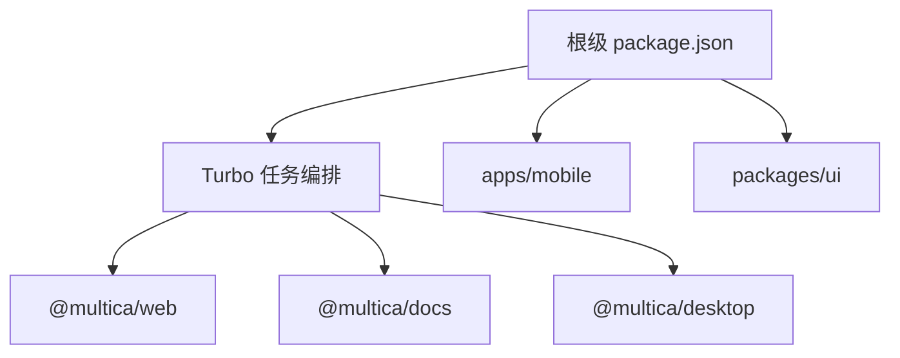

# Other — package.json

## package.json

根级 `package.json` 是 multica monorepo 的 Node 工具入口。它不包含业务运行时代码，也没有函数调用图或执行流；它的职责是声明仓库级脚本、固定包管理器版本、配置 pnpm 安装策略，并集中放置根级开发工具依赖。

这个文件主要连接三类代码区域：



## 模块定位

`package.json` 通过以下字段定义仓库的基础行为：

- `"name": "multica"`：根包名称。
- `"version": "0.2.0"`：当前仓库版本。
- `"private": true`：禁止根包被发布到 npm。
- `"type": "module"`：根级 Node 脚本默认按 ESM 解析，例如 `scripts/generate-reserved-slugs.mjs`。
- `"packageManager": "pnpm@10.28.2"`：固定 pnpm 版本，确保本地和 CI 使用一致的包管理器行为。

业务依赖通常应放在具体 workspace 的 `package.json` 中；根级 `devDependencies` 只适合放跨仓库工具，例如 `turbo`、`typescript`、`@playwright/test`。

## 脚本分组

### 本地开发脚本

根脚本提供不同端的开发入口：

```json
{
  "dev:web": "turbo dev --filter=@multica/web",
  "dev:docs": "turbo dev --filter=@multica/docs",
  "dev:desktop": "turbo dev --filter=@multica/desktop",
  "dev:desktop:staging": "turbo dev:staging --filter=@multica/desktop"
}
```

这些脚本通过 Turbo 的 `--filter` 精确运行目标 workspace。新增 web、docs、desktop 相关仓库级命令时，应优先沿用这种模式，而不是在根脚本中手写进入目录后的命令。

移动端命令没有走 Turbo，而是直接委托给 `apps/mobile`：

```json
{
  "dev:mobile": "pnpm -C apps/mobile dev",
  "dev:mobile:staging": "pnpm -C apps/mobile dev:staging",
  "dev:mobile:prod": "pnpm -C apps/mobile dev:prod"
}
```

这说明 mobile 包的开发命令由 `apps/mobile/package.json` 自己定义，根文件只提供便捷入口。

### iOS 移动端脚本

`ios:mobile*` 系列脚本同样通过 `pnpm -C apps/mobile` 调用移动端包内脚本：

```json
{
  "ios:mobile": "pnpm -C apps/mobile ios",
  "ios:mobile:device:staging:release": "pnpm -C apps/mobile ios:device:staging:release",
  "ios:mobile:device:prod:release": "pnpm -C apps/mobile ios:device:prod:release"
}
```

命名规则表达了执行目标：

- `ios:mobile`：启动 iOS 默认流程。
- `device`：面向真机。
- `staging` / `prod`：选择环境。
- `release`：选择发布构建类型。

如果新增移动端环境或构建模式，应先在 `apps/mobile/package.json` 中实现对应脚本，再在根级 `package.json` 暴露同名便捷入口。

### 构建与校验脚本

根级质量命令都通过 Turbo 执行，并显式排除 `@multica/mobile`：

```json
{
  "build": "turbo build --filter=!@multica/mobile",
  "typecheck": "turbo typecheck --filter=!@multica/mobile",
  "test": "turbo test --filter=!@multica/mobile",
  "lint": "turbo lint --filter=!@multica/mobile"
}
```

这表示根级 `pnpm build`、`pnpm typecheck`、`pnpm test`、`pnpm lint` 覆盖除 mobile 外的 workspace。移动端有独立工具链时，应继续使用 `apps/mobile` 自身脚本验证，不要假设根级质量命令会覆盖它。

### 维护脚本

```json
{
  "clean": "turbo clean && rm -rf node_modules",
  "ui:add": "cd packages/ui && npx shadcn@latest add",
  "generate:reserved-slugs": "node scripts/generate-reserved-slugs.mjs"
}
```

- `clean`：先运行各 workspace 的 Turbo 清理任务，再删除根级 `node_modules`。
- `ui:add`：进入 `packages/ui` 后调用 `shadcn@latest add`，用于添加 UI 组件。由于 `packages/ui` 不能依赖 `@multica/core`，添加组件后需要保持 UI 包的无业务逻辑边界。
- `generate:reserved-slugs`：执行 `scripts/generate-reserved-slugs.mjs`，用于生成保留 slug 相关产物。

## pnpm 配置

### onlyBuiltDependencies

```json
{
  "onlyBuiltDependencies": [
    "esbuild",
    "electron"
  ]
}
```

pnpm 只允许这里列出的依赖执行构建脚本。当前允许 `esbuild` 和 `electron`，这通常用于需要 native/binary 安装步骤的工具链。

如果新增依赖需要安装期构建脚本，必须显式评估后再加入 `onlyBuiltDependencies`，避免无意扩大安装阶段可执行代码范围。

### overrides

```json
{
  "overrides": {
    "@types/react": "catalog:",
    "@types/react-dom": "catalog:",
    "@xmldom/xmldom": "^0.8.13"
  }
}
```

`overrides` 用于强制整个 workspace 的依赖解析结果：

- `@types/react` 和 `@types/react-dom` 使用 pnpm catalog 版本，保证 React 类型版本在 monorepo 内一致。
- `@xmldom/xmldom` 被固定到 `^0.8.13`，用于覆盖传递依赖中的版本选择。

新增全局覆盖时，应优先确认它影响的 workspace 范围，避免为修复单个包的问题而改变整个仓库的依赖树。

## 根级开发依赖

```json
{
  "@playwright/test": "^1.58.2",
  "@types/node": "catalog:",
  "@types/pg": "^8.20.0",
  "pg": "^8.20.0",
  "turbo": "^2.5.4",
  "typescript": "catalog:"
}
```

这些依赖服务于仓库级工具和脚本：

- `turbo`：执行 `build`、`typecheck`、`test`、`lint`、`dev:*` 等跨 workspace 任务。
- `typescript`：提供统一 TypeScript 工具版本，版本来自 pnpm catalog。
- `@types/node`：提供 Node 类型定义，版本来自 pnpm catalog。
- `@playwright/test`：提供端到端或浏览器测试能力。
- `pg` / `@types/pg`：提供 PostgreSQL 客户端及类型，供根级脚本或测试工具使用。

业务包运行时依赖不应随意添加到根级 `devDependencies`。如果某个依赖只被 `apps/web`、`apps/desktop` 或某个 `packages/*` 使用，应添加到对应包中。

## 贡献时的常见修改规则

修改根级 `package.json` 时，优先遵循现有模式：

- 跨 workspace 的任务使用 `turbo <task> --filter=...`。
- mobile 相关任务使用 `pnpm -C apps/mobile <script>`。
- 非 mobile 的全仓库质量任务保持 `--filter=!@multica/mobile` 语义一致。
- 共享版本优先使用 `catalog:`，具体版本应在 pnpm workspace catalog 中维护。
- UI 组件生成入口保持在 `packages/ui` 内执行。
- 新增根级依赖前先确认它确实是仓库级工具依赖，而不是某个 workspace 的局部依赖。

## 常用命令

```bash
pnpm dev:web
pnpm dev:desktop
pnpm dev:mobile

pnpm build
pnpm typecheck
pnpm test
pnpm lint

pnpm ui:add
pnpm generate:reserved-slugs
```

根级命令的核心作用是“分发任务”，不是承载业务逻辑。理解这个文件时，应把它看作 monorepo 的命令索引和安装策略声明。