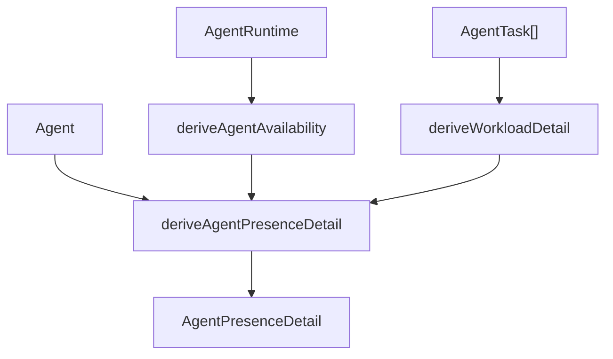

# Other — packages-core

## packages-core 其他核心模块

本模块覆盖 `packages/core` 中偏横向的前端核心逻辑，主要包括两类能力：Agent 派生状态与视图偏好，以及前端 analytics 事件处理。它们都遵循 `packages/core` 的边界约束：保存可复用业务逻辑，不直接依赖 Next.js、路由实现或应用层组件。

## Agent 状态与配置

`packages/core/agents` 负责把后端返回的原始 Agent、Runtime、Task 数据转换成 UI 可直接使用的状态，并提供相关查询、偏好 store 与配置工具。

### Presence 派生

核心文件是 `derive-presence.ts` 和 `types.ts`。后端只存储事实，例如任务状态、runtime 在线状态、`last_seen_at`、`archived_at`；前端通过纯函数派生用户可见的 presence。

Presence 被拆成两个正交维度：

- `AgentAvailability`：runtime 可达性，取值为 `online`、`unstable`、`offline`、`archived`
- `Workload`：当前任务负载，取值为 `working`、`queued`、`idle`

这两个维度不会互相覆盖。比如 `offline + queued` 表示 runtime 不可达但还有任务排队，是明确的“卡住”状态；`unstable + working` 表示 runtime 刚掉线但仍有运行中任务记录。

关键函数：

- `deriveAgentAvailability(runtime, now)`  
  基于 `deriveRuntimeHealth` 派生可达性。`online` 保持为 `online`，`recently_lost` 映射为 `unstable`，`offline` 和 `about_to_gc` 都折叠为 `offline`。缺失 runtime 也视为 `offline`。

- `deriveWorkload({ runningCount, queuedCount })`  
  对计数做三态分类：有运行中任务就是 `working`；无运行中但有排队任务就是 `queued`；否则 `idle`。

- `deriveWorkloadDetail(tasks)`  
  扫描任务列表并统计当前负载。`running` 计入 `runningCount`；`queued`、`dispatched`、`waiting_local_directory` 计入 `queuedCount`；`completed`、`failed`、`cancelled` 被忽略，因为历史结果由 Recent Work 和 Inbox 展示。

- `deriveAgentPresenceDetail({ agent, runtime, tasks, now })`  
  组合 availability 与 workload，并把 `agent.max_concurrent_tasks` 写入 `capacity`。如果 `agent.archived_at` 存在，会直接返回 `availability: "archived"`、`workload: "idle"`、计数为 0，避免已归档 Agent 因残留 runtime 或 task 显示成在线。

- `buildPresenceMap({ agents, runtimes, snapshot, now })`  
  工作区级批量构建 `Map<string, AgentPresenceDetail>`。它先按 `runtime.id` 建索引，再按 `task.agent_id` 分组，避免列表页每行重复扫描所有任务。

React Hook 层在 `use-agent-presence.ts`：

- `useWorkspacePresenceMap(wsId)` 是列表、卡片、runtime 子页面的首选入口，一次订阅 `agentListOptions`、`runtimeListOptions`、`agentTaskSnapshotOptions`，然后通过 `buildPresenceMap` 批量派生。
- `useAgentPresenceDetail(wsId, agentId)` 用于单 Agent 场景。缺失 Agent 时返回灰色离线的 `MISSING_AGENT_DETAIL`，缺失 runtime 则交给 `deriveAgentPresenceDetail` 解释为离线。
- 内部 `usePresenceTick()` 每 30 秒触发一次重新计算，用于让 `unstable` 在 5 分钟窗口结束后自然衰减为 `offline`。

### Agent 查询

`queries.ts` 集中定义 Agent 相关 React Query key 和 query options：

- `agentTaskSnapshotOptions(wsId)`：工作区级任务快照，包含所有活跃任务和每个 Agent 最近一条终态任务。presence 派生以它为单一任务来源。
- `agentActivity30dOptions(wsId)`：最近 30 天按天聚合的任务活动。
- `agentRunCounts30dOptions(wsId)`：最近 30 天运行次数，用于 Agents 列表 RUNS 列。
- `agentTasksOptions(wsId, agentId)`：单个 Agent 的完整任务列表。
- `agentTemplateListOptions()` / `agentTemplateDetailOptions(slug)`：服务端内置模板目录，使用 `staleTime: Infinity`。

这些 options 都通过 `api` 客户端调用后端方法，例如 `api.getAgentTaskSnapshot()`、`api.getWorkspaceAgentActivity30d()`、`api.listAgentTasks(agentId)`。

### Activity 派生

`use-agent-activity.ts` 提供 Agent 活动热度数据：

- `useWorkspaceActivityMap(wsId)` 同时读取 Agent 列表和 30 天 bucket，一次性构建 `Map<agentId, AgentActivity>`。
- `buildActivityMap(agents, buckets, now)` 按 `agent_id` 分组 bucket，再逐个 Agent 调用 `deriveAgentActivity`。
- `deriveAgentActivity(buckets, agentCreatedAt, now)` 生成固定 30 个 bucket，顺序为旧到新。无活动日期补零，超出 30 天窗口的 bucket 被忽略。
- `summarizeActivityWindow(activity, windowDays)` 截取尾部 N 天并汇总 `totalRuns`、`totalFailed`，供列表 7 天 sparkline 和详情页 30 天面板共用。

日期边界由内部 `startOfDay(ts)` 按本地时区计算，符合用户对“今天/昨天”的直觉。

### 访问范围与可见性

`effective-access.ts` 解决 legacy `visibility` 字段表达能力不足的问题。真实访问控制由 `permission_mode` 与 `invocation_targets` 决定：

- `effectiveAccessScope(permissionMode, invocationTargets)` 返回 `"workspace"`、`"specific-people"` 或 `"owner-only"`。
- `ALL_ACCESS_SCOPES` 定义展示顺序。
- `isAccessChangeReady(change)` 判断批量访问修改弹窗的 Apply 是否可用：未选择为 false；`private` 总是可提交；`public_to` 必须至少有一个 target。

`visibility-label.ts` 仍提供旧 `AgentVisibility` 的展示文案：

- `VISIBILITY_LABEL`
- `VISIBILITY_DESCRIPTION`
- `VISIBILITY_TOOLTIP`
- `visibilityLabel(v)`

注意 `private` 在 UI 中显示为 `Personal`，描述也明确包含 workspace owner/admin 的可分配权限。

### Agent 视图 Store

`packages/core/agents/stores` 中有两个 Zustand store。

`useAgentsViewStore` 保存 Agents 列表偏好：

- `scope`: `"mine"`、`"all"`、`"archived"`
- `sortField`: `"lastActive"`、`"name"`、`"runs"`、`"created"`
- `sortDirection`: `"asc"` 或 `"desc"`
- `hiddenColumns`
- `filters`: `availability`、`runtimes`、`owners`、`models`、`access`

它使用 `createWorkspaceAwareStorage(defaultStorage)` 按工作区 namespace 持久化，例如测试中会写入 `multica_agents_view:acme`。`registerForWorkspaceRehydration` 在工作区切换时触发 rehydrate，避免把上一个工作区的筛选状态泄漏到新工作区。`merge` 会把旧持久化 payload 与 `EMPTY_AGENT_FILTERS` 深合并，防止新增筛选维度缺失后访问 `.length` 崩溃。

`useTranscriptViewStore` 保存任务 transcript 视图偏好：

- `sortDirection`: `"chronological"` 或 `"newest_first"`
- `preserveFilters`
- `selectedFilterKeys`
- `defaultExpanded`

内部 `uniqueFilterKeys` 会过滤空字符串并去重，持久化 key 为 `multica_transcript_view`。

### Provider 与 OpenClaw 配置

`mcp-support.ts` 用 `providerSupportsMcpConfig(provider)` 判断某个 runtime provider 是否消费 `agent.mcp_config`。只有在 `MCP_SUPPORTED_PROVIDERS` 集合内的 provider 才应该显示 MCP 配置页，避免用户保存 runtime 会忽略的值。

`openclaw-runtime-config.ts` 定义 OpenClaw 专用 `agent.runtime_config` schema：

- `OpenclawRoutingMode`: `"local"` 或 `"gateway"`
- `OpenclawGatewayPin`: `host`、`port`、`token`、`tls`
- `OpenclawRuntimeConfig`
- `OPENCLAW_GATEWAY_TOKEN_MASK = "***"`

相关函数：

- `parseOpenclawRuntimeConfig(raw)` 从任意 JSONB payload 中解析合法字段，非法输入返回空对象。
- `serializeOpenclawRuntimeConfig(cfg)` 把表单状态序列化为 API wire shape。空字段不输出；token mask 会保留，用于通知后端保留已存 token。
- `openclawRuntimeConfigEquals(a, b)` 做稳定浅比较，把缺失 gateway 与空 gateway 视为相同。

### 其他 Agent 工具

`useUpdateAgentAllowlist(agentId)` 是 Composio toolkit allowlist 的 mutation hook。它通过 `api.updateAgent(agentId, { composio_toolkit_allowlist })` 写入，先乐观更新 `workspaceKeys.agents(wsId)`，失败时回滚，结束后 invalidate 以同步后端规范化结果。

`useWorkspaceAgentAvailability()` 返回当前用户在工作区内是否有可聊天/可分配的 Agent：

- `"loading"`：Agent 或 member 查询未完成
- `"none"`：查询完成但没有可用 Agent
- `"available"`：至少有一个未归档且通过 `canAssignAgentToIssue` 的 Agent

它同时读取 `agentListOptions(wsId)` 和 `memberListOptions(wsId)`，因为 `canAssignAgentToIssue` 需要当前用户角色判断 private Agent 权限。

`useWorkspacePresencePrefetch(wsId)` 用于提前预热 Agent presence 和 mention suggestion 需要的查询：Agent、runtime、task snapshot、squad 列表。

`AGENT_DESCRIPTION_MAX_LENGTH` 是前后端共享的 Agent 描述长度上限，当前为 255。

## Analytics 事件处理

`packages/core/analytics` 是 posthog-js 的前端封装。它不负责服务端 funnel 事件；signup、workspace_created、runtime_registered、issue_executed、invite_sent、invite_accepted 等由 `server/internal/analytics` 发出。前端主要处理初始化、身份绑定、异常上报、归因和客户端事件。

### 初始化与 super properties

`index.ts` 中的 `initAnalytics` 读取后端 `/api/config` 提供的 PostHog key 和 host。配置不来自 `NEXT_PUBLIC_*`，避免 self-hosted Docker 镜像泄露项目 key。

初始化后会注册公共属性：

- `client_type`: `web` 或 `desktop`，通过 `window.electron` 判断桌面端
- `app_version`: 传入时注册
- `environment`
- `event_schema_version`
- `is_demo`

`EVENT_SCHEMA_VERSION` 当前为 `2`。

`resetAnalytics()` 调用 `posthog.reset()` 后会重新注册缓存的 super properties，避免 reset 清空后续事件需要的 `client_type`、`app_version` 等字段。

### 初始化前缓冲

测试覆盖了 `captureException` 的初始化前缓冲行为：如果 `captureException(err, props)` 在 `initAnalytics()` 前调用，事件会先保存在内存中；初始化完成后按顺序 flush。初始化后调用则直接转发给 `posthog.captureException`。

源码注释还表明 `identify()`、前端 `captureEvent()`、`setPersonProperties()` 也存在类似的配置竞态处理：`auth-initializer` 可能并行请求 `/api/config` 和 `/api/me`，所以身份绑定和事件可能早于 analytics 初始化到达。

### `$exception` 处理管线

`index.ts` 在 posthog `before_send` 中处理 `$exception`。管线顺序很重要：

1. `isBenignException(properties)` 识别已知无害异常，直接丢弃。
2. `redactExceptionProperties(properties)` 对异常内容做脱敏。
3. `shouldDropException(properties)` 对脱敏后的异常做 session 级去重限流。
4. 非 `$exception` 事件原样通过。

`benign-exceptions.ts` 当前只静默 ResizeObserver loop 类错误：

- `ResizeObserver loop limit exceeded`
- `ResizeObserver loop completed with undelivered notifications`

`isBenignException(properties)` 会从顶层 `$exception_message` 和 `$exception_list[].value` 中读取消息，大小写不敏感匹配 `/ResizeObserver loop/i`。任何缺失或异常形状都返回 false，即保留事件。

`exception-dedupe.ts` 提供 `shouldDropException(properties)`：

- 作用域是浏览器 tab session，存储在 `sessionStorage`
- 存储 key 为 `mc_exc_fp`
- 每个 fingerprint 保留前 3 次，第四次开始丢弃
- 最多追踪 50 个不同 fingerprint
- 只存 hash 和计数，不把原始异常消息、文件名或 PII 写入 storage
- 所有 storage 失败都 fail open，也就是保留事件

fingerprint 由异常类型、脱敏后的 value/message，以及一个确定性的 stack frame 组成。frame 字段支持缺失，`colno` 会参与 fingerprint，以区分压缩 bundle 中同一行的不同错误。没有稳定信号时返回 `null`，事件不会被去重。

## 与代码库其他部分的连接

这些 core 模块主要被 `apps/*` 和 `packages/views/*` 消费：

- Agent presence 的查询 options 被 runtime 卡片、Agent 列表、Agent 详情页、hover card、mention 入口等复用。
- `useWorkspacePresenceMap` 和 `useWorkspaceActivityMap` 避免列表页按行发起重复订阅，是 Agent 列表性能的关键入口。
- `useAgentsViewStore` 依赖 `platform/workspace-storage`，随工作区切换重新加载偏好。
- `useWorkspaceAgentAvailability` 与 `permissions/canAssignAgentToIssue` 保持一致，避免聊天入口、AssigneePicker 和 Agent 下拉菜单对“是否可用”的判断分叉。
- analytics 模块由 web 和 desktop 应用初始化；桌面端通过 `window.electron` 自动带上 `client_type: "desktop"`。
- API 查询统一通过 `packages/core/api`，具体解析由 client/schema 层负责，例如调用图中多个 API 方法都会通过 `parseWithFallback` 解析响应。

## 贡献注意事项

修改 presence 逻辑时，优先改纯函数并补充 `derive-presence.test.ts`。特别注意不要把历史任务结果混入 `Workload`，也不要让 workload 改变 availability 的颜色语义。

新增 Agent 列表筛选维度时，需要同时更新 `AgentListFilters`、`EMPTY_AGENT_FILTERS`、持久化测试和 rehydrate merge 逻辑，保证旧 localStorage payload 能正常补齐默认值。

新增支持 MCP 配置的 provider 时，需要更新 `MCP_SUPPORTED_PROVIDERS`，并确认后端 `server/pkg/agent/` 或 `server/internal/daemon/execenv/` 确实会消费对应配置。

修改 OpenClaw runtime_config 字段时，需要同步后端 `server/internal/daemon/openclaw_runtime_config.go` 和 handler 中 token mask 的 preserve 逻辑。

新增 analytics 静默规则时要非常保守：`benign-exceptions.ts` 只适合浏览器自恢复、无行动价值且高噪声的错误。真实业务错误应交给 `exception-dedupe.ts` 限流，而不是完全丢弃。