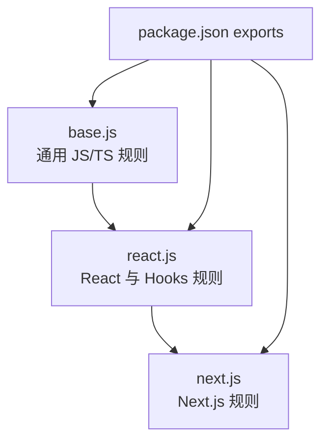

# Other — packages-eslint-config

## 模块定位

`packages/eslint-config` 提供 monorepo 内共享的 ESLint Flat Config。它不是运行时代码模块，没有内部函数调用、类实例化或业务执行流；它的输出是多个 `Linter.Config[]` 默认导出，供各 workspace 包的 `eslint.config.*` 复用。

配置分三层：



## 对外入口

`package.json` 将三个配置文件作为子路径导出：

```json
{
  "exports": {
    "./base": "./base.js",
    "./react": "./react.js",
    "./next": "./next.js"
  }
}
```

消费者按项目类型选择对应入口：

```js
// 普通 TypeScript / Node 包
import config from "@multica/eslint-config/base";

export default config;
```

```js
// React 包
import config from "@multica/eslint-config/react";

export default config;
```

```js
// Next.js 应用
import config from "@multica/eslint-config/next";

export default config;
```

模块声明了 `"type": "module"`，因此所有配置文件都使用 ESM `import` / `export default`。

## `base.js`

`base.js` 是所有配置的基础层，默认导出一个 ESLint Flat Config 数组：

```js
export default [
  eslint.configs.recommended,
  ...tseslint.configs.recommended,
  {
    plugins: {
      "import-x": importPlugin,
    },
    rules: {
      "@typescript-eslint/no-unused-vars": "off",
      "@typescript-eslint/no-explicit-any": "off",
      "import-x/no-extraneous-dependencies": ["error", { ... }],
    },
  },
  {
    ignores: [
      "node_modules/",
      "dist/",
      ".next/",
      "out/",
    ],
  },
];
```

它组合了三类能力：

1. `@eslint/js` 的 `eslint.configs.recommended`
2. `typescript-eslint` 的 `configs.recommended`
3. `eslint-plugin-import-x` 的依赖声明校验

### TypeScript 相关取舍

`@typescript-eslint/no-unused-vars` 被关闭：

```js
"@typescript-eslint/no-unused-vars": "off"
```

原因是未使用变量和参数已经由 TypeScript 编译器的 `noUnusedLocals` / `noUnusedParameters` 负责检查。这样可以避免 ESLint 与 `tsc` 重复报告同一类问题。

`@typescript-eslint/no-explicit-any` 也被关闭：

```js
"@typescript-eslint/no-explicit-any": "off"
```

这表示仓库允许在必要场景中显式使用 `any`。类型质量主要依赖 TypeScript 编译配置、代码评审和具体包的边界约束，而不是由 ESLint 全局禁止。

### 依赖边界检查

`import-x/no-extraneous-dependencies` 用于阻止“幽灵依赖”：代码导入的包必须出现在当前 package 的 `package.json` 中。

```js
"import-x/no-extraneous-dependencies": ["error", {
  devDependencies: [
    "**/*.test.{ts,tsx}",
    "**/*.spec.{ts,tsx}",
    "**/test/**",
    "**/tests/**",
    "**/vitest.config.*",
    "**/vite.config.*",
    "**/electron.vite.config.*",
    "**/eslint.config.*",
    "**/scripts/**",
    "**/src/main/**",
    "**/src/preload/**",
  ],
  peerDependencies: true,
}]
```

`devDependencies` 白名单覆盖测试、构建配置、脚本、Electron main/preload 等非生产运行路径。这些文件允许依赖开发期工具包。

`peerDependencies: true` 允许导入 peer dependency，适用于共享包或插件类包。

### 忽略路径

基础配置统一忽略生成物和依赖目录：

```js
ignores: [
  "node_modules/",
  "dist/",
  ".next/",
  "out/",
]
```

这些目录通常由包管理器、构建器或 Next.js 生成，不应参与源码 lint。

## `react.js`

`react.js` 在 `base.js` 之上增加 React 和 React Hooks 规则：

```js
import baseConfig from "./base.js";
import reactPlugin from "eslint-plugin-react";
import reactHooksPlugin from "eslint-plugin-react-hooks";

export default [
  ...baseConfig,
  { ...React JSX 规则... },
  { ...React Hooks 规则... },
];
```

### JSX 文件规则

React 插件只作用于 JSX/TSX 文件：

```js
files: ["**/*.{jsx,tsx}"]
```

启用的规则来自：

```js
...reactPlugin.configs.recommended.rules,
...reactPlugin.configs["jsx-runtime"].rules,
```

`jsx-runtime` 配置匹配现代 React JSX transform，不要求每个 JSX 文件显式导入 `React`。

仓库还关闭了两条 React 规则：

```js
"react/prop-types": "off",
"react/no-unknown-property": "off",
```

`react/prop-types` 关闭是因为 TypeScript 已承担组件 props 类型检查。

`react/no-unknown-property` 关闭通常用于兼容非标准 JSX 属性场景，例如某些底层 UI、动画、SVG、Canvas 或框架扩展属性。贡献代码时仍应优先使用 React 支持的属性名，只有确有需要时才依赖这个放宽项。

React 版本通过插件自动探测：

```js
settings: {
  react: { version: "detect" },
}
```

### Hooks 规则

React Hooks 规则作用于所有 JS/TS 文件：

```js
files: ["**/*.{ts,tsx,js,jsx}"]
```

这是一个有意设计：hooks 不一定只写在 `.tsx` 文件中，`useEffect`、`useCallback`、`useMemo` 相关逻辑也可能出现在纯 `.ts` 模块里。把 `react-hooks` 应用于 `.ts` 文件，可以让 `exhaustive-deps` 和相关 inline disable 注释正常生效。

规则来源是：

```js
...reactHooksPlugin.configs["recommended-latest"].rules
```

## `next.js`

`next.js` 面向 `apps/web` 这类 Next.js 应用。它先继承完整 React 配置，再添加 Next.js 官方规则：

```js
import reactConfig from "./react.js";
import nextPlugin from "@next/eslint-plugin-next";

export default [
  ...reactConfig,
  {
    files: ["**/*.{js,jsx,ts,tsx}"],
    plugins: {
      "@next/next": nextPlugin,
    },
    rules: {
      ...nextPlugin.configs.recommended.rules,
      ...nextPlugin.configs["core-web-vitals"].rules,
    },
  },
];
```

`next.js` 的规则覆盖所有 JavaScript 和 TypeScript 源文件，包括 JSX 和非 JSX 文件。

它合并了两组 Next 官方规则：

1. `nextPlugin.configs.recommended.rules`
2. `nextPlugin.configs["core-web-vitals"].rules`

因此 Next 应用会同时获得通用 Next.js 约束和 Core Web Vitals 相关检查。

## 配置组合顺序

这三个配置都使用 ESLint Flat Config 数组。顺序很重要：

1. 通用推荐规则先进入数组
2. TypeScript 推荐规则随后进入数组
3. 仓库自定义规则覆盖前面的默认值
4. React / Hooks / Next 按文件范围追加
5. `ignores` 作为数组元素统一生效

`react.js` 通过 `...baseConfig` 继承基础规则，`next.js` 通过 `...reactConfig` 继承 React 规则。贡献者新增规则时，应放在最具体的层级：

- 所有包都需要的规则放在 `base.js`
- React 包需要的规则放在 `react.js`
- 只有 Next.js 应用需要的规则放在 `next.js`

## 与仓库其他部分的关系

该模块服务于 monorepo 的 lint 体验，主要连接点是各 workspace 的 ESLint 配置文件，而不是业务代码调用。

典型使用方式是：

- `packages/core/` 这类无 React UI 的包使用 `@multica/eslint-config/base`
- `packages/ui/`、`packages/views/` 这类 React 包使用 `@multica/eslint-config/react`
- `apps/web/` 使用 `@multica/eslint-config/next`
- Electron 相关配置和入口文件通过 `base.js` 中的 `devDependencies` 白名单获得合理的依赖导入豁免

由于模块只导出静态配置，调用图中没有内部调用、外部调用或执行流。它的影响发生在开发期：运行 ESLint 时，ESLint 加载这些默认导出的配置数组，并按文件匹配规则应用检查。

## 维护注意事项

新增依赖检查例外时，优先修改 `base.js` 的 `devDependencies` glob，并确认该路径确实只用于测试、配置、脚本或非生产 bundle 入口。

新增 React 规则时，先判断规则是否只对 JSX 有意义。如果只检查 JSX 语法，应放入 `files: ["**/*.{jsx,tsx}"]` 的 React 配置块；如果规则影响 hooks 调用或依赖数组，应放入覆盖 `ts/tsx/js/jsx` 的 Hooks 配置块。

新增 Next.js 规则时，应放在 `next.js`，避免把 Next 专属约束泄漏到共享 React 包中。