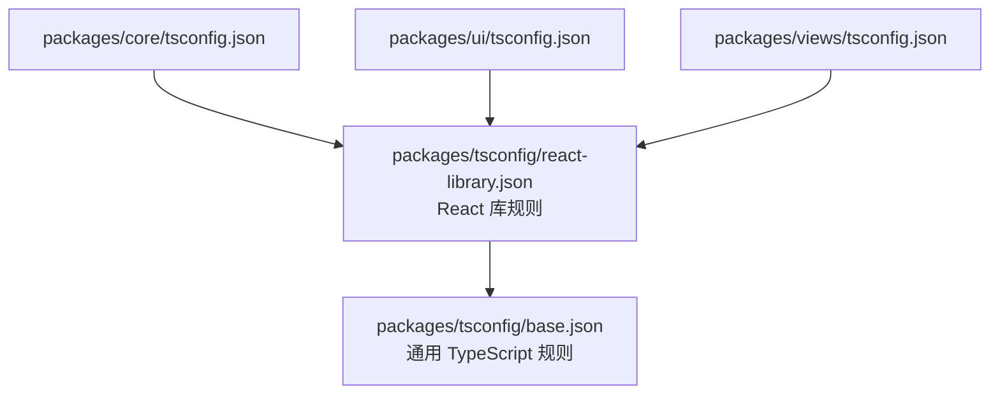

# Other — packages-tsconfig

## 模块概览

`packages/tsconfig` 是仓库内共享的 TypeScript 配置包，包名为 `@multica/tsconfig`。它不包含运行时代码、函数、类或导出 API，只提供可被其他 workspace 继承的 `tsconfig` 基础配置。

该模块的核心职责是统一前端与共享包的 TypeScript 编译规则，尤其是：

- 统一严格类型检查策略，例如 `strict`、`noUncheckedIndexedAccess`、`noImplicitReturns`
- 统一现代 ESM 与 bundler 解析模式
- 为共享包生成声明文件与 source map
- 为 React 库包提供 JSX 与 DOM 类型环境

## 文件结构

```text
packages/tsconfig/
├── base.json
├── react-library.json
└── package.json
```

## `package.json`

`packages/tsconfig/package.json` 定义 workspace 包名：

```json
{
  "name": "@multica/tsconfig",
  "version": "0.0.0",
  "private": true
}
```

其他包通过 workspace 依赖引用它，例如：

```json
{
  "devDependencies": {
    "@multica/tsconfig": "workspace:*"
  }
}
```

当前仓库中 `packages/core`、`packages/ui`、`packages/views` 和 `apps/desktop` 都声明了该依赖；其中 `packages/core`、`packages/ui`、`packages/views` 的 `tsconfig.json` 直接继承了 `@multica/tsconfig/react-library.json`。

## 配置继承关系



该模块没有运行时调用图，也没有执行流。它与代码库的连接点是 TypeScript 的 `extends` 机制，而不是 JavaScript/TypeScript import 调用。

## `base.json`

`base.json` 是所有共享配置的基础层：

```json
{
  "compilerOptions": {
    "target": "ESNext",
    "module": "ESNext",
    "moduleResolution": "bundler",
    "strict": true,
    "esModuleInterop": true,
    "skipLibCheck": true,
    "forceConsistentCasingInFileNames": true,
    "resolveJsonModule": true,
    "isolatedModules": true,
    "noUnusedLocals": true,
    "noUnusedParameters": true,
    "noImplicitReturns": true,
    "noUncheckedIndexedAccess": true,
    "declaration": true,
    "declarationMap": true,
    "sourceMap": true
  },
  "exclude": ["node_modules", "dist"]
}
```

关键配置含义：

- `target: "ESNext"` 和 `module: "ESNext"`：面向现代构建链输出，由消费方应用或 bundler 负责最终转换。
- `moduleResolution: "bundler"`：匹配 Vite、Next.js、Turborepo 等现代前端构建环境的模块解析语义。
- `strict: true`：启用 TypeScript 严格模式，是仓库类型安全的基础。
- `noUncheckedIndexedAccess: true`：通过索引访问数组或对象时返回可能为 `undefined` 的类型，避免隐式越界或缺失 key。
- `noImplicitReturns: true`：要求函数所有路径都显式返回，减少控制流遗漏。
- `noUnusedLocals` 和 `noUnusedParameters`：把未使用变量和参数作为类型检查错误处理。
- `isolatedModules: true`：保证每个文件可被独立转译，适合 SWC、esbuild 等编译器。
- `declaration` 和 `declarationMap`：为共享包生成 `.d.ts` 与声明映射，方便跨包类型消费和跳转。
- `sourceMap: true`：保留源码映射，便于调试。
- `exclude: ["node_modules", "dist"]`：避免检查依赖目录和构建产物。

## `react-library.json`

`react-library.json` 面向 React 组件库或含 JSX 的共享包：

```json
{
  "extends": "./base.json",
  "compilerOptions": {
    "jsx": "react-jsx",
    "lib": ["ESNext", "DOM", "DOM.Iterable"]
  }
}
```

它在 `base.json` 的基础上增加两类能力：

- `jsx: "react-jsx"`：使用 React 17+ 的 JSX transform，不要求每个 JSX 文件显式导入 `React`。
- `lib: ["ESNext", "DOM", "DOM.Iterable"]`：提供浏览器 DOM、可迭代 DOM 集合和现代 ECMAScript 类型定义。

这适合 `packages/core`、`packages/ui`、`packages/views` 这类会包含 React hooks、组件、DOM 类型或浏览器侧类型的包。

## 使用方式

共享包通常在自己的 `tsconfig.json` 中继承 React 库配置：

```json
{
  "extends": "@multica/tsconfig/react-library.json",
  "include": ["src", "*.ts", "*.tsx"]
}
```

如果未来新增不含 React/DOM 的纯 TypeScript 包，可以考虑继承 `@multica/tsconfig/base.json`，避免无意引入 DOM 类型环境。

## 与仓库边界的关系

`packages/tsconfig` 支撑仓库的包边界规则，但不直接表达业务约束。例如：

- `packages/core` 不能依赖 `react-dom`、`localStorage` 或 `process.env`
- `packages/ui` 不能导入 `@multica/core`
- `packages/views` 不能导入 `next/*` 或 `react-router-dom`

这些约束主要由代码规范、依赖声明、lint/typecheck 和 review 执行。`@multica/tsconfig` 提供的是统一的 TypeScript 严格检查基础，让这些包在相同类型规则下编译。

## 修改注意事项

修改 `base.json` 会影响所有继承它的配置，通常会波及 `packages/core`、`packages/ui`、`packages/views` 等共享包。修改前需要确认该规则是否适合整个 monorepo，而不是只服务某一个包的局部需求。

修改 `react-library.json` 主要影响 React 相关共享包。如果调整 `jsx`、`lib` 或模块解析策略，应至少运行：

```bash
pnpm typecheck
```

如果改动会影响构建输出或声明文件生成，还应运行相关构建检查，例如：

```bash
pnpm build
```