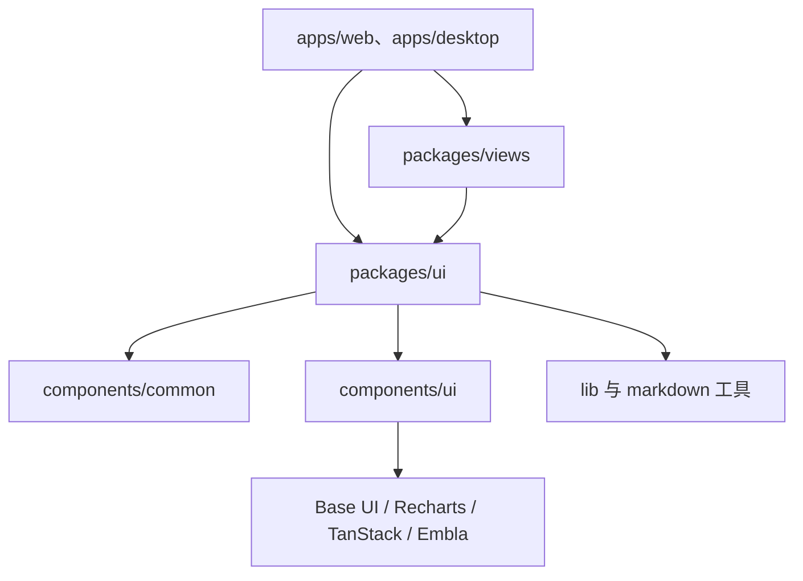
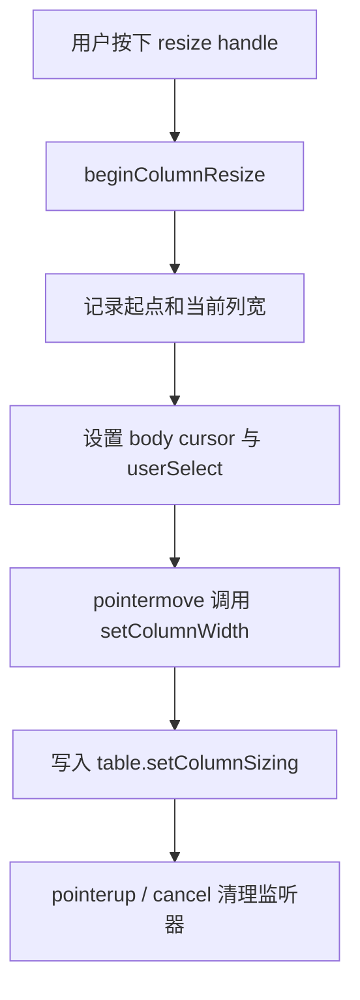

# Other — packages-ui

## `packages/ui` 模块

`packages/ui` 是 Multica 的原子 UI 包，负责提供跨 Web 和 Desktop 复用的视觉组件、交互组件、样式工具和少量纯 UI 辅助逻辑。它不承载业务状态，也不依赖 `@multica/core`。上层的 `packages/views`、`apps/web` 和 `apps/desktop` 通过这些组件构建业务界面。

模块定位可以概括为：

- `components/ui/*`：通用 UI 原语，主要封装 Base UI、shadcn 风格组件、Recharts、TanStack Table、Embla 等库。
- `components/common/*`：Multica 产品内通用但仍然无业务依赖的组合组件，例如头像、提交按钮、反应条、错误边界。
- `lib/*`：样式合并、表格列样式、剪贴板、Markdown 链接处理等纯工具。
- `styles/tokens.css`：设计 token 和 Tailwind CSS 变量入口。
- `components.json`：shadcn 配置，声明 `base-nova` 风格、`lucide` 图标库和 `@multica/ui/*` 路径别名。



### 边界与依赖约束

`packages/ui` 是共享 UI 基础层，因此必须保持平台无关和业务无关：

- 不导入 `@multica/core`。
- 不访问 Next.js、React Router、Electron 或后端 API。
- 不持有业务状态；组件只通过 props 接收数据和回调。
- 服务器状态由上层 React Query 管理，客户端视图状态由上层 Zustand 管理。
- 视觉样式应使用语义 token，例如 `bg-background`、`text-muted-foreground`、`border-border`、`bg-surface`。
- 图标优先使用 `lucide-react`。
- 通用组件通过 `@multica/ui/components/ui/*` 和 `@multica/ui/components/common/*` 暴露给上层。

这种边界让同一个组件可以同时被 Web、Desktop、测试环境和共享业务视图使用。

### shadcn/Base UI 配置

`components.json` 定义了 UI 组件生成与路径约定：

```json
{
  "style": "base-nova",
  "tsx": true,
  "tailwind": {
    "css": "styles/tokens.css",
    "baseColor": "zinc",
    "cssVariables": true
  },
  "iconLibrary": "lucide",
  "aliases": {
    "components": "@multica/ui/components",
    "ui": "@multica/ui/components/ui",
    "hooks": "@multica/ui/hooks",
    "lib": "@multica/ui/lib",
    "utils": "@multica/ui/lib/utils"
  }
}
```

新增 shadcn/Base UI 组件时应从仓库根目录运行：

```bash
pnpm ui:add badge
```

生成后的组件应继续遵守本包的边界：只做 UI，不引入业务包或平台 API。

## 通用组合组件

### `ActorAvatar`

`ActorAvatar` 是产品内参与者头像的统一入口，支持成员、agent、系统和 squad。

核心行为：

- 始终渲染圆形头像。
- `avatarUrl` 可用时渲染 ``。
- 图片加载失败时通过 `imgError` 回退到图标或 initials。
- `avatarUrl` 变化时通过 `useEffect` 重置错误状态。
- 尺寸来自 `AVATAR_SIZE_PX` 和 `DEFAULT_AVATAR_SIZE`。
- `rounded-full` 放在 className 合并结果最后，保证调用方不能覆盖头像形状。

回退优先级：

1. `isSystem`：渲染 `MulticaIcon`。
2. `isAgent`：渲染 `Bot`。
3. `isSquad`：渲染 `Users`。
4. 默认：渲染 `initials`。

示例：

```tsx
<ActorAvatar
  name="Ada Lovelace"
  initials="AL"
  avatarUrl={member.avatarUrl}
  size="lg"
/>
```

### `CapabilityBanner`

`CapabilityBanner` 是资源详情页的只读提示条。调用方可以无条件挂载它：

- `reason === "allowed"` 或 `reason === "unknown"` 时返回 `null`。
- 其他权限原因会显示带 `Lock` 图标的状态提示。
- 文案由内部 `getCopy(reason, noun, ownerName)` 集中维护。
- 支持资源类型：`agent`、`skill`、`comment`、`runtime`、`workspace`。

它的职责仅限展示权限解释，不判断权限本身。权限计算应由上层业务层完成后通过 `reason` 传入。

### `ErrorBoundary`

`ErrorBoundary` 是区块级错误边界，用于包住 timeline、comment list、sidebar panel 等页面局部区域，避免单个区域渲染崩溃导致整页空白。

关键 API：

- `fallback?: ({ error, reset }) => ReactNode`：自定义回退 UI。
- `onError?: (error, info) => void`：用于遥测或日志。
- `resetKeys?: ReadonlyArray<unknown>`：任一值变化时自动恢复。

内部行为：

- `getDerivedStateFromError` 捕获渲染错误。
- `componentDidCatch` 调用 `onError`，并无条件 `console.error`。
- `componentDidUpdate` 比较 `resetKeys`，长度或元素变化时调用 `reset()`。
- 默认回退 UI 使用 `Button` 显示 `Try again`。

适合用法：

```tsx
<ErrorBoundary resetKeys={[issueId]}>
  <IssueTimeline issueId={issueId} />
</ErrorBoundary>
```

完整页面级错误仍应使用路由层错误 UI，例如 Next.js `error.tsx`。

### `FileUploadButton`

`FileUploadButton` 封装隐藏 `<input type="file">` 和图标按钮：

- 点击按钮触发文件选择。
- `multiple` 为 `true` 时逐个调用 `onSelect(file)`。
- 每次选择后重置 `e.target.value`，允许重复选择同一个文件。
- 文案通过 `useTranslation("ui")` 读取 `attach_file`。
- 使用 `Button` 和 `Paperclip`，尺寸支持 `"default"` 与 `"sm"`。

调用方只负责上传逻辑：

```tsx
<FileUploadButton
  multiple
  onSelect={(file) => {
    // 上传逻辑由调用方处理
    uploadAttachment(file)
  }}
/>
```

### Emoji 与反应组件

`EmojiPicker`、`QuickEmojiPicker` 和 `ReactionBar` 组成了评论反应相关的 UI 层。

`EmojiPicker`：

- 使用 `emoji-mart` 的 `Picker`。
- 通过 `useRef` 保存最新 `onSelect`，避免 Picker 实例频繁重建。
- 挂载时手动 `appendChild`，卸载时 `replaceChildren()` 清理 DOM。

`QuickEmojiPicker`：

- 先展示 `QUICK_EMOJIS` 快捷表情。
- 点击 `More emojis...` 后 lazy 加载 `EmojiPicker`。
- 选择表情后关闭 Popover 并重置完整选择器状态。

`ReactionBar`：

- 内部 `groupReactions(reactions, currentUserId)` 按 emoji 聚合。
- `reacted` 只在 `actor_type === "member"` 且 `actor_id === currentUserId` 时为 true。
- 每个反应按钮点击后调用 `onToggle(emoji)`。
- Tooltip 通过 `getActorName(type, id)` 显示参与者名称。
- 末尾始终显示 `QuickEmojiPicker`。

数据形状：

```ts
interface ReactionItem {
  id: string
  actor_type: string
  actor_id: string
  emoji: string
}
```

### `SubmitButton`

`SubmitButton` 是输入框发送/停止按钮的统一组件。

两种状态：

- `running === true`：显示 `Square` 停止按钮，点击 `onStop`。
- 非运行中：显示发送按钮，`loading` 时显示旋转的 `Loader2`，否则显示 `ArrowUp`。

Tooltip 由调用方传入：

- `tooltip`：空闲发送按钮提示。
- `stopTooltip`：运行中停止按钮提示。
- `ariaLabel`、`stopAriaLabel`：图标按钮可访问名称。

组件刻意不导入平台检测或 i18n，快捷键文案由上层组合，例如 `Send · ⌘↵`。

### `ThemeProvider`

`ThemeProvider` 封装 `next-themes` 的 `ThemeProvider`，并在内部挂载 `TooltipProvider`：

```tsx
<NextThemesProvider
  attribute="class"
  defaultTheme="system"
  enableSystem
  disableTransitionOnChange
>
  <TooltipProvider delay={500}>{children}</TooltipProvider>
</NextThemesProvider>
```

Desktop 入口 `App` 会调用该组件；全局 Tooltip 能力也通过它建立。

### `MulticaIcon`

`MulticaIcon` 是纯 CSS Multica 标识：

- 使用 `clip-path: polygon(...)` 绘制八角星形。
- 使用 `currentColor`，自动跟随主题文本色。
- `animate` 控制一次性入场旋转。
- `noSpin` 禁用 hover 旋转。
- `bordered` 显示带边框容器。
- `size` 支持 `"sm"`、`"md"`、`"lg"`，仅在 `bordered` 模式下使用。

`ActorAvatar` 在系统头像回退时使用 `MulticaIcon noSpin`。

### `UnicodeSpinner`

`UnicodeSpinner` 使用 `unicode-animations` 的 Braille spinner 帧：

- 默认 `name="braille"`。
- 根据 spinner 自带 `interval` 轮换帧。
- `paused` 为 true 时停止推进帧。
- 使用 monospace、`minWidth: "1ch"` 和 `tabular-nums` 避免宽度抖动。

它适合内联在文本流中，不会像直接渲染 unicode 字符那样造成相邻文本重排。

## UI 原语组件

### 组件封装模式

`components/ui/*` 大多遵循同一模式：

1. 使用 Base UI、cmdk、Recharts、Embla、TanStack Table 等底层库提供行为。
2. 用 `cn` 合并 Tailwind class。
3. 通过 `data-slot` 标记组件结构，方便样式选择器和测试定位。
4. 对可替换元素使用 Base UI 的 `render` 或 `useRender`。
5. 把 variant 和 size 用 `class-variance-authority` 管理。

典型例子是 `Button`：

```tsx
function Button({
  className,
  variant = "default",
  size = "default",
  ...props
}: ButtonPrimitive.Props & VariantProps<typeof buttonVariants>) {
  return (
    <ButtonPrimitive
      data-slot="button"
      className={cn(buttonVariants({ variant, size, className }))}
      {...props}
    />
  )
}
```

### `Button` 与 `buttonVariants`

`Button` 是交互按钮基础组件，基于 `@base-ui/react/button`。

支持的 `variant`：

- `default`
- `outline`
- `secondary`
- `ghost`
- `destructive`
- `link`

支持的 `size`：

- `default`
- `xs`
- `sm`
- `lg`
- `icon`
- `icon-xs`
- `icon-sm`
- `icon-lg`

多个上层组件会直接复用它，例如 `FileUploadButton`、`SubmitButton`、`AlertDialogAction`、`CarouselPrevious`、`CarouselNext`、`CalendarDayButton`。

### 信息展示组件

`Alert`、`Card`、`Badge`、`Breadcrumb`、`Avatar` 负责常见展示结构。

`Alert`：

- 使用 `alertVariants` 管理 `default` 和 `destructive`。
- `AlertTitle`、`AlertDescription`、`AlertAction` 使用 `data-slot` 协作。
- 根节点默认 `role="alert"`。

`Card`：

- `Card` 支持 `size="default" | "sm"`。
- `CardHeader` 会根据是否包含 `CardAction`、`CardDescription` 调整网格布局。
- `CardFooter` 默认带顶部分隔和 hover surface 背景。

`Badge`：

- 使用 `useRender` 支持替换默认 `span`。
- `badgeVariants` 提供 `default`、`secondary`、`destructive`、`outline`、`ghost`、`link`。

`Avatar`：

- 基于 Base UI Avatar。
- 提供 `AvatarImage`、`AvatarFallback`、`AvatarBadge`、`AvatarGroup`、`AvatarGroupCount`。
- 产品参与者头像优先用 `ActorAvatar`；通用头像布局可用 `Avatar`。

`Breadcrumb`：

- `BreadcrumbLink` 使用 `useRender`，方便上层传入路由链接组件。
- `BreadcrumbPage` 设置 `aria-current="page"`。
- `BreadcrumbEllipsis` 使用 `MoreHorizontalIcon` 并包含 sr-only 文案。

### 弹层与菜单组件

`AlertDialog`、`Dialog`、`DropdownMenu`、`ContextMenu`、`Popover`、`HoverCard`、`Tooltip` 等组件统一处理浮层行为和样式。

`AlertDialogContent` 会组合：

- `AlertDialogPortal`
- `AlertDialogOverlay`
- `AlertDialogPrimitive.Popup`

`ContextMenuSubContent` 复用 `ContextMenuContent`，只覆写 `data-slot` 和 `side="right"`。`DropdownMenuSubContent` 也采用类似模式复用主内容组件。

这些组件的重要约定：

- 内容层使用 portal，避免被父容器 overflow 裁剪。
- `data-open`、`data-closed`、`data-side` 驱动动画。
- destructive 菜单项通过 `data-variant="destructive"` 控制样式。
- checkbox/radio 菜单项使用 `CheckIcon` 作为 indicator。

### 表单与输入组件

`Checkbox`、`Combobox`、`Command`、`InputGroup`、`Field`、`Label` 等提供表单和选择行为。

`Checkbox`：

- 基于 Base UI Checkbox。
- 支持 `indeterminate`。
- 勾选显示 `CheckIcon`，半选显示 `MinusIcon`。
- 使用 `data-checked` 和 `data-indeterminate` 切换主色样式。

`Combobox`：

- 直接导出 `ComboboxPrimitive.Root` 为 `Combobox`。
- `ComboboxInput` 内部组合 `InputGroup`、`ComboboxPrimitive.Input`、`ComboboxTrigger`、`ComboboxClear`。
- `ComboboxContent` 通过 `Positioner` 定位，默认跟随 anchor 宽度。
- `ComboboxChips`、`ComboboxChip`、`ComboboxChipsInput` 支持多选 chip 输入。
- `useComboboxAnchor()` 返回 `React.useRef<HTMLDivElement | null>(null)`，用于把弹层锚定到 chips 容器。

`Command`：

- 基于 `cmdk`。
- `CommandDialog` 组合 `Dialog`，默认隐藏标题和描述但保留可访问结构。
- `CommandInput` 使用 `InputGroup` 和 `SearchIcon`。
- `CommandItem` 会在 `data-[checked=true]` 时显示 `CheckIcon`，如果存在 `CommandShortcut` 则隐藏尾部 check icon。

### 导航和布局组件

`Accordion`、`Collapsible`、`AspectRatio`、`ButtonGroup`、`Carousel` 提供通用布局与交互结构。

`Accordion`：

- 基于 Base UI Accordion。
- `AccordionTrigger` 使用 `ChevronDownIcon` 和 `ChevronUpIcon` 根据展开状态切换。
- `AccordionContent` 使用 `--accordion-panel-height` 驱动展开/收起动画。

`ButtonGroup`：

- 使用 `buttonGroupVariants` 控制横向或纵向组合。
- 自动处理相邻子组件圆角和边框重叠。
- `ButtonGroupSeparator` 复用 `Separator`。
- `ButtonGroupText` 使用 `useRender` 支持替换默认标签。

`Carousel`：

- 基于 `embla-carousel-react`。
- `useCarousel()` 必须在 `<Carousel />` 内使用，否则抛出错误。
- `Carousel` 创建上下文，暴露 `scrollPrev`、`scrollNext`、`canScrollPrev`、`canScrollNext`。
- 支持 `orientation="horizontal" | "vertical"`。
- 捕获左右方向键触发滚动。
- `setApi` 可把 Embla API 传给上层。

### 数据表格

`DataTable` 是 TanStack Table 的共享渲染壳，使用 shadcn table 原语但刻意不使用包装 `<Table>`，避免内层 `overflow-x-auto` 和外层滚动容器竞争。

核心行为：

- 根容器为 `flex min-h-0 flex-1 flex-col`。
- 外层滚动容器为 `overflow-auto bg-background`。
- `<table>` 使用 `w-full table-fixed`，并设置 `minWidth: table.getTotalSize()`。
- 表头 sticky：`TableHeader` 使用 `sticky top-0 z-10 bg-muted/30 backdrop-blur`。
- 单元格样式由 `getCellStyle(column, { withBorder, hasExplicitSize })` 计算。
- 支持 pinned column，通过不透明背景覆盖横向滚动内容。
- 支持 row click：`onRowClick?: (row) => void`。
- 支持空态：`emptyMessage` 默认 `"No results."`。
- 支持选中行 action bar：只有 `table.getFilteredSelectedRowModel().rows.length > 0` 时渲染。

列 resize 流程：



键盘 resize 由 `handleResizeKeyDown` 处理：

- `ArrowRight` 增加宽度。
- `ArrowLeft` 减少宽度。
- 默认步长 8px。
- 按住 Shift 时步长 20px。
- 宽度会被 `minSize` 和 `maxSize` 限制。

`DataTableColumnHeader` 负责表头排序和隐藏菜单：

- 如果列既不能排序也不能隐藏，直接渲染纯文本。
- 可排序时显示 `ChevronUp`、`ChevronDown` 或 `ChevronsUpDown`。
- 菜单项包括 `Asc`、`Desc`、`Reset`。
- 可隐藏时提供 `Hide`，调用 `column.toggleVisibility(false)`。

### 图表组件

`chart.tsx` 提供 Recharts 的主题化容器和 tooltip/legend 内容。

关键类型：

```ts
export type ChartConfig = Record<
  string,
  {
    label?: React.ReactNode
    icon?: React.ComponentType
  } & (
    | { color?: string; theme?: never }
    | { color?: never; theme: Record<"light" | "dark", string> }
  )
>
```

`ChartContainer`：

- 创建 `ChartContext`，供 tooltip 和 legend 读取 `config`。
- 生成稳定 `data-chart` id。
- 注入 `ChartStyle`，把 `config` 中的颜色写入 CSS 变量。
- 使用 `RechartsPrimitive.ResponsiveContainer`。
- 默认 `initialDimension` 为 `{ width: 320, height: 200 }`，减少 SSR/初始渲染尺寸不稳定。

`ChartTooltipContent`：

- 必须在 `ChartContainer` 内使用，因为内部调用 `useChart()`。
- 支持 `indicator="dot" | "line" | "dashed"`。
- 支持 `hideLabel`、`hideIndicator`、`labelFormatter`、`formatter`、`footer`。
- 通过 `getPayloadConfigFromPayload(config, item, key)` 从 Recharts payload 解析显示标签和图标。
- 数值使用 `toLocaleString()` 和 `tabular-nums` 显示。

`ChartLegendContent`：

- 同样依赖 `useChart()`。
- 根据 payload 和 `ChartConfig` 渲染图标或颜色块。
- `verticalAlign === "top"` 时使用底部 padding，否则使用顶部 padding。

## Markdown 与纯工具

调用图显示 `packages/ui` 还提供 Markdown 相关纯函数，供编辑器和 views 使用：

- `preprocessFileCards` 调用 `isFileCardUrl`，用于把符合规则的文件链接预处理为 file card Markdown。
- `findMatchingBracket` 和 `findMarkdownLinkRanges` 调用 `isEscaped`，用于识别 Markdown 链接边界并避开转义字符。
- `collectLinkifyMatches` 会递归收集 linkify 匹配结果。
- `detectLinks` 被编辑器扩展 `autolink-email-repair.ts` 调用。
- `isIssueIdentifier` 被 issue identifier 测试覆盖。
- `Markdown` 被 `packages/views` 的 Markdown 测试调用。
- `copyText` 被 desktop daemon panel 和 editor clipboard 测试调用。

这些工具属于 UI 包，是因为它们直接服务文本渲染、编辑器展示和交互辅助，但它们仍然不应依赖业务 API 或状态。

## 与代码库其他部分的连接

`packages/ui` 的调用方分布在共享视图和平台应用中：

- `packages/views` 使用 `Markdown`、`Select`、`DataTable`、`Button`、`Dialog` 等组件构建业务页面。
- `apps/desktop` 的 renderer 使用 `ThemeProvider`、`Toaster`、`Button`、`DialogContent`、`DialogTitle`、`useSidebar`、`MulticaIcon`。
- editor 扩展使用 `detectLinks`、`preprocessFileCards`、`copyText` 等纯工具。
- 多条跨模块执行流最终会进入 `cn`，例如 onboarding、project detail、issues filter 等 UI 渲染路径。

`cn` 是本包最基础的样式工具。大量组件和上层页面通过它合并 Tailwind class，因此修改 `cn` 或 token 相关行为会影响面很大，应谨慎验证。

## 贡献指南

新增或修改 `packages/ui` 组件时，优先遵守以下原则：

- 如果是通用 UI 行为，放在 `components/ui`。
- 如果是 Multica 产品内复用的无业务组合组件，放在 `components/common`。
- 如果需要业务数据、权限判断、路由跳转或 API 调用，应放在 `packages/views` 或 app/platform 层，而不是 `packages/ui`。
- 对外 API 用 props 表达，不直接读取全局业务状态。
- 保持组件可组合，避免把特定页面布局写死进原语组件。
- 可访问性属性应随组件内建，例如 icon-only button 的 `aria-label`、dialog title/description、separator role。
- 长文本、overflow、sticky、portal、键盘操作应在组件层明确处理。
- 样式优先使用语义 token 和已有 variant，不新增硬编码颜色体系。

修改高复用组件时应重点检查：

- `Button`、`Dialog`、`DropdownMenu`、`Tooltip`、`Popover` 等基础交互是否影响上层页面。
- `DataTable` 的列宽、sticky header、pinned column、resize 和行点击是否仍然正确。
- `ChartContainer`、`ChartTooltipContent` 是否仍在 `ChartContext` 内工作。
- `ActorAvatar` 的圆形不变量是否被破坏。
- `ThemeProvider` 是否仍然同时提供主题和 Tooltip 上下文。