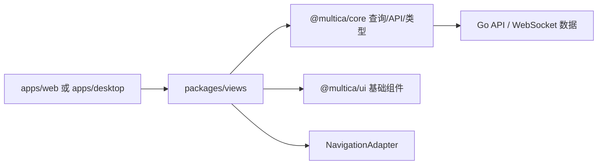

# Other — packages-views

## packages/views 模块

`packages/views` 是 Multica 前端的共享业务视图层。它位于应用壳层和底层包之间：从 `@multica/core` 读取类型、查询、状态和 API，从 `@multica/ui` 复用基础组件，但不直接绑定 Next.js、Electron 或 React Router。路由跳转通过 `NavigationAdapter` / `useNavigation` 完成，工作区路径通过 `useWorkspacePaths` 生成。



## 设计边界

`packages/views` 承担“业务页面和业务组件”的职责：

- 页面级组件，例如 `AgentsPage`、`AgentDetailPage`、`AgentCreationStudio`、`IssueDetail`、`SquadDetailPage`、`ProjectsPage`。
- 跨 Web 和 Desktop 复用的业务 UI，例如设置面板、批量工具栏、悬浮详情卡、聊天输入区、资源标签选择器。
- 业务流程编排，例如 Agent 创建、Agent 批量归档、Agent Builder 聊天、草稿恢复、创建后加入 Squad。
- 国际化文案消费，通过 `useT(namespace)` 读取 `packages/views/locales/*` 资源。

它不负责：

- 直接调用 `next/*` API。
- 存放全局 Zustand store。
- 实现底层 UI 原语。
- 处理后端协议细节之外的 API 客户端封装。

这些职责分别由 app 层、`@multica/core` 和 `@multica/ui` 承担。

## 与外部包的连接方式

`packages/views` 的组件通常按以下模式组织依赖：

- `@multica/core/types` 提供 `Agent`、`MemberWithUser`、`AgentTask`、`RuntimeDevice`、`CreateAgentRequest` 等共享类型。
- `@multica/core/api` 提供 `api.updateAgent`、`api.archiveAgent`、`api.restoreAgent`、`api.createAgent`、`api.createAgentFromTemplate`、`api.createAgentBuilderSession`、`api.sendChatMessage`、`api.cancelTaskById` 等调用。
- `@multica/core/workspace/queries`、`@multica/core/runtimes/queries`、`@multica/core/chat/queries` 提供 React Query options。
- `@multica/ui/components/ui/*` 提供 `Button`、`Dialog`、`Input`、`Textarea`、`Checkbox` 等基础控件。
- `../../navigation` 提供平台无关导航能力。
- `../../i18n` 的 `useT` 负责视图层命名空间文案。

React Query 是服务端状态的来源。视图组件通过 `useQuery` 读取列表、成员、运行时、聊天消息和 pending task，并通过 `queryClient.invalidateQueries` 或 `setQueryData` 更新缓存。组件本地 `useState` 只保存表单草稿、弹窗状态、忙碌状态等视图状态。

## Agent 视图子模块

当前源码片段主要覆盖 `packages/views/agents`。该子模块提供 Agent 列表、详情、创建、权限和活动状态相关的共享业务 UI。

### `AgentAccessSettings`

`AgentAccessSettings` 是 Agent 设置页中的访问权限分区。它包装通用设置布局：

- `SettingsSection`
- `SettingsCard`
- `AccessPicker`

它从 `agent.permission_mode`、`agent.invocation_targets`、`agent.visibility` 初始化 `AccessPicker`，并根据 `currentUserId` 与 `agent.owner_id` 判断 `canEdit`。保存时调用：

```ts
onChange={(next) => onUpdate(agent.id, next)}
```

这使访问权限修改保持在页面提供的 `onUpdate` 管道中，而不是在组件内部直接调用 API。

### `AgentBatchToolbar`

`AgentBatchToolbar` 是 Agent 列表底部的浮动批量操作栏。它接收选中的 `AgentListRow[]`，并根据行状态渲染：

- `Restore`
- `Set access scope`
- `Archive`

批量访问范围修改使用 `AccessPicker` 的 `hideFooter` 模式。此时 `AccessPicker` 只负责产生可提交的 `AccessChange`，真正提交由外层 Dialog 的确认按钮完成。

关键逻辑：

- `ownedRows = rows.filter((r) => r.isOwnedByMe)`：访问范围批量写入只允许 owner。
- `allManageable = rows.every((r) => r.canManage)`：归档和恢复使用管理权限。
- `handleAccessReadyChange` 使用 `useCallback` 保持稳定，避免 `AccessPicker` effect 与父级 state 更新形成循环。
- `setAccessDialogOpen` 在打开和关闭时都会清空 `accessChange`，避免上一次选择泄漏到下一次弹窗。
- `runBatch` 使用 `Promise.allSettled` 执行批量操作，然后 invalidates `workspaceKeys.agents(wsId)` 并调用 `onClear()`。

批量访问范围提交只写这两个字段：

```ts
api.updateAgent(id, {
  permission_mode: change.permission_mode,
  invocation_targets: change.invocation_targets,
})
```

测试 `agent-batch-toolbar.test.tsx` 覆盖了按钮顺序、跳过非 owner 行、Apply 启用时机、重复渲染不再触发循环、每个 owned agent 只写一次、关闭重开不保留旧选择。

### `AgentActivityHoverContent`

`AgentActivityHoverContent` 是 “当前 Agent 在做什么” 悬浮卡内容，被 issue 范围和 workspace 范围的活动入口复用。它接收已经筛选好的 `tasks: readonly AgentTask[]`，并保持调用方传入顺序，每个 task 渲染一行。

它内部读取：

- `useWorkspaceId()`
- `useActorName()`
- `useQuery(agentListOptions(wsId))`
- `useQuery(runtimeListOptions(wsId))`
- `deriveAgentAvailability(runtime, now)`

组件每秒更新一次 `now`，用于刷新每行耗时。运行时和 Agent 列表会转成 `Map`，避免每行做 N×M 查找。

状态颜色规则与 presence indicator 保持一致：

- `running`：品牌色 `bg-brand`
- queued 且 runtime online：灰色，表示短暂排队状态
- queued 且 runtime offline/unstable：warning 色，表示可能卡住

标题使用 `agent_activity.hover_header_tasks` 并按 task 数计数，而不是按 agent 数计数。测试明确保护这个行为：一个 Agent 可以同时运行多个 task，所以悬浮卡标题必须与实际行数一致。

`formatDuration(fromIso, nowMs)` 是导出的工具函数，用于统一格式化耗时：

- `< 60s`：`45s`
- `< 60m`：`2m 14s`
- `>= 60m`：`1h 03m`

### `AgentAvatarStack`

`AgentAvatarStack` 是纯展示组件，不发起数据请求，也不处理 hover。调用方传入已去重且已排序的 `agentIds`。

它通过 `useActorName()` 获取头像所需的名称、首字母和头像 URL，然后用 `ActorAvatarBase` 渲染重叠头像组。重叠距离按头像尺寸的 30% 计算：

```ts
const overlap = Math.round(px * 0.3);
```

当 `agentIds.length > max` 时，尾部折叠为 `+N` chip。`opacity="half"` 用于 queued-only 状态，让相同头像以更弱视觉权重呈现。

### `AgentDetailInspector`

`AgentDetailInspector` 是 Agent 详情页的 General 设置面板，负责 profile 和 execution 两组设置。

Profile 分区包括：

- avatar：`AvatarUploadControl`
- name：`Input`
- description：`Textarea` + `CharCounter`
- labels：`ResourceLabelPicker`

名称和描述使用 `useAutoSave` 自动保存。组件只在 `agent.id` 改变时重置本地草稿，避免缓存更新覆盖正在编辑的本地内容。

Execution 分区包括：

- `RuntimePicker`
- `ModelPicker`
- `ThinkingSettingField`
- `ConcurrencyField`

`ConcurrencyField` 使用本地字符串草稿，提交时校验整数范围 `1..50`。失焦或按 Enter 会尝试保存；非法输入会回滚到当前保存值。

### `AgentCreationStudio`

`AgentCreationStudio` 是 Agent 创建流程的主组件，支持多种创建模式：

```ts
type StudioMode = "choose" | "templates" | "blank" | "template" | "ai";
```

它维护 `AgentDraft`：

```ts
interface AgentDraft {
  name: string;
  description: string;
  instructions: string;
  avatarUrl: string | null;
  runtimeId: string;
  model: string;
  skillIds: Set<string>;
  permissionScope: "private" | "workspace" | "members";
  memberIds: Set<string>;
  teamIds: Set<string>;
}
```

主要数据来源：

- `agentListOptions(wsId)`：用于 duplicate 模式找源 Agent。
- `runtimeListOptions(wsId)`：运行时选择。
- `memberListOptions(wsId)`：成员选择和权限范围。
- `skillListOptions(wsId)`：技能选择。
- `agentTemplateListOptions()` / `agentTemplateDetailOptions(slug)`：模板创建。
- `chatMessagesOptions(builderSessionId)` / `pendingChatTaskOptions(builderSessionId)`：AI Builder 聊天。

创建流程最后调用：

- 模板模式：`api.createAgentFromTemplate`
- 非模板模式：`api.createAgent`

如果 URL 带 `squad` 参数，创建成功后还会调用 `api.addSquadMember`，并 invalidates 对应 squad query。创建成功后 invalidates `workspaceKeys.agents(wsId)`，然后导航到 Agent 详情页或 Squad 详情页。

## Agent Builder 协议

AI Builder 使用真实的 chat session，但用户消息不是纯自然语言，而是带上下文的编码输入。编码前缀为：

```ts
const BUILDER_INPUT_PREFIX = "MULTICA_AGENT_BUILDER_INPUT\n";
```

`encodeBuilderInput(request, draft, skills, members, runtime, models)` 会生成：

- `user_request`
- `current_draft`
- `selected_runtime`
- `available_runtime_models`
- `available_workspace_skills`
- `available_workspace_members`

聊天展示时，用户消息通过 `decodeBuilderInput` 还原为 `user_request`，避免界面显示整段 JSON。Assistant 消息中可能包含结构化草稿块：

```xml
<agent_draft>{"name":"Researcher","permission_scope":"workspace"}</agent_draft>
```

相关函数职责：

- `parseBuilderDraft(content)`：解析 `<agent_draft>...</agent_draft>` 中的 JSON。
- `stripBuilderDraft(content)`：从展示文本中移除结构化草稿块。
- `mergeBuilderDraft(current, payload, validSkillIds, validMemberIds, validModelIds)`：把 assistant 产出的安全字段合并进当前草稿。
- `pickBuilderRestore(synchronous, durable)`：处理取消任务后的 composer 草稿恢复。
- `buildInvocationTargets(draft)`：把 UI 层权限草稿转为 API 需要的 `AgentInvocationTargetInput[]`。
- `deriveDuplicateAccess(agent)`：复制 Agent 时从 `permission_mode` 和 `invocation_targets` 还原 UI 权限状态。

`mergeBuilderDraft` 有明确的防御边界：技能 ID 和成员 ID 必须存在于当前工作区；模型只能保留当前值或采用已发现的 runtime catalog ID。模型发现失败时不会允许 Builder 引入任意新模型。

## 访问权限模型

Agent 访问权限在视图层有两种表达：

UI 草稿表达：

```ts
permissionScope: "private" | "workspace" | "members";
memberIds: Set<string>;
teamIds: Set<string>;
```

API 表达：

```ts
permission_mode: "private" | "public_to";
invocation_targets: AgentInvocationTargetInput[];
```

转换规则由 `buildInvocationTargets` 和创建请求中的 `permission_mode` 组合完成：

- `private`：`permission_mode = "private"`，`invocation_targets = []`
- `workspace`：`permission_mode = "public_to"`，`invocation_targets = [{ target_type: "workspace" }]`
- `members`：`permission_mode = "public_to"`，targets 来自 `memberIds` 和 `teamIds`

复制 Agent 时，`deriveDuplicateAccess` 会保留 member/team 粒度授权。虽然当前创建表单还不能编辑 team grants，但 duplicate 不能丢失它们。

## 国际化与文案一致性

Agent 相关文案位于：

- `packages/views/locales/en/agents.json`
- `packages/views/locales/zh-Hans/agents.json`
- `packages/views/locales/ja/agents.json`
- `packages/views/locales/ko/agents.json`

`agents-i18n-parity.test.ts` 专门保护访问范围和批量访问范围相关 key 在四种语言中都存在。它还检查插值必须使用 i18next 的双大括号格式 `{{count}}`，避免写成 `{count}` 后运行时不替换。

新增 Agent UI 文案时，应同步更新全部 locale，并优先增加 parity test 覆盖关键路径。

## 测试策略

`packages/views` 的测试以 Vitest + Testing Library 为主。Agent 子模块中的测试重点不是快照，而是保护业务交互和回归点：

- `access-picker-bulk-commit.test.tsx`：验证 `AccessPicker` 在 `hideFooter` bulk 模式下的 ready/change 行为，以及稳定 callback 下不会重复通知父组件。
- `agent-batch-toolbar.test.tsx`：验证批量操作顺序、权限跳过、Apply 启用、批量写入次数和弹窗状态重置。
- `agent-activity-hover-content.test.tsx`：验证 hover header 按 task 数计数，而不是 agent 数。
- `agent-creation-studio.test.ts`：验证 Builder 编码/解码、结构化草稿解析、非法字段过滤、模型校验、duplicate 权限保留。
- `agents-i18n-parity.test.ts`：验证多语言 key 和插值格式一致。

这些测试通常 mock 掉与当前行为无关的重组件，例如头像、presence、查询结果或 toast，从而把断言集中在业务规则上。

## 贡献注意事项

修改 `packages/views` 时，应优先保持现有分层：

- 服务端数据通过 React Query options 读取和失效，不在视图层自建服务端状态 store。
- 业务组件可以依赖 `@multica/core`，但 `packages/ui` 不能反向依赖视图或 core 业务。
- 需要导航时使用 `useNavigation` 和 `useWorkspacePaths`，不要直接引入平台路由 API。
- 表单草稿和弹窗状态可以放在组件本地；跨页面或跨业务的客户端状态应放在 `packages/core`。
- 对权限、批量操作、草稿恢复、自动保存这类容易出现循环或竞态的逻辑，新增测试应覆盖“重复渲染后是否稳定”和“关闭重开是否重置”。