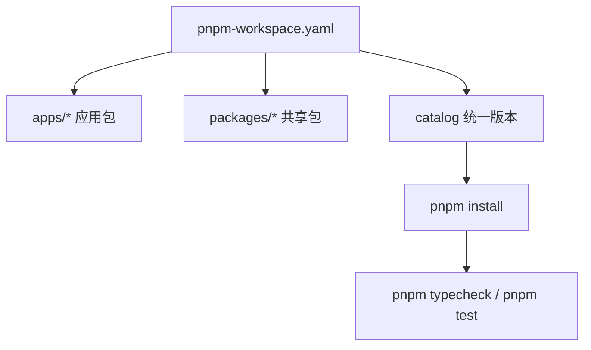

# Other — pnpm-workspace.yaml

## 模块概览

`pnpm-workspace.yaml` 是前端 monorepo 的 pnpm 工作区入口配置。它做两件事：

1. 声明哪些目录属于同一个 workspace。
2. 通过 `catalog` 统一管理跨包依赖版本。

这个文件没有运行时代码，也没有函数、类、调用关系或执行流。它影响的是安装、解析依赖、版本一致性和包间协作方式。

## 工作区范围

```yaml
packages:
  - "apps/*"
  - "packages/*"
```

当前 workspace 只包含两类目录：

- `apps/*`：应用层包，例如 Web 应用和桌面应用。
- `packages/*`：共享包，例如核心逻辑、UI、共享视图、共享 TypeScript 配置。

这意味着根目录外的其他目录不会自动成为 pnpm workspace 包。新增可发布或可被其他包引用的前端包时，应放在 `apps/` 或 `packages/` 下，或者同步更新这里的 `packages` 匹配规则。

## 依赖版本目录

`catalog` 是 pnpm 的集中版本表。子包的 `package.json` 可以通过 `catalog:` 引用这里声明的版本，而不是在每个包里重复写具体版本。

典型模式如下：

```json
{
  "dependencies": {
    "react": "catalog:",
    "@tanstack/react-query": "catalog:"
  },
  "devDependencies": {
    "typescript": "catalog:",
    "vitest": "catalog:"
  }
}
```

这样做的效果是：

- 所有 workspace 包使用同一份 React、TypeScript、测试工具和 UI 依赖版本。
- 升级公共依赖时通常只需要修改 `pnpm-workspace.yaml`。
- 避免 `apps/web`、`apps/desktop`、`packages/views` 等包之间出现隐式版本漂移。

## 依赖分组

### React 核心

```yaml
react: "19.2.3"
react-dom: "19.2.3"
"@types/react": "^19.2.0"
"@types/react-dom": "^19.2.0"
```

这些版本定义了整个前端的 React 基线。由于 `packages/views`、`packages/ui` 和应用层都会围绕 React 组件协作，`react` 与 `react-dom` 应保持同步升级。

### TypeScript 与 Node 类型

```yaml
typescript: "^5.9.3"
"@types/node": "^25.0.10"
```

这些依赖支撑 workspace 内的类型检查、构建脚本和测试环境。实际可用命令以根目录 `package.json`、`Makefile` 和共享 TypeScript 配置为准，例如 `pnpm typecheck`。

### 状态管理与数据表格

```yaml
zustand: "^5.0.0"
"@tanstack/react-query": "^5.96.2"
"@tanstack/react-table": "^8.21.3"
```

这些依赖对应仓库的状态管理约定：

- React Query 管理服务端状态。
- Zustand 管理客户端视图状态。
- TanStack Table 用于表格型 UI。

版本集中在这里可以避免共享包和应用包对状态库产生多版本实例。

### 运行时结构校验

```yaml
zod: "^4.1.5"
```

`zod` 用于 API 边界的防御性校验。文件中的注释明确指向 `CLAUDE.md` 的 “API Response Compatibility” 规则，说明它不是普通工具依赖，而是用于抵御 API 响应漂移的边界依赖。

### UI 与样式

```yaml
tailwindcss: "^4"
"@tailwindcss/postcss": "^4"
"@tailwindcss/vite": "^4"
tailwind-merge: "^3.4.0"
class-variance-authority: "^0.7.1"
clsx: "^2.1.1"
katex: "^0.16.45"
rehype-katex: "^7.0.1"
remark-math: "^6.0.0"
mermaid: "^11.14.0"
lucide-react: "^1.0.1"
```

这组依赖支撑组件样式、图标、数学公式渲染和 Mermaid 图表渲染。`packages/ui` 通常应只承载通用 UI 能力，不应引入业务依赖；这些基础 UI 依赖适合通过 catalog 统一。

### 国际化

```yaml
i18next: "^26.0.8"
react-i18next: "^17.0.6"
"@formatjs/intl-localematcher": "^0.8.4"
eslint-plugin-i18next: "^6.1.4"
```

这组依赖提供运行时翻译、React 绑定、语言匹配和 lint 规则。它们属于跨应用能力，适合由 workspace 统一约束版本。

### 产品功能依赖

```yaml
unicode-animations: "^1.0.3"
"react-qr-code": "^2.0.18"
react-virtuoso: "^4.14.0"
"@tanstack/react-virtual": "^3.13.0"
posthog-js: "^1.176.1"
yaml: "^2.6.0"
```

这些依赖对应具体产品能力：

- `unicode-animations`：聊天状态展示。
- `react-qr-code`：Lark device-flow 扫码安装场景。
- `react-virtuoso`、`@tanstack/react-virtual`：长列表和时间线虚拟滚动。
- `posthog-js`：产品分析。
- `yaml`：解析 skill frontmatter。

这些依赖虽然服务具体功能，但仍可能被多个 workspace 包共享，因此放在 catalog 中统一版本。

### 测试工具链

```yaml
vitest: "^4.1.0"
jsdom: "^29.0.1"
"@vitejs/plugin-react": "^6.0.1"
"@testing-library/react": "^16.3.2"
"@testing-library/jest-dom": "^6.9.1"
"@testing-library/user-event": "^14.6.1"
```

这组依赖定义前端测试基线。通常与 `pnpm test`、组件测试和 React Testing Library 测试一起使用。

## 与代码库的关系



这个模块不参与业务运行时调用链，但它决定了前端 workspace 的依赖拓扑。包是否被 pnpm 识别、依赖版本是否一致、安装后锁文件如何解析，都受这个文件影响。

## 修改原则

修改 `packages` 时，要确认新匹配范围不会意外纳入非包目录。新增 workspace 包后，应确保该包拥有合法的 `package.json`，并符合仓库的包边界规则。

修改 `catalog` 时，要优先检查所有引用该依赖的 workspace 包。公共依赖升级可能影响多个应用和共享包，尤其是：

- `react` / `react-dom`
- `typescript`
- `@tanstack/react-query`
- `tailwindcss`
- `vitest`
- `zod`

新增依赖时，如果它会被多个包使用，或者属于全局工具链，应放入 `catalog`。如果依赖只属于单个包的私有实现细节，可以直接写在该包的 `package.json`，但要避免造成重复版本。