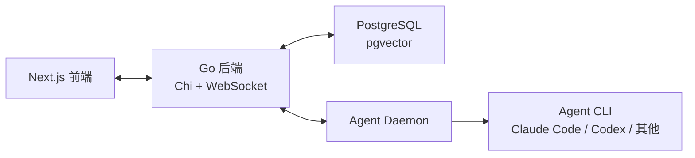

# Other — README.md

## README.md 模块说明

`README.md` 是 Multica 仓库的入口文档，面向新用户、潜在贡献者和需要快速理解系统边界的开发者。它不包含可执行代码，也没有内部调用、外部调用或执行流；它的作用是把产品定位、安装路径、核心概念、CLI 入口、系统架构和开发入口串起来。

该文件是仓库的公开门面，通常会被 GitHub、包管理入口、搜索引擎和新贡献者首先读取。因此它应保持准确、简洁，并优先链接到更详细的专题文档，而不是承载所有细节。

## 文档职责

`README.md` 当前覆盖以下内容：

- 产品定位：Multica 是一个开源的 managed agents 平台，用于把编码 Agent 管理为团队成员。
- 核心概念：Agent、Squad、Runtime、Autopilot、Reusable Skills、Workspace。
- 快速安装：Homebrew、安装脚本、Windows PowerShell、自托管安装入口。
- 入门流程：运行 `multica setup`、验证 Runtime、创建 Agent、分配任务。
- CLI 常用命令：`multica login`、`multica daemon start`、`multica issue create` 等。
- 高层架构：Next.js 前端、Go 后端、PostgreSQL、Agent Daemon。
- 开发入口：`make dev`、`CONTRIBUTING.md`、`apps/mobile/README.md`。

## 与代码库的关系

`README.md` 本身不参与构建或运行，但它引用了代码库中的主要边界：

| 文档中的概念 | 对应代码区域 |
|---|---|
| Next.js Frontend | `apps/web/` |
| Electron Desktop App | `apps/desktop/` |
| iOS Mobile Client | `apps/mobile/` |
| Go Backend | `server/` |
| Headless business logic | `packages/core/` |
| Shared UI components | `packages/ui/` |
| Shared business views | `packages/views/` |
| CLI 和 daemon | 由 `multica` 命令暴露，详细说明链接到 `CLI_AND_DAEMON.md` |
| 自托管部署 | `SELF_HOSTING.md` |
| 贡献流程 | `CONTRIBUTING.md` |

这些链接是 README 的主要维护风险点：当目录结构、命令名称、支持的 Agent CLI 或开发流程发生变化时，应同步更新 README。

## 高层架构

README 使用简化架构图说明系统运行关系。核心链路是：前端访问 Go 后端，后端读写 PostgreSQL，并与本地或云端 Agent Runtime 协作执行任务。



README 中的架构描述是概念级说明，不替代 `CLAUDE.md`、`CONTRIBUTING.md` 或具体包内文档。开发者需要实现或修改功能时，应以代码和项目根目录的工程规则为准。

## 安装与启动路径

README 提供三类安装路径：

1. Homebrew 推荐路径：

```bash
brew install multica-ai/tap/multica
```

2. macOS / Linux 安装脚本：

```bash
curl -fsSL https://raw.githubusercontent.com/multica-ai/multica/main/scripts/install.sh | bash
```

3. Windows PowerShell：

```powershell
irm https://raw.githubusercontent.com/multica-ai/multica/main/scripts/install.ps1 | iex
```

安装后，README 推荐使用：

```bash
multica setup
```

该命令承担一站式初始化职责：连接 Multica Cloud、登录、启动本地 daemon。自托管场景使用：

```bash
multica setup self-host
```

README 还说明了 `--with-server` 安装路径，用于在本机部署完整服务端，并提示需要 Docker。

## Runtime 与 Agent 概念

README 中的 Runtime 是执行 Agent 任务的计算环境，可以是本地 daemon，也可以是云端实例。Runtime 会上报本机可用的 Agent CLI，例如：

- `claude`
- `codex`
- `codebuddy`
- `copilot`
- `opencode`
- `openclaw`
- `hermes`
- `pi`
- `cursor-agent`
- `kimi`
- `kiro-cli`
- `agy`
- `qodercli`
- `traecli`

Agent 则是用户在 Multica 中创建和分配任务的工作实体。README 明确了 Agent 在产品中的行为模型：出现在看板、评论、分配列表和任务生命周期中，并通过 Runtime 实际执行任务。

## CLI 命令索引

README 中的 CLI 表格是用户第一次接触 `multica` 命令的入口。它列出的是高频命令，而不是完整参考：

| 命令 | 用途 |
|---|---|
| `multica login` | 浏览器认证 |
| `multica daemon start` | 启动本地 Agent Runtime |
| `multica daemon status` | 查看 daemon 状态 |
| `multica setup` | 配置、登录并启动 daemon |
| `multica setup self-host` | 面向自托管部署的初始化 |
| `multica workspace list` | 列出工作区 |
| `multica workspace switch <id\|slug>` | 切换默认工作区 |
| `multica issue list` | 列出 issue |
| `multica issue create` | 创建 issue |
| `multica update` | 更新到最新版本 |

完整命令说明应维护在 `CLI_AND_DAEMON.md` 中，README 只保留最短路径和入口链接。

## 开发者入口

贡献者的主入口是：

```bash
make dev
```

README 对 `make dev` 的说明包括：

- 自动识别主 checkout 或 worktree。
- 创建环境文件。
- 安装依赖。
- 设置数据库。
- 运行 migrations。
- 启动所有服务。

开发前置依赖在 README 中列为：

- Node.js v20+
- pnpm v10.28+
- Go v1.26+
- Docker

更完整的开发流程、测试、worktree 支持和故障排查应放在 `CONTRIBUTING.md`。

## 维护注意事项

更新 `README.md` 时，应重点检查以下一致性：

- 支持的 Agent CLI 列表需要与 daemon 的实际 auto-detection 能力一致。
- 安装命令需要与 `scripts/install.sh`、`scripts/install.ps1` 和 Homebrew tap 发布方式一致。
- CLI 表格需要与真实 `multica` 命令保持一致。
- 架构栈版本需要与项目配置一致，例如 Next.js、Go、PostgreSQL、pnpm 版本。
- 链接目标需要存在，例如 `SELF_HOSTING.md`、`CONTRIBUTING.md`、`CLI_AND_DAEMON.md`、`apps/mobile/README.md`。
- README 只描述稳定入口；细节变化频繁的内容应链接到专题文档，避免重复维护。