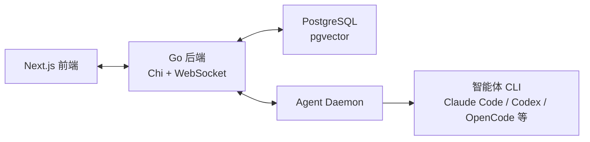

# Other — README.zh-CN.md

## README.zh-CN.md

`README.zh-CN.md` 是 Multica 仓库面向中文开发者和用户的入口文档。它不是运行时代码模块，没有函数、类、内部调用或执行流；它的职责是把产品定位、安装路径、首次上手流程、架构概览和贡献入口组织成一份可直接阅读的中文 README。

该文件与英文版 `README.md` 互为语言入口，并通过链接把读者引向更深入的文档，例如 `SELF_HOSTING.md`、`CONTRIBUTING.md` 和 `apps/mobile/README.md`。

## 文档职责

`README.zh-CN.md` 主要服务三类读者：

- 想快速理解 Multica 是什么的产品或技术读者。
- 想安装 CLI、连接运行时并创建第一个智能体的使用者。
- 想参与开发或自部署的贡献者。

它承担的是仓库首页级别的信息聚合，而不是完整手册。因此正文刻意保持高层说明，并把细节交给专门文档：

| 入口 | 指向内容 |
| --- | --- |
| `SELF_HOSTING.md` | 自部署安装、服务启动、Docker 依赖 |
| `CONTRIBUTING.md` | 本地开发、测试、贡献流程 |
| `apps/mobile/README.md` | iOS 移动端本地编译和安装 |
| `README.md` | 英文 README |
| `docs/assets/*` | banner、logo、产品截图等视觉资产 |

## 内容结构

文档从产品叙事进入，再落到可执行步骤：

1. 顶部品牌区：展示 `docs/assets/banner.jpg`、明暗主题 logo、徽章和外部链接。
2. `Multica 是什么？`：解释 Multica 如何把编码智能体变成可分配、可跟踪、可积累 skill 的队友。
3. `为什么叫 "Multica"？`：说明命名来源和 Multics 的类比。
4. `功能特性`：概括智能体、小队、自动执行、自动化、skill、运行时、多工作区等核心能力。
5. `快速安装`：提供 Homebrew、安装脚本、Windows PowerShell 和自部署安装命令。
6. `快速上手`：说明 `multica setup`、运行时连接、创建智能体、分配第一个 issue 的流程。
7. `架构`：用 ASCII 图展示 Next.js 前端、Go 后端、PostgreSQL 和 Agent Daemon 的关系。
8. `开发`：列出开发环境要求和最小启动命令。
9. `开源协议`：链接到 `LICENSE`。

## 和代码库的连接

虽然 `README.zh-CN.md` 本身没有代码调用关系，但它描述的系统组件对应仓库中的真实目录：

| README 中的概念 | 代码位置 |
| --- | --- |
| Next.js 前端 | `apps/web/` |
| 桌面端 | `apps/desktop/` |
| iOS 移动端 | `apps/mobile/` |
| Go 后端 | `server/` |
| 共享业务逻辑、API client、React Query hooks、Zustand stores | `packages/core/` |
| 原子 UI 组件 | `packages/ui/` |
| 共享业务页面和组件 | `packages/views/` |
| 本地开发与启动命令 | `Makefile`、`package.json`、`pnpm-workspace.yaml` |

这些目录关系也需要与 `CLAUDE.md` 保持一致。修改 README 中的架构、开发命令或包职责时，应同步核对 `CLAUDE.md`、`CONTRIBUTING.md` 和实际脚本，避免 README 变成过期入口。

## 安装与上手流程

README 中的安装路径围绕 `multica` CLI 展开：

```bash
brew install multica-ai/tap/multica
multica setup
```

`multica setup` 在文档中被定义为首选入口：它负责配置、认证并启动本地守护进程。守护进程会检测 PATH 中可用的智能体 CLI，例如 `claude`、`codex`、`codebuddy`、`copilot`、`opencode`、`cursor-agent`、`kimi`、`kiro-cli`、`qodercli`、`traecli` 等。

自部署路径通过安装脚本的 `--with-server` 分支进入：

```bash
curl -fsSL https://raw.githubusercontent.com/multica-ai/multica/main/scripts/install.sh | bash -s -- --with-server
multica setup self-host
```

这部分文案依赖 `SELF_HOSTING.md` 承接细节。若 CLI 参数、安装脚本行为或自部署命令变化，README 中的命令必须同步更新。

## 架构说明

README 用一个简化架构图解释 Multica 的运行方式：



这个图是面向首次阅读者的概念图，不覆盖所有包边界。更精确的开发约束仍以 `CLAUDE.md` 为准：服务端状态由 TanStack Query 管理，客户端视图状态由 Zustand 管理，共享业务逻辑在 `packages/core/`，共享 UI 和页面分别在 `packages/ui/` 与 `packages/views/`。

## 中文术语约定

`README.zh-CN.md` 是中文产品文案，术语需要遵守 `apps/docs/content/docs/developers/conventions.zh.mdx`：

- `Workspace` 写作「工作区」。
- `Agent` 写作「智能体」。
- `Daemon` 写作「守护进程」。
- `Runtime` 写作「运行时」。
- `Autopilot` 写作「自动化」。
- `issue`、`skill`、`task` 在代码上下文和短句中保留英文。
- 品牌名、CLI、API、WebSocket、GitHub 等不翻译。
- 英文实体词和中文之间保留单空格，例如「创建 issue」「配置运行时」。

当前 README 中部分表达使用了「Agent」「daemon」等英文形式。后续维护时应优先对齐中文术语规范，除非是在命令、品牌名、Provider 名称或代码上下文中。

## 维护注意事项

修改 `README.zh-CN.md` 时重点检查以下内容：

- Provider 列表是否与实际支持的智能体 CLI 保持一致。
- 安装命令是否仍匹配 `scripts/install.sh`、`scripts/install.ps1` 和 Homebrew tap。
- `multica setup`、`multica setup self-host`、`multica issue create` 等命令是否仍存在。
- 架构技术栈版本是否与项目实际依赖一致，例如 Next.js、Go、PostgreSQL。
- 贡献和开发命令是否与 `Makefile`、`package.json`、`pnpm-workspace.yaml` 一致。
- 链接目标是否存在，尤其是 `SELF_HOSTING.md`、`CONTRIBUTING.md`、`apps/mobile/README.md` 和 `LICENSE`。
- 中文术语是否符合项目规范，不要把 schema 级实体随意翻译成中文。

## 变更风险

这个模块没有执行流，因此不会直接影响运行时代码。但它位于仓库首页级别，错误信息会直接影响安装、上手和贡献体验。高风险变更通常包括：

- 改动安装命令或自部署命令。
- 删除或替换 Provider 名称。
- 修改架构技术栈描述。
- 改动开发环境要求或启动命令。
- 改动面向外部用户的产品定位文案。

文案类变更通常不需要运行测试，但涉及命令和链接时，至少应人工核对对应脚本、文档和文件路径。