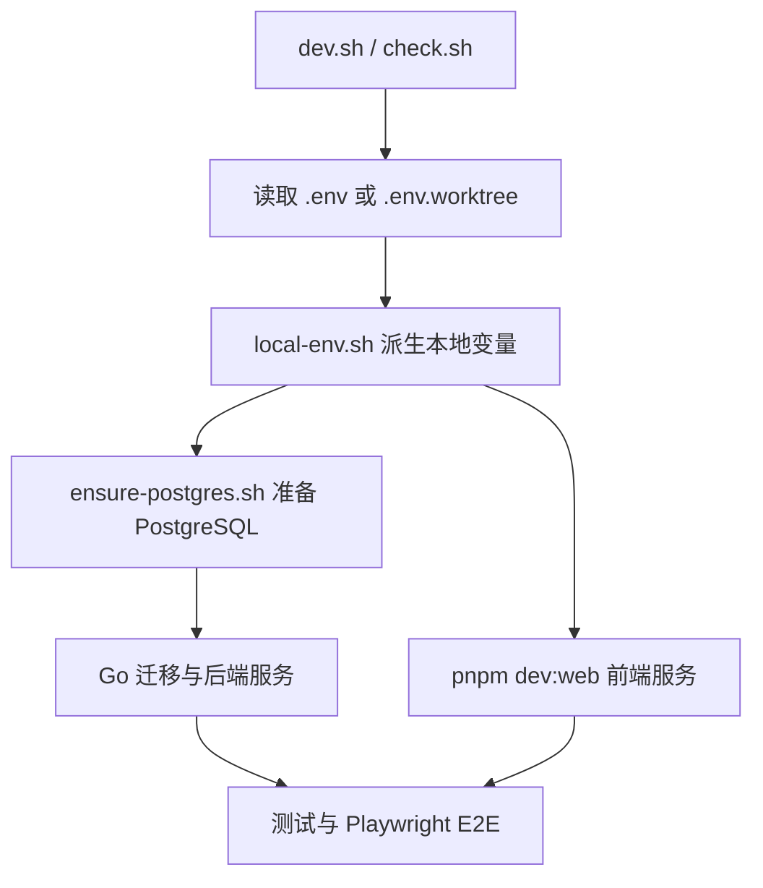

# Other — scripts

## 脚本模块（`scripts/`）

`scripts/` 存放仓库的开发、验证、安装、自托管和少量代码生成脚本。它不是业务运行时代码，而是把 Go 后端、Next.js 前端、Docker PostgreSQL、Playwright、发布产物和环境文件串成可重复执行的工程流程。



## 本地开发入口

`dev.sh` 是本地开发的一键启动脚本，通常由 `make dev` 间接调用。它先检查 `node`、`pnpm`、`go`、`docker` 是否存在，然后决定使用哪个环境文件：

- 普通仓库使用 `.env`，缺失时从 `.env.example` 复制。
- Git worktree 中 `.git` 是文件，脚本会使用 `.env.worktree`，缺失时调用 `init-worktree-env.sh` 生成。

加载环境文件后，`dev.sh` 会 source `scripts/local-env.sh`，再按顺序执行：

1. `pnpm install`，仅在 `node_modules` 不存在时运行。
2. `ensure-postgres.sh "$ENV_FILE"`，确保数据库可用。
3. `(cd server && go run ./cmd/migrate up)`，执行数据库迁移。
4. 同时启动 `(cd server && go run ./cmd/server)` 和 `pnpm dev:web`。

脚本末尾使用 `trap 'kill 0' EXIT`，退出时会结束当前进程组内由它启动的后端和前端进程。

## 全量验证流水线

`check.sh` 是完整验证入口，默认读取 `ENV_FILE=.env`，也可以通过环境变量覆盖：

```bash
ENV_FILE=.env.worktree bash scripts/check.sh
```

流水线固定为五步：

1. `pnpm typecheck`
2. `pnpm test`
3. `go run ./cmd/migrate up` 和 `go test ./...`
4. 检查或启动后端、前端服务
5. `pnpm exec playwright test`

`cleanup()` 只会停止本脚本启动的服务，不会杀掉用户已经运行的后端或前端。`wait_for_port(port, name, max_wait, path)` 使用 `curl -sf http://localhost:${port}${path}` 轮询服务就绪状态，后端默认检查 `/health`，前端检查 `/`。临时服务日志分别写入 `/tmp/multica-check-backend.log` 和 `/tmp/multica-check-frontend.log`。

## 共享环境派生

`local-env.sh` 是本地开发和验证脚本的共享环境层。约定用法是：先加载 `.env`，再 source `scripts/local-env.sh`。

它统一派生并导出这些变量：

- `POSTGRES_DB`、`POSTGRES_USER`、`POSTGRES_PORT`
- `PORT`：优先级为 `BACKEND_PORT` → `API_PORT` → `SERVER_PORT` → `PORT` → `8080`
- `FRONTEND_PORT`，默认 `3000`
- `FRONTEND_ORIGIN`，默认 `http://localhost:${FRONTEND_PORT}`
- `MULTICA_APP_URL`
- `GOOGLE_REDIRECT_URI`
- `MULTICA_SERVER_URL`
- `LOCAL_UPLOAD_BASE_URL`
- `PLAYWRIGHT_BASE_URL`

新增本地脚本时，如果需要后端端口、前端地址或 Playwright base URL，应复用 `local-env.sh`，避免在多个脚本中重复端口推导逻辑。

## PostgreSQL 准备逻辑

`ensure-postgres.sh` 接收环境文件路径，默认 `.env`。它读取 `POSTGRES_DB`、`POSTGRES_USER`、`POSTGRES_PASSWORD`、`POSTGRES_PORT`、`DATABASE_URL`，再根据数据库地址决定本地或远程流程。

`parse_database_url()` 从 `DATABASE_URL` 中解析 host、port 和 database name，支持普通 host、带认证信息的 URL，以及 IPv6 形式的 host。`is_local()` 判断逻辑为：

- `DATABASE_URL` 为空：视为本地。
- host 为 `localhost`、`127.0.0.1` 或 `::1`：视为本地。
- 其他 host：视为远程数据库。

本地模式会运行 `docker compose up -d postgres`，等待容器内 `pg_isready` 成功，并通过 `psql` 确保 `POSTGRES_DB` 存在。远程模式不会启动 Docker；如果本机有 `pg_isready`，则用 `pg_isready -d "$DATABASE_URL"` 做连通性等待，否则只打印配置确认信息。

## Worktree 环境生成

`init-worktree-env.sh` 为 Git worktree 生成互不冲突的 `.env.worktree`。默认输出文件是 `.env.worktree`，也可以传入目标路径。

脚本会拒绝覆盖已有文件，除非设置 `FORCE=1`。生成规则是：

- `worktree_name` 默认取当前目录名，也可用 `WORKTREE_NAME` 覆盖。
- `slug` 由 worktree 名转换为小写、非字母数字替换为 `_`。
- `offset = cksum($PWD) % 1000`。
- 数据库名为 `multica_${slug}_${offset}`。
- 后端端口为 `18080 + offset`。
- 前端端口为 `13000 + offset`。

生成的环境文件会同时写入后端、前端、WebSocket、Google OAuth callback 和 Playwright 所需的 URL，保证同一 worktree 内的服务地址一致。

## 安装与自托管脚本

`install.sh` 是 macOS/Linux 的公开安装器，`install.ps1` 是 Windows 对应版本。二者都支持两类用途：安装或升级 `multica` CLI，以及可选地准备自托管服务。

`install.sh` 的主要函数包括：

- `detect_os()`：识别 `darwin`、`linux` 和 `amd64`、`arm64`。
- `install_cli()`：已有 CLI 时比较当前版本和 latest release；否则优先尝试 Homebrew，再回退到 GitHub Releases 二进制。
- `install_cli_brew()`、`install_cli_binary()`：分别实现 Homebrew 安装和 tarball 下载安装。
- `setup_server()`：克隆或更新 `$MULTICA_INSTALL_DIR`，调用 `checkout_server_ref()` 切到 latest release、`MULTICA_SELFHOST_REF` 或 `main`，生成 `.env` 随机密钥，拉取并启动 `docker-compose.selfhost.yml`。
- `run_default()`：默认只安装 CLI。
- `run_with_server()`：安装 CLI 并启动自托管服务。
- `run_stop()`：关闭自托管 Docker Compose 服务，并尝试停止 `multica daemon`。
- `main()`：解析 `--with-server`、`--local`、`--stop`、`--help`。

`print_remote_server_token_hint()` 会在检测到 `SSH_CONNECTION`、`SSH_CLIENT` 或 `SSH_TTY` 时打印 token 登录提示，避免远程机器上的浏览器回调 localhost 失败。

`install.ps1` 保持相同产品语义，但使用 PowerShell 实现。它通过 `MULTICA_MODE` 选择模式：

- 默认：安装或升级 CLI。
- `with-server` / `local`：准备自托管服务并安装 CLI。
- `stop`：停止自托管服务和 daemon。

Windows CLI 架构识别由 `Get-WindowsCliArch()` 完成，优先使用 `Win32_Processor.Architecture`，再回退到 `.NET RuntimeInformation.OSArchitecture` 和环境变量。`Install-CliBinary()` 下载 zip 包后会尝试读取 `checksums.txt` 校验 SHA256。

## 代码生成：保留 slug

`generate-reserved-slugs.mjs` 从 `server/internal/handler/reserved_slugs.json` 生成 `packages/core/paths/reserved-slugs.ts`。JSON 是单一事实来源；Go 后端嵌入同一份 JSON，前端通过生成的 TS 文件使用 `RESERVED_SLUGS` 和 `isReservedSlug(slug)`。

生成器会校验：

- 顶层必须有 `groups` 数组。
- 每个 group 必须有 `label` 字符串和 `slugs` 数组。
- 每个 slug 必须是非空字符串。
- slug 不能重复。

内部辅助函数 `wrapComment(text, width)` 只负责把 group description 按空白分词后包装成固定宽度的注释行；调用图中唯一的内部边是 `generate-reserved-slugs.mjs → wrapComment`。

## PR 卡片截图脚本

`screenshot-pr-cards.mjs` 是独立的本地视觉检查脚本，用 Playwright 捕获 6 个 demo issue 页面截图。入口 `main()` 会调用 `loginAndGetToken()` 完成本地登录：

1. 用 `pg.Client(DB)` 连接数据库。
2. 删除 `verification_code` 中 `dev@localhost` 的旧验证码。
3. 调用 `${API}/auth/send-code`。
4. 直接从数据库读取最新未使用验证码。
5. 调用 `${API}/auth/verify-code`，返回 token。

随后 `main()` 启动 headless Chromium，把 token 写入 `localStorage.multica_token`，依次打开 `${FRONTEND}/${SLUG}/issues/DEV-${n}`，等待 `Pull requests` 区域出现，尝试关闭浮动聊天窗口，并保存 `.screenshots/pr-card-DEV-${n}.png`。

该脚本依赖本地服务、数据库和 demo issue 数据，不属于 CI 主验证路径。

## 脚本测试

`install.test.sh` 用纯 Bash 构造临时沙盒，stub 掉 `curl` 和 `brew`，验证安装器的回退行为：

- `test_brew_install_failure_falls_back_to_release_binary`
- `test_brew_tap_failure_falls_back_to_release_binary`
- `test_remote_ssh_install_prints_token_login_hint`
- `test_local_install_does_not_print_token_login_hint`

`_setup_sandbox()` 会生成假的 release tarball 和 `curl`，`_run_installer()` 断言 fallback 二进制被安装到临时目录，并且 Homebrew 失败诊断输出包含日志尾部。

`selfhost-config.test.sh` 验证自托管 Docker Compose 配置和 `local-env.sh` 的派生规则。它用临时 env 文件覆盖 `FRONTEND_PORT=3100` 和 `BACKEND_PORT=9100`，检查 Compose 输出中的端口和 URL，并断言 `scripts/dev.sh`、`scripts/check.sh` 都 source 了 `scripts/local-env.sh`。

## 与代码库其他部分的关系

`scripts/` 横跨仓库多个边界：

- 后端：调用 `server/cmd/migrate`、`server/cmd/server`，依赖 `/health`、`/auth/send-code`、`/auth/verify-code`，并读写 `verification_code`。
- 前端：通过 `pnpm dev:web` 启动 Next.js 应用，通过 `FRONTEND_ORIGIN`、`NEXT_PUBLIC_API_URL`、`NEXT_PUBLIC_WS_URL` 连接后端。
- 共享 core：`generate-reserved-slugs.mjs` 生成 `packages/core/paths/reserved-slugs.ts`。
- Docker：`ensure-postgres.sh` 使用默认 `docker compose` PostgreSQL；安装器使用 `docker-compose.selfhost.yml`。
- CI/验证：`check.sh` 串联 TypeScript、Vitest、Go test 和 Playwright；生成器通常配合 `git diff --exit-code` 防止 JSON 和 TS 文件漂移。

调用图没有发现来自应用运行时代码的入边，也没有检测到跨模块执行流。这符合该目录定位：脚本主要由开发者、Makefile、package scripts 或安装命令直接执行，而不是被产品运行时调用。