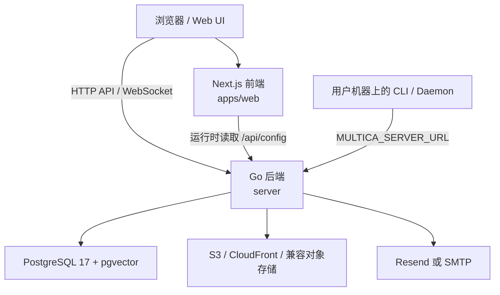

# Other — SELF_HOSTING_ADVANCED.md

## 模块定位

`SELF_HOSTING_ADVANCED.md` 是 Multica 自托管部署的高级运维文档，面向需要配置生产环境、私有网络、反向代理、对象存储、邮件、指标、升级和数据回填的开发者或平台管理员。

该模块不包含可执行代码，调用图中也没有内部调用、外部调用或执行流。它的价值在于把运行时契约集中写清楚：后端、前端、数据库、CLI/Daemon、对象存储、WebSocket、反向代理和迁移工具都通过这里列出的环境变量和命令协同工作。

## 配置模型

Multica 自托管的核心配置方式是环境变量。推荐从 `.env.example` 复制后修改。

最小可用部署需要：

- `DATABASE_URL`：PostgreSQL 连接串。
- `JWT_SECRET`：JWT 签名密钥，必须替换默认值。
- `FRONTEND_ORIGIN`：前端访问地址，用于 CORS 和 Cookie 安全策略。

配置优先级在数据库连接池部分有明确约定：

```text
环境变量 > DATABASE_URL 中的 pool_* 查询参数 > 内置默认值
```

`DATABASE_MAX_CONNS` 和 `DATABASE_MIN_CONNS` 用于控制每个后端副本的 `pgxpool` 连接数。开发者调整连接池时需要按实例数计算总连接压力：

```text
总连接上限约等于 pod_count × DATABASE_MAX_CONNS
```

## 运行时组件关系



这张关系图对应文档中的几个关键契约：

- Web UI 从 `/api/config` 运行时读取 `GOOGLE_CLIENT_ID`、`ALLOW_SIGNUP`、`DISABLE_WORKSPACE_CREATION` 等配置。
- 浏览器的 WebSocket 连接受 `CORS_ALLOWED_ORIGINS` / `FRONTEND_ORIGIN` 约束。
- 后端直接连接 PostgreSQL，并依赖 `rollup_task_usage_hourly()`、`task_usage_hourly`、`sys_cron_executions` 等数据库对象。
- CLI / Daemon 使用 `MULTICA_SERVER_URL` 连接后端 WebSocket。

## 认证与邮件

Multica 的登录验证依赖邮件验证码。文档定义了两个邮件后端：

1. `SMTP_HOST` 存在时优先使用 SMTP。
2. 未配置 SMTP 时使用 `RESEND_API_KEY`。
3. 两者都没有时，验证码会打印到后端日志。

SMTP 配置支持内部邮件中继场景，关键变量包括：

- `SMTP_HOST`
- `SMTP_PORT`
- `SMTP_USERNAME`
- `SMTP_PASSWORD`
- `SMTP_TLS`
- `SMTP_TLS_INSECURE`
- `SMTP_EHLO_NAME`

`SMTP_TLS` 支持 `starttls`、`implicit`、`smtps`、`ssl`。端口 `465` 会自动启用隐式 TLS。

本地固定验证码只通过 `MULTICA_DEV_VERIFICATION_CODE` 开启，并且要求 `APP_ENV` 不是生产环境。Docker 自托管栈固定 `APP_ENV=production`，因此不会接受该捷径。公开实例不应启用固定验证码。

## OAuth 与注册控制

Google OAuth 由以下变量控制：

- `GOOGLE_CLIENT_ID`
- `GOOGLE_CLIENT_SECRET`
- `GOOGLE_REDIRECT_URI`

修改后重启后端即可生效。Web UI 从 `/api/config` 读取 `GOOGLE_CLIENT_ID`，不需要重新构建前端。

注册和工作区创建由以下变量控制：

- `ALLOW_SIGNUP`
- `ALLOWED_EMAIL_DOMAINS`
- `ALLOWED_EMAILS`
- `DISABLE_WORKSPACE_CREATION`

需要注意 `ALLOW_SIGNUP=false` 只阻止新账号创建，不阻止已登录用户调用 `POST /api/workspaces` 创建新工作区。若私有实例要求所有 issue、repo、agent 都归平台管理员可见，应设置：

```bash
DISABLE_WORKSPACE_CREATION=true
```

推荐初始化顺序是先允许创建工作区，由管理员创建共享工作区，然后开启 `DISABLE_WORKSPACE_CREATION=true` 并重启后端。

## 文件存储与下载模式

文件上传和附件通过 S3 或兼容对象存储配置。关键变量包括：

- `S3_BUCKET`
- `S3_REGION`
- `AWS_ACCESS_KEY_ID`
- `AWS_SECRET_ACCESS_KEY`
- `AWS_ENDPOINT_URL`
- `S3_USE_PATH_STYLE`
- `ATTACHMENT_DOWNLOAD_MODE`
- `ATTACHMENT_DOWNLOAD_URL_TTL`
- `CLOUDFRONT_DOMAIN`
- `CLOUDFRONT_KEY_PAIR_ID`
- `CLOUDFRONT_PRIVATE_KEY`

`ATTACHMENT_DOWNLOAD_MODE` 支持：

- `auto`
- `cloudfront`
- `presign`
- `proxy`

私有桶、Docker 内网 endpoint 或 VPC-only endpoint，例如 `http://rustfs:9000`，应使用 `proxy`，避免浏览器直接访问不可达的内部地址。

## Cookie 与跨域

`COOKIE_DOMAIN` 只应在前端和后端位于同一个注册域名的不同子域时设置，例如 `.example.com`。单主机、localhost、LAN IP 或单域名部署应留空。

不要把 IP 字面量写入 `COOKIE_DOMAIN`。RFC 6265 不允许 Cookie `Domain` 使用 IP 地址，浏览器会丢弃这类 `Set-Cookie`。

Session Cookie 的 `Secure` 标志由 `FRONTEND_ORIGIN` 的 scheme 自动推导：

- `https://...` 产生 Secure Cookie。
- `http://...` 产生非 Secure Cookie，适配 LAN / 私有网络部署。

## 服务端与 WebSocket Origin

后端核心变量包括：

- `PORT`
- `METRICS_ADDR`
- `FRONTEND_PORT`
- `CORS_ALLOWED_ORIGINS`
- `LOG_LEVEL`

`CORS_ALLOWED_ORIGINS` 同时控制 HTTP CORS allowlist 和 WebSocket `Origin` 检查。浏览器 origin 不在 allowlist 中时，WebSocket upgrade 会返回 `403`，实时更新会失效，但普通 HTTP 请求可能仍然正常。

典型报错表现是：

```text
websocket: request origin not allowed by Upgrader.CheckOrigin
```

浏览器侧通常会看到反复重连，例如：

```text
disconnected, reconnecting in 3s
```

因此，任何非 localhost 访问方式，包括 LAN IP 和公网反向代理域名，都必须把实际浏览器 origin 写入 `CORS_ALLOWED_ORIGINS` 或 `FRONTEND_ORIGIN`。

## CLI / Daemon 配置

CLI 和 Daemon 的环境变量配置在每个用户自己的机器上，不属于服务器部署配置。

基础变量：

- `MULTICA_SERVER_URL`
- `MULTICA_APP_URL`
- `MULTICA_DAEMON_POLL_INTERVAL`
- `MULTICA_DAEMON_HEARTBEAT_INTERVAL`

Agent 覆盖变量按工具成对出现：

- `MULTICA_CLAUDE_PATH` / `MULTICA_CLAUDE_MODEL`
- `MULTICA_CODEX_PATH` / `MULTICA_CODEX_MODEL`
- `MULTICA_COPILOT_PATH` / `MULTICA_COPILOT_MODEL`
- `MULTICA_OPENCODE_PATH` / `MULTICA_OPENCODE_MODEL`
- `MULTICA_OPENCLAW_PATH` / `MULTICA_OPENCLAW_MODEL`
- `MULTICA_HERMES_PATH` / `MULTICA_HERMES_MODEL`
- `MULTICA_PI_PATH` / `MULTICA_PI_MODEL`
- `MULTICA_CURSOR_PATH` / `MULTICA_CURSOR_MODEL`
- `MULTICA_GROK_PATH` / `MULTICA_GROK_MODEL`

这些变量让用户机器上的 daemon 找到对应 agent 二进制，并覆盖默认模型选择。

## 数据库与迁移

Multica 要求 PostgreSQL 17，并启用 `pgvector`：

```sql
CREATE EXTENSION IF NOT EXISTS vector;
```

Docker Compose 自托管栈内置 PostgreSQL，并自动运行迁移。手动运行迁移时使用：

```bash
./server/bin/migrate up
```

或从源码运行：

```bash
cd server && go run ./cmd/migrate up
```

迁移是幂等的，重复执行不会造成额外影响。

## Usage Dashboard Rollup

Usage 和 Runtime dashboard 读取派生表 `task_usage_hourly`。该表由 SQL 函数 `rollup_task_usage_hourly()` 填充。

MUL-2957 之后，后端每个副本都会在进程内运行调度器：

- 每 30 秒 tick 一次。
- 争抢当前 5 分钟 UTC 计划。
- 调度状态写入 `sys_cron_executions`。
- 唯一键 `(job_name, scope_kind, scope_id, plan_time)` 保证多副本只有一个 winner。
- winner 调用 `SELECT rollup_task_usage_hourly()`。
- `rollup_task_usage_hourly()` 内部持有 advisory lock `4246`，避免与 `pg_cron`、手动调用或 backfill 冲突。

排查调度状态时使用：

```sql
SELECT plan_time, status, attempt, runner_id,
       error_code, error_msg, started_at, finished_at
  FROM sys_cron_executions
 WHERE job_name = 'rollup_task_usage_hourly'
 ORDER BY plan_time DESC
 LIMIT 20;
```

旧版本中通过 `pg_cron` 注册的 `rollup_task_usage_hourly` 可以保留；advisory lock `4246` 会防止重复写入。确认进程内调度器正常后，可删除冗余 cron：

```sql
SELECT cron.unschedule('rollup_task_usage_hourly')
  FROM cron.job WHERE jobname = 'rollup_task_usage_hourly';
```

## 历史数据回填

`rollup_task_usage_hourly()` 只处理开始运行之后的新 bucket。若升级前已有 `task_usage` 历史数据，需要运行 `backfill_task_usage_hourly` 回填历史小时桶。

Docker Compose：

```bash
docker compose -f docker-compose.selfhost.yml exec backend \
  ./backfill_task_usage_hourly --sleep-between-slices=2s
```

Kubernetes：

```bash
kubectl -n multica exec deploy/multica-backend -- \
  ./backfill_task_usage_hourly --sleep-between-slices=2s
```

该命令按月切片扫描 `task_usage` 的完整时间范围，调用与进程内调度器相同的幂等 primitive。它可以安全重跑、被 Ctrl-C 中断，也可以与调度器并发运行，因为 advisory lock `4246` 会串行化写入。

常用参数：

- `--sleep-between-slices`：月切片之间暂停，降低生产库读压力。
- `--months-back N`：只回填最近 N 个月，必须搭配 `--force-partial`。
- `--dry-run`：只打印将处理的切片，不写入数据。

回填完成后，rollup-state watermark 会推进到 `now() - 5 minutes`，避免下一次调度重复处理历史数据。

## `v0.3.4 → v0.3.5+` 升级语义

迁移 `103` 有 fail-closed guard：在 `task_usage_hourly` 追平之前，不允许删除 legacy daily rollups。

MUL-2957 之后，`migrate up` 会在应用迁移 `103` 前自动运行幂等的月切片回填。因此从 `v0.3.4` 升级到 `v0.3.5+` 通常只需要一次 `migrate up`。

如果使用的是早于 MUL-2957 的二进制，或自动 hook 因环境问题失败，恢复路径是：

```bash
./backfill_task_usage_hourly --sleep-between-slices=2s
./server/bin/migrate up
```

全新安装不受影响；当 `task_usage` 为空时 guard 会短路，进程内调度器会从第一次 tick 开始处理新数据。

## 反向代理

生产环境应在前端和后端前放置反向代理，用于 TLS、路由和 WebSocket upgrade。

单域名 Caddy 布局中，`/ws` 必须先于 catch-all 前端代理：

```caddy
multica.example.com {
    @multica_ws path /ws /ws/*
    handle @multica_ws {
        reverse_proxy localhost:8080 {
            flush_interval -1
        }
    }

    reverse_proxy localhost:3000
}
```

这里有两个重要细节：

- `path /ws /ws/*` 明确匹配 WebSocket 路径，避免误匹配 `/ws-foo` 这类合法 workspace URL。
- `flush_interval -1` 禁用响应缓冲，让 WebSocket 帧及时转发。

Nginx 必须为 `/ws` 设置 upgrade 头：

```nginx
location /ws {
    proxy_pass http://localhost:8080;
    proxy_http_version 1.1;
    proxy_set_header Upgrade $http_upgrade;
    proxy_set_header Connection "upgrade";
    proxy_set_header Host $host;
    proxy_read_timeout 86400;
}
```

分离域名部署时，后端需要设置：

```bash
FRONTEND_ORIGIN=https://app.example.com
CORS_ALLOWED_ORIGINS=https://app.example.com
```

如果从源码构建 web 镜像，还需要设置：

```bash
REMOTE_API_URL=https://api.example.com
NEXT_PUBLIC_API_URL=https://api.example.com
NEXT_PUBLIC_WS_URL=wss://api.example.com/ws
```

## LAN / 非 localhost 访问

通过 LAN IP 访问时，例如 `http://192.168.1.100:3000`，必须让后端接受该 origin：

```bash
FRONTEND_ORIGIN=http://192.168.1.100:3000
CORS_ALLOWED_ORIGINS=http://192.168.1.100:3000
```

然后重启：

```bash
docker compose -f docker-compose.selfhost.yml up -d
```

HTTP API 在 LAN 下通常能工作，因为 Next.js rewrites 会代理 `/api`、`/auth` 和 `/uploads`。WebSocket 不同：Next.js rewrites 不会转发 WebSocket upgrade，因此实时能力需要额外处理。

推荐方式是使用 Caddy 或 Nginx 反向代理，让代理处理 WebSocket upgrade。没有反向代理时，需要把 WebSocket 地址烘焙进 web 镜像：

```bash
NEXT_PUBLIC_WS_URL=ws://<lan-ip>:8080/ws
```

然后使用源码构建 override：

```bash
docker compose -f docker-compose.selfhost.yml -f docker-compose.selfhost.build.yml up -d --build
```

`NEXT_PUBLIC_WS_URL` 是构建期变量，只在预构建镜像的 `environment:` 中设置不会生效。

## 健康检查与指标

后端暴露三个公共健康端点：

```text
GET /health
GET /readyz
GET /healthz
```

`/health` 用于基础 liveness / reachability。`/readyz` 会检查依赖状态，响应包含：

```json
{"status":"ok","checks":{"db":"ok","migrations":"ok"}}
```

`/healthz` 是 `/readyz` 的别名，保留给运维习惯使用。

Prometheus 指标通过独立管理监听器启用：

```bash
METRICS_ADDR=127.0.0.1:9090 ./server/bin/server
curl http://127.0.0.1:9090/metrics
```

默认 `METRICS_ADDR` 为空，不启动 metrics listener。公共 API 端口不提供 `/metrics`。生产环境中应把 metrics 绑定到内部接口，并通过私有网络、allowlist、NetworkPolicy 或代理认证保护。

容器中如果设置：

```bash
METRICS_ADDR=0.0.0.0:9090
```

只应把端口发布到可信网络，例如：

```text
127.0.0.1:9090:9090
```

## 升级流程

标准升级流程：

```bash
docker compose -f docker-compose.selfhost.yml pull
docker compose -f docker-compose.selfhost.yml up -d
```

如需固定版本，在 `.env` 中设置 `MULTICA_IMAGE_TAG`，例如：

```bash
MULTICA_IMAGE_TAG=v0.2.4
```

后端启动时会自动运行迁移。若 GHCR 对应 tag 尚未发布，可退回源码构建方式：

```bash
docker compose -f docker-compose.selfhost.yml -f docker-compose.selfhost.build.yml up -d --build
```

## 维护该文档时的注意点

这个模块是多个运行时边界的契约文档。修改时应同步核对相关实现和部署文件：

- 环境变量默认值应与 `.env.example`、`docker-compose.selfhost.yml`、`docker-compose.selfhost.build.yml` 保持一致。
- WebSocket 说明应与后端 `CORS_ALLOWED_ORIGINS` / `FRONTEND_ORIGIN` 的 origin 检查行为一致。
- `/api/config` 中暴露给前端运行时读取的字段变化，应同步更新 OAuth、注册控制和工作区创建部分。
- `rollup_task_usage_hourly()`、`task_usage_hourly`、`sys_cron_executions`、advisory lock `4246`、迁移 `103` 的描述应与数据库迁移和后端调度器实现保持一致。
- 健康检查端点 `/health`、`/readyz`、`/healthz` 的响应语义变化时，应同步更新监控建议。
- 新增 agent 时，应补充对应的 `MULTICA_*_PATH` 和 `MULTICA_*_MODEL` 变量，保持 CLI / Daemon 配置完整。